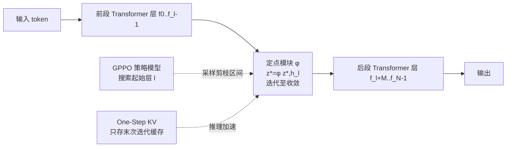

# Equilibrium Language Models

**会议**: ICLR 2026  
**代码**: [Jyk-122/ELM](https://github.com/Jyk-122/ELM)  
**领域**: LLM 高效化 / 模型压缩  
**关键词**: 层剪枝、深度均衡模型、定点网络、KV Cache 压缩、策略优化

## 一句话总结
把 Transformer 中一段连续的中间层替换成一个轻量"定点（fixed-point）模块"，用求解均衡态来等价表达深层堆叠，从而在剪掉 28% 参数的同时保留 99% 的精度，专为边缘端低内存部署设计。

## 研究背景与动机
**领域现状**：LLM 上端侧（手机、边缘设备）已是大势所趋，但推理时把数十亿参数塞进 RAM 经常超出内存预算，催生了剪枝、量化、蒸馏等压缩方向。

**现有痛点**：现有压缩两条路都有硬伤。(1) 同时压计算和参数的方法（统计指标剪低贡献层、或用轻量模块替换连续层），在代码合成、数学推理这类"硬生成任务"上掉点严重；(2) 按输入自适应跳层的方法只省计算、几乎不省参数，无法满足边缘端严苛的内存约束。

**核心矛盾**：要省内存就得真删参数，但删多了模型容量就崩——尤其在生成型难任务上。如何在删掉真实参数的前提下，仍保住接近稠密模型的表达能力？

**本文目标**：提出一个真正减少参数（省内存）、又几乎不掉精度的压缩框架，面向边缘部署。

**核心 idea**：受深度均衡模型（DEQ）启发——一个权重共享的定点网络等价于"无限深"的网络，能用极少参数获得堪比深层堆叠的表达力。于是把一段连续的中间 Transformer 层整体替换成一个定点模块 $z^*=\phi(z^*, h^l)$，把"前向走过 M 层"重写成"迭代求解一个均衡态"。

## 方法详解

### 整体框架
ELM 把原模型 $F$ 中连续 $M$ 层（$M<N$）剪掉，在第 $l$ 层位置嵌入一个定点模块 $\phi$，其输出为非线性系统 $z^*=\phi(z^*, h^l)$ 的均衡解，通过迭代 $z^{(k+1)}=\phi(z^{(k)}, h^l)$ 逼近。三个关键问题分别由三个组件回答：**剪哪一段**（GPPO 用策略优化自动搜索起始层）、**怎么训**（随机 Jacobian-Free 反传 + 蒸馏对齐）、**推理怎么省 KV**（One-Step KV Cache）。

### 关键设计

**1. 定点模块替换层组：用均衡态等价深层堆叠。** 定点模块由两个全连接 $W_z, W_h\in\mathbb{R}^{d\times d}$ 和一个 Transformer 层 $f^*$ 构成，迭代规则为 $\phi(z^{(k)}, h^l)=f^*(W_z\cdot z^{(k)}+W_h\cdot h^l)$。巧妙的初始化让冷启动就站在好位置：$f^*$ 继承被剪第一层 $f^l$ 的参数，$z^{(0)}=0$，$W_h$ 初始化为单位阵、$W_z$ 随机——于是第一次迭代的输出恰好等于原始 $f^l$ 的输出。理论上迭代上界是无穷，但实践中 $M$ 步内即收敛，从而在 $M$ 层上实现参数压缩、且不增加计算复杂度。训练用交叉熵 + 蒸馏双损失 $L_{sft}=\lambda_{ce}L_{ce}+\lambda_{distill}L_{distill}$，蒸馏项用 MSE 把 $z^*$ 对齐到原模型第 $l+M-1$ 层的隐状态 $h^{l+M}$。

**2. 随机 Jacobian-Free 反传（SJFB）：绕开矩阵求逆训练定点网。** 标准隐式微分要算 $(I-\partial f/\partial z^*)^{-1}$，矩阵求逆代价高。本文采用随机 JFB：均匀采样 $m\sim U[0, M/2]$ 步无梯度迭代 + $n\sim U[1, M/2]$ 步带梯度迭代，只在最后若干步算梯度，既省训练内存又在大规模实验上更稳。

**3. Group Pruning Policy Optimization（GPPO）：用 RL 自动搜剪枝区间。** 传统靠余弦相似度 / 困惑度等统计指标定层重要性，但这些指标无法刻画"用定点公式替换多层带来的近似误差"。GPPO 把每个候选起始层 $f^0,\dots,f^{N-M}$ 当成动作，可学习参数 $\theta\in\mathbb{R}^{N-M+1}$ 定义选层分布 $\pi_\theta$；每层挂一个 LoRA 降低训练开销，采样一个起始层构建 ELM 作为奖励模型，用 SFT 损失更新奖励模型、把负交叉熵 $-L_{ce}$ 当奖励。策略更新借鉴 GRPO，用组归一化优势 $\hat{A}=(R-\text{mean}(R))/\text{std}(R)$ 和 PPO 裁剪目标 $L^{CLIP}$。训练按周期进行（收集 $p$ 步奖励 → 更新 $q$ 步策略），收敛后取 $\arg\max\theta$ 作为最优起始层。

**4. One-Step KV Cache：把定点迭代的 KV 内存从 O(T·M) 降到 O(T)。** 定点模块要迭代多次才收敛，朴素做法每次迭代都保存所有历史 token 的 KV，存储复杂度 $O(T\cdot M)$。关键观察是中间特征 $z^{(k)}$ 都收敛到同一均衡态 $z^*$，所以只需保存并复用**最后一轮**迭代的 KV：$z^{(k+1)}_{T+1}=\phi(K^*_{1\cdots T}, V^*_{1\cdots T}, z^{(k)}_{T+1}, h_{T+1})$，复杂度降到 $O(T)$，且不掉精度。额外好处是消除了"不同 token 分配不同迭代步数时 KV 缺失"的问题，使自适应停机的定点求解器能高效部署。

**5. 自适应停机 + 加速求解器。** 借助 One-Step KV，可对每个 token 用残差范数 $\|\phi(z^{(k)},h)-z^{(k)}\|_2<\delta$ 自适应停机，按收敛快慢分配算力；并可叠加 Broyden 拟牛顿法、Anderson 加速等经典求解器进一步减少迭代次数。

## 实验关键数据

### 主实验
源模型：Qwen2.5-1.5B/7B-Instruct、Llama3.2-3B-Instruct（均 28 层）；剪 8 层（$M{=}8$，约压缩 28.6% 非嵌入参数）。RP = 相对稠密模型保留率。

| 模型 | 方法 | 平均分 | RP（保留率） |
|------|------|--------|------|
| Qwen2.5-1.5B | Dense | 68.9 | 100% |
| Qwen2.5-1.5B | LLM-Streamline(Layer) | 51.9 | 75.4% |
| Qwen2.5-1.5B | Shortened-LLaMA | 60.1 | 87.3% |
| Qwen2.5-1.5B | **ELM(Ours)** | **68.1** | **98.9%** |
| Llama3.2-3B | Dense | 68.6 | 100% |
| Llama3.2-3B | LLM-Streamline(Layer) | 66.5 | 97.0% |
| Llama3.2-3B | **ELM(Ours)** | **67.9** | **99.0%** |
| Qwen2.5-7B | Dense | 75.7 | 100% |
| Qwen2.5-7B | Shortened-LLaMA | 67.3 | 89.0% |
| Qwen2.5-7B | **ELM(Ours)** | **75.0** | **99.0%** |

关键差距：GSM8K 上 Qwen2.5-7B 的 ELM 达稠密模型 99.5% 精度，超 Sheared-LLaMA 17.2%、Shortened-LLaMA 20.4%、LLM-Streamline 34.9%，而 ReplaceMe 在数学/代码上几乎全崩（0 分）。

### 消融实验
**One-Step KV（Qwen2.5-1.5B，4K 上下文 16-bit）：**

| 配置 | KV(MB) | GSM8K | MATH | 说明 |
|------|--------|-------|------|------|
| Dense | 114.8 | 72.4 | 32.2 | 基线 |
| $M{=}8$ w/o One-Step | 114.8 | 71.4 | 30.8 | 多步 KV |
| $M{=}8$ w/ One-Step | 86.0 | 71.8 | 30.5 | KV 省 25% |
| $M{=}14$ w/o One-Step | 114.8 | 63.3 | 24.1 | 多步 KV |
| $M{=}14$ w/ One-Step | 61.6 | 63.6 | 24.0 | KV 省 46% |

**加速求解器（GSM8K，Qwen2.5-1.5B）：** Anderson 加速最稳，$M{=}14$、$\delta{=}0.5$ 时较朴素迭代省 38.6% 计算量、精度几乎无损；Broyden 在 $M{=}8$ 时因逆 Jacobian 近似误差较大表现稍弱。

### 关键发现
- 不像基线在数学/代码上崩盘，ELM 即便在 MATH 上也保留 ≥90% 精度。
- 高压缩率下优势更明显：Llama3.2-3B 剪 50% 层后 MBPP 仍保留 97.7%，超 LLM-Streamline 43.4%。
- GPPO 找到的最优起始层与枚举实验一致，且学到的 $\theta$ 与 ELM 性能强正相关，证明指标式准则确实不适配定点替换。

## 亮点与洞察
- 把"剪层 = 删表达力"的思路改成"剪层 = 换一种等价表达"，用 DEQ 的隐式深度补偿被删的显式深度，是个漂亮的视角转换。
- One-Step KV 抓住了"所有迭代都收敛到同一均衡态"这一本质，用一行公式把迭代式 KV 的内存从 $O(TM)$ 砍到 $O(T)$，对边缘部署是真正的内存红利。
- 用 RL 策略优化替代启发式指标选剪枝区间，直接以下游 SFT 损失为奖励，绕开了"指标无法刻画定点近似误差"的根本困难。

## 局限与展望
- 实验集中在 1.5B–7B、28 层模型与 ≤50% 剪枝比，更大模型 / 更深结构的可扩展性待验证。
- GPPO 需要对每个候选层挂 LoRA 并多轮采样训练，搜索成本不低；且每个下游任务的最优起始层不同，意味着换任务可能要重搜。
- 定点迭代引入额外推理迭代（虽省参数但增加串行计算步），在算力受限设备上参数省与延迟增之间的权衡需具体衡量。

## 相关工作与启发
- **vs Shortened-LLaMA / ReplaceMe / LLM-Streamline**：这些用困惑度/余弦相似度选层、再用线性变换或单个轻量模块替换连续层；ELM 用可迭代的定点模块替换并以 RL 选区间，在数学/代码硬任务上不崩。
- **vs Sheared-LLaMA**：后者做结构化剪枝（头/FFN通道/隐维/层）+ L0 正则；ELM 走"层组→均衡模块"路线，参数压缩同时保表达力。
- **vs 自适应跳层（MoD 类）**：跳层只省计算不省参数；ELM 真删参数省内存，更契合边缘端内存瓶颈。
- **vs DEQ / SJFB**：把深度均衡模型的隐式深度思想首次系统迁移到 LLM 层压缩，并配套 One-Step KV 解决自回归推理的 KV 难题。

## 评分
- 新颖性: ⭐⭐⭐⭐⭐ 「层组→定点模块」+ One-Step KV + GPPO 三件套组合在 LLM 压缩里很新，视角转换扎实。
- 实验充分度: ⭐⭐⭐⭐ 覆盖 3 模型 × 8 benchmark、多压缩率、KV 内存与求解器消融，较完整；缺更大规模与延迟实测。
- 写作质量: ⭐⭐⭐⭐ 动机清晰、公式与算法完整，图示到位；部分符号（如 $z\in\mathbb{R}^{d\times d}$）需对照理解。
- 价值: ⭐⭐⭐⭐ 面向边缘端真省内存且几乎不掉精度，代码开源，对端侧 LLM 部署有实用价值。

<!-- RELATED:START -->

## 相关论文

- [\[ICLR 2026\] Expert Divergence Learning for MoE-based Language Models](expert_divergence_learning_for_moe-based_language_models.md)
- [\[ICLR 2026\] Diffusion Language Models Know the Answer Before Decoding](diffusion_language_model_knows_the_answer_before_it_decodes.md)
- [\[ICLR 2026\] DND: Boosting Large Language Models with Dynamic Nested Depth](dnd_boosting_large_language_models_with_dynamic_nested_depth.md)
- [\[ICLR 2026\] KnowProxy: Adapting Large Language Models by Knowledge-guided Proxy](knowproxy_adapting_large_language_models_by_knowledge-guided_proxy.md)
- [\[ICLR 2026\] The Pensieve Paradigm: Stateful Language Models Mastering Their Own Context](the_pensieve_paradigm_stateful_language_models_mastering_their_own_context.md)

<!-- RELATED:END -->
