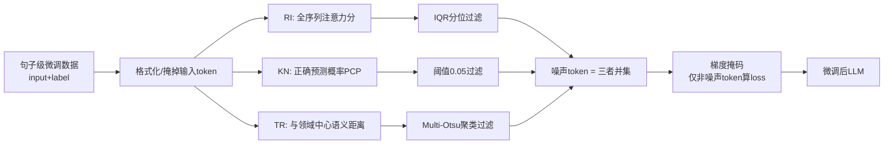

# Explainable Token-level Noise Filtering for LLM Fine-tuning Datasets

**会议**: ICLR 2026  
**OpenReview**: [https://openreview.net/forum?id=WEEodalWQg](https://openreview.net/forum?id=WEEodalWQg)  
**代码**: 待确认  
**领域**: llm_efficiency  
**关键词**: 微调数据优化, token 级噪声, 梯度掩码, 可解释性, 注意力打分  

## 一句话总结
针对"微调数据是句子级、但 LLM 优化是 token 级"的错配，本文提出 XTF：把每个 token 对微调的贡献拆解为「推理重要性 / 知识新颖性 / 任务相关性」三个可解释属性分别打分，凡完全缺失任一属性的 token 即判为噪声，并在训练时对其梯度做掩码，在数学/代码/医学三类任务、7 个主流 LLM 上把微调精度最高提升 13.7%。

## 研究背景与动机
- **领域现状**：微调是把通用 LLM 适配到下游任务的关键手段，而数据质量决定微调上限。现有数据优化分两条路——数据过滤（剔除低质样本）和数据增强（扩充样本），但二者都在**样本（句子）粒度**上操作。
- **现有痛点**：LLM 的训练目标是在**每个 token** 上算 loss、逐 token 更新参数，可微调数据集却是句子级标注，把整句话当作目标输出。一句标签里并非所有 token 都对性能有益，把整句无差别拿去训练会引入 **token 级噪声**，误导收敛方向、反而拉低下游性能。
- **核心矛盾**：要在 token 粒度过滤噪声，必须回答两个难题——(1) 现有可解释性研究只能解释"输入 token 如何影响生成"，**说不清标签里某个 token 对微调任务到底有没有价值**；(2) 微调效果同时取决于基座模型已有的知识和目标任务的特性，**判噪不能只靠单一标准**。已有的 token 级训练工作（如基于 loss 变化的 selective LM、面向 DPO 的 token reward）要么依赖"高质量数据无噪声"这一在微调场景常不成立的隐含假设，要么局限于偏好对齐/蒸馏等特定场景。
- **本文目标**：建立一套**可解释、可计算、兼顾基座与任务**的 token 级判噪准则，在不改模型结构的前提下把噪声 token 从微调中剔除。
- **核心 idea**：**属性分解（attribute decomposition）**——与其给 token 价值一个说不清的复合分，不如把"贡献"拆成三个正交且各自可量化的属性；**只要一个 token 完全不具备其中任意一个属性，就可判为噪声**，再用梯度掩码让它不参与训练。

## 方法详解

### 整体框架
XTF 把微调看作"高性能基座模型"与"任务数据集"之间的对齐，于是从三个角度衡量一个标签 token 的价值：对应基座认知的**推理重要性 RI**、对应基座与任务差异的**知识新颖性 KN**、对应任务知识本身的**任务相关性 TR**。整条流水线分三步：先按常规格式函数预处理数据并掩掉输入 token；再用三种"推理级"可解释方法分别给输出标签的每个 token 打 RI/KN/TR 三个分，取三类被过滤 token 的并集作为噪声集；最后把噪声 token 标成 `-100`、在训练时屏蔽其梯度，仅用剩余 token 计算 loss。

### 关键设计
**1. 三属性判噪准则：从"复合打分"退回"缺一即噪"**
作者先论证三个属性无法简单加权成一个综合分——它们之间既没有明确的相互关系，也没有天然的层级顺序，硬凑权重缺乏依据。于是换一个更稳的逻辑：不去算 token 有多好，而是看它是否**完全缺失某一属性**。直觉上，一个 token 哪怕能影响后续生成（有 RI）、或代表基座没学过的知识（有 KN），但只要它和任务目标毫不相关（缺 TR），它对微调就是无用噪声。形式化地，噪声集是三类缺失数据的并集：
$$D_{noise} = (D_{RI\downarrow}) \cup (D_{KN\downarrow}) \cup (D_{TR\downarrow})$$
这一"析取式"准则把"判断哪些 token 有用"这个模糊问题，转成"从三个独立视角各自找出明显缺失者"的三个简单问题，且每个判断都有可解释来源（附录 A 给出逻辑证明）。

**2. 三种推理级打分：低成本、且不脱离基座与数据本身**
打分方法被刻意约束为两点——算力可控、且必须联合考虑基座模型与数据，因此三者都直接复用基座模型的前向信号，无需另训参考模型。**RI 用注意力分**：把输入与标签拼接后整体喂入基座，取标签第 $k$ 个 token 的注意力值 $S_{RI}(O_k)=A(\theta, I+O)[l_I+k]$，注意力越低说明在生成逻辑中越不重要（已有工作表明屏蔽低注意力 token 甚至能提升生成质量）。**KN 用正确预测概率 PCP**：$S_{KN}(O_k)=1-P(O_k\mid I+[O_0,\dots,O_{k-1}])$，模型预测该 token 的概率越高，说明它越是模型已掌握的旧知识、新颖性越低。**TR 用语义距离**：先把整条数据喂入基座、对 embedding 取均值得到该任务的"领域向量" $V(Domain)$，再算各 token 的无上下文 embedding 与领域中心的距离 $S_{TR}(O_k)=1-\text{Normalize}(D(E(O_k), V(Domain)))$，离中心越远越与任务无关。三个分都来自基座本身，因而天然"兼顾基座认知与任务特性"。

**3. 分布自适应过滤：三种分布配三种阈值法**
作者观察到三类分数在数据上的分布形态截然不同（图 3），因此不能用统一阈值。RI 分数呈"扎堆在若干固定值、归一化后差异被放大"的极端分布，用**四分位法（IQR）**砍掉极低分：$Q_1-IQR$ 以下判为缺 RI。KN 分数近似**均匀分布**、低分难区分，于是用启发式硬阈值——PCP 高于 95%（即 $S_{KN}<0.05$）的 token 视作"只含旧知识、无新颖性"的噪声。TR 分数呈**聚类特征**，用 **Multi-Otsu** 多阈值分割，并特意跳过均值最小的簇（多为空格/替换符），过滤均值第二小的簇。

**4. 激进并集 + 保守阈值：用多视角互补补偿宽松阈值的漏检**
XTF 取三类过滤 token 的**并集**（激进），但每个属性内部用**保守阈值**（只砍分数显著偏低者），二者看似矛盾实则配套：保守阈值保证被砍的 token 确实"完全"缺该属性、不误伤；而并集靠多属性互补来补偿单视角的漏检。作者用实测支撑这一设计——不同属性过滤出的 token 重叠率不超过 58.3%（图 4），说明"某一视角难以区分的模糊噪声，往往能被另一视角清晰识别"。最终损失函数只对非噪声 token 求和：
$$L_F = -\sum_{O_k \notin N} \log P(O_k \mid I+[O_0,O_1,\dots,O_{k-1}])$$

## 实验关键数据
- **设置**：3 个下游任务——数学（GSM8K 微调+评测）、代码（CodeExercise 微调 / HumanEval 评测）、医学（PubMedQA）；7 个基座，覆盖 DeepSeek-R1-distilled-Qwen-1.5B/7B/14B、Llama-3.2-1B/3B、Llama-3.1-8B、Mistral-7B，含全参与 LoRA。基线含常规微调（Normal）、双倍 epoch、样本级数据过滤 DF、数据增强 DA、selective LM（SLM）、token cleaning（TC）。评测用 judge model 判对错（数学/医学），代码用 pass@1/5/10。

### 主实验（GSM8K 数学任务，accuracy %，节选）

| Model | LoRA | CA | Normal | DF | SLM | TC | **XTF** |
|---|---|---|---|---|---|---|---|
| Llama-3.2-3B | × | 3.9 | 25.8 | 36.9 | 38.8 | 38.4 | **40.5** |
| Mistral-7B | × | 8.0 | 15.0 | 21.3 | 22.6 | 24.1 | **29.1** |
| DeepSeek-1.5B | × | 17.6 | 42.9 | 47.0 | 37.3 | 38.5 | **56.2** |
| DeepSeek-7B | × | 37.9 | 63.0 | 65.5 | 63.8 | 61.9 | **69.3** |
| DeepSeek-14B | ✓ | 34.5 | 47.6 | 52.4 | 49.3 | 52.1 | **60.3** |
| **平均** | – | 16.0 | 37.1 | 41.4 | 40.5 | 41.0 | **45.7** |

- 数学任务：XTF 平均比 Normal 高 8.6%、比最佳基线 DF 高 4.3%，10 例里 8 个最优、2 个次优；DeepSeek-1.5B 全参时比 Normal 高 **13.3%**。
- 医学任务（PubMedQA）：平均比 Normal 高 6.7%、比最佳基线 TC 高 3.4%；Llama-3.1-8B(LoRA) 比 Normal 高 **13.7%**。
- 代码任务（HumanEval）：pass@1/5/10 最高分别提升 5.6%/5.6%/6.3%；给的生成机会越多（pass@1→@10）增益越大；部分案例 Normal 微调反而掉点，印证噪声 token 的危害。

### 消融实验（三属性组合，平均 accuracy %）

| Case | RI | KN | TR | Avg |
|---|---|---|---|---|
| Zero | − | − | − | 30.7 |
| I | × | − | − | 32.0 |
| II | − | × | − | 34.5 |
| III | − | − | × | 33.3 |
| IV | × | × | − | 36.1 |
| V | × | − | × | 36.9 |
| VI | − | × | × | 36.3 |
| **XTF** | × | × | × | **40.1** |

- 三属性全开始终最优，任意单属性或两两组合都不及，说明三者缺一不可、且彼此互补。
- 但**最优两属性组合随模型与任务变化**（数学上 RI+KN 常占优，医学上则不固定），印证了"判噪须联合考虑基座与任务、不存在通用单一标准"的出发点。

### 关键发现
- 基座越强、规模越大，噪声过滤增益越明显——更强的基座更能放大 XTF 的收益，因为"判噪本就依赖基座的知识水平"。

## 亮点与洞察
- **把"token 价值"这一玄学问题做了可解释拆解**：RI/KN/TR 三属性各自对应"基座认知 / 基座与任务差异 / 任务知识"，每个都能用基座前向信号直接读出，整套判噪有迹可循而非黑箱启发式。
- **"缺一即噪 + 析取并集"是聪明的工程退让**：放弃难以标定的复合权重，转成三个互不依赖的简单判断，既绕开了属性间关系不明的困境，又用 58.3% 的低重叠率证明多视角确实互补。
- **零额外训练成本**：三种打分全部复用基座的注意力/概率/embedding，比"另训参考模型"的 selective LM 一类方法更轻量。
- **纯数据侧、即插即用**：只改 label 的 `-100` 掩码，不动模型结构与训练框架，全参/LoRA 通吃。

## 局限与展望
- **打分仍是推理级开销**：要对全量 token 跑一遍基座前向，大模型上负担不小；作者设想用小蒸馏模型替大模型判噪来降本，但尚未实现。
- **属性体系可扩展但未穷尽**：三属性是人工设计，作者承认可以引入更多属性、从更多视角评估，目前覆盖面有限。
- **阈值仍带启发式**：KN 的 0.05、TR 跳过第二小簇等阈值偏经验，缺少更原则化的自适应机制；附录虽有阈值消融但泛化性待考。
- **"缺一即噪"的理论保证依赖附录 A 的逻辑论证**，在更复杂任务/更弱基座下是否仍成立值得进一步验证。

## 相关工作与启发
- **样本级数据优化（DF/DA）**：传统数据过滤与增强只在句子粒度操作，无法消除句内 token 噪声——本文正是补上 token 粒度这块空白。
- **token 级训练（SLM、token cleaning、DPO token reward）**：已有工作或基于 loss 变化选 token、或依赖"高质量数据无噪声"的隐含假设、或局限于偏好对齐场景；XTF 用可解释属性分解给出更通用、不依赖该假设的判噪框架。
- **LLM 可解释性**：现有解释方法多聚焦推理过程（输入 token 如何影响生成），鲜有解释"标签 token 与微调结果的关系"——本文把可解释性从"理解推理"延伸到"指导训练数据优化"，是一个值得借鉴的迁移视角。
- **启发**：当一个目标量难以直接打分时，"分解为若干正交、各自可观测的属性 + 析取式判定"可能比硬凑复合指标更鲁棒；这套思路对数据选择、样本加权、课程学习等场景都有潜在迁移价值。

## 评分
- 新颖性: ⭐⭐⭐⭐ 把句子级/token 级错配讲清楚，并用"三属性分解 + 缺一即噪 + 梯度掩码"给出可解释判噪框架，视角清新、落地干净。
- 实验充分度: ⭐⭐⭐⭐ 3 任务 × 7 模型 × 全参/LoRA，对比 6 类基线，含属性消融与互补性分析，覆盖较全；代码任务增益偏小、阈值消融放附录略减分。
- 写作质量: ⭐⭐⭐⭐ 动机—准则—打分—过滤—训练逻辑顺，三属性命名直观，图 3/图 4 把"为何用不同阈值""为何取并集"解释得很到位。
- 价值: ⭐⭐⭐⭐ 即插即用、零额外训练、对强基座增益明显，对实际微调数据清洗有直接参考意义；主要门槛是全量 token 的推理级打分成本。

<!-- RELATED:START -->

## 相关论文

- [\[ICLR 2026\] Difficulty–Diversity Collaborative Filtering for Data-Efficient LLM Fine-Tuning](difficultydiversity_collaborative_filtering_for_data-efficient_llm_fine-tuning.md)
- [\[ICLR 2026\] CPQS-Tuning: A Model Self-Perception-Based Data Filtering Algorithm for Efficient Instruction Fine-Tuning](cpqs-tuning_a_model_self-perception-based_data_filtering_algorithm_for_efficient.md)
- [\[ICLR 2026\] Influence-Preserving Proxies for Gradient-Based Data Selection in LLM Fine-Tuning](influence-preserving_proxies_for_gradient-based_data_selection_in_llm_finetuning.md)
- [\[ICLR 2026\] MHLA: Restoring Expressivity of Linear Attention via Token-Level Multi-Head](mhla_restoring_expressivity_of_linear_attention_via_token-level_multi-head.md)
- [\[ICLR 2026\] Unlocking Full Efficiency of Token Filtering in Large Language Model Training](unlocking_full_efficiency_of_token_filtering_in_large_language_model_training.md)

<!-- RELATED:END -->
