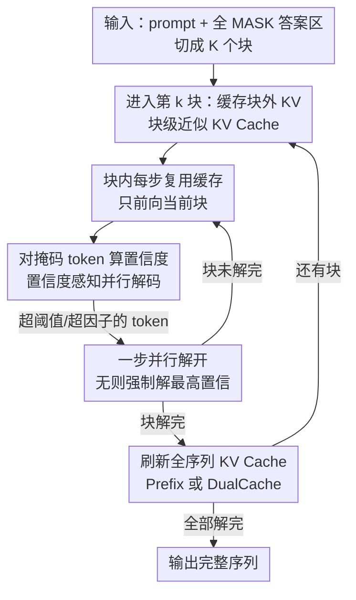

# Fast-dLLM: Training-free Acceleration of Diffusion LLM by Enabling KV Cache and Parallel Decoding

**会议**: ICLR 2026  
**OpenReview**: [https://openreview.net/forum?id=3Z3Is6hnOT](https://openreview.net/forum?id=3Z3Is6hnOT)  
**代码**: https://nvlabs.github.io/Fast-dLLM  
**领域**: LLM效率 / 扩散语言模型  
**关键词**: Diffusion LLM, KV Cache, 并行解码, 推理加速, 置信度阈值

## 一句话总结
Fast-dLLM 无需重新训练，给双向扩散语言模型补上一套块级近似 KV Cache，并用「置信度阈值」替代固定 top-K 的并行解码策略，在 LLaDA / Dream 上实现最高 27.6× 的端到端吞吐提升，且精度几乎不掉。

## 研究背景与动机
**领域现状**：扩散式大语言模型（Diffusion LLM）用「掩码—去噪」的非自回归方式生成文本，理论上能一次并行恢复多个 token，且天然支持双向注意力。商业系统（Mercury、Gemini Diffusion）已经跑到每秒上千 token，让人对它的加速潜力充满期待。

**现有痛点**：但开源扩散 LLM 的实际推理速度反而常常落后于自回归（AR）模型。原因有两个：① 它**用不了 KV Cache**——AR 模型靠缓存历史 token 的 Key/Value 避免重复计算，而扩散模型每步都是对整段序列做全注意力，没有「只往前看」的因果结构，缓存无法直接复用；② **并行解码会掉质量**——LLaDA 等模型只有逐个 token 解码时效果最好，一旦一步同时解多个 token，生成质量迅速崩坏。

**核心矛盾**：并行解码崩坏的根因，是 τ-leaping 在一步内对多个 token 做了**条件独立假设**：它用边缘概率乘积 $\prod_j p(x^j_s\mid x_t)$ 近似真实联合分布 $p(x^i_s, x^j_s\mid x_t)$，从而忽略了 token 之间的依赖（如 $p(x^j_s\mid x_t, x^i_s)$）。一旦同时解的 token 互相依赖，就会生成「high house」这种各自局部合理、合起来却语无伦次的搭配。于是扩散 LLM 卡在两难：要质量就只能一步一个 token（慢），要速度就并行解码（崩）。

**本文目标**：在**不重新训练**的前提下，同时解决「没有 KV Cache」和「并行解码掉质量」两个问题，把扩散 LLM 的实际吞吐拉到能和 AR 模型掰手腕的水平。

**切入角度**：作者做了两个关键观察——其一，把生成改成**块级（block-wise）**进行后，同一个块内相邻去噪步之间，prefix/suffix 的 KV 激活余弦相似度高度接近 1，意味着缓存「虽不精确但足够好」可以放心复用；其二，并行解码的崩坏只发生在低置信度 token 上，**只挑模型已经很有把握的 token 一起解**，就能在大部分时候避免依赖被破坏。

**核心 idea**：用「块级近似 KV Cache + 置信度阈值并行解码」两个免训练插件，把扩散 LLM 里被浪费的重复计算和不安全的并行步同时省掉。

## 方法详解

### 整体框架
Fast-dLLM 建立在掩码扩散模型（MDM）之上，把生成过程组织成**按块顺序展开**的形式：答案区被切成若干长度为 $B$ 的块，从左到右一块一块地解。框架由两个正交且互补的加速组件构成——**块级近似 KV Cache** 负责砍掉跨步的重复注意力计算，**置信度感知并行解码** 负责在保质量的前提下一步多解几个 token。两者都是纯推理期策略，不改权重、不需微调。

整段流程（对应论文 Algorithm 1）是：先把 prompt 之后全填成 `[MASK]`，初始化 KV Cache；进入某个块前，先算好并缓存该块**之外**所有 token 的 Key/Value；在块内的每一步去噪里，复用这份缓存只对当前块跑前向，对每个掩码 token 算置信度，把超过阈值的 token 一次性解开（若全都没过阈值，就强制解开置信度最高的那个以保证推进）；块内全部解完后，再统一刷新一次全序列的 KV Cache，进入下一块。

### 关键设计

**1. 块级近似 KV Cache：用「相邻步激活几乎不变」换掉重复全注意力**

扩散 LLM 双向注意力的本质让它无法拥有 AR 那样**精确**的 KV Cache，但作者发现一个可利用的近似性：把生成改成块级后，画出 LLaDA 的 Key-Value 激活在不同推理步之间的余弦相似度热力图，会看到对角线邻域（相邻步 $i\approx j$）的相似度持续接近 1，只有相距很远的步之间相似度才明显下降。这说明在解一个块的过程中，prefix（以及全是掩码的 suffix）的 Key/Value 几乎不变。基于此，进入某块前先把块外 token 的 KV 算好存下，块内多步去噪全部复用这份缓存，**只对当前块做前向**；块解完后再统一刷新一次全序列缓存以纠正累积误差。关键之处在于，这个缓存刷新可以和解码步**融合**进行，所以相比不用缓存**没有额外计算开销**，纯赚——把原本每步 $O(L)$ 的全注意力压到只算块内的一小段。

作者进一步提出 **DualCache**：不仅缓存 prefix，还缓存块**之后**那段「全是掩码」的 suffix。热力图同样显示 suffix 的 KV 在块内各步差异可忽略。当 prefill 很长（如 8-shot）或生成很长（如 1024）时，DualCache 能复用的计算更多，加速也更显著——这也是 27.6× 这个峰值数字主要来源于 8-shot、生成长度 1024 配置的原因。

**2. 置信度感知并行解码：只解「模型有把握」的 token，绕开条件独立陷阱**

针对并行崩坏，已有做法是引入辅助模型显式建模 token 依赖，但会让 pipeline 变复杂。Fast-dLLM 选了一条更简单的路：每步对每个掩码 token 算一个置信度 $c_i = \max_x p_\theta(x_i\mid\cdot)$（softmax 最大概率），**只解开置信度超过全局阈值 $\tau$ 的 token**，其余继续保持掩码、留到后续步再判断；若某步没有任何 token 过阈值，就强制解开置信度最高的那个，避免死循环。这与 LLaDA「每步固定挑 top-K」的做法形成对比——固定数量会强行解开一些模型其实没把握的 token，而这些恰恰是依赖最容易被破坏的地方；按阈值动态选则把并行度交给模型自己的确定性来控制。

这个策略不是拍脑袋，作者给了理论支撑（Theorem 1）：设要并行解的 $n$ 个 token 都满足高置信 $p_j(x_{i_j}\mid E) > 1-\epsilon$，当 $(n+1)\epsilon \le 1$ 即 $\epsilon \le \tfrac{1}{n+1}$ 时，**贪心并行解码（取边缘乘积的 argmax）与贪心顺序解码（取真实联合分布的 argmax）结果完全一致**，且该界是紧的；定理还给出了两者分布的总变差 $D_{TV}(p,q) < \tfrac{3n-1}{2}\epsilon$ 与前向 KL 的上界。直觉上：只要每个 token 都足够确定，它们之间残余的依赖就不足以改变联合最优解，此时并行解码是「安全」的。

**3. 因子式并行解码：把定理直接变成自适应选 token 数的规则**

固定阈值 $\tau$ 仍是个静态超参，作者顺着 Theorem 1 的不等式给出更自洽的**因子式（factor-based）**变体：把块内各 token 的置信度降序排成 $c_{(1)}\ge c_{(2)}\ge\dots$，选满足 $(n+1)(1-c_{(n)}) < f$ 的**最大** $n$，一步并行解这 top-$n$ 个，其中 $f$ 是固定的解码因子。这个判据正好镜像了定理里 $(n+1)\epsilon \le 1$ 的形式（把 $\epsilon$ 换成 $1-c_{(n)}$），相当于让「并行度」随当前这批 token 的置信度分布动态伸缩——大家都很确定时一步多解几个，有人含糊时就少解，在理论可控的范围内最大化并行度。

### 损失函数 / 训练策略
本方法是**纯推理期、免训练**的：不引入任何新参数、不做微调，直接套在已训练好的 LLaDA / Dream 等掩码扩散模型上。涉及的超参主要是缓存块大小（4–32，默认 32）和置信度阈值（0.5–1.0，默认 0.9）。

## 实验关键数据

### 主实验
在 NVIDIA A100 80GB 上，于 LLaDA-Instruct 与 Dream-Base 上跨 GSM8K / MATH / HumanEval / MBPP / IFEval 评测，吞吐为端到端「输出 token / 秒」。

| 模型 / 任务 | 生成长度 | Baseline 吞吐 | +Cache | +Parallel | Fast-dLLM(Cache+Parallel) | 精度变化 |
|--------|------|------|------|------|------|------|
| LLaDA · GSM8K(5-shot) | 256 | 6.7 (1×) | 21.2 (3.2×) | 16.5 (2.5×) | 54.4 (**8.1×**) | 79.3→78.5 |
| LLaDA · GSM8K(5-shot) | 512 | 3.2 (1×) | 10.4 (3.3×) | 18.6 (5.8×) | 35.3 (**11.0×**) | 77.5→77.2 |
| LLaDA · MBPP(3-shot) | 512 | 4.3 (1×) | 10.1 (2.3×) | 22.3 (5.1×) | 39.5 (**9.2×**) | 14.8→13.8 |
| Dream · MBPP(3-shot) | 512 | 9.4 (1×) | 26.7 (2.8×) | 37.6 (4.0×) | 73.6 (**7.8×**) | 55.6→55.2 |
| Dream · GSM8K(5-shot) | 256 | 9.1 (1×) | 32.5 (3.6×) | 14.2 (1.6×) | 48.2 (**5.3×**) | 75.0→74.8 |

单组件即有效（Cache 单独 2×–3.6×，Parallel 单独约 4×–6×），两者高度互补、叠加后增益最大；全程精度与骨干网相差 1–2 个点，部分配置甚至略升。

多模态 LLaDA-V 上（Table 3）：MathVista 用 refresh-based 更新得到 **9.9×** 加速（59.2→56.6），MathVerse 达 **8.5×** 且精度略升（28.5→28.6），说明方法跨文本/视觉模态都成立。

### 消融实验
DualCache 在长 prefill / 长生成下收益最大，是 27.6× 峰值的来源（LLaDA，生成长度 1024）：

| 配置(8-shot, Len 1024) | 精度 | 吞吐(加速) | 说明 |
|------|------|------|------|
| Baseline | 77.3 | 0.7 (1×) | 逐 token 解 |
| Parallel + No Cache | 78.0 | 9.3 (13.3×) | 仅置信度并行 |
| Parallel + PrefixCache | 75.7 | 13.0 (18.6×) | 加 prefix 缓存 |
| Parallel + DualCache | 76.0 | 19.3 (**27.6×**) | prefix+suffix 缓存 |

生成长度从 256→512→1024，DualCache 的加速从 9.4×→15.8×→27.6× 单调上升，验证「越长越赚」。

### 关键发现
- **两组件正交互补**：KV Cache 砍重复计算、并行解码减步数，二者叠加而非冲突，组合加速 ≈ 各自加速的乘积量级。
- **置信度策略 > 固定 top-K**：在相同「每步平均 token 数」下，阈值/因子式解码的 GSM8K 精度持续高于固定 top-2/4/8 基线（Figure 5c），证明「按把握度选」比「按数量选」更安全。
- **长序列是甜点区**：prefill 与生成越长，可复用的缓存越多、DualCache 收益越大，这正契合 few-shot 推理与代码生成等真实长序列场景。
- **块大小有 trade-off**：缓存块过大近似误差累积、精度下滑，默认块大小 32 在精度与吞吐间取得较好平衡（Figure 4，3.3× 加速点）。

## 亮点与洞察
- **「近似但够用」的 KV Cache**：双向注意力本不可能有精确缓存，但作者用热力图实证「相邻去噪步激活几乎不变」，把不可能问题转成可接受的近似——这是把工程直觉用数据坐实的范例。
- **缓存刷新零开销**：把块末的全序列缓存刷新和解码步融合，使得「加缓存」相比「不加」没有任何额外前向，几乎是白送的加速。
- **理论与算法严丝合缝**：Theorem 1 的 $(n+1)\epsilon\le1$ 不只是事后解释，而是直接被搬成因子式解码的选 token 判据 $(n+1)(1-c_{(n)})<f$，让超参选择有了原理依据，而非纯调参。
- **免训练即插即用**：所有收益都不动权重，可直接套到任意掩码扩散 LLM，迁移成本极低——这点对部署侧极具吸引力。

## 局限与展望
- 近似 KV Cache 终究有误差，块大小过大时精度会下滑（Figure 4），需要按模型/任务调块大小；多模态 LLaDA-V 对块大小尤其敏感（96→8 在 MathVista 掉超 8%），不得不保留全块长 + refresh 更新来补偿。
- 加速倍数高度依赖序列长度与 prefill 长度，**短序列**场景收益有限（如 IFEval 仅 2–3.7×），27.6× 这类亮眼数字仅在长生成 + 多 shot 下成立，横向比较时不可直接套用。
- 置信度阈值/因子是手调超参，默认 0.9 未必对所有任务最优；理论保证建立在「高置信」前提上，低置信度密集的难任务上并行度会被压低、加速收窄。
- 仅在掩码扩散这一类（LLaDA/Dream）上验证，对其他扩散语言模型范式的普适性仍待检验。

## 相关工作与启发
- **vs LLaDA 原生 top-K 并行**：LLaDA 每步固定挑置信度 top-K 个 token 解，会强解一些没把握的 token 导致依赖破坏；本文改为按全局阈值/因子动态选，只解有把握的，相同 token/步预算下质量更高。
- **vs 引入辅助模型建模依赖**：部分工作训练额外模型显式捕捉 token 间依赖来缓解条件独立问题，代价是 pipeline 变复杂、需训练；本文用一个简单的置信度判据 + 理论界绕过这一问题，免训练且更轻。
- **vs 自回归 KV Cache**：AR 的因果结构让 KV Cache 精确无损；扩散的双向注意力做不到，本文用「块级 + 近似」把这套加速利器移植到扩散范式上，是两类范式效率工具的一次跨界对齐。

## 评分
- 新颖性: ⭐⭐⭐⭐ 把 KV Cache 移植到双向扩散并用置信度阈值替代固定 top-K，配上紧致的理论界，思路清晰且实用。
- 实验充分度: ⭐⭐⭐⭐⭐ 覆盖两类骨干、五个基准、多种长度与多模态，组件消融与超参分析完整。
- 写作质量: ⭐⭐⭐⭐ 动机—观察—方法—理论链条顺畅，图表支撑充分。
- 价值: ⭐⭐⭐⭐⭐ 免训练即插即用、最高 27.6× 加速且精度几乎不掉，对扩散 LLM 实际部署意义重大。

<!-- RELATED:START -->

## 相关论文

- [\[ICLR 2026\] Dynamic-dLLM: Dynamic Cache-Budget and Adaptive Parallel Decoding for Training-Free Acceleration of Diffusion LLM](dynamic-dllm_dynamic_cache-budget_and_adaptive_parallel_decoding_for_training-fr.md)
- [\[ICLR 2026\] Learning to Parallel: Accelerating Diffusion Large Language Models via Learnable Parallel Decoding](learning_to_parallel_accelerating_diffusion_large_language_models_via_learnable_.md)
- [\[ICLR 2026\] Fast-dLLM v2: Efficient Block-Diffusion LLM](fast-dllm_v2_efficient_block-diffusion_llm.md)
- [\[ICLR 2026\] Attention Is All You Need for KV Cache in Diffusion LLMs](attention_is_all_you_need_for_kv_cache_in_diffusion_llms.md)
- [\[ICLR 2026\] Hierarchy Decoding: A Training-free Parallel Decoding Strategy for Diffusion Large Language Models](hierarchy_decoding_a_training-free_parallel_decoding_strategy_for_diffusion_larg.md)

<!-- RELATED:END -->
