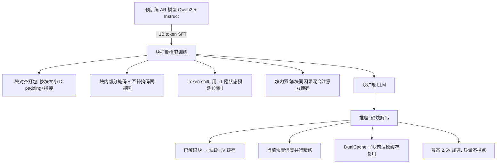

# Fast-dLLM v2: Efficient Block-Diffusion LLM

**会议**: ICLR 2026  
**OpenReview**: [https://openreview.net/forum?id=1NZ3DHF9nT](https://openreview.net/forum?id=1NZ3DHF9nT)  
**代码**: [https://nvlabs.github.io/Fast-dLLM/v2/](https://nvlabs.github.io/Fast-dLLM/v2/)  
**领域**: LLM 推理加速 / 扩散语言模型  
**关键词**: 块扩散、并行解码、AR 模型适配、层次化缓存、互补掩码  

## 一句话总结
Fast-dLLM v2 用约 1B token 的轻量微调把预训练的自回归 Qwen2.5 模型改造成块扩散语言模型，配合层次化缓存与置信度并行解码，在不掉点的前提下相比 AR 解码取得最高 2.5× 的加速。

## 研究背景与动机
**领域现状**：自回归（AR）LLM 凭借 next-token prediction 成为部署主流，但严格的逐 token 左到右解码无法利用并行性，推理效率受限。扩散语言模型（dLLM）允许多 token 甚至整块联合预测/精修，理论上并行度更高，代表作 LLaDA（从头训）和 Dream（从 Qwen2.5 适配）已被扩到 7B 规模。

**现有痛点**：纯扩散 dLLM 在实践中问题重重——双向注意力导致 KV cache 难以有效复用，推理延迟常常反而高于 AR 模型，且多数要求固定序列长度、生成长度灵活性差。Fast-dLLM 此前提出的 DualCache 是近似 KV cache，并不等价于原始计算，没从根本上解决 dLLM 与 KV cache 的不兼容。块扩散（BD3-LMs）通过"块间自回归、块内扩散"在两种范式间插值，同时获得灵活长度和块间 KV 缓存，但只在小模型和传统 LM 指标上验证过，能否扩到 SOTA 大模型并保持质量未知。

**核心矛盾**：想要扩散带来的并行解码效率，又不想付出从头训练扩散模型的巨大数据代价（Dream 需 ~500B token 微调），还要保住 AR 模型原有的生成质量。

**本文目标**：把成熟的预训练 AR 模型**低成本**地适配成可大规模部署的块扩散 LLM，在质量不退化的同时拿到真实加速。

**核心 idea**：**[AR 友好的块扩散设计]** 采用接近原 AR 模型的块级注意力结构，使适配过程天然兼容、数据高效——仅用 ~1B token（比 Dream 少 500×）即实现无损适配；**[层次化缓存 + 块内并行]** 块级缓存复用历史上下文，子块缓存支持部分解码块内的并行生成，二者叠加 DualCache 把扩散的并行潜力真正转化为吞吐提升。

## 方法详解

### 整体框架
Fast-dLLM v2 分两阶段：**训练侧**把 Qwen2.5-Instruct（1.5B/7B）通过 SFT 改造成块扩散模型——序列按块大小 D 对齐打包，块内做带部分掩码的 next-token 预测，并用互补掩码保证每个 token 都被监督；**推理侧**逐块自回归解码，已解码块缓存为只读前缀上下文，当前块内用置信度并行精修 + DualCache 复用。关键在于块内双向、块间因果的混合注意力掩码在训练和推理时保持一致。

### 关键设计

**1. AR 到块扩散的数据高效适配：用块对齐打包保住质量。** 与 Dream 那种全注意力扩散不同，Fast-dLLM v2 刻意采用接近原 AR 的块级注意力结构，让微调天然兼容、数据需求骤降。具体做法是先把每条样本用 [MASK] padding 到块大小 D 的整数倍（这些 padding 不计损失），再把多条 padding 后的序列拼成长流并切成固定上下文长度 L 的训练序列，于是每条序列自然被切成 $B = L/D$ 个对齐的非重叠块。这种块对齐打包既保证批处理效率，又避免块边界跨越样本边界——后者在双向注意力下会造成跨样本信息泄漏。

**2. 互补掩码 + token shift：让每个 token 都被监督且保住 AR 表示。** 块内随机采样二值掩码 $m \in \{0,1\}^D$（$m_j=1$ 表示该位置替换成可学习的 [MASK] embedding），然后把每条样本复制成掩码 $m$ 和其补 $\bar{m}=1-m$ 两个视图放进同一 batch，使得某个视图里被掩的 token 能在另一个视图里被预测，从而所有 token 都获得监督。为保住预训练 AR 模型的表示质量，采用 shifted-label 策略：被掩位置 $i$ 的预测用其前一位置 $i-1$ 的 logit，与因果 LM 的 next-token 机制一致。训练只在被掩 token 上算交叉熵：
$$\mathcal{L}_{block}(\theta) = -\mathbb{E}_{x,m}\left[\sum_{i=1}^{L} \mathbb{1}[x_t^i = \text{[MASK]}]\log p_\theta(x_0^i \mid x_{<i}, x_{block(i)})\right]$$
其中 $x_{block(i)}$ 是位置 $i$ 所在块的全部 token（含掩/非掩），$x_{<i}$ 是更早块的干净 token。注意力上把噪声序列 $x_t$ 和干净序列 $x_0$ 沿序列维拼成长度 $2L$，用 $A \in \{0,1\}^{2L\times 2L}$ 的混合掩码同时支持块内并行与块间因果，并用 flex-attention 高效实现。

**3. 层次化缓存 + 置信度并行解码：把扩散并行潜力转成真实吞吐。** 推理逐块进行，块间天然保留左到右语义：每块解码完后其非掩 token 缓存为后续块的只读上下文，实现块级 KV 复用，大幅减少冗余计算；当前块内则借鉴 Fast-dLLM 的置信度感知并行解码——对被掩 token 按预测置信度迭代精修，超过阈值的并行解码并 unmask，不确定的留待后续。阈值设为 1.0 退化为标准非并行解码，阈值 0.9 在 GSM8K 上吞吐从 39.1 涨到 101.7 tokens/s（2.6× 加速）而精度仅微降。块内再叠加 DualCache 维护部分解码块的前缀+后缀 KV 缓存，支撑迭代选择性解码而无需昂贵重算。

**4. 子块解码：解耦训练-推理块大小，避免不匹配掉点。** 训练块大小固定为 32，但推理直接改块大小会因训练-推理不一致而严重掉点（GSM8K 从 62.0 跌到 58.5）。引入子块解码（子块大小固定 8）后，可在不破坏块结构一致性的前提下灵活控制推理粒度，从而在不同任务上拿到更好性能——子块最优大小其实是任务相关的（GSM8K 偏好更小，HumanEval 在 8 更好）。

## 实验关键数据

### 主实验表格
Qwen-2.5 1.5B/7B Instruct 适配，训练用 LLaMA-Nemotron post-training 数据，64× A100（1.5B 训 ~8h，7B 训 ~12h）。

| Model | #Params | HumanEval(Base/Plus) | MBPP(Base/Plus) | GSM8K | Math | IFEval | MMLU | GPQA | Avg. |
|---|---|---|---|---|---|---|---|---|---|
| Qwen2.5-1.5B | 1.5B | 42.1/37.2 | 48.1/41.3 | 57.0 | 46.8 | 41.2 | 54.6 | 30.6 | 44.3 |
| Qwen2.5-1.5B-Nemo-FT | 1.5B | 37.2/33.5 | 53.4/44.4 | 58.5 | 43.5 | 39.4 | 58.1 | 31.0 | 44.3 |
| **Fast-dLLM v2** | 1.5B | 43.9/40.2 | 50.0/41.3 | 62.0 | 38.1 | 47.0 | 55.1 | 27.7 | **45.0** |
| Dream | 7B | 57.9/53.7 | 68.3/56.1 | 81.0 | 39.2 | 62.5 | 67.0 | 33.0 | 57.6 |
| Qwen2.5-7B-Nemo-FT | 7B | 52.4/48.2 | 57.1/50.0 | 84.1 | 72.0 | 69.5 | 68.6 | 34.2 | 59.6 |
| **Fast-dLLM v2** | 7B | 63.4/58.5 | 63.0/52.3 | 83.7 | 61.6 | 61.4 | 66.6 | 31.9 | **60.3** |

7B 版本 Avg. 60.3 超过 Qwen2.5-7B-Nemo-FT（59.6）和 Dream（57.6），代码生成（HumanEval 63.4）领先明显；1.5B 版本 Avg. 45.0 刷新 1B 级扩散/AR 的 SOTA。吞吐上 Fast-dLLM v2(7B) 比 Qwen2.5-7B-Instruct 快 2.54×，比 Fast-dLLM-LLaDA 精度 +5.2%。

### 消融实验表格
1.5B 模型上拆解训练配方（互补掩码 CM + padding）：

| Method | HumanEval(Base/Plus) | MBPP(Base) | GSM8K | Avg. |
|---|---|---|---|---|
| Naive token shift | 38.4/32.9 | 44.4 | 59.0 | 41.3 |
| + pad | 38.4/34.1 | 45.2 | — | — |
| **+ pad + CM（完整配方）** | — | — | — | **+3.7 over naive** |

完整配方相比 naive 平均提升 +3.7 分。padding 防止序列打包时跨样本注意力泄漏（双向注意力下尤其关键），CM 保证全部 token 受监督。子块/块大小消融显示：子块大小 8 平均最优；推理时直接改块大小（不对齐训练配置）会显著掉点（GSM8K 62.0→58.5），印证训练-推理块结构一致性的重要性，子块解码正是为此而设。

### 关键发现
- **数据效率是核心卖点**：仅 ~1B token 微调即无损适配，比 Dream 的 ~500B token 少 500×，源于块级注意力结构接近原 AR 模型。
- **置信度阈值 0.9 是吞吐-质量甜点**：GSM8K 上 2.6× 加速、精度仅微降；阈值越低越激进、吞吐越高。
- **新硬件收益更大**：批量扩展时 A100 上扩散最高 1.5× 吞吐，H100 上达 1.8×，说明扩散解码更能吃满并行硬件。

## 亮点与洞察
- **"适配"而非"重训"的范式**：抓住块级注意力与原 AR 结构的相似性，把扩散能力当作可低成本嫁接的解码模式，而非推倒重来的新模型，工程落地性极强。
- **训练-推理一致性的工程洞察**：明确指出块大小不匹配是掉点根因，并用子块解码优雅解耦推理粒度与训练块结构，是很实用的 trick。
- **缓存层次化设计**：块级缓存（块间）+ DualCache（块内子块）两级复用，把 dLLM 一直被诟病的 KV cache 不兼容问题在工程上绕了过去。
- **可作为投机解码 draft 模型**：论文指出 Fast-dLLM v2-7B 比 Dream-7B 快近 10×，作为 speculative decoding 的 draft 模型是有前景的后续方向。

## 局限与展望
- **DualCache 仍是近似缓存**：块内复用本质上仍是近似 KV cache，并非与原始计算严格等价，论文自己也承认这点未被根本解决。
- **部分指标相对 AR 有退化**：7B 版本在 Math（61.6 vs Nemo-FT 72.0）、MMLU、GPQA 上低于纯 AR 微调基线，说明知识密集/复杂推理任务上块扩散仍有质量代价。
- **子块/块大小任务相关**：最优粒度依任务而变，缺乏自适应选择机制，需人工调参。
- **规模上限**：仅验证到 7B，更大规模（如 70B+）下的适配数据效率与质量保持仍待验证。
- **展望**：与投机解码、更激进的自适应阈值/粒度调度结合，以及把适配范式推广到 MoE、长上下文场景。

## 相关工作与启发
- **块扩散基座**：BD3-LMs（Arriola 2025）首提块间 AR、块内扩散的插值范式，本文将其扩到大规模 LLM 并解决训练-推理不匹配；SDAR（并发工作）同样从 AR 微调块扩散，但本文以数据效率（1B token）和解码鲁棒性（子块解码 + 互补掩码）区分。
- **掩码扩散 LLM**：LLaDA（从头训）、Dream（从 Qwen2.5 适配，~500B token）是 7B 级 dLLM 代表，本文用 500× 更少数据达到可比/更优质量。
- **dLLM 加速**：DualCache（Fast-dLLM）、dKV-Cache、dLLM-Cache、Sparse-dLLM、DPad 等缓存方法，以及置信度并行解码、EB-Sampler、WINO、SlowFast Sampling 等解码策略，本文整合了置信度并行 + DualCache。
- **启发**：低成本把成熟 AR 模型"改装"成并行解码器的思路，对任何想引入非自回归加速但又不愿重训的场景都有借鉴意义；训练-推理结构一致性这一约束在所有块/分段生成方法里都值得警惕。

## 评分
- **新颖性**: ⭐⭐⭐⭐ — 块扩散非首创，但"AR 友好设计 + 1B token 无损适配 + 子块解码解耦"的系统性组合扎实且有洞察。
- **实验充分度**: ⭐⭐⭐⭐ — 覆盖代码/数学/知识/指令多任务，1.5B 与 7B 双规模，含阈值/子块/块大小/训练配方多维消融及 A100/H100 吞吐对比。
- **写作质量**: ⭐⭐⭐⭐ — 动机、方法、缓存层次和训练-推理一致性讲得清晰，图表完整。
- **价值**: ⭐⭐⭐⭐ — 500× 数据效率 + 2.5× 加速 + 不掉点，对 dLLM 实际部署是有分量的一步，工程可复现性强。

<!-- RELATED:START -->

## 相关论文

- [\[ICML 2026\] Fast-dLLM++: Fréchet Profile Decoding for Faster Diffusion LLM Inference](../../ICML2026/llm_efficiency/fast-dllm_fréchet_profile_decoding_for_faster_diffusion_llm_inference.md)
- [\[CVPR 2026\] Rejection Mixing: Fast Semantic Propagation of Mask Tokens for Efficient DLLM Inference](../../CVPR2026/llm_efficiency/rejection_mixing_fast_semantic_propagation_of_mask_tokens_for_efficient_dllm_inf.md)
- [\[ICLR 2026\] Dynamic-dLLM: Dynamic Cache-Budget and Adaptive Parallel Decoding for Training-Free Acceleration of Diffusion LLM](dynamic-dllm_dynamic_cache-budget_and_adaptive_parallel_decoding_for_training-fr.md)
- [\[ICLR 2026\] FlashDLM: Accelerating Diffusion Language Model Inference via Efficient KV Caching and Guided Diffusion](flashdlm_accelerating_diffusion_language_model_inference_via_efficient_kv_cachin.md)
- [\[ICLR 2026\] Prima.cpp: Fast 30-70B LLM Inference on Heterogeneous and Low-Resource Home Clusters](primacpp_fast_30-70b_llm_inference_on_heterogeneous_and_low-resource_home_cluste.md)

<!-- RELATED:END -->
