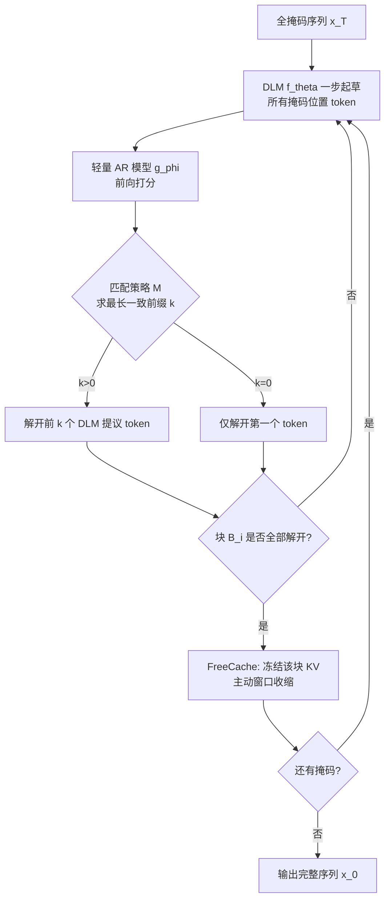

# FlashDLM: Accelerating Diffusion Language Model Inference via Efficient KV Caching and Guided Diffusion

**会议**: ICLR 2026  
**OpenReview**: [https://openreview.net/forum?id=KUfKvlX3VY](https://openreview.net/forum?id=KUfKvlX3VY)  
**代码**: [https://github.com/ZhanqiuHu/flash-dlm-experimental](https://github.com/ZhanqiuHu/flash-dlm-experimental)  
**领域**: LLM 推理加速 / 扩散语言模型  
**关键词**: Diffusion Language Model, KV Cache, Guided Diffusion, Speculative Decoding, Training-free Acceleration  

## 一句话总结
两个免训练技巧——复用稳定 KV 投影的 FreeCache，加上用小 AR 模型一致性信号指导并行解掩码的 Guided Diffusion——让 7B/8B 扩散语言模型推理端到端平均提速 12 倍，首次把扩散 LLM 的延迟拉到与同尺寸自回归模型相当甚至更快。

## 研究背景与动机
**领域现状**：扩散语言模型（DLM，如 Dream-7B、LLaDA-8B）通过对一个全掩码序列反复去噪来并行生成 token，天然具备双向上下文，质量已能追平同尺寸自回归（AR）模型（如 Qwen2.5-7B、Llama3-8B）。这被视为继 AR 之后语言生成的一条新路线。

**现有痛点**：DLM 推理慢得离谱。AR 模型解码时只算新 token、过去 token 全部进 KV cache；而 DLM 每一步去噪都要对**整条长度 L 的序列**做完整的 MHA 与 FFN 前向，每个模块都多出 $O(L)$ 的额外复杂度。多步去噪 = 多次全序列前向，长 prompt、长上下文场景下延迟爆炸。更糟的是，并行解掩码依赖对各掩码位置的**因子化独立分布**，无法建模 token 间联合依赖，于是同步解开多个语义相关位置会引入 token 不连贯（token incoherence），现有采样启发式（MaskGIT、entropy、Top-K margin）在去噪步数减少时精度急剧下滑。

**核心矛盾**：想快就得减少去噪步数 / 缓存 KV，但 DLM 的不规则去噪过程与 AR 那套成熟的 KV 缓存不兼容；已有的 Block Diffusion 虽能上缓存，却需要额外微调/训练，且在大尺寸 DLM 上的可扩展性存疑。即「**免训练地加速 SoTA DLM，同时不掉点**」这件事没人做成。

**本文目标**：在不做任何训练/微调/校准的前提下，直接对货架上的 DLM 加速，既砍掉冗余计算，又抑制并行解掩码带来的不连贯。

**核心 idea**：(1) **冗余可缓存**——已经确定（clean）的 token，其 KV 投影在后续去噪步中只发生可忽略的变化，因此可以冻结复用，把未来 token 对早期位置的影响近似掉；(2) **大模型起草、小模型把关**——让大 DLM 一步起草所有 token，再用一个轻量 AR 模型作为「一致性裁判」决定一次能安全解开多少个，从而大幅压缩去噪迭代数，而不引入 speculative decoding 那种昂贵的逐 token 纠正。

## 方法详解

### 整体框架
FlashDLM 由两个正交、可叠加、均免训练的模块组成。FreeCache 在**单步内部**降低计算量：随着序列分块逐块被确定，主动重算的窗口持续收缩，越往后每步越便宜。Guided Diffusion 在**步与步之间**降低迭代数：每步让 DLM 一次性起草全部掩码位置，再用一个小 AR 模型给出的「最长一致前缀」决定本步实际解开几个 token。两者结合，前者治「每步太贵」，后者治「步数太多」。

### 关键设计

**1. FreeCache：收缩窗口的近似 KV 缓存，把"已定 token"冻起来不再重算。** 作者通过余弦相似度热图观察到一个稳定现象：prompt 区域的 K/V 投影在整个去噪过程几乎不动，而生成区域的 token 一旦从掩码被解开（变 clean），其 V 投影对上一步的相似度就从低（不稳定）迅速跳到高（稳定）并维持。也就是说，未来 token 对一个已确定位置的影响随去噪步迅速衰减，直接缓存这些 clean token 的 KV 等价于一次误差可忽略的 KV 状态近似。基于此，FreeCache 把 post-prompt 生成序列切成固定大小的块 $(B_1,\dots,B_N)$：首次前向算出全序列（prompt + 所有块）的完整 KV 并保存；生成块 $B_i$ 时，主动计算窗口只包含 $B_i$ 及其后所有块 $(B_i,\dots,B_N)$，前面已冻结的块与 prompt 仅作为 context 提供 KV，不再重算；一旦 $B_i$ 全部解掩码完成，就冻结它的 KV，窗口随之收缩。于是每步计算量随推理推进**级联递减**，序列越长省得越多。该设计也兼容动态块大小（按局部 KV 稳定性、去噪不确定性或 AR 一致率自适应），但本文为简洁用固定块。单看 FreeCache 即在 GSM8K(8-shot) 上对 Dream-7B 提速 4.42×、LLaDA-8B 提速 6.32×，精度仅掉约 2 个点。

**2. Guided Diffusion：用小 AR 模型的"一致前缀"当解掩码信号，免阈值调参地放心并行。** 针对并行解掩码的不连贯问题，作者把 DLM 当 drafter：每步 DLM 一次前向对所有掩码位置产生提议 token $t_{\text{DLM}}=\pi(\mathrm{Softmax}(f_\theta(x)))$，再把这些提议喂给冻结的小 AR 模型 $g_\phi$ 得到 $\text{logits}_{\text{AR}}=\mathrm{Softmax}(g_\phi(t_{\text{DLM}}))$。设当前掩码位置为 $M=[i_1,\dots,i_m]$，用匹配策略求出两模型一致的最长前缀长度 $k=\mathcal{M}(t_{\text{DLM}},\text{logits}_{\text{AR}})$：若 $k>0$ 就用 DLM 的提议解开 $i_1,\dots,i_k$，否则保守地只解开第一个 $i_1$，循环至全部解开。这种跨模型一致性充当了一个**轻量的连贯性先验**——只有当大 DLM 和小 AR 都认同某串前缀时才放心并行解开，从而在不改动扩散过程、不引入任何训练的前提下抑制因子化独立预测带来的不连贯。匹配策略支持精确匹配，也支持用置信阈值 $\tau$ 接受近似平局的松弛变体。

**3. 与 Speculative Decoding 的范式翻转：AR 只"裁判"不"纠正"，保住扩散的并行红利。** 这是 Guided Diffusion 与 Speculative Diffusion Decoding（SDD）的本质区别。SDD 里 AR 是 target、扩散是 drafter，AR 要逐 token 纠正 drafter 的提议；而 Guided Diffusion 反转了这个范式——大扩散模型负责高效起草，小 AR 模型**只提供一个一致性信号，既不生成也不纠正 token**。因此不存在 speculative decoding 那种「匹配率低就频繁回退跑 target 大模型」的延迟塌方，扩散过程的并行加速被完整保住；同时正因为 AR 只当裁判，一个很小很轻的 AR 模型就够用，额外延迟极小。一个重要推论是：输出质量由 DLM 的推理能力决定，与 guider 大小基本无关——把 guider 从 1.5B 换到 7B 只带来边际精度提升却要付出更多延迟（Table 3 中 FreeCache+Qwen-1.5B 往往比 +Qwen-7B 更快且精度相当），因此实践上选小 guider 即可，甚至可按领域换专用 AR（如数学任务用 Qwen2.5-Math-1.5B 进一步提升 GSM8K 推理）。

## 实验关键数据

部署于单卡 NVIDIA RTX 6000 Ada (48GB)，max new tokens=1024（鼓励完整推理链），延迟用 `torch.cuda.Event` 直接测量，主模型为 Dream-7B-Instruct。

### 主实验：FreeCache + Guided Diffusion（Dream-7B-Instruct）

| 任务 | Baseline Acc/Lat | FreeCache Only | +Qwen-1.5B Acc/Lat/加速 | +Qwen-7B Acc/Lat/加速 |
|------|------------------|----------------|--------------------------|------------------------|
| MMLU-PRO | 46.92% / 20.73s | 45.18% / 6.68s (3.11×) | 46.64% / 1.66s / 12.48× | 48.20% / 2.77s / 7.48× |
| GSM8K(8-shot) | 79.68% / 48.05s | 77.40% / 10.87s (4.42×) | 80.33% / 2.70s / 17.80× | 81.41% / 2.74s / 17.53× |
| PiQA | 85.56% / 14.62s | 84.83% / 4.21s (3.47×) | 85.15% / 0.43s / 34.1× | 85.85% / 1.05s / 13.92× |
| ARC-C | 80.87% / 10.64s | 80.61% / 4.25s (2.50×) | 80.89% / 3.12s / 3.41× | 80.72% / 4.58s / 2.32× |
| ARC-E | 87.53% / 10.59s | 86.24% / 5.54s (1.91×) | 87.50% / 3.25s / 3.26× | 87.44% / 5.03s / 2.11× |
| GPQA | 39.29% / 21.50s | 43.30% / 9.91s (2.12×) | 49.55% / 12.02s / 1.78× | 49.33% / 15.26s / 1.41× |

端到端平均：Dream-7B 12.14×（论文摘要口径 12.48×），LLaDA-8B 13.29×；长 prompt 的 GSM8K 上数学题平均高达 34.1×。

### 对比自回归 LLM（GSM8K 8-shot CoT）

| Guider 模型 | 独立 AR Acc/Lat | Guided Diffusion (Dream-7B) | Guided Diffusion (LLaDA-8B) |
|-------------|------------------|------------------------------|------------------------------|
| Qwen2.5-1.5B-Instruct | 68.54% / 2.26s | 80.3% / 2.55s | 79.91% / 4.29s |
| Qwen2.5-Math-1.5B | 78.24% / 1.59s | 82.9% / 3.19s | 81.96% / 5.31s |
| Qwen2.5-7B-Instruct | 91.13% / 3.23s | 82.3% / 3.43s | 79.68% / 4.42s |

延迟已与同尺寸 AR 持平；精度由 DLM 决定，故小 guider 即可拿到大部分收益。

### 关键发现
- **质量与 guider 大小解耦**：1.5B guider 已能让 Dream-7B 在 GSM8K 拿 80%+，换 7B 仅边际提升。
- **小 AR 反而"提分"**：FreeCache 引入的近似缓存掉的点，被 Guided Diffusion 的一致性约束补回来，部分任务（GSM8K、GPQA、MMLU-PRO）精度甚至超过 baseline。
- **显存可控**：Guided Diffusion 的额外开销很小，Dream-7B + Qwen-1.5B 共 18.7GB、+ Qwen-7B 共 31.9GB，约等于两模型显存之和而非额外膨胀。

## 亮点与洞察
- **"冗余即可缓存"的可视化论证**：用 V 投影余弦相似度热图直观证明 clean token 的 KV 时间稳定性，把一个工程直觉变成可观测的现象，是 FreeCache 站得住的根基。
- **范式翻转很优雅**：speculative decoding 是「小起草 + 大纠正」，本文是「大起草 + 小把关」，AR 仅作一致性信号而非纠正器，既绕开匹配率低导致的回退塌方，又把质量上限锁在 DLM 自身——这让 guider 可以做得很小、甚至按领域换专用模型。
- **完全免训练、即插即用**：不需校准、不需微调，直接套货架模型，部署门槛极低，两个模块还正交可叠加。
- **里程碑意义**：首次把扩散 LLM 的端到端延迟做到与同尺寸 AR 相当甚至更快，给"扩散路线能否实用"提供了正面证据。

## 局限与展望
- **FreeCache 是拿精度/显存换速度**：KV 近似虽小但不可避免地引入误差，且要存全序列 KV，显存占用更高。
- **Guided Diffusion 增加系统复杂度**：多出一个 AR guider，guider 的对齐程度会影响效果（领域不匹配时一致率下降，加速打折）。
- **DLM 自身推理仍偏弱**：Dream-7B/LLaDA-8B 的推理能力还逊于 Qwen2.5-7B 这类强 AR；本方法的延迟红利要等 DLM 推理变强才能完全兑现。
- **评测面窄**：可用的十亿级 DLM 太少，仅在 Dream-7B（由 AR 改造）和 LLaDA-8B（从零训练）两种上验证，对未来 DLM 架构的普适性待考。

## 相关工作与启发
- **DLM 加速同期工作**：dKV-Cache 用启发式调度（延迟偏移、窗口大小、周期刷新）复用中间 KV；Fast-dLLM 用置信度驱动的并行解码规则但需按任务调超参；Block Diffusion 用块内扩散上 KV 缓存但要额外训练。FlashDLM 的卖点是**彻底免启发式调度与阈值调参**——FreeCache 直接冻结已确定块的 KV，Guided Diffusion 只用模型一致性当唯一信号。
- **AR 侧 KV 优化**：FlashAttention/PageAttention 从系统层面优化，KV 驱逐/量化/结构化剪枝从压缩层面优化；但 DLM 因去噪不规则需要全尺寸 K/V，这些方法难直接迁移，正是本文要绕开的难点。
- **Speculative Decoding 谱系**：Medusa（多头解码）、自起草、Sequoia 等都绕不开 target 模型的逐 token 纠正；SDD 用小扩散当 drafter、大 AR 当 target。本文的「大扩散起草 + 小 AR 把关、无纠正」是对这条线的有趣反向利用。
- **启发**：当生成过程存在"一旦确定就稳定"的子结构时，缓存近似往往是高性价比的免训练加速点；而"用一个廉价模型提供约束信号而非纠正"是降低协作开销的通用思路，可迁移到其他大小模型协同生成场景。

## 评分
- **新颖性**: ⭐⭐⭐⭐ FreeCache 的 KV 稳定性观察直接但有效，Guided Diffusion 对 speculative decoding 的范式翻转（裁判而非纠正）颇具巧思，两者都免训练且正交可叠加。
- **实验充分度**: ⭐⭐⭐⭐ 覆盖 6 个推理/QA 基准、两种 DLM、多档 guider，并与 AR 直接对比、报显存；但受限于可用大 DLM 太少，泛化性证据偏薄。
- **写作质量**: ⭐⭐⭐⭐ 用 Challenge 1/2 引出动机、热图论证缓存合理性、表格清晰，逻辑顺畅；个别英文表述略生硬。
- **价值**: ⭐⭐⭐⭐⭐ 首次让扩散 LLM 延迟追平同尺寸 AR，且完全即插即用、部署门槛极低，对扩散语言模型走向实用是关键一步。

<!-- RELATED:START -->

## 相关论文

- [\[ICLR 2026\] Learning to Parallel: Accelerating Diffusion Large Language Models via Learnable Parallel Decoding](learning_to_parallel_accelerating_diffusion_large_language_models_via_learnable_.md)
- [\[ICML 2026\] dLLM-Cache: Accelerating Diffusion Large Language Models with Adaptive Caching](../../ICML2026/llm_efficiency/dllm-cache_accelerating_diffusion_large_language_models_with_adaptive_caching.md)
- [\[ICLR 2026\] ReFusion: A Diffusion Large Language Model with Parallel Autoregressive Decoding](refusion_a_diffusion_large_language_model_with_parallel_autoregressive_decoding.md)
- [\[ICLR 2026\] Reasoning Language Model Inference Serving Unveiled: An Empirical Study](reasoning_language_model_inference_serving_unveiled_an_empirical_study.md)
- [\[ICLR 2026\] Hierarchy Decoding: A Training-free Parallel Decoding Strategy for Diffusion Large Language Models](hierarchy_decoding_a_training-free_parallel_decoding_strategy_for_diffusion_larg.md)

<!-- RELATED:END -->
