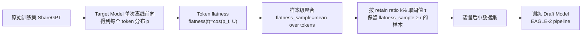

# Flatter Tokens are More Valuable for Speculative Draft Model Training

**会议**: ICLR 2026  
**OpenReview**: [https://openreview.net/forum?id=wgGJE6Z1B3](https://openreview.net/forum?id=wgGJE6Z1B3)  
**代码**: [https://github.com/fjm9933/Flatness](https://github.com/fjm9933/Flatness)  
**领域**: LLM 推理加速 / 投机解码 / 数据高效训练  
**关键词**: Speculative Decoding, Draft Model, Knowledge Distillation, Data Selection, Flatness, EAGLE  

## 一句话总结
本文从数据中心视角发现：训练投机解码 draft model 时，目标模型预测分布更"平坦"（接近均匀）的 token 价值更高，据此提出仅依赖目标模型、可离线计算的 flatness 指标与 SFDD 数据蒸馏方法，用 50% 数据换来 2× 以上训练加速且推理加速损失不到 4%。

## 研究背景与动机
**领域现状**：投机解码（Speculative Decoding, SD）是加速 LLM 自回归推理的关键技术——用小 draft model 先快速生成 γ 个候选 token，再由大 target model 并行验证接受，接受率越高加速越明显。其中 train-based 方法（如 EAGLE 系列）通过训练 draft model 对齐 target，比 train-free 方法接受率更高更稳定，但代价是要在大规模数据集上训练。

**现有痛点**：train-based SD 默认沿用 vanilla 知识蒸馏（KD），即最小化 student 与 teacher 输出分布的 KL 散度。但 SD 真正要优化的是接受率，理论上接受率由两分布的 L1 范数决定（$\alpha(h)=1-\frac{1}{2}\|p-q\|_1$），与 KL 目标存在根本性错位。已有工作尝试直接把 L1 当损失，却时灵时不灵，有时甚至不如标准 KL——说明单纯换损失函数不够。

**核心矛盾**：现有方法只盯着"用什么损失"，却忽略了"数据里哪些部分才提供有意义的训练信号"。EAGLE 等系统对所有 token 一视同仁地训练，但 token 对接受率的贡献其实高度异质，这造成大量可避免的训练开销。

**本文目标**：从数据中心视角识别并保留高价值样本，在几乎不损失推理加速的前提下大幅削减 draft model 的训练成本。

**核心 idea**：**[平坦 token 更值钱]** 通过对单步 KD 的理论建模发现——目标分布越平坦（方差越大、越接近均匀）的 token，单位训练量能带来的 L1 距离下降（即接受率提升空间）越大；而尖锐峰值的 token 很快饱和、贡献甚微。**[只依赖 target 可离线打分]** 这一重要性判据只取决于固定的 target 分布，无需预热 draft model，可一次离线遍历算完，从而把 token 级洞察上升为样本级数据筛选。

## 方法详解

### 整体框架
方法分两步：先从理论上证明"目标分布平坦的 token 训练价值更高"，再据此设计可落地的 SFDD（Sample-level-flatness-based Dataset Distillation）数据筛选流程——离线用 target model 跑一遍数据，给每个 token 算 flatness，聚合到样本级，按 retain ratio 保留高分样本，最后只在蒸馏后的子集上训练 draft model。

### 关键设计

**1. 单步 KD 的预算受限更新模型：用 ΔL1 衡量 token 真实价值。** 直接最小化静态 L1 范数会被误导——若 draft 分布 $q$ 已经很接近 target $p$，L1 本就很小但再训练也无收益。因此作者把 token 价值定义为"单步训练带来的 L1 下降量" $\Delta L_1 = \|p-q\|_1 - \|p-r^*\|_1$，其中 $r^*$ 是一次理想更新后的 draft 分布。这次更新被建模成一个预算受限的优化问题：$r^* = \arg\min_r D_{KL}(p\|r)\ \text{s.t.}\ D_{KL}(r\|q)\le\theta$，即在贴近 KD 实践（向 teacher 靠拢）的同时，用预算 $\theta$ 约束单步不能偏离 $q$ 太远（对应学习率/优化器效应）。$r^*$ 只是分析工具而非真实训练目标。

**2. 高斯闭式解揭示"方差越大越值钱"。** 把 $p,q$ 限制到高斯族后用 KKT 条件求解，得到 $r^*=\mathcal{N}(\mu_r^*,\sigma_r^{2*})$，其更新后方差 $\sigma_r^{2*}=(1-\tau^*)\sigma_p^2+\tau^*\sigma_q^2+\tau^{*2}(1-\tau^*)(\mu_p-\mu_q)^2$，路径参数 $\tau^*\in[0,1]$ 由预算 $\theta$ 唯一确定。这个式子说明：target 方差 $\sigma_p^2$ 越大，更新后分布 $r^*$ 也越平坦。而 L1 范数对尖峰错位极其敏感、对平坦分布的逐点差异不敏感，于是平坦 target 让 $\|p-r^*\|_1$ 更小、$\Delta L_1$ 更大。数值仿真（Figure 1a）证实：固定均值时 $\Delta L_1$ 随 $\sigma_p^2$ 单调上升，平坦 token 确实训练收益最大。

**3. flatness 指标：用余弦相似度把连续方差迁移到离散词表。** 实际 LLM 输出是离散分布，无法直接算连续方差，作者用"与均匀分布的余弦相似度"作为方差代理：$\text{flatness}(t):=\cos(p_t,U)=\frac{p_t\cdot U}{\|p_t\|_2\|U\|_2}$，其中 $U$ 是词表上的均匀分布。附录证明并通过仿真（Figure 1b）验证该量与高斯标准差单调正相关。在真实 LLM 上按 target flatness 排序观察训练动态（Figure 2）发现：低 flatness 区的 draft 统计量和 $\Delta L_1$ 一个 epoch 几乎不动（已饱和或顽固错位），高 flatness 区则有明显可学习的变化——这从经验上坐实 flatness 是"剩余可提升空间"的可靠信号。对比实验还显示，同样保留比例下 flatness 比 entropy 能剔除更多已饱和的低价值 token（gap $g=|\Delta L_1|_{\text{low-entropy}}-|\Delta L_1|_{\text{low-flatness}}>0$ 恒成立且随采样数增大）。

**4. SFDD：从 token 洞察落到样本级数据蒸馏。** 把 token flatness 在样本内取平均得到样本级分数 $\text{flatness}_{\text{sample}}(S)=\frac{1}{|S|}\sum_{t\in S}\text{flatness}(t)$，分数越高样本整体训练价值越大。给定 retain ratio $k\%$，取所有样本分数的 $(1-k)\%$ 分位数向上取整作为阈值 $\tau$，保留 $\text{flatness}_{\text{sample}}\ge\tau$ 的样本组成蒸馏数据集。整个流程只需 target model 单次离线前向，无需预热 draft model、无需跟踪其变化的预测，可直接插入 EAGLE-2 训练管线。

## 实验关键数据

### 主实验表格
EAGLE-2 + LLaMA3-8B-Instruct，ShareGPT 训练，固定 50% retain ratio，5 个下游任务（GSM8K / Alpaca / MT-Bench / CNN-DM / NQ），报告 Speedup 与平均接受长度 $l$（γ=5，温度 1.0）：

| 方法 | 平均 Speedup | 平均 $l$ |
|------|------|------|
| No Filter (100% 数据) | 2.49× | 2.78 |
| Random | 2.20× | 2.46 |
| Entropy | 2.20× | 2.49 |
| Top-1 Probability | 2.23× | 2.49 |
| Margin | 2.15× | 2.40 |
| Energy Score | 2.21× | 2.49 |
| PPL | 2.20× | 2.48 |
| **SFDD (Ours)** | **2.41×** | **2.56** |

SFDD 在每个下游任务上都优于所有其他重要性指标，平均 2.41× 显著高于次优的 Top-1 Probability（2.23×），且仅用一半数据就把推理加速损失控制在 full-dataset 基线的 4% 以内（2.41× vs 2.49×）。

### 消融实验表格
不同 retain ratio 下 SFDD 与 Random / Top-1 Probability 对比（平均 Speedup）：

| Retain Ratio | Random | Top-1 Prob | SFDD (Ours) |
|------|------|------|------|
| 100% (No Filter) | — | — | 2.49× |
| 70% | 2.19× | 2.35× | **2.44×** |
| 60% | 2.20× | — | 优于基线 |
| 50% | 2.20× | 2.23× | **2.41×** |

70% 数据时 SFDD 的加速几乎追平 No Filter，在 Alpaca 上甚至反超全量（2.77× vs 2.71×），说明筛选有时能剔除噪声/冗余数据。即便在 5%/10%/20% 的极端低保留率下，SFDD 相对 Random 仍保持稳定的加速领先。

### 关键发现
- flatness 的优势不是偶然：跨所有 retain ratio 都大幅领先 Random 与第二名 Top-1 Probability，证明 flatness 评分本身有效。
- flatness 比 entropy 更会"删废 token"：相同保留比例下能剔除更多已饱和、$|\Delta L_1|$ 小的 token，且这个优势随选样数增加而扩大。
- 50% retain ratio 下实现 2× 以上训练加速（含数据选择开销），推理性能损失 <4%。

## 亮点与洞察
- **反直觉但站得住**：低 flatness（target 很确定）的 token 看似是"强标签信号"，本应宝贵，但作者论证它们要么已快速对齐、后续更新收益可忽略，要么顽固错位、贡献微弱甚至有害——把算力投到高 flatness token 才命中真正能提升接受率的地方。
- **目标错位的精准诊断**：抓住了 SD 与 vanilla KD 的根本矛盾（接受率 ↔ L1 vs KD ↔ KL），但没有停在"换损失"这个被前人证伪的层面，而是转向"换数据"，视角新颖且与各类 train-based 方法正交。
- **极低开销可落地**：判据只依赖固定的 target 分布、可离线一次算完，不需要预热 draft、不需要追踪移动目标 $q$，工程上几乎零成本插入 EAGLE 管线。
- **理论—代理—实证三段闭环**：从高斯闭式解（方差越大越值钱）→ 余弦相似度代理（离散可算）→ 真实训练动态验证（target-sorted view），链条完整。

## 局限与展望
- 理论分析建立在高斯分布与单步理想更新的简化假设上，$r^*$ 只是分析工具，与真实多步 SGD 训练动态存在 gap，实证虽支撑但非严格等价。
- 实验只在 EAGLE-2 + LLaMA3-8B-Instruct + ShareGPT 单一配置上验证，跨 target 规模、跨 draft 架构、跨训练数据分布的普适性有待更广覆盖。
- flatness 是纯目标侧静态指标，未考虑样本间多样性/覆盖度——极低保留率下可能因高 flatness 样本同质而损失泛化，作者已观察到极端比例下性能下滑。
- 方法与损失函数优化正交，但未探索"flatness 数据选择 + L1/TVD 损失"联合优化能否进一步逼近甚至超过全量基线。

## 相关工作与启发
- **投机解码**：train-free（拒绝采样、复用 target、并行候选验证）接受率受限；train-based（蒸馏、轻量预测头如 EAGLE/Medusa、可训练 early-exit、多 token 预测）加速更稳。本文聚焦后者的数据效率，与改损失（TVD 对齐）类工作互补。
- **数据重要性度量**：已有方法多围绕"分布不确定性"（Shannon 熵、Energy Score、PPL）或"类别概率"（Top-1 prob、top-2 margin、ground-truth prob）设计，但都服务于标准训练目标（提精度/分布保真）。本文是首个从 SD 接受率这一独特视角系统研究 token 数据重要性的工作。
- **启发**：当训练目标与代理损失存在已知错位时，与其反复纠结损失函数，不如回到"哪些数据真正提供有效梯度"这一更底层的问题——一个只依赖固定教师侧、可离线计算的轻量判据，往往比复杂的在线难度估计更实用。

## 评分
- **新颖性**: ⭐⭐⭐⭐ 首次从数据中心视角切入 SD draft 训练，"平坦 token 更值钱"这一洞察反直觉且有理论支撑，与主流"换损失"路线正交。
- **实验充分度**: ⭐⭐⭐ 5 任务 + 多指标对比 + 多 retain ratio 消融 + 极端低比例验证较扎实，但只在单一 target/draft/数据集配置上验证，普适性证据偏薄。
- **写作质量**: ⭐⭐⭐⭐ 从理论建模到代理指标再到训练动态实证，逻辑链清晰，图表（target-sorted view、SFDD workflow）有效支撑论点。
- **价值**: ⭐⭐⭐⭐ 50% 数据换 2× 训练加速且推理损失 <4%，对实际部署 EAGLE 类 SD 系统有直接的降本意义，方法简单可即插即用。

<!-- RELATED:START -->

## 相关论文

- [\[ICLR 2026\] RepSpec: Structural Re-parameterized Draft Model Training for Speculative Decoding](repspec_structural_re-parameterized_draft_model_training_for_speculative_decodin.md)
- [\[ICLR 2026\] PARD: Accelerating LLM Inference with Low-Cost Parallel Draft Model Adaptation](pard_accelerating_llm_inference_with_lowcost_parallel_draft_model_adaptation.md)
- [\[ICLR 2026\] Global Resolution: Optimal Multi-Draft Speculative Sampling via Convex Optimization](global_resolution_optimal_multi-draft_speculative_sampling_via_convex_optimizati.md)
- [\[ACL 2025\] FastDraft: How to Train Your Draft](../../ACL2025/llm_efficiency/fastdraft_how_to_train_your_draft.md)
- [\[ICLR 2026\] Unlocking Full Efficiency of Token Filtering in Large Language Model Training](unlocking_full_efficiency_of_token_filtering_in_large_language_model_training.md)

<!-- RELATED:END -->
