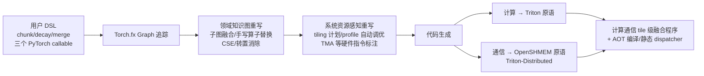

# FlexLinearAttention: Compiling a Unified Abstraction into Scalable Kernels for Linear Attention

**会议**: ICLR 2026  
**OpenReview**: [https://openreview.net/forum?id=N4jJQvQSiN](https://openreview.net/forum?id=N4jJQvQSiN)  
**代码**: 待确认  
**领域**: LLM 效率 / 算子编译 / 线性注意力  
**关键词**: 线性注意力, 领域专用编译器, Chunk-wise 并行, 计算通信融合, 序列并行, Triton  

## 一句话总结
FlexLA 把五花八门的线性注意力变体统一抽象成「intra-chunk 计算 / inter-chunk 状态传播 / 输出合并」三个阶段，让用户用几十行 PyTorch 就能描述算法，再由领域专用编译器自动生成融合了计算与通信的高性能 Triton 内核，单卡上达到甚至超越专家手写库 FLA（1.01×–4.9×），分布式上对 LASP2 最高 7.2× 加速并近线性扩展到 128 卡、1600 万 token。

## 研究背景与动机
**领域现状**：softmax 注意力的 $O(L^2d)$ 复杂度是长上下文的核心瓶颈，催生了 Mamba、RetNet、RWKV、GLA、HGRN、Gated DeltaNet 等一大批线性复杂度的变体。它们去掉 softmax 后利用结合律把计算重排成 $o_i = q_i(k_i v_i^\top)$ 的线性递推 $S_t = S_{t-1} + k_t v_t^\top,\ o_t = q_t S_t$，并通过 chunk-wise 并行在并行度与 FLOPs 之间取得平衡。

**现有痛点**：softmax 注意力有 Flash-Attention、Ring-Attention 这种被广泛标准化的内核，而线性注意力的生态却高度碎片化。最权威的 Flash-Linear-Attention（FLA）库本质上是"靠专家给每个变体手写 Triton 内核"——线性注意力变体迭代极快，根本不存在一刀切的方案，研究者被迫陷入"每出一个新变体就手写一遍内核"的高成本循环。这里有两个老大难：其一，写高性能内核需要深厚的硬件功底——状态更新规则要融进单个 kernel，还要手调流水线调度、tile 尺寸、shared memory 限制、barrier 等底层细节；其二，现有方案几乎不支持分布式执行，而扩展到几十万乃至上百万 token 时序列并行不可或缺，LASP / LASP-2 等方案只为特定架构设计、又用 NCCL 的 All-Gather 这类通用原语，跟分布式线性注意力的 dataflow 不匹配，导致网络带宽利用率严重不足。

**核心矛盾**：线性注意力算法演进的速度，与开发可扩展高性能内核的难度，二者之间存在巨大鸿沟。

**本文目标**：提供一个框架，让绝大多数线性注意力变体都能用几行地道的 PyTorch 写出来，并自动扩展到分布式系统。

**核心 idea**：作者观察到这些困难大多源于"没有利用线性注意力变体共有的结构"——**绝大多数变体本质上共享一小撮规范化的算子和数据交换模式**。据此提出 FlexLA：一个编译器驱动的领域专用框架，用三个模块化函数表达线性注意力，把算法表达与系统优化彻底解耦。

## 方法详解

### 整体框架
FlexLA 的前端吃进用户用 DSL 写的线性注意力计算逻辑（三个 PyTorch callable：`chunk_mode`、`decay_mode`、`merge_mode`），后端把这套逻辑连同潜在的通信操作一起映射到 GPU 与网卡上，施加领域专用优化、生成支持分布式的高性能内核。整条流水线建立在 chunk-wise 并行形式之上：序列被切成 $L/C$ 个 chunk，计算被拆成 inter-chunk（从序列开头到当前 chunk 起点的状态读出，$O_{[i]}^{\text{inter}} = Q_{[i]} S_{[i-1]}$）与 intra-chunk（当前 chunk 内信息处理，$O_{[i]}^{\text{intra}} = (Q_{[i]} K_{[i]}^\top \odot M) V_{[i]}$）两部分再合并。

### 关键设计

**1. 三阶段统一编程抽象：用一套语义吃下所有变体。** 这是 FlexLA 的地基。尽管 HGRN（向量状态+数据相关向量衰减）、RetNet（矩阵状态+标量衰减）、Mamba2（矩阵+数据相关标量）、GLA（矩阵+数据相关向量）、GDN（矩阵+数据相关矩阵，含 delta rule $S_t = \alpha_t S_{t-1}(I-\beta_t k_t k_t^\top) + \beta_t v_t k_t^\top$）在状态类型和衰减机制上千差万别，作者都把它们统一进三个阶段：① **Intra-Chunk Computation**，在每个 chunk 内算局部状态，chunk 之间无数据依赖、是 embarrassingly parallel 的；② **Inter-Chunk State Propagation**，处理 chunk 间依赖，把所有前序 chunk 的状态摘要累加成当前 chunk 起点的全局状态（vanilla 线性注意力下就是一次 prefix-sum 扫描），这一阶段因时间依赖而**天然串行，且跨设备通信只发生在这里**；③ **Merging and Output Generation**，把 inter 与 intra 结果合并、再次可并行。对应的三个 callable `chunk_mode / decay_mode / merge_mode` 让用户只需把 token 级更新规则改写成 chunk 级矩阵运算就能落地——例如 Mamba2 写成 $S_{[t]} = (\prod \alpha)\odot S_{[t-1]} + VK^\top$、$O = Q^\top K \odot M \odot G V^\top + SQ$。这种"把可并行部分和必须串行+可能通信的部分显式分开"的切分，正是后续激进优化的信息来源。

**2. 领域知识驱动的图编译：从 fx graph 到 Triton 的多遍重写。** 用户函数先被 tracing 成 Torch.fx graph 作为 IR——选 fx 是因为它能直接捕获绝大多数 torch 算子，表达力足够覆盖大部分变体。编译器先把特殊 op（如 placeholder→load 指令）替换为自定义指令，再跑一系列领域专用优化 pass：尝试子图融合、手写算子替换（对 GDN 里 `lower_triangular_inverse` 这类非平凡算子，预置一批线性注意力常用的自定义 Triton kernel，看到 `torch.inverse` 等就标记并在代码生成阶段换成对应源码）、公共子表达式消除、转置消除等。之后 IR 再带着系统资源感知被重写——比如把 TMA（Tensor Memory Accelerator）是否可用标记成 load 指令的属性，生成硬件专用指令。

**3. tile 级计算-通信融合：绕开 NCCL 的带宽瓶颈。** 因为抽象保证了所有跨设备通信都被关进第二阶段（inter-chunk 状态传播），FlexLA 可以专门分析这一阶段的数据依赖，再根据网络拓扑确定计算 tiling 与通信 tiling 策略、选择通信模式，生成片上的计算+通信指令。最终 IR 被 lower 成 Triton-Distributed（而非官方 Triton）源码：计算映射到 Triton 计算原语，通信映射到其独有的 OpenSHMEM 风格原语、最终翻译成 GPU 发起的通信操作。这样就把计算和通信在 tile 级别融成单个 kernel，缩小数据依赖范围、消除传统 overlap 策略里频繁的 GPU-host 同步，定制化的通信 pattern 还绕开了 NCCL All-Gather 带来的数据冗余。

**4. 系统级瓶颈优化：AOT 编译 + 自适应并行调度。** 除内核融合外，作者还盯住两个真实系统瓶颈。其一是 **runtime overhead**：Triton runtime 有数百微秒级开销，在 2K–4K 这种短中序列下往往比内核本身执行还久；FlexLA 扩展出自定义 AOT 编译模块，把 Triton 源码提前编译成预链接动态库，运行时用 profile-guided 静态 dispatcher 直接通过 CUDA Driver API 调用最优预编译二进制、完全绕过 Triton runtime，dispatcher 由离线性能数据库自动生成。利用"head dim、head 数等维度跨运行基本静态、只有序列长度动态"的特性，它枚举常量维度的笛卡尔积提前生成所有候选 kernel，并借 PyTorch 符号 tracing 支持 symbolic shape、避免重复编译。其二是**并行策略权衡**：是否融合不同阶段是关键 trade-off——把 `chunk_mode` 与 `decay_mode` 融合能避免中间状态落 global memory、省内存流量，但又会限制 chunk 级并行度；FlexLA 用一个并行调度算法根据输入 shape 与硬件信息动态选最优并行策略。

## 实验关键数据

### 主实验（单卡 H100 latency，ms）
固定 BatchSize=1、NumHeads=32、HeadDim=128（HGRN 用其原始单头配置），对比无领域知识的通用编译器 Torch-Compile 与 SOTA 专家手写库 FLA（commit 02766e71）。

| 变体 | 序列长 | Torch-Compile | FLA | FlexLA(Ours) |
|------|--------|---------------|-----|--------------|
| HGRN | 16384 | 5.75 | 0.24 | **0.17** |
| Vanilla-LA | 16384 | 41.59 | 0.68 | **0.56** |
| Scalar-GLA | 16384 | 102.37 | 0.93 | **0.74** |
| Scalar-GLA | 262144 | 1507.0 | 10.52 | **9.47** |
| Vector-GLA | 16384 | 100.0 | 1.56 | **1.38** |
| GDN | 262144 | 1781.98 | 23.13 | **22.99** |

> Figure 1 的标志性数字：scalar GLA 从 PyTorch eager 的 34.6 秒降到 9.2 ms（优于 FLA 手写内核），扩到 4 卡后进一步降到 2.7 ms。

### 序列并行（weak scaling，H20 集群，固定每卡负载）
固定 BatchSize=4、NumHeads=32、HeadDim=128，从 4 卡 128K token 扩到 128 卡 4M token，对比最强开源基线 LASP2。

| 模型 | GPU 数 | LASP2 开销 (ms) | FlexLA 开销 (ms) |
|------|--------|-----------------|------------------|
| GDN | 4 | ~13.2 (49.2 total) | ~12.2 |
| GDN | 128 | **345.3** | **14.5** |
| Scalar-GLA | 128 | 11.1 | **6.8** |

GDN 在 128 卡上 FlexLA 几乎持平理想 latency，而 LASP2 因 All-Gather 冗余从 4 卡 49.2ms 退化到 128 卡 345ms。

### 消融实验

| 消融项 | 设置 | 结果 |
|--------|------|------|
| AOT 静态 dispatcher | Scalar GLA, L=1024 | Triton 开销 207µs（是 kernel 47µs 的 4.4×），dispatcher 减 46% 开销→端到端 1.6× 加速；L=8192 时开销从 101µs 降到 1µs |
| tile 级计算-通信重叠 | 8×H800，state 67MB | Serial 873µs / Torch-Pipeline 902µs / **Ours 560µs**（对 serial 1.56×） |

### 关键发现
- HGRN 上 FlexLA 比专家手写 FLA 还快 1.64–2.02×，编译器发现了"更高效的线程分配"等专家没用上的优化机会。
- 短中序列下加速最明显——此时系统级开销与并行策略选择是主导因素，恰是 FlexLA 消除的瓶颈；GDN 在长序列下收敛到与 FLA 持平。
- Torch-Pipeline 反而比朴素 Serial 还慢，说明 host 管理的流水线因频繁小算子启动与 host-device 同步而适得其反。

## 亮点与洞察
- **把"工程苦力"变成"编译问题"**：核心洞见——线性注意力变体看似各异，实则共享一小套规范操作与数据交换，于是用三阶段抽象一次性吃下十余种模型，用户几十行 PyTorch 即可，编译器负责所有 how。
- **通信被关进单一阶段是优化的杠杆**：把所有跨设备通信约束到 inter-chunk 传播阶段，编译器才能精确分析依赖、做 tile 级计算-通信融合并绕开 NCCL，这是分布式 7.2× 加速的根。
- **盯住 runtime overhead 这个易被忽视的瓶颈**：短序列下 Triton runtime 数百微秒开销比 kernel 还久，AOT + 静态 dispatcher 直击此处，体现了"端到端"而非"只看 kernel"的系统视角。

## 局限与展望
- 本文聚焦线性注意力的 **prefill 阶段**（推理或训练前向），backward pass 只说"可类似实现"，未给完整评测。
- 抽象依赖 chunk-wise 并行形式与三阶段切分，对不符合该范式的全新机制（如某些 test-time-training 变体）的覆盖度待验证。
- 未与 ZeCO（流水线通信，报告了更优 scaling）正面对比——因其实现未开源；分布式收益主要在 GDN 这种矩阵型更新上最突出。
- 静态 dispatcher 依赖离线性能数据库与常量维度枚举，维度范围设定不当或频繁变动时仍可能重编译。

## 相关工作与启发
- **线性注意力变体**：Mamba/Mamba2、RetNet、RWKV、GLA、HGRN、Gated DeltaNet 等是 FlexLA 的服务对象；FLA 提供专家手写 Triton 内核但需逐变体手工开发。
- **序列并行**：LASP 用串行 send-recv 首次扩展线性注意力到分布式，LASP2 改用集合通信原语但仍带宽利用不足，ZeCO 用流水线 send-recv 但未开源。
- **AI 编译器**：torch.compile / TVM / TASO 优化通用算子但不覆盖线性注意力；Triton / ThunderKitten / TileLang / Triton-Distributed 提供算子级抽象但支持大量变体仍需大量手工。最接近的 FlexAttention 面向 block-sparse softmax 注意力且仅限单卡——FlexLA 正是把这种"用 DSL 描述、编译器生成内核"的范式带到线性注意力 + 分布式场景。
- **启发**：对快速演进、共享底层结构的算法家族，与其逐个手写内核，不如抽象出规范形式 + 领域专用编译器，把算法表达与系统优化解耦——这套方法论可迁移到其他"变体爆炸"的算子领域。

## 评分
- **新颖性**: ⭐⭐⭐⭐ 首个面向线性注意力家族 + 分布式的领域专用编译器，三阶段抽象与 tile 级计算-通信融合的组合有清晰创新；单点技术（Triton-Distributed、AOT）有所借鉴，但整合与抽象设计原创性强。
- **实验充分度**: ⭐⭐⭐⭐ 覆盖 5 类变体、1K–256K 单卡 latency、4–128 卡 weak scaling 到 4M token、两组消融，对比 SOTA（FLA/LASP2）；但缺 backward、缺与 ZeCO 对比、端到端模型精度未涉及。
- **写作质量**: ⭐⭐⭐⭐ 动机—抽象—编译—优化—实验逻辑清晰，图表（DSL 对照、流水线、scaling 分解）信息量大；个别拼写小瑕。
- **价值**: ⭐⭐⭐⭐ 直击线性注意力"内核难写、分布式难扩"的真实工程痛点，对长上下文模型训练/推理基础设施有实际落地价值。

<!-- RELATED:START -->

## 相关论文

- [\[ICLR 2026\] Log-Linear Attention](log-linear_attention.md)
- [\[ICLR 2026\] RACE Attention: A Strictly Linear-Time Attention Layer for Training on Outrageously Large Contexts](race_attention_a_strictly_linear-time_attention_layer_for_training_on_outrageous.md)
- [\[ICLR 2026\] Local Linear Attention: An Optimal Interpolation of Linear and Softmax Attention for Test-Time Regression](local_linear_attention_an_optimal_interpolation_of_linear_and_softmax_attention_.md)
- [\[NeurIPS 2025\] Tiled Flash Linear Attention: More Efficient Linear RNN and xLSTM Kernels](../../NeurIPS2025/llm_efficiency/tiled_flash_linear_attention_more_efficient_linear_rnn_and_xlstm_kernels.md)
- [\[ICML 2026\] Dynamic Linear Attention](../../ICML2026/llm_efficiency/dynamic_linear_attention.md)

<!-- RELATED:END -->
