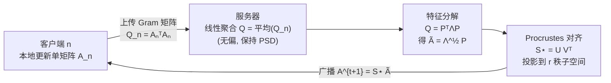

# FLoRG: Federated Fine-tuning with Low-rank Gram Matrices and Procrustes Alignment

**会议**: ICLR 2026  
**OpenReview**: [https://openreview.net/forum?id=kntrZOm2AQ](https://openreview.net/forum?id=kntrZOm2AQ)  
**代码**: 待确认  
**领域**: 大模型高效微调 / 联邦学习  
**关键词**: 联邦微调, LoRA, Gram 矩阵, Procrustes 对齐, 通信效率, 收敛分析  

## 一句话总结
FLoRG 把 LoRA 的两个低秩矩阵重参数化为单个低秩矩阵并只聚合其 Gram 矩阵，让服务器端聚合从「有偏的双线性运算」变成「无偏的线性运算」，再用 Procrustes 对齐解决分解非唯一带来的漂移，从而在联邦微调中同时消除聚合误差、压低通信开销（最高 2041×）并收紧收敛界。

## 研究背景与动机
**领域现状**：LoRA 把全参数微调换成 $W = W_0 + BA$ 两个低秩矩阵，已成为大模型适配下游任务的主流手段；而联邦学习（FL）让数据分散在多客户端时仍能协同微调而不暴露原始数据。两者结合——客户端本地用 LoRA 训练、上传低秩更新、服务器聚合——是非常自然的方案。

**现有痛点**：把 LoRA 直接塞进 FL 会撞上两类根本性矛盾。第一类是**聚合误差**：传统做法（FedIT 等）对 $B_n$、$A_n$ 分别取平均，得到的是 $(\frac{1}{N}\sum_n B_n)(\frac{1}{N}\sum_n A_n)$，而真正想要的更新是 $\frac{1}{N}\sum_n (B_n A_n)$，两者不相等，这个系统性偏差会随轮数累积、拖垮性能。第二类是**分解漂移**：另一派做法（FeDeRA 等）先聚合乘积 $B_n A_n$ 再做矩阵分解还原两个低秩矩阵，虽然消除了聚合误差，但聚合矩阵通常秩亏、还可能有重特征值，分解不唯一——不同分解会改变后续轮次的参数子空间与梯度方向，漂移同样会累积；而且分解后的秩可能与目标秩 $r$ 不匹配。

**核心矛盾**：只要 LoRA 还是「两个矩阵相乘」，分别聚合（产生误差）或聚合后分解（产生漂移）二者必居其一，无法两全。

**本文目标**：找到一种联邦微调方案，既消除分别聚合带来的误差，又最小化矩阵分解带来的漂移。

**核心 idea**：**[重参数化]** 用单个低秩矩阵承载 LoRA，并只聚合它的 **Gram 矩阵**（列向量内积矩阵）——因为 Gram 矩阵聚合是线性且保持半正定，服务器能拿到真正的无偏聚合；**[对齐稳定]** 再用 **Procrustes 对齐** 在保持 Gram 矩阵不变的前提下，把分解出的矩阵投影到离上一轮最近的方向，按掉非唯一分解造成的漂移。

## 方法详解

### 整体框架
FLoRG 把每个 LoRA 层的微调量写成 $\Delta W^t = L Q^t R = L (A^t)^\top A^t R$，其中 $L\in\mathbb{R}^{d_{out}\times k}$、$R\in\mathbb{R}^{k\times d_{in}}$ 是全局共享、固定的半正交基（$L^\top L = I_k$，$R R^\top = I_k$，$k=\min\{d_{in},d_{out}\}$），客户端只训练单个低秩矩阵 $A^t\in\mathbb{R}^{r\times k}$。每轮流程为：客户端本地用梯度更新 $A^t$ → 上传其 Gram 矩阵 $Q_n^{t+1/2}=(A_n^{t+1/2})^\top A_n^{t+1/2}$ → 服务器线性平均得到无偏的 $Q^{t+1}$ → 对 $Q^{t+1}$ 做特征分解、再用 Procrustes 对齐还原出下一轮的 $A^{t+1}$ → 广播回客户端。

### 关键设计

**1. 单矩阵 + 共享半正交基的重参数化：让任意维度都能错误自由聚合。** LoRA 用两个矩阵是为了适配不同形状的权重矩阵 $W_0\in\mathbb{R}^{d_{out}\times d_{in}}$，但这正是聚合偏差的根源。FLoRG 把形状自由度外包给两个**固定且共享**的半正交基 $L$、$R$，真正可训练的只剩中间那个方阵参数 $Q^t=(A^t)^\top A^t$（通过单个 $A^t$ 表示）。客户端梯度也只对 $A^t$ 求：$\nabla_A F_n(W^t;\xi_n)=A^t\big(H_n^t+(H_n^t)^\top\big)$，其中 $H_n^t=L^\top \nabla F_n(W^t;\xi_n) R^\top$。由于客户端上传的是 Gram 矩阵，聚合 $Q^{t+1}=\frac{1}{N}\sum_n (A_n^{t+1/2})^\top A_n^{t+1/2}$ 是纯线性运算且保持半正定，服务器拿到的就是真实聚合结果——双线性不一致（聚合误差）被结构性地消除了。同时每客户端每轮只传一个矩阵而非两个，上行通信直接砍半以上。

**2. Procrustes 对齐：在保 Gram 不变的前提下消分解漂移。** 服务器对 PSD 的 $Q^{t+1}$ 做特征分解 $Q^{t+1}=(P^{t+1})^\top \Lambda^{t+1} P^{t+1}$，得到一个规范分解 $\tilde{A}^{t+1}=(\Lambda^{t+1})^{1/2}P^{t+1}$。但对任意正交列矩阵 $O$ 都有 $(O\tilde{A}^{t+1})^\top O\tilde{A}^{t+1}=Q^{t+1}$，分解非唯一；不同选择会让下一轮梯度路径发散。FLoRG 因此求一个半正交对齐矩阵 $S^t$，在所有合法分解里挑出与上一轮 $A^t$ 在 Frobenius 范数下最近的那个：
$$\min_{S^t}\ \big\|S^t\tilde{A}^{t+1}-A^t\big\|_F^2\quad \text{s.t.}\ (S^t)^\top S^t=I.$$
展开后等价于最大化 $\mathrm{Tr}\big(A^t(\tilde{A}^{t+1})^\top (S^t)^\top\big)$，这是经典正交 Procrustes 问题，对 $A^t(\tilde{A}^{t+1})^\top=U^t\Sigma^t(V^t)^\top$ 做 SVD 即得闭式最优解 $S^{t,\star}=U^t(V^t)^\top$。这一步一箭双雕：既从非唯一分解中选定了「最稳」的那个、稳住后续梯度，又用半正交投影把秩为 $r'^{,t}$ 的 $\tilde{A}^{t+1}$ 投回目标秩 $r$、解决秩失配。最终 $A^{t+1}=S^{t,\star}\tilde{A}^{t+1}$。服务器侧每轮计算量 $O(Lk^3)+O(L(krr'^{,t}+\dots))$ 与客户端数无关，可扩展。

**3. 把 Procrustes 对齐写进收敛界：理论上证明对齐收紧 bound。** 在 $L$-光滑、梯度有界、参数空间有界三条标准假设下，作者证明 FLoRG 在非凸损失下的收敛率（Theorem 2）由三项构成：随轮数 $T$ 消失的初始最优性间隙、不消失的残差偏差项、以及**Procrustes 对齐漂移项**——后者正比于 $\sum_t \Delta_{\text{proc}}^{t+1}/\sigma_{\min}(\cdot)$，其中 $\Delta_{\text{proc}}^{t+1}=\|S^t\tilde{A}^{t+1}-A^t\|_F^2-\|S^{t,\star}\tilde{A}^{t+1}-A^t\|_F^2\ge 0$ 度量了「没用最优对齐」造成的额外漂移。当采用最优 Procrustes 对齐时 $\Delta_{\text{proc}}^{t+1}=0$，第三项整体归零，从而得到更紧的收敛界。这把「对齐有用」从经验观察提升成了可证明的收敛优势。

## 实验关键数据

### 主实验表格（GLUE 测试准确率，N=20，r=4，非 IID ρ=0.5）

| 基座模型 | 数据集 | FLoRG | FedIT | FeDeRA | FFA-LoRA | FedSA-LoRA | FedEx-LoRA |
|---|---|---|---|---|---|---|---|
| OPT-125M | MNLI | **87.35** | 79.42 | 81.15 | 83.54 | 84.61 | 85.83 |
| OPT-125M | WNLI | **65.28** | 58.45 | 59.34 | 62.61 | 62.83 | 64.15 |
| RoBERTa-large | MNLI | **91.27** | 84.91 | 88.06 | 89.28 | 90.75 | 90.96 |
| RoBERTa-large | RTE | **71.26** | 64.25 | 67.12 | 68.49 | 69.93 | 70.98 |
| Llama-3.2-3B | MNLI | **93.15** | 87.24 | 89.83 | 91.05 | 92.38 | 92.74 |
| Llama-3.2-3B | RTE | **73.84** | 67.08 | 69.75 | 71.33 | 72.56 | 73.15 |

FLoRG 在三个不同规模基座上、四个数据集大多数设置下都优于五个 SOTA 基线，相对最强基线提升约 0.3~1.5 个点。

### 通信开销（QNLI，达到目标准确率所需传输参数总量）

| 基座 | 目标 Acc | FLoRG | FedIT | FedEx-LoRA |
|---|---|---|---|---|
| OPT-125M | 80.00 | **8.2×10⁶** | 3.78×10⁷ | 1.25×10¹⁰ |
| RoBERTa-large | 85.00 | **1.45×10⁷** | 8.12×10⁷ | 2.96×10¹⁰ |

达到同样精度，FLoRG 传输的参数量比基线最多低 **2041×**（相对 FedEx-LoRA）。

### 消融实验表格（Procrustes 对齐的影响，准确率）

| 基座 | 设置 | MRPC | MNLI | QNLI | WNLI | RTE |
|---|---|---|---|---|---|---|
| OPT-125M | w/ 对齐 | 86.54 | 87.20 | 89.69 | 65.41 | 68.77 |
| OPT-125M | w/o 对齐 | 83.14 | 80.93 | 86.72 | 59.81 | 64.32 |
| RoBERTa-large | w/ 对齐 | 89.87 | 91.39 | 92.48 | 66.41 | 71.40 |
| RoBERTa-large | w/o 对齐 | 86.50 | 88.93 | 88.62 | 62.07 | 67.09 |

### 关键发现
- **Procrustes 对齐是性能命脉**：去掉它后 RoBERTa-large 上各数据集掉 2.5~4.3 个点，整体只能勉强追平 FeDeRA，说明无偏 Gram 聚合若不配对齐，分解漂移会吃掉大部分收益。
- **跨秩稳健**：在 $r=2,4,8$ 下 FLoRG 均优于全部基线，对秩选择不敏感。
- **规模无关的可扩展性**：服务器计算量随 LoRA 层数线性、与客户端数解耦，从 125M 到 3B 基座都成立。

## 亮点与洞察
- **用结构换无偏**：把「两矩阵」收缩成「单矩阵 + 固定共享基」，让聚合天然线性无偏，是从问题根源（双线性）下手，而非事后打补丁（如 FedEx-LoRA 加残差矩阵）。
- **Gram 聚合与 Procrustes 对齐恰好互补**：Gram 聚合保证无偏但天然带来「分解非唯一」副作用，Procrustes 对齐正好把这个副作用按掉，两个设计是同一思路的正反面。
- **理论闭环漂亮**：对齐项 $\Delta_{\text{proc}}$ 直接出现在收敛界里且最优对齐时归零，把工程 trick 升级为可证明的收敛改进。
- **通信收益量级大**：2041× 的压缩主要来自「只传一个矩阵 + 收敛更快所需轮数更少」，对带宽受限的联邦场景实用价值高。

## 局限与展望
- **实验局限在 NLU/QA**：评测集中在 GLUE + SQuAD v1.1，缺生成式任务、长上下文、指令微调等更贴近真实 LLM 微调的场景验证。
- **半正交基 $L$、$R$ 固定**：共享基是预先初始化且全程冻结的，对极端异构权重形状或任务是否需要可学/可适配的基，论文未深入。
- **服务器侧每轮要做特征分解 + SVD**：虽与客户端数解耦，但 $O(Lk^3)$ 在 $k=\min(d_{in},d_{out})$ 很大时仍不可忽略，超大模型下的服务器开销值得进一步优化。
- **客户端采样 / 掉线鲁棒性**：默认全员参与，部分参与、异步、隐私（DP）等更现实的 FL 设定下的表现待补。

## 相关工作与启发
- **传统联邦 LoRA（FedIT, FedAvg 式分别聚合）**：FLoRG 直指其聚合偏差并结构性消除。
- **聚合乘积再分解（FeDeRA, FFA-LoRA 等）**：FLoRG 指出其分解漂移问题并用 Procrustes 对齐解决，是直接的改进对象。
- **单矩阵 LoRA 重参数化（Bensaïd et al. 2025）**：本文把「单矩阵」思想从中心化推广到联邦，并赋予 Gram 聚合的无偏意义。
- **启发**：「在聚合前先把待聚合量变成对聚合运算封闭（线性/保 PSD）的形式」是一条通用的联邦设计原则；而正交 Procrustes 作为「在等价类里选最稳代表」的工具，可迁移到任何「聚合—分解」往返、表示非唯一的分布式优化问题。

## 评分
- **新颖性**: ⭐⭐⭐⭐ — 单低秩矩阵 + Gram 聚合 + Procrustes 对齐的组合是对联邦 LoRA 两大顽疾（聚合误差 / 分解漂移）的一次干净的根因式解法，且把对齐写进收敛界，理论与方法咬合得很紧。
- **实验充分度**: ⭐⭐⭐⭐ — 三种规模基座、五个 SOTA 基线、通信/秩/对齐多维消融较完整；但任务面偏窄（NLU/QA），缺生成式与更现实 FL 设定。
- **写作质量**: ⭐⭐⭐⭐ — 问题动机层层递进（误差→漂移→双难全消），公式与定理推导清晰，图示与复杂度分析到位。
- **价值**: ⭐⭐⭐⭐ — 在带宽受限的联邦大模型微调中，2041× 通信压缩 + 一致精度提升有较强实用与参考价值。

<!-- RELATED:START -->

## 相关论文

- [\[ICLR 2026\] Developmental Federated Tuning: A Cognitive-Inspired Paradigm for Efficient LLM Adaptation](developmental_federated_tuning_a_cognitive-inspired_paradigm_for_efficient_llm_a.md)
- [\[ICLR 2026\] Mitigating Non-IID Drift in Zeroth-Order Federated LLM Fine-Tuning with Transferable Sparsity](mitigating_non-iid_drift_in_zeroth-order_federated_llm_fine-tuning_with_transfer.md)
- [\[ICLR 2026\] LoRA-S: An Efficient Low Rank Adaptation scheme via Sylvester equation](lora-s_an_efficient_low_rank_adaptation_scheme_via_sylvester_equation.md)
- [\[ICLR 2026\] BoRA: Towards More Expressive Low-Rank Adaptation with Block Diversity](bora_towards_more_expressive_low-rank_adaptation_with_block_diversity.md)
- [\[ICLR 2026\] Three Forward, One Backward: Memory-Efficient Full-Rank Fine-Tuning of Large Models via Extra Forward Passes](three_forward_one_backward_memory-efficient_full-rank_fine-tuning_of_large_model.md)

<!-- RELATED:END -->
