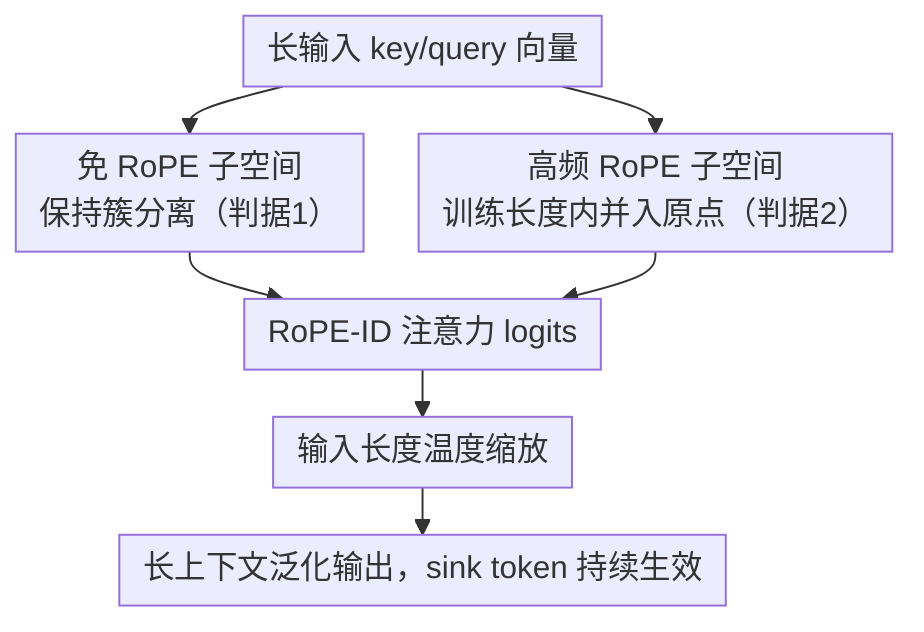

# Frayed RoPE and Long Inputs: A Geometric Perspective

**会议**: ICLR 2026  
**OpenReview**: [https://openreview.net/forum?id=W8ZXfNaqku](https://openreview.net/forum?id=W8ZXfNaqku)  
**领域**: LLM效率  
**关键词**: RoPE, 长上下文外推, 注意力汇聚, 几何分析, 位置编码

## 一句话总结
本文用一套统一的几何视角解释了「RoPE 模型为什么一超过训练长度就崩」——长输入把分得很开的 key/query 簇打散重叠，使得 sink token（注意力汇聚点）失效；据此提出 RoPE-ID：只对一半通道施加高频旋转，让免训练即可外推到更长上下文，在 RULER / LongBench 上追平甚至超过 YaRN。

## 研究背景与动机
**领域现状**：RoPE（旋转位置编码）已是绝大多数主流 LLM（LLaMA、GPT、DeepSeek）的标配，它把相对位置编码成 key/query 之间的角位移，靠旋转把相对距离拆解成 query 和 key 各自独立的变换。

**现有痛点**：RoPE 有一个致命弱点——一旦输入长度超过训练上下文，性能就断崖式下跌。主流的解释是「通道旋转到了分布之外（out-of-distribution）」，因此各种方案（PI、NTK、YaRN、LongRoPE）都在做频率重缩放（frequency rescaling）来缓解。

**核心矛盾**：但「旋转到 OOD」只是现象描述，并没有说清楚**多出来的旋转究竟通过什么机制、如何**导致了病态行为。与此同时，另一个被广泛观察到的现象——attention sink（通常是首 token，语义贫乏却长期吸走大量注意力）——被证明对长上下文泛化至关重要，却一直和 RoPE、注意力机制被当成三件彼此孤立的事来研究。

**本文目标**：把「注意力 / RoPE / sink token」这三件看似无关的事统一进一个几何框架，回答两个子问题：(1) 注意力在隐空间里到底长什么样、sink token 凭什么能默认吸走注意力？(2) RoPE 在长输入下究竟破坏了什么，导致 sink 失效？

**切入角度**：作者放弃了「注意力 = 软最近邻查找、key/query 是围绕原点的重叠点云」这一直觉模型，转而**实测 LLaMA3 / Gemma / OLMo 的隐空间几何**，发现真实情况完全不同：key 和 query 各自挤成偏离原点、方向相对的紧簇。

**核心 idea**：长上下文崩溃的本质是 **sink token 的崩溃**。RoPE 在超训练长度后把 key/query 簇拉向原点、打散重叠，让原本互相为负的点积变正，盖过了 sink token 那个小而关键的 logit。只要保证「簇分离有下界」且「下界在训练长度内就达到」，就能让 sink 继续工作——RoPE-ID 正是这两条判据的一个最简实现。

## 方法详解

### 整体框架
方法部分要解决的核心问题是：在不重训、不需要预知最终序列长度（oracle length）的前提下，让 RoPE 模型「开箱即用」地外推到更长上下文。本文的做法不是改频率缩放曲线，而是从分析得到的两条判据出发，重新设计施加 RoPE 的方式。

整体逻辑是：把每个注意力头的通道一分为二。**免 RoPE 的那一半**不旋转，于是 key/query 簇在任意长度都保持分离（满足判据 1：簇重叠有非平凡下界，sink 得以存活）；**施加高频 RoPE 的那一半**用足够高的基频，让这些通道在**训练长度之内**就完成完整旋转、彻底并入原点周围的不相关球壳（满足判据 2：下界在训练长度内达到，不会再「漂出分布」）。两路通道的 logits 合并后，再叠加一个**随输入长度调节的温度缩放**，抵消大量近似 IID logits 被 softmax 过度平滑的副作用。

### 关键设计

**1. 两条长度泛化判据：簇分离要有下界、且要在训练长度内达到**

这一条是全文的「诊断结论」，也是后面所有设计的依据。通过奇异值分析，作者刻画了 RoPE 对 key/query 矩阵 $X\in\mathbb{R}^{n\times d}$ 的两个作用：一方面 RoPE 会缩小第一奇异值（FSV，即谱范数），把簇拉向原点（Lemma 1：当 $n\to\infty$，FSV 至少缩小 $\sqrt{2}$、至多缩小 $\sqrt{d}$ 倍）；另一方面 RoPE 保持 Frobenius 范数不变（Lemma 2，$\|R(X)\|_F=\|X\|_F$），于是其它奇异值必然增大来补偿，簇被「摊平」分散。两者合起来就是稳定秩（stable rank）随长度单调上升：

$$\mathrm{srank}(X):=\frac{\|X\|_F^2}{\|X\|_2^2}=\frac{\sum_{i=1}^{d}\sigma_i^2}{\sigma_1^2}$$

Theorem 1 由两条引理直接得出：长度趋大时 RoPE 把稳定秩至少放大 2 倍、至多 $d$ 倍——点云从「偏离原点的针状紧簇」摊成「绕原点的球」，这正是簇重叠、点积变正、sink 失效的根源。由此作者提炼出两条**必要**判据：① 簇重叠要有一个非平凡的下界（极限下仍保持 sink 功能）；② 这个下界必须在训练长度之内就达到（否则会漂出训练时见过的分布，重蹈 OOD 覆辙）。作者还指出：PI、YaRN 之所以有效，其实是「无意中」满足了这两条；而单纯「只对部分通道用 RoPE」（HalfRoPE）只满足判据 1、单纯「全通道高频 RoPE」只满足判据 2，都不够。

**2. RoPE-ID：一半通道高频旋转、一半免 RoPE 的双子空间分工**

这是论文的方法主体，直接针对「单条判据都不够」这个痛点：把两条判据各交给一半通道去满足。免 RoPE 的子空间天然保持 key/query 簇的分离，承载长期语义内容，保证 sink token 在任意长度都还能凭其小范数吸走默认注意力（判据 1）；高频 RoPE 的子空间则把基频抬高到「训练长度内转满整圈」——具体实现里把最低频率设为**每个训练长度转两整圈**（只转一圈低频通道间可能还残留相关性），最高旋转速度设为每 32 token 转一圈以保留短窗信息。这样高频子空间里的簇会在训练长度内就完成向原点的并合、退化成可预期持久的不相关球壳，旋转弧被「转满」后就再也无法转出分布（判据 2）。两条判据同时被满足，长上下文泛化便是「by construction」的自然结果，而非靠预知序列长度去临时缩放。

**3. 输入长度温度缩放：抵消大量 IID logits 被 softmax 过度平滑**

高频 RoPE 会让很多 logits 变成近似 IID，而对一堆 IID logits 取 softmax 时，分母随长度增大、分子却不变，混合分布会被人为地越抹越平，削弱检索的判别力。作者借鉴 YaRN 的做法，引入一个随输入长度变化的温度对注意力 logits 缩放，补偿这种平滑。消融显示这是个「中庸但安全」的启发式：随着高频成分逐步增加，模型性能平缓改善，直到某个临界点才急转直下；带温度缩放的 RoPE-ID 明显强于不带的版本，因此正式实验只保留带缩放版。

### 损失函数 / 训练策略
RoPE-ID 是 RoPE 的即插即用替换，不引入额外损失项。为评估，作者从零预训练了 1B 和 3B 两个 decoder：用 LLaMA3 tokenizer、Dolma v1.7 数据集（按相关工作重加权），训练约 210 亿 token，训练上下文长度 LLaMA/Gemma 为 8k（OLMo 2k），评测时直接外推到 16k。

## 实验关键数据

### 主实验
在 RULER（针在干草堆检索、计数等合成长上下文任务）上，按序列长度看平均准确率：

| 模型 | 长度 | RoPE | HighFreq | HalfRoPE | YaRN | RoPE-ID(缩放) |
|------|------|------|----------|----------|------|---------------|
| Llama-1B | 4k | 39.72 | 16.04 | 43.07 | 40.24 | 39.15 |
| Llama-1B | 8k | 0.01 | 7.60 | 0.14 | 35.55 | **35.64** |
| Llama-1B | 16k | 0.03 | 2.37 | 0 | 30.25 | **30.83** |
| Llama-3B | 8k | 0.14 | 14.31 | 0.4 | **45.09** | 43.39 |
| Llama-3B | 16k | 0.01 | 5.14 | 0.03 | 40.14 | **42.0** |

香草 RoPE 和 HalfRoPE 在 4k 训练长度内表现最好（HalfRoPE 还因语义编码改善略有加成），但一过 4k 立刻掉到接近 0；高频 RoPE 全程稳定但起点就低（信息被搅得太碎）。RoPE-ID（带温度缩放）整体上是评测里最强的，长序列处略胜 YaRN，且**无需预知序列长度**（YaRN 在超 4k 时被给了 oracle length）。

LongBench（14 个英文任务平均）结论一致：

| 模型 | 长度 | RoPE | HighFreq | HalfRoPE | YaRN | RoPE-ID(缩放) |
|------|------|------|----------|----------|------|---------------|
| Llama-1B | 16k | 8.73 | 11.04 | 8.86 | 14.09 | **15.80** |
| Llama-3B | 16k | 10.42 | 13.78 | 10.62 | **19.63** | 17.94 |

1B 规模 RoPE-ID 全面超过 YaRN，3B 规模在长序列上略逊于 YaRN，但都远好于其余基线。

### 消融实验
| 配置 | 现象 | 说明 |
|------|------|------|
| 香草 RoPE | 满足 0 条判据 | 合成实验里 FSV 一路衰减到 0，且不在训练长度内完成 |
| HalfRoPE（半通道 RoPE） | 只满足判据 1 | FSV 有非平凡下界，但 4k 内达不到，仍会 OOD |
| 高频全通道 RoPE | 只满足判据 2 | 下界在 4k 内达到，但下界是平凡的 0，簇全塌、丢远程信息 |
| RoPE-ID | 同时满足两条 | FSV 非平凡下界且 4k 内达到，两全其美 |
| RoPE-ID w/o 温度缩放 | 明显变弱 | 长序列上掉点，故正式实验只保留带缩放版 |

常识推理任务（ARC-C / HellaSwag / PIQA）作为 sanity check，各方法分数接近——说明 RoPE 频率和通道数在训练长度内对模型表达力影响很小，RoPE-ID 在所有设置下都进前三。

### 关键发现
- **失效机制被精确定位到 sink token**：Fig.6 显示带 RoPE 时 sink token 的注意力权重在 8k 训练长度内稳定波动，一过界就急剧衰减到 0；同时 per-query 的最大 key/query 点积随长度持续上升——两条曲线互为因果，量化证实「簇重叠 → 出现正点积 → 盖过 sink」。
- **稳定秩是简洁的全局诊断量**：相比只看 2D PCA 投影或成对距离，稳定秩随长度单调上升给出了「簇正在分散」的整体、可证明的刻画。
- **温度缩放是必需而非锦上添花**：去掉它后长序列明显掉点，因为高频通道带来的大量 IID logits 会让 softmax 分布越来越平。

## 亮点与洞察
- **把三件孤立的事统一了**：注意力（softmax 平移不变性逼出对峙的双簇）、sink token（首 key 放在原点附近、对所有 query 点积近零、靠负的平均点积默认胜出）、RoPE（把簇旋向原点打散）被一条几何主线串起来，解释力远超「旋转到 OOD」这种现象描述。
- **推翻了「注意力=软最近邻」的常见直觉**：实测 key/query 不是围绕原点的重叠点云，而是偏离原点、方向相对的紧簇（FSV 占 LLaMA3 簇方差 75%+，近似 rank-1）；这也顺带解释了为什么是「分配一个 sink」而不是「默认对齐当前 token」更容易实现。
- **判据驱动而非曲线调参**：YaRN/PI 是「碰巧」满足两条判据，本文反过来把判据显式化，于是 RoPE-ID 的两个旋钮（部分通道 + 高频）各自对应一条判据，设计动机清晰可迁移——任何想做长度外推的位置编码都可以用这两条判据自查。

## 局限与展望
- **理论建立在 rank-1 假设上**：Lemma 1 / Theorem 1 假设 $X=uv^\top$ 严格 rank-1，虽然实测 key/query 近似 rank-1，但放宽到「近似 rank-1」的严格证明留作未来工作。
- **超参是「中庸启发式」**：低频设为每训练长度转两圈、最高速每 32 token 一圈、RoPE 通道占一半——都是消融出的安全折中，并非最优，且可能依赖模型/数据。
- **聚焦免训练外推，未做微调**：作者明确把「带微调的长度扩展」留给未来；与 LongRoPE 这类需多步长上下文微调的方法不在同一赛道直接可比。
- **3B 规模长序列略逊 YaRN**：方法在 1B 上全面占优，但 3B LongBench 长序列上不及 YaRN，规模放大后的优势能否保持有待验证。

## 相关工作与启发
- **vs YaRN / NTK / PI**：它们做推理时频率重缩放，且本文实验里 YaRN 被给了 oracle 序列长度；RoPE-ID 改的是「施加 RoPE 的通道与频率」，开箱即用、不需预知长度，作者论证这些缩放法其实也是「无意中」满足了同两条判据。
- **vs HalfRoPE（Barbero 等「只对部分通道用 RoPE」）**：本文承认部分通道法能保留语义、稳住簇分离（判据 1），但指出它只满足一条判据，低频通道仍在、长上下文照样崩；RoPE-ID 在「部分通道」之上再叠「高频」补上判据 2。
- **vs 全高频 RoPE（Liu 等）**：他们只用困惑度评估，困惑度因长程稳定而改善，却掩盖了多轮不相关旋转导致的远程信息丢失；本文用 RULER/LongBench 检索任务揭示这一缺陷。

## 评分
- 新颖性: ⭐⭐⭐⭐⭐ 把注意力/RoPE/sink token 统一进一套可证明的几何框架，并把失效精确归因到 sink 崩溃，视角新颖且解释力强。
- 实验充分度: ⭐⭐⭐⭐ 多模型几何分析 + 1B/3B 双规模、RULER/LongBench/常识三类基准，较完整；但训练规模偏小、仅外推到 16k。
- 写作质量: ⭐⭐⭐⭐⭐ 从直觉模型被推翻、到奇异值证明、到 sink 机制、再到方法判据，逻辑链非常清晰。
- 价值: ⭐⭐⭐⭐ 提供了可迁移的「两条判据」诊断工具和一个简单有效的即插即用方案，对长上下文位置编码设计有实际指导意义。

<!-- RELATED:START -->

## 相关论文

- [\[ICLR 2026\] Revisiting Long-context Modeling from Context Denoising Perspective](revisiting_long-context_modeling_from_context_denoising_perspective.md)
- [\[ICLR 2026\] Randomization Boosts KV Caching, Learning Balances Query Load: A Joint Perspective](randomization_boosts_kv_caching_learning_balances_query_load_a_joint_perspective.md)
- [\[ICLR 2026\] Beyond Real: Imaginary Extension of Rotary Position Embeddings for Long-Context LLMs](beyond_real_imaginary_extension_of_rotary_position_embeddings_for_long-context_l.md)
- [\[ICML 2026\] CriticalKV: Optimizing KV Cache Eviction from an Output Perturbation Perspective](../../ICML2026/llm_efficiency/criticalkv_optimizing_kv_cache_eviction_from_an_output_perturbation_perspective.md)
- [\[ICLR 2026\] Sparse Attention Adaptation for Long Reasoning](sparse_attention_adaptation_for_long_reasoning.md)

<!-- RELATED:END -->
