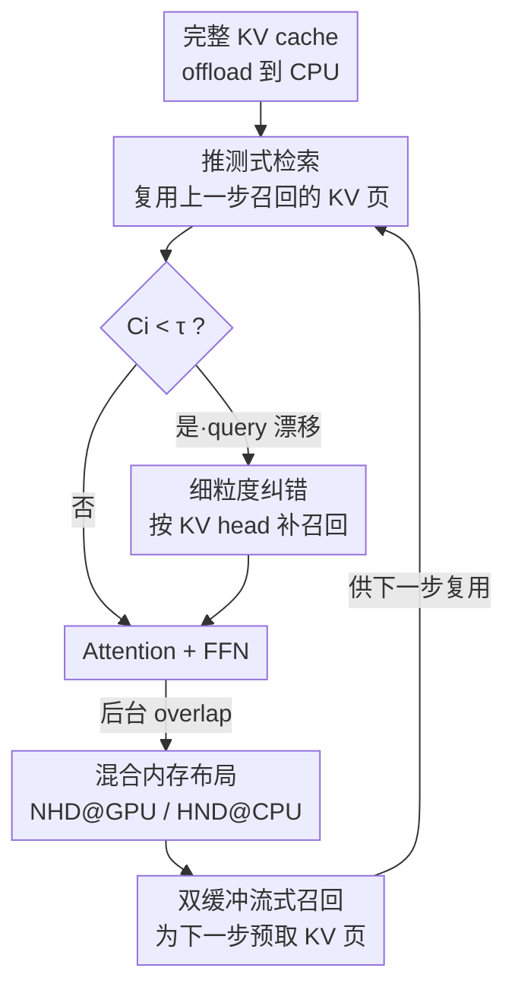

# FreeKV: Boosting KV Cache Retrieval for Efficient LLM Inference

**会议**: ICLR 2026  
**OpenReview**: [https://openreview.net/forum?id=wXAn7orB1H](https://openreview.net/forum?id=wXAn7orB1H)  
**代码**: https://github.com/sjtu-zhao-lab/FreeKV  
**领域**: LLM效率  
**关键词**: KV cache、检索式压缩、推测式检索、长上下文推理、算法-系统协同优化

## 一句话总结
FreeKV 是一个 **training-free 的算法-系统协同优化框架**，通过「推测式检索」把 KV 页的选择与召回挪出推理关键路径、用「细粒度纠错」补偿精度损失，再配合 CPU/GPU 混合内存布局与双缓冲流式召回，让检索式 KV cache 压缩在几乎无损精度的前提下相比 SOTA 检索方法最高提速 **13×**。

## 研究背景与动机

**领域现状**：LLM 的上下文窗口正快速扩张到 128K 乃至百万 token，但 KV cache 的体积随上下文长度线性增长（Llama-3-70B 在 128K 下单条请求的 KV cache 就达 40GB），既可能撑爆显存，又因为 decoding 是 memory-bound 而严重拖慢解码速度。为缓解这一问题，业界利用注意力稀疏性对 KV cache 做压缩，分为两类：**KV dropping**（永久淘汰不重要 token）与 **KV retrieval**（保留完整 cache、每步动态选一个子集参与计算）。

**现有痛点**：两条路线各有死穴。KV dropping 因为 token 重要性是**动态**的——某些当下被判定不重要而永久丢弃的 token，后续可能变得关键——在 summarization、reasoning 这类长生成任务上精度大幅塌方，推理模型动辄 32K token 的思考链更是放大了这一缺陷。KV retrieval 精度稳，但效率是硬伤：① 完整 cache 通常 offload 到 CPU，受限于 CPU-GPU 低带宽，把选中的 KV 元组从 CPU 召回到 GPU 延迟极高；② 在整个上下文上做选择本身开销就大。实测 Llama-3.1-8B、32K 上下文下，ArkVale 的召回+选择占总延迟约 94%，ShadowKV 约 73%，InfiniGen 即便把召回与计算重叠，未被隐藏的召回仍占约 53%。

**核心矛盾**：精度与效率之间存在 Pareto 式的 trade-off——dropping 高效但不准，retrieval 准但低效。而 retrieval 低效的根因在于**选择与召回处在推理的关键路径（critical path）上**，每个 decoding step 都得等它们做完才能算 attention，无法被计算掩盖。

**本文目标**：在保住 retrieval 精度优势的同时，把选择与召回的开销彻底「藏起来」，让检索式压缩的效率逼近 dropping 方法甚至全量 cache。

**切入角度**：作者观察到一个关键现象——**相邻 decoding step 的 query 向量高度相似**（绝大多数注意力头的余弦相似度 >0.9，所有头均 >0.84），这意味着相邻步选中的 KV 页几乎不变（$\mathrm{Sel}(q_i, K) \sim \mathrm{Sel}(q_{i-1}, K)$）。既然如此，当前步就不必现算现取，可以「赌」它和上一步选的一样，**复用上一步召回的结果**。

**核心 idea**：用「推测式检索 + 细粒度纠错」把选择/召回从关键路径上移走并隐藏其延迟，再用系统侧的混合布局与流式召回把召回本身做快，从而在算法和系统两侧同时榨干检索式压缩的效率。

## 方法详解

### 整体框架
FreeKV 的目标是让检索式 KV cache 在「完整 cache offload 到 CPU」的前提下，把每个 decoding step 的「页选择 + 从 CPU 召回 KV 页」开销完全藏进计算里。整体上分**算法侧**与**系统侧**两条线协同：算法侧用**推测式检索**让当前步直接复用上一步召回的 KV 页来算 attention，同时在后台并行地为下一步做选择和召回；当相邻步 query 相似度跌破阈值时，用**细粒度纠错**按 KV head 临时补召回，挡住精度损失。系统侧则保证「召回足够快、能被计算掩盖」：GPU 用 NHD、CPU 用 HND 的**混合内存布局**消除碎片化传输，再用**双缓冲流式召回**把 CPU→GPU 传输与布局转换流水线化。

### 关键设计

**1. 推测式检索：把选择与召回挪出关键路径**

检索式方法低效的根因是每个 decoding step 都得「先选页、再从 CPU 召回、才能算 attention」，这条链卡在关键路径上无法隐藏。FreeKV 抓住「相邻步 query 高度相似、选中页几乎不变」这一观察，让第 $i$ 步的 attention **跳过当前的选择和召回**，直接复用第 $i-1$ 步已经召回到 GPU 的 KV 页来计算；与此同时，本步的选择和召回在后台并行启动，其结果留给第 $i+1$ 步复用，如此迭代滚动。这样选择/召回就能和当前层的 attention、FFN 以及下一层的 QKV projection 重叠，开销被完全掩盖。相比 InfiniGen 需要额外 re-projection 来预取下一层，推测式检索**零额外计算**就隐藏了选择和召回两者的延迟。

选择本身采用 **page-wise group-consistent selection**：把每个 KV 页用 min-max pooled key 作为页摘要（类似 Quest），对注意力头 $h$ 算出页注意力权重 $P_h \in \mathbb{R}^{n_{page}}$ 后，在组内对 $\mathrm{softmax}(P_h)$ 做 mean pooling，使同一 GQA 组内所有头选出一致的页——KV head $m$ 的页得分为 $\sum_{j=1}^{G}\mathrm{softmax}(P_{(m-1)\times G+j})/G$。组一致性保证检索 KV 的空间是 $O(B \times n_{kv})$ 而非 $O(B \times n_{qo})$，避免 $G$ 倍的显存与访存开销。

**2. 细粒度纠错：只在 query 漂移时按需补召回**

纯复用上一步的页虽然最快，但相似度分析显示：尽管均值很高，**某些 decoding step 会出现相似度骤降的离群点，且离群位置因注意力头而异**。若不管不顾地复用，这些步的精度会明显下降。FreeKV 用一套低开销的纠错机制对症下药，包含两步。**Query-based identification**：直接比对 $\mathrm{Sel}(q_i,K)$ 与 $\mathrm{Sel}(q_{i-1},K)$ 的索引差异开销大、还会破坏重叠，因此改用 query 余弦相似度 $C_i$ 来判定——只有当 $C_i < \tau$ 时才触发纠错（$\tau$ 为预设阈值，论文取 0.8/0.9）；为保持组一致性，先在组内对 $C_i$ 做 mean pooling 再与 $\tau$ 比较，决定某个 KV head 是否需要纠正。**Head-wise correction**：被标记的 KV head 在当前步 attention 之前就地启动选择与召回（拿到当前步真正该用的页），而不需要纠错的 head 则把召回推迟到后台、为下一步复用做准备。为避免分别为「纠错头/非纠错头」启动选择带来的开销与 GPU 利用率下降，只要有任一 head 需要纠错，就**对所有 KV head 一次性做选择**，非纠错头直接复用这次选择结果做召回、不再重复选页。

**3. 混合内存布局：用 NHD@GPU + HND@CPU 消除碎片化传输**

召回要能被掩盖，前提是召回本身够快，而内存布局直接决定传输效率。KV cache 有两种常见布局：NHD 形状为 $(n_{page}, p, n_{kv}, d)$，HND 为 $(n_{page}, n_{kv}, p, d)$。由于投影出的 K/V 天然是 $(L, n_{kv}\times d)$，NHD 是自然布局、主流框架都用它，避免 decoding 时反复转置。但 NHD 下**同一个 KV head 的 $p$ 个 token 在内存里不连续**，逐 head 召回时最大传输单元只有 $d$ 个元素（$d{=}128$、Float16 下仅 256 字节），碎片化传输严重拉垮效率。FreeKV 的解法是**GPU 用 NHD、CPU 用 HND 的混合布局**：GPU 端保持 NHD 免去每步转置；CPU 端用 HND 让同一 head 的 $p$ 个向量连续，传输单元升到 $p\times d$（$p{=}32$ 时约 8KB）。这样 NHD↔HND 转置只在「把一个 KV 页 offload 出去」时发生一次、可被计算摊薄。CPU 端进一步用 $(n_{page}, n_{kv}, 2, p, d)$ 的形状，使 key 和 value 在召回时能一并连续传 $2\times p\times d$ 个元素。

**4. 双缓冲流式召回：让传输与布局转换流水线重叠**

offload 和转置可以和计算重叠，但召回时「HND→NHD 的布局转换」会阻塞数据传输和后续 attention，形成串行瓶颈。FreeKV 用 **double-buffering** 把召回做成流水线：一个选中的 KV 页传输到 buffer 2 后立即开始它的布局转换，与此同时下一个页的传输并发地灌进 buffer 1，两个 buffer 与转换过程都驻留在 GPU 上、吃满 GPU 高带宽。传输与转换由此重叠成流，召回延迟进一步压缩——这正是推测式召回能转化为实际加速、并实现「完全隐藏（full overlap）」的系统底座。

## 实验关键数据

实验覆盖长输入（LongBench v2）、长生成（LongGenBench）与长推理（MATH500 / AIME24 / GPQA）三类场景，模型含 Llama-3.1-8B、Qwen-2.5-7B/14B 与 DeepSeek-R1 系列；除 RazorAttention 稀疏度设 0.15 外，其余方法预算 $B$ 统一为 2048。效率实验在 A100 40GB（PCIe Gen4 连 AMD 7302 CPU）上进行。

### 主实验

精度（LongBench v2 Overall，越高越好；FreeKV 与 Full KV 的差距 ≤0.6）：

| 模型 | Full | RaaS（动态drop） | Quest | ArkVale | ShadowKV | InfiniGen | FreeKV |
|------|------|------|-------|---------|----------|-----------|--------|
| Llama-3.1-8B | 29.22 | 28.23 | 28.43 | 28.63 | 25.45 | 28.56 | **29.22** |
| Qwen-2.5-7B | 27.44 | 26.24 | 27.63 | 26.84 | 25.84 | 26.44 | 26.84 |
| Qwen-2.5-14B | 33.40 | 32.60 | 33.80 | 34.19 | 34.79 | 32.31 | 34.19 |

长推理（avg@k，DeepSeek-R1 系列，越高越好）：

| 模型 / 数据集 | Full | Quest | ArkVale | ShadowKV | InfiniGen | FreeKV |
|------|------|-------|---------|----------|-----------|--------|
| R1-Llama-8B / AIME24 | 47.08 | 44.17 | 46.67 | 36.50 | 45.83 | **47.50** |
| R1-Qwen-7B / AIME24 | 56.66 | 47.50 | 47.92 | 43.75 | 43.34 | 52.92 |
| R1-Qwen-14B / GPQA | 53.25 | 51.25 | 53.75 | 51.75 | 38.00 | **56.00** |

端到端效率（相比 SOTA 检索方法的加速比，越高越好）：

| 场景 | vs ArkVale | vs ShadowKV | vs InfiniGen |
|------|-----------|-------------|--------------|
| Llama-3.1-8B 长生成 | **13.7×** | 8.4× | 8.5× |
| Llama-3.1-8B 长输入 | 10.0× | — | 5.1× |
| Qwen-2.5-7B 长生成 | 7.9× | — | 5.4× |
| Qwen-2.5-7B 长输入 | 5.8× | — | 3.2× |

### 消融实验

| 配置 | 效果 | 说明 |
|------|------|------|
| 完整 FreeKV | 近无损精度 + 最高 13× 提速 | 算法侧+系统侧全开 |
| 纯复用、无细粒度纠错 | 精度显著下降 | query 相似度离群步未被纠正 |
| group-consistent 用 max pooling 替 mean pooling | 不如 mean pooling | 见 Appendix B.2/B.3 |
| 用上一层 query 直接召回（替推测式） | 精度更差 | 用上一步 query 的推测式检索更优（App. B.1） |

### 关键发现
- **细粒度纠错是精度的命门**：纯推测式复用虽最快，但相邻步相似度存在 head-specific 的离群骤降，不纠错会让精度明显塌；按 $C_i < \tau$ 触发的 head-wise 纠错以极小开销补回精度。
- **加速比随负载放大**：batch size 越大、生成越长（召回次数越多）、KV head 越多（如 Llama-3.1-8B 比 Qwen-2.5-7B 的 cache 更大），FreeKV 相对其他检索方法的优势越明显，长生成场景对 ArkVale 最高 13.7×。
- **ShadowKV 在 Qwen-2.5 上重复输出**：因为它只在 prefill 做一次 SVD、解码中低秩 key 不更新，重构 key 出错导致精度异常，从侧面印证 FreeKV「保留并实时检索完整 cache」的稳健性。

## 亮点与洞察
- **把「相邻 step query 高相似」做成可隐藏延迟的杠杆**：这是全文最巧的一步——不是去优化选择/召回本身有多快，而是用推测复用直接把它们移出关键路径，再用阈值触发的纠错兜底，等于用「赌 + 偶尔纠」换来了几乎免费的隐藏。
- **算法与系统真正咬合**：推测式检索要落地成实际加速，前提是召回够快能被掩盖；混合布局（NHD@GPU/HND@CPU）+ 双缓冲流式召回正是为此服务，两侧缺一不可。
- **可迁移的 trick**：「用相邻迭代的相似性做推测、再用轻量信号（余弦相似度阈值）决定是否纠正」这套范式，可迁移到任何「每步都要重算一个昂贵子集」的场景，如稀疏注意力的页选择、检索增强的候选召回。
- **training-free**：不改模型、不需重训，作为推理期插件即可叠加在现有 LLM 上。

## 局限与展望
- 作者指出 FreeKV 与 adaptive/dynamic budget、top-p 稀疏等正交技术可叠加进一步提精度，但本文未整合。
- page-wise selection 在**预算很小**时效果会变差（已有工作指出），FreeKV 依赖 page 摘要做选择，小预算下可能受限；可学习的 block-wise 稀疏（pretrain 或 posttrain）是更优的原生方向。
- 推测式检索的有效性建立在「相邻 step query 高相似」上，若某些模型/任务相似度普遍偏低，纠错触发会频繁、隐藏收益会缩水；阈值 $\tau$ 需按场景（长输入 0.8 / 长生成 0.9）调，自适应 $\tau$ 是可改进点。
- 效率实验在单张 A100 40GB + PCIe Gen4 上做，换更高带宽互联（如 NVLink/HBM 直连）后 offload-recall 瓶颈减弱，加速比能否保持有待验证。

## 相关工作与启发
- **vs ArkVale**: 同为 offload + 召回的检索式方法，ArkVale 的召回处在关键路径、占总延迟约 94%；FreeKV 用推测式检索把召回挪出关键路径，长生成下相对 ArkVale 最高 13.7×。
- **vs ShadowKV**: ShadowKV 靠低秩 SVD 只召回 value、重构 key 省传输，但 prefill 后低秩 key 不更新、不支持长生成且会重复输出；FreeKV 保留完整 cache 实时检索，精度更稳。
- **vs InfiniGen**: InfiniGen 用 re-projection 预取下一层 KV 实现部分重叠，但 token-wise 召回低效、未隐藏部分仍占约 53%，且 re-projection/选择开销大；FreeKV 零额外计算地隐藏选择+召回，长输入相对 InfiniGen 3.2×–5.1×。
- **vs KV dropping（RazorAttention/RaaS）**: dropping 高效但永久丢 token，在 summarization/reasoning 上精度大幅下降；FreeKV 在逼近 dropping 效率的同时保住 retrieval 的精度。

## 评分
- 新颖性: ⭐⭐⭐⭐ 「推测式检索 + 细粒度纠错」把相邻步 query 相似性转化为可隐藏延迟，角度新颖且落地。
- 实验充分度: ⭐⭐⭐⭐⭐ 覆盖长输入/长生成/长推理三类场景、多模型、6 个 baseline，精度与效率双线齐全。
- 写作质量: ⭐⭐⭐⭐ 算法-系统两侧脉络清晰，时间线图与布局图直观，但部分系统细节需对照附录。
- 价值: ⭐⭐⭐⭐⭐ training-free、即插即用、最高 13× 提速且近无损，对长上下文/推理模型部署有直接落地价值。

<!-- RELATED:START -->

## 相关论文

- [\[ICLR 2026\] LouisKV: Efficient KV Cache Retrieval for Long Input-Output Sequences](louiskv_efficient_kv_cache_retrieval_for_long_input-output_sequences.md)
- [\[ICLR 2026\] DefensiveKV: Taming the Fragility of KV Cache Eviction in LLM Inference](defensivekv_taming_the_fragility_of_kv_cache_eviction_in_llm_inference.md)
- [\[ICML 2026\] OBCache: Optimal Brain KV Cache Pruning for Efficient Long-Context LLM Inference](../../ICML2026/llm_efficiency/obcache_optimal_brain_kv_cache_pruning_for_efficient_long-context_llm_inference.md)
- [\[ICLR 2026\] IceCache: Memory-Efficient KV-cache Management for Long-Sequence LLMs](icecache_memory-efficient_kv-cache_management_for_long-sequence_llms.md)
- [\[ICLR 2026\] QuoKA: Query-Oriented KV Selection for Efficient LLM Prefill](quoka_query-oriented_kv_selection_for_efficient_llm_prefill.md)

<!-- RELATED:END -->
