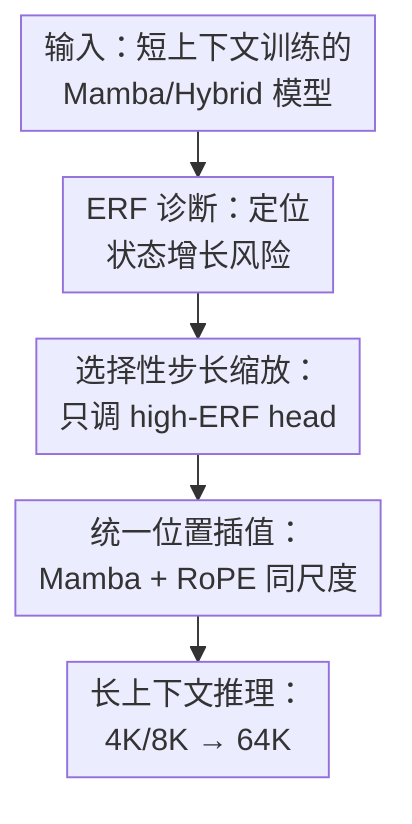

# From Collapse to Control: Understanding and Extending Context Length in Emerging Hybrid Models via Universal Position Interpolation

**会议**: ICLR2026  
**OpenReview**: [https://openreview.net/forum?id=MjmORKLHUI](https://openreview.net/forum?id=MjmORKLHUI)  
**代码**: 无  
**领域**: LLM效率  
**关键词**: 长上下文扩展, 混合 Mamba-Transformer, 状态空间模型, 位置插值, 训练免费推理  

## 一句话总结
本文系统解释了混合 Mamba-Transformer 模型在超出训练窗口后为何会长上下文崩溃，并提出训练免费 Universal Position Interpolation，通过同时缩放 Transformer 的 RoPE 频率和少数不稳定 Mamba head 的步长 $\Delta_t$，把 Bamba、Nemotron-H 和 Mamba2 的可用上下文从 4K/8K 推到最高 64K。

## 研究背景与动机

**领域现状**：长上下文能力已经成为 LLM 在文档理解、检索增强、多轮对话和代码库分析中能否落地的关键能力。纯 Transformer 可以用全局注意力直接建模远距离依赖，但计算和显存随长度近似二次增长；Mamba 和选择性状态空间模型则用线性递归降低长序列成本。于是，Bamba、Nemotron-H、Jamba 等混合 Mamba-Transformer 架构开始把少量 Transformer 层和大量 Mamba 层交错起来，希望同时拿到注意力的表达能力和状态空间模型的推理效率。

**现有痛点**：这些混合模型在训练上下文内表现很强，却很少被系统测试过“训练 4K/8K，推理 32K/64K”时会发生什么。论文的初步实验显示，Bamba-9B-v2 这类强混合模型一旦输入超过训练长度，PG-19 perplexity 会快速飙升，RULER needle retrieval 准确率也会断崖式下降。直觉上，人们可能会认为 Transformer 层负责精确检索、Mamba 层负责局部摘要，所以只要给 Transformer 的 RoPE 套 YaRN/PI 就能扩上下文；但实验表明这只能稍微缓解，无法阻止 collapse。

**核心矛盾**：混合模型的长上下文瓶颈不只在 Transformer 的位置编码，也在 Mamba 层内部的状态动态。Mamba 的递归状态会沿时间累计，少数 forget gate 长期接近 1 的 head 在训练长度内还没达到饱和，推理到更长序列时继续增长到训练分布之外。随后这些大幅值 state 通过输出门和 GroupNorm 压制其他 head 与当前输入的贡献，形成 feature collapse。也就是说，长上下文扩展需要同时控制“注意力位置尺度”和“Mamba 状态增长尺度”。

**本文目标**：作者要回答三个问题：第一，混合 Mamba-Transformer 的长上下文失败到底来自哪里；第二，能否用不用微调、不开大规模搜索、也不改 fused kernel 的方式修正它；第三，这个修正是否能同时适用于纯 Mamba 和混合模型，并在 PG-19、LongBench、RULER 上稳定提升。

**切入角度**：论文从 Effective Receptive Field（ERF）入手，把 Transformer head 和 Mamba head 放在同一个尺度下观察。结果发现，Transformer 层的 ERF 会随长度稳定扩展，而 Mamba 层大多数 head 很快饱和，只有少数 high-ERF head 继续增长。这些 high-ERF head 又恰好对应状态 Frobenius norm 持续放大的 head，因此作者把“找出少数未收敛 head 并降低每个 token 对 state 的增量”作为核心切口。

**核心 idea**：当推理长度扩大 $n$ 倍时，对不稳定 Mamba head 把步长 $\Delta_t$ 缩小为 $\Delta_t/n$，同时对 Transformer 层使用 RoPE 频率缩放，从而用统一的位置插值视角控制混合模型里的两类位置动态。

## 方法详解

### 整体框架

UPI 不是重新训练一个长上下文模型，而是在现有混合模型上做一次轻量校准和推理时的闭式缩放。它先用少量校准样本计算每个 Mamba head 的 ERF，选出 top-$K$ high-ERF head 作为状态增长风险点；推理时，Transformer 层继续使用 YaRN 等 RoPE 缩放，而被选中的 Mamba head 把步长 $\Delta_t$ 按目标长度比例缩小。最终，模型仍走原来的前向图，不需要引入额外参数，也不需要在每次生成时做额外搜索。

这个流程里的关键贡献是三件事：先证明 collapse 和 high-ERF Mamba head 的 state magnitude explosion 相关，再把 Mamba 的步长缩放推成闭式形式，最后把它和 RoPE 频率缩放放到同一个“位置推进速度变慢”的框架下。ERF 诊断只需要在小校准集上跑若干 forward pass；一旦 head 集合确定，推理阶段的改动就是对 selected heads 的 $\Delta_t$ 做元素级缩放。

### 关键设计

**1. ERF 诊断：把长上下文 collapse 定位到少数未收敛 Mamba head**

论文没有直接把失败归因于“混合架构不适合长上下文”，而是用 Effective Receptive Field 分层、分 head 去看每个位置对最后 token 的实际影响。对 Mamba，作者采用 Mamba Mean Distance（MMD）形式的 ERF：

$$
\mathrm{MMD}=\sum_{j=1}^{L}(L-j)\frac{|M_{L,j}|}{\sum_{i=1}^{L}|M_{L,i}|}
$$

其中 $M$ 是把 Mamba 递归展开后得到的类注意力下三角矩阵，$M_{L,j}$ 表示第 $j$ 个 token 对最后位置的影响强度。这个定义的好处是可以同时用于 Mamba 和 Transformer：高 MMD 代表远处 token 对当前输出仍有明显影响，低 MMD 则说明 head 更偏局部。

在 Bamba-9B-v2 上，Transformer 层的 ERF 随上下文长度接近线性增长；Mamba 层平均看起来很快饱和，但 head-level 曲线显示少数 Mamba head 仍能扩展到很长距离。作者进一步跟踪这些 head 的 hidden state Frobenius norm，发现高 ERF 与状态幅值增长同步出现。Mamba 更新可简化为 $h_{t+1}=a_t h_t + B_t x_t$，当 forget gate $a_t$ 长期接近 1 时，理想化上界 $Bx/(1-a)$ 会非常大，状态需要远超训练长度才会收敛。推理到 32K/64K 时，这类 head 继续累积到训练时未见过的幅值，经过 $y_t=C_t h_t + D x_t$ 后压过其他 head，再被 GroupNorm 拉回分布时又把其他贡献压扁，于是出现 feature collapse。

**2. 选择性步长缩放：用 $\Delta_t/n$ 控制每个 token 的状态增量**

既然问题来自少数 head 的累计状态变化太快，UPI 的核心操作就是让更长序列中的每个 token 对 state 的推动变小。设目标推理长度是训练长度的 $n$ 倍，原始 Mamba 更新为：

$$
h_{t+1}=\exp(-a\Delta_t)h_t+\Delta_t B_t x_t
$$

作者把一个原始大步拆成 $n$ 个小步，并要求两个一致性条件成立：经过 $n$ 个小步后的总遗忘量等于原来的一个大步；$n$ 个小步累计的输入贡献也等于原来的一个大步。由此得到 forget gate 和 input gate 的闭式调整：

$$
f(a,\Delta_t,n)=\exp(-a\Delta_t/n)
$$

$$
g(B_t,\Delta_t,n)=\Delta_tB_t\cdot\frac{1-\exp(-a\Delta_t/n)}{1-\exp(-a\Delta_t)}
$$

理论上，这个形式会把未收敛 head 的状态增长拉回训练分布。但真实模型里的 $\Delta_t$ 是输入相关的，input gate 那个分式在实践中会因为 $\Delta_t$ 剧烈变化而不稳定。作者注意到需要修正的正是 $\Delta_t$ 很小、forget gate 接近 1 的 head；当 $\Delta_t\to0$ 时，分式极限为 $1/n$。因此最终实现可以简化成非常干净的规则：对 high-ERF head，把 $\Delta_t$ 替换成 $\Delta_t/n$。这既保留了“长序列每个 token 少推一点 state”的直觉，又避免了动态 input scaling 的数值噪声。

**3. 统一位置插值：把 Mamba gate 缩放和 Transformer RoPE 缩放放在同一套 CLE 逻辑里**

UPI 之所以叫 Universal，不只是因为它能用于多种模型，而是因为作者把 Mamba 的 cumulative decay 和 Transformer 的 rotary frequency 看成两种位置注入机制。RoPE 中，不同频率决定表示随位置旋转的速度；位置插值方法会把低频维度按比例缩放，让模型在更长位置上仍处于训练时见过的相对相位范围。Mamba 中，$\Delta_t$ 和 forget gate 决定状态随 token 位置推进的速度；缩小 selected heads 的 $\Delta_t$，本质上是在让这部分 state 的时间轴也变慢。

这个视角对混合模型尤其重要。只缩放 Transformer RoPE，相当于只把注意力层的位置钟表调慢，而 Mamba 层的状态钟表仍按原速走，少数 head 仍会跑出训练分布；只缩放所有 Mamba head，又会破坏本来负责局部模式的 short-range head。UPI 的做法是：Transformer 层使用现成的 RoPE 频率调整（如 YaRN），Mamba 层只对 top-$K$ ERF head 做 $\Delta_t/n$。论文根据 log-ERF 的双峰分布和消融结果采用 20% 作为通用 cutoff，这个比例在 Bamba、Nemotron-H 和 Mamba2 上都能比较好地切开“少数长程风险 head”和“大多数局部 head”。

### 一个完整示例

以训练上下文为 4K 的 Bamba-9B-v2 扩到 64K 为例，长度缩放因子是 $n=16$。UPI 先在 proof-pile ArXiv 子集上构造 100 个 16K token 的校准样本，跑 forward pass 得到每个 Mamba head 的平均 ERF，然后按 ERF 从高到低选择 top 20% head。这个过程不训练参数，只是在记录哪些 head 的 long-range influence 最大。

推理时，如果输入是一段 64K 文档，Transformer 层的 RoPE 频率由 YaRN 缩放；Mamba 层中被选中的 high-ERF head 使用 $\Delta_t/16$ 更新状态，其余 80% head 保持原始 $\Delta_t$。这样，高 ERF head 仍能覆盖远距离依赖，但它们的状态幅值不会按原速冲出训练分布；局部 head 也不会因为被过度插值而失去短程模式。最终模型可以在不改权重的情况下处理 64K 输入，而不是在 16K 或 32K 后 perplexity 爆炸。

### 损失函数 / 训练策略

UPI 没有新的训练损失，也不需要长序列微调。它的“训练策略”更准确说是一次训练免费校准：用 100 条 16K token 校准样本估计 Mamba head 的 ERF，选择 top-$K$ head，然后在推理时按目标长度应用闭式缩放。论文报告这个校准在 8 张 A100 上少于 3 分钟；相比之下，LongMamba 需要多轮 LongBench-E 超参数搜索，在同样硬件上约 10.5 小时。

实现上，UPI 对 Transformer 层复用已有 RoPE CLE 方法；对 Mamba 层只对 selected heads 的 $\Delta_t$ 做元素级缩放，因此不会改变模型结构，也没有额外推理时间开销。对于没有 RoPE 的 Nemotron-H-8B，UPI 只作用在 Mamba 层；对于 Bamba-9B-v2，则组合为 UPI + YaRN。

## 实验关键数据

### 主实验

论文在三类模型上测试：纯 Mamba2-2.7B、混合 Bamba-9B-v2 和混合 Nemotron-H-8B。主要语言建模结果来自 PG-19，不同模型的训练上下文不同：Mamba2 为 2K，Bamba 为 4K，Nemotron-H 为 8K。

| 模型 | 方法 | 8K PPL | 16K PPL | 32K PPL | 64K PPL |
|------|------|--------|---------|---------|---------|
| Bamba-9B-v2 | Base | 9.37 | 14.23 | 32.76 | 127.90 |
| Bamba-9B-v2 | LongMamba + YaRN | 8.83 | 13.02 | 23.68 | 53.14 |
| Bamba-9B-v2 | UPI + YaRN | 9.01 | 9.82 | 14.60 | 18.59 |
| Nemotron-H-8B | Base | 7.59 | 46.57 | 210.30 | 530.31 |
| Nemotron-H-8B | LongMamba | 7.13 | 23.24 | 46.42 | 78.51 |
| Nemotron-H-8B | UPI | 7.39 | 15.58 | 25.72 | 44.01 |
| Mamba2-2.7B | Base | 16.73 | 53.14 | 137.82 | 478.21 |
| Mamba2-2.7B | LongMamba | 9.16 | 14.82 | 23.59 | 42.20 |
| Mamba2-2.7B | UPI | 8.75 | 13.69 | 17.58 | 22.24 |

PG-19 结果非常直接：base 模型在长于训练窗口后都出现明显失控，尤其 Nemotron-H 和 Mamba2 到 64K 时 perplexity 分别升到 530.31 和 478.21；UPI 把它们降到 44.01 和 22.24。Bamba 在 64K 上从 127.90 降到 18.59，也明显优于 LongMamba + YaRN 的 53.14。

在 RULER 上，UPI 也提升了长上下文检索与理解任务的平均分。例如 Bamba-9B-v2 在 8K 时，Base 平均 20.1，LongMamba + YaRN 为 26.0，UPI + YaRN 为 28.3；在 16K 时三者分别为 12.0、11.4、19.0。Nemotron-H-8B 在 16K 的 RULER 平均分从 Base 40.7 提升到 UPI 45.0，在 32K 从 20.9 提升到 26.0。LongBench-E 上，UPI 对混合模型同样最稳：Bamba 平均分从 21.71/22.85 提升到 23.68，Nemotron-H 从 23.61/23.14 提升到 25.15。

### 消融实验

| 配置 | 8K PPL | 16K PPL | 32K PPL | 64K PPL | 说明 |
|------|--------|---------|---------|---------|------|
| UPI + YaRN | 9.01 | 9.82 | 14.60 | 18.59 | 同时缩放 Mamba high-ERF head 与 Transformer RoPE |
| w/o YaRN | 9.23 | 12.54 | 16.87 | 25.79 | 只保留 Mamba 侧 UPI，长上下文变差 |
| w/o UPI | 8.97 | 14.85 | 27.29 | 98.01 | 只保留 Transformer RoPE，64K 基本 collapse |
| w/o Selective head | 9.47 | 15.73 | 23.85 | 65.92 | 所有 Mamba head 都缩放，破坏局部 head |

这个消融说明两点。第一，混合模型需要双侧处理：去掉 YaRN 会变差，去掉 Mamba 侧 UPI 更糟，说明瓶颈不只在 Transformer 位置编码。第二，selective head 是必要的：如果不区分 high-ERF 和 low-ERF head，而是所有 Mamba head 一起插值，64K perplexity 会从 18.59 恶化到 65.92，说明很多 head 原本承担的是短程建模，不能被无差别放慢。

| Top-K high-ERF head 比例 | 8K PPL | 16K PPL | 32K PPL | 64K PPL |
|--------------------------|--------|---------|---------|---------|
| 10% | 10.43 | 18.79 | 24.21 | 33.69 |
| 20% | 9.01 | 9.82 | 14.60 | 18.59 |
| 30% | 12.18 | 21.09 | 20.14 | 27.02 |
| 40% | 16.24 | 22.76 | 22.53 | 34.14 |

Top-K 消融进一步支持 20% cutoff。10% 可能漏掉部分未收敛 head，30%/40% 又开始误伤局部 head；20% 在四个长度上都最好。作者还比较了不同校准数据集的 head selection overlap，top 20% 在 proof-pile ArXiv、PG-19、WikiText2 之间有 82.7% 到 91.0% 的重合，说明 ERF 选 head 对数据集并不脆弱。

### 关键发现

- Mamba 层不是混合模型里的“无害局部摘要器”。少数 high-ERF Mamba head 会在长上下文里继续积累状态，状态幅值越界后会通过输出投影和归一化压制其他 head，成为 collapse 的核心来源。
- UPI 的收益在最长上下文最明显。Bamba-9B-v2 在 64K 上相对 Base 的 PPL 从 127.90 降到 18.59；Nemotron-H-8B 从 530.31 降到 44.01；Mamba2-2.7B 从 478.21 降到 22.24。
- Mamba 侧和 Transformer 侧缩放是互补关系。只用 YaRN 不能解决 Mamba state explosion，只用 Mamba UPI 也没有充分利用 Transformer RoPE 的长上下文插值能力。
- UPI 校准成本远低于搜索式方法。LongMamba 需要为每个模型做约 10.5 小时超参搜索，UPI 只需要约 3 分钟 ERF profiling，且推理时没有额外开销。
- UPI 与长上下文微调并不冲突。论文把 Bamba fine-tune 到 32K/128K 后再加 UPI，仍能在更长长度上提升 passkey、dialogue history QA 和 code repo QA 等任务，说明它更像一个后处理稳定器，而不是微调替代品。

## 亮点与洞察

- 最关键的洞察是把混合模型 collapse 从“上下文太长所以模型不会用”拆成了可诊断的状态动力学问题。ERF 和 state norm 的对应关系让问题落到具体 head 上，而不是停留在模型整体性能曲线。
- UPI 的公式很简洁，但不是拍脑袋缩小步长。作者先从 forget consistency 和 input consistency 推出闭式形式，再用 $\Delta_t\to0$ 的极限把 input gate scaling 简化为 $1/n$，这让最终实现既有理论动机，也足够工程友好。
- “只缩放 top 20% high-ERF head”比“所有 head 一起缩放”更有价值。它提醒长上下文扩展不是把模型所有位置机制统一拉长，而是要保留局部 head 的短程归纳偏置，同时控制真正会越界的长程 head。
- 把 Mamba 的 $\Delta_t$ 和 RoPE 频率放在同一个位置插值视角下，是本文最有迁移潜力的地方。未来如果出现更多混合架构，比如 attention、SSM、retention 或 convolution 混合，这种“先找每个组件的位置推进速度，再做对应缩放”的思路可能继续适用。

## 局限与展望

- UPI 的 head selection 仍依赖一次校准流程。虽然 100 条样本、3 分钟成本很低，但它并不是完全零准备；当模型结构、tokenizer 或推理内核改变时，可能需要重新 profile。
- 20% cutoff 是经验上稳定的选择，而不是从模型参数中严格推出的最优值。论文展示了 log-ERF 双峰分布和 Top-K 消融，但不同规模、不同训练配方的未来混合模型可能需要更自适应的阈值。
- 实验主要覆盖语言建模、检索、长文理解和代码任务，还没有充分讨论生成质量、对齐行为、长上下文 hallucination 或多轮 agent 场景。perplexity 和 retrieval 准确率改善不一定自动等价于更可靠的长程推理。
- UPI 主要稳定推理期的状态增长，不能补上模型训练时从未学过的长距离组合能力。对于需要跨文档复杂推理或极长代码依赖的任务，长上下文微调、数据构造和检索机制仍然可能必要。
- 论文把 RoPE-Mamba duality 作为重要解释，但更多是 proof sketch 和现象对应。后续可以更细地研究不同 Mamba head 的 $\Delta_t$ 分布、语义功能和 RoPE 频率 band 之间是否存在可预测映射。

## 相关工作与启发

- **vs YaRN / Position Interpolation**: YaRN 这类方法主要缩放 Transformer 的 RoPE 频率，适合纯 Transformer 或混合模型中的 attention 层；UPI 继承这个方向，但指出混合模型还有 Mamba state dynamics 需要同步处理。两者不是替代关系，在 Bamba 上组合 UPI + YaRN 才能最好地防止 64K collapse。
- **vs LongMamba**: LongMamba 也是训练免费地扩展 Mamba 长上下文，但需要较重的参数搜索和 clipping lookup，并且主要面向纯 Mamba。UPI 用 ERF profiling 选 head，再用闭式 $\Delta_t/n$ 缩放，校准更轻，对混合模型更自然。
- **vs DeciMamba / StuffedMamba / MambaExtend**: 这些方法关注纯 Mamba 的长度外推，常涉及 token filtering、time-step clamping 或容量分析。本文的差异在于把 Mamba 与 Transformer 放进同一个混合架构诊断框架，并把 CLE 问题解释为两类位置机制的共同缩放。
- **vs Hybma / Samba / Jamba 等架构式长上下文方法**: 架构方法通常需要重新设计或训练模型，让长上下文能力成为模型结构的一部分；UPI 是 post-hoc 方法，目标是让已经训练好的 Bamba/Nemotron-H 这类模型直接获得更长可用窗口。它的优势是低成本和易部署，劣势是不能替代训练阶段学到的长程任务能力。

## 评分

- 新颖性: ⭐⭐⭐⭐⭐ 首次系统解释混合 Mamba-Transformer 长上下文 collapse，并把 Mamba gate 缩放和 RoPE 插值统一起来。
- 实验充分度: ⭐⭐⭐⭐⭐ 覆盖 Bamba、Nemotron-H、Mamba2，包含 PG-19、RULER、LongBench-E、47B 泛化和多组消融，证据链比较完整。
- 写作质量: ⭐⭐⭐⭐☆ 论文主线清晰，公式推导和实验结论能对上；少数 appendix 细节较密，需要读者熟悉 Mamba2 与 ERF 才能完全跟上。
- 价值: ⭐⭐⭐⭐⭐ 对想部署混合 SSM/Transformer 长上下文模型的人很实用，提供了低成本、训练免费且机制可解释的扩窗方案。

<!-- RELATED:START -->

## 相关论文

- [\[ICLR 2026\] Understanding and Improving Length Generalization in Hierarchical Sparse Attention Models](understanding_and_improving_length_generalization_in_hierarchical_sparse_attenti.md)
- [\[ICLR 2026\] UltraLLaDA: Scaling the Context Length to 128K for Diffusion Large Language Models](ultrallada_scaling_the_context_length_to_128k_for_diffusion_large_language_model.md)
- [\[ACL 2025\] Giraffe: Design Choices for Extending the Context Length of Visual Language Models](../../ACL2025/llm_efficiency/design_choices_for_extending_the_context_length_of_visual_language_models.md)
- [\[ICLR 2026\] Beyond Real: Imaginary Extension of Rotary Position Embeddings for Long-Context LLMs](beyond_real_imaginary_extension_of_rotary_position_embeddings_for_long-context_l.md)
- [\[ICLR 2026\] Distilling to Hybrid Attention Models via KL-Guided Layer Selection](distilling_to_hybrid_attention_models_via_kl-guided_layer_selection.md)

<!-- RELATED:END -->
