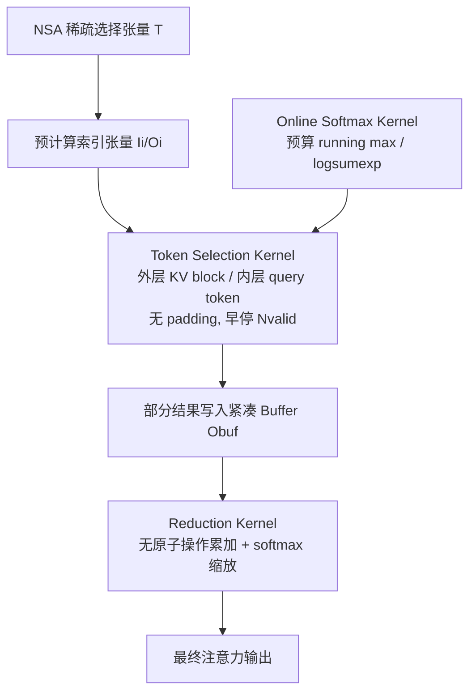

# FSA: An Alternative Efficient Implementation of Native Sparse Attention Kernel

**会议**: ICLR 2026  
**OpenReview**: [https://openreview.net/forum?id=c5mdo1hWrs](https://openreview.net/forum?id=c5mdo1hWrs)  
**代码**: [https://github.com/Relaxed-System-Lab/Flash-Sparse-Attention](https://github.com/Relaxed-System-Lab/Flash-Sparse-Attention)  
**领域**: LLM 高效推理与训练 / 稀疏注意力 GPU Kernel  
**关键词**: Native Sparse Attention, GQA, 注意力 Kernel, 长上下文, Triton, 循环重排  

## 一句话总结
FSA 把 NSA 稀疏注意力 kernel 的"外层循环 query token、内层循环 KV block"翻转成"外层循环 KV block、内层循环 query token"，从而在每个 GQA group 只有少量 query head 的主流 LLM 上消除 padding 浪费，kernel 延迟最高降 3.5×、端到端训练最高加速 1.25×。

## 研究背景与动机

**领域现状**：长上下文 LLM 的全注意力随序列长度二次增长，64k token 时注意力可占解码延迟的 70–80%。稀疏注意力让每个 query 只与 KV 的一个子集交互，是降本的主流方向。其中 Native Sparse Attention (NSA) 把 KV 组织成 block，用压缩(compression)、选择(selection)、滑窗(sliding window)三路并行注意力，做到原生可训练、硬件对齐，精度逼近全注意力，是 SOTA。

**现有痛点**：NSA 真正的系统瓶颈是 token selection 这一路——每个 query token 跨 query head 动态选择各自不同的 T 个 KV block，造成不规则 HBM 访问。NSA 的 vanilla kernel 用两层循环：外层循环 query token、把共享同一 KV head 的多个 query head 批在一起；内层循环逐个加载选中的 KV block。这套批 query head 的策略只有当每个 GQA group 里 query head 数足够多（够填满 wmma/wgmma 矩阵指令的最小 shape，如 Hopper 上每维 ≥8）时才高效。

**核心矛盾**：现实里主流 LLM 的 GQA group 普遍只有 1/2/4 个 query head，远不够填满矩阵指令。NSA kernel 只能对 query head 维度做 **padding** 来凑满硬件要求，导致大量无用的数据加载和算力浪费——稀疏算法理论上省下的 FLOPs 无法兑现成真实墙钟加速。

**本文目标**：设计一个在各种 GQA group 配置（尤其是 head 数少）下都高效的 NSA token selection kernel，让稀疏算法的红利真正落地到广泛的现役 LLM 上。

**核心 idea（循环重排 + 解耦归约）**：既然"一个 KV block 被多少 query token 关注"这个数量通常远大于硬件最小 shape 要求，那就**交换两层循环顺序**——外层循环 KV block、内层批量循环关注该 block 的 query token，于是天然无需 padding；但翻转循环也带来"同一 query 的部分结果分散在不同 thread block"的新难题，FSA 用索引张量 + 独立归约/在线 softmax kernel 解决。

## 方法详解

### 整体框架
FSA 保持 NSA 算法语义不变，只重写 token selection 这一路的 kernel 实现。核心是把 NSA 的（query token 外层 / KV block 内层）循环顺序反转为（KV block 外层 / query token 内层），每个 thread block 负责一个 (Query Head, KV Block) pair，把对应 block 的 KV 一次性载入、再迭代处理关注它的非连续 query token batch。为应对反转带来的两个副作用——非连续 query 访存、跨 thread block 的部分结果累加——FSA 引入索引张量编排数据搬运，并把"算"和"归约/在线 softmax"拆成三个专用 kernel。

### 关键设计

**1. 循环顺序反转，从根上消除 padding：** vanilla NSA 之所以要 padding，是因为它在内层逐 KV block 处理、外层批 query head，而 GQA group 内 head 数 g 太小填不满矩阵指令最小维。FSA 反过来——外层 grid 循环 KV block，内层循环关注该 block 的 query token 批。由于关注同一 KV block 的 query token 数量通常远超硬件最小 shape，矩阵乘的"行"方向天然被填满，**完全不需要 padding**，直接砍掉无效访存与 FLOPs。理论分析（Theorem）证明：在 $g\in\{1,2,4,8\}$ 的常见 GQA 设置下，FSA 的 token selection + online softmax + reduction 三个 kernel 的**总**访存量与 FLOPs 都低于 vanilla NSA 单 kernel，且 g 越小优势越大。

**2. 索引张量编排非连续访存：** 反转循环后，落到某个 KV block 上的 query token 索引是稀疏、非连续的。FSA 从 NSA 的稀疏选择张量 $T\in\mathbb{R}^{h_K\times N\times T}$ 预计算两套索引：输入索引 $I_i$（记录关注第 $i$ 个 KV block 的 query token 下标，有效数 $N_{valid}=|I_i|\le N$）和输出映射索引 $O_i$（把部分结果连续地写回紧凑 buffer）。thread block 在处理完 $I_i$ 中所有有效 query 后**提前终止**，避免多余访存；$O_i$ 则保证中间结果的 I/O 是连续的，缓解非连续访存对 L2 命中率的伤害。反向传播复用前向缓存的 $I_i/O_i$。

**3. 两阶段解耦归约，回避原子操作：** 因为同一 query 的部分注意力结果被分散到处理不同 KV block 的多个 thread block，直接写回输出张量需要原子加来防竞争，开销过高。FSA 把"计算"和"累加"解耦成两步：(i) token selection kernel 只算部分结果（不归约）写入中间 buffer；(ii) 专门的 **reduction kernel** 带在线 softmax 缩放把部分结果累加成最终输出。这样彻底消除原子操作。代价是多占 HBM，FSA 通过只给每个 KV block 分配 $N_{valid}$ 大小（而非全 $N$）的紧凑 buffer、并用 $O_i$ 做连续 I/O 来把内存开销压到可控。

**4. 独立在线 softmax kernel 保证数值正确：** 若在 token selection kernel 内部就地算在线 softmax 统计量，多个 thread block 各算同一 query 的部分统计会得到错误的 running max 与输出。FSA 因此用一个独立的 **online softmax kernel** 提前用 $Q$、$K$ 预计算好每个 query token 的在线 softmax 统计量（running max、log-sum-exp）并存入 buffer，供 token selection 与 reduction 两个 kernel 正确缩放：partial 结果先按历史 running max 缩放，最终输出再按 log-sum-exp 归一。

## 实验关键数据

### 主实验：Kernel 级延迟（H20 / H200，Triton 实现）

| 对比对象 | 平台 | 平均加速 | 最高加速 | 优势区间 |
|---|---|---|---|---|
| vs NSA | H20 | 1.8× | 3.5× | g 越小、序列越长越优 |
| vs NSA | H200 | 1.4× | 2.9× | g∈{1,2}、32K/64K 最明显 |
| vs Full Attention | H20 | 2.4× | 6.4× | g 越大优势越大（g=8,64K 达 6.4×） |
| vs Full Attention | H200 | 2.3× | 4.9× | 长序列稳定领先 |

> 摘要中报告综合 kernel 平均 1.6×、最高 3.5×。值得注意：vanilla NSA 在 g=1、32K 等多种配置下反而慢于全注意力，而 FSA 始终超过全注意力。

### 端到端训练 / 推理（Llama3-8B、Qwen3-14B、Qwen2.5-32B，32K/64K）

| 场景 | 对比 NSA（平均 / 最高） | 对比 Full Attention（平均 / 最高） |
|---|---|---|
| 训练 | 1.09× / 1.25× | 1.86× / 2.47× |
| 推理 Prefill | 1.11× / 1.36× | 1.39× / 1.69× |
| 推理 Decode | 与 NSA 持平 | — |

### 关键发现
- **GQA head 数越少，FSA 相对 NSA 优势越大**：g=1 时峰值 3.5×，印证了"消除 padding"正是收益来源。
- **序列越长收益越大**：32K/64K 下 FSA 与 NSA 差距进一步拉开。
- **辅助 kernel 开销可控**：online softmax + reduction 引入的额外访存，远小于 NSA 在 padded 数据上浪费的访存（Figure 2/3 的访存与 FLOPs 分析支撑 Theorem）。
- **跨 GPU 通用**：A100、H100(PCIe/NVL/SXM)、H200、H20 上均稳定优于 NSA。

## 亮点与洞察
- **不动算法、只改 kernel 实现**就拿到大幅加速，是把"系统瓶颈定位—硬件约束分析—循环重排"做到位的范例：抓住"NSA 三路里 token selection 才是瓶颈"和"GQA head 数太小填不满矩阵指令"这两个关键事实。
- **循环重排是手段，难点在善后**：反转循环看似简单，真正的工程价值在于用索引张量 + 紧凑 buffer + 解耦的在线 softmax/归约 kernel，干净地处理了非连续访存与跨 block 累加，避免昂贵的原子操作。
- **理论与经验双重背书**：既有 Theorem 证明总访存/FLOPs 更低，又有跨 6 种 GPU 的实测 profiling，论证闭环。
- **直击落地痛点**：现役 LLM 的 GQA group 普遍小，FSA 正好补上 NSA "head 多才高效"的短板，让稀疏注意力红利对主流模型可用。

## 局限与展望
- **额外 HBM 开销**：解耦归约需中间 buffer，虽用 $N_{valid}$ 紧凑分配压缩，但内存仍高于单 kernel 方案，超长序列下需关注。
- **解码阶段无增益**：FSA 仅与 NSA 持平，加速主要在 kernel/训练/prefill，对 decode 受限场景帮助有限。
- **GQA head 多时优势收窄**：g=8 时相对 NSA 接近持平（收益主要在 g 小时），说明方法是对特定瓶颈的针对性优化。
- **依赖 Triton 实现与 NSA 框架**：性能数字基于 Triton kernel，迁移到其他算子库或更深度的 CUDA/CUTLASS 实现时的相对优势有待验证。

## 相关工作与启发
- **NSA (Yuan et al., 2025)**：本文直接优化对象，压缩/选择/滑窗三路稀疏注意力。
- **Flash Attention (Dao, 2023)**：全注意力的两层循环 + 在线 softmax 设计，是 FSA 在数值处理与循环结构上的方法论源头。
- **在线 softmax (Milakov & Gimelshein, 2018)**：FSA 跨 thread block 正确累加的数值基础。
- **GQA (Ainslie et al., 2023)**：本文优化所围绕的注意力分组结构，head 数正是关键变量。
- 启发：稀疏算法要落地，"kernel 实现是否匹配真实硬件约束（矩阵指令最小 shape、访存连续性）"往往比算法本身更决定墙钟加速；循环顺序的选择应由"哪个维度天然填满硬件"反推。

## 评分
- **新颖性**: ⭐⭐⭐⭐ — 循环重排思路朴素但切中 NSA 落地痛点，配套的索引编排 + 解耦归约 + 独立 softmax 是扎实的系统创新。
- **实验充分度**: ⭐⭐⭐⭐⭐ — 覆盖 6 种 GPU、4 种 GQA、2 组 NSA 超参、4 种序列长度、3 个真实模型，kernel/训练/推理三层 + 理论分析齐全。
- **写作质量**: ⭐⭐⭐⭐ — 瓶颈定位、硬件约束、设计权衡讲得清楚，图示完整；部分访存分析需翻附录。
- **价值**: ⭐⭐⭐⭐⭐ — 让 SOTA 稀疏注意力对主流小 GQA-head LLM 真正可用，已开源，工程落地价值高。

<!-- RELATED:START -->

## 相关论文

- [\[ICLR 2026\] Understanding and Improving Length Generalization in Hierarchical Sparse Attention Models](understanding_and_improving_length_generalization_in_hierarchical_sparse_attenti.md)
- [\[ICLR 2026\] InfLLM-V2: Dense-Sparse Switchable Attention for Seamless Short-to-Long Adaptation](infllm-v2_dense-sparse_switchable_attention_for_seamless_short-to-long_adaptatio.md)
- [\[ICLR 2026\] Retrospective Sparse Attention for Efficient Long-Context Generation](retrospective_sparse_attention_for_efficient_long-context_generation.md)
- [\[ACL 2025\] Native Sparse Attention: Hardware-Aligned and Natively Trainable Sparse Attention](../../ACL2025/llm_efficiency/native_sparse_attention.md)
- [\[ACL 2026\] Native Hybrid Attention for Efficient Sequence Modeling](../../ACL2026/llm_efficiency/native_hybrid_attention_for_efficient_sequence_modeling.md)

<!-- RELATED:END -->
