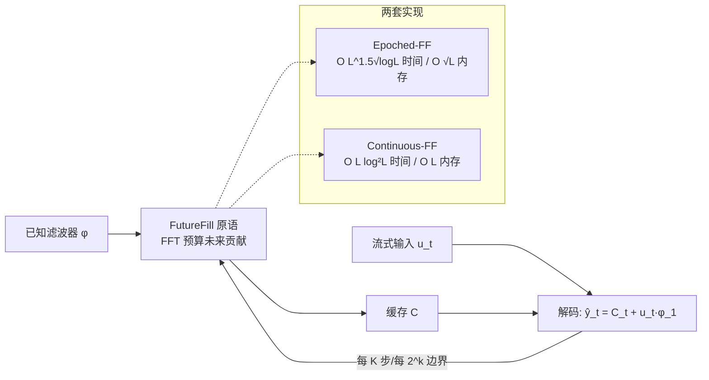

# FutureFill: Fast Generation from Convolutional Sequence Models

**会议**: ICLR 2026  
**OpenReview**: [https://openreview.net/forum?id=t5GUEuIsxR](https://openreview.net/forum?id=t5GUEuIsxR)  
**代码**: [dshah.io/futurefill](https://dshah.io/futurefill)  
**领域**: LLM 高效推理 / 卷积序列模型  
**关键词**: 卷积序列模型, 自回归生成, FFT, 在线卷积, 缓存压缩, 状态空间模型  

## 一句话总结
针对卷积/谱序列模型（STU、Hyena 等）自回归解码慢的问题，本文提出 **FutureFill** 原语——用 FFT 提前算好"已生成 token 对未来 token 的贡献"，把从头生成 $L$ 个 token 的时间从 $O(L^2)$ 降到拟线性 $O(L\log^2 L)$，带提示生成时缓存从 $O(L+K)$ 降到只与生成长度有关的 $O(K)$，且全程**精确无近似**。

## 研究背景与动机
- **领域现状**：卷积序列模型（LongConv、SGConv、Hyena、谱变换单元 STU 等）凭借 FFT 在**训练**时能做到关于序列长度近线性的开销，是 Transformer 二次注意力的有力替代，尤其擅长长程依赖建模。
- **现有痛点**：训练快不代表**生成快**。SSM/RNN 解码时间与序列长度无关（常数级），但纯卷积模型自回归解码的已知最优结果仍是 $O(L^2)$——和注意力一样是二次的；同时朴素在线卷积要存全部历史输入，缓存达 $O(L+K)$。已有的"把 SSM 从卷积模型蒸馏出来"路线（Massaroli et al.）是**近似**，逼近误差不清楚。
- **核心矛盾**：卷积模型天然具备"滤波器完全已知"的结构，但现有解码却像注意力一样朴素地逐 token 内积，完全没利用这个结构去**预先计算未来**。
- **本文目标**：在**不做任何近似**、适配任意卷积模型（不管怎么训练出来的）的前提下，同时压低生成时间与缓存大小。
- **核心 idea**：**【在线卷积可被"预填未来"加速】** 卷积模型中，当前及历史 token 对未来输出的贡献，因为滤波器 $\phi$ 已知，**无需等未来 token 生成出来就能算**。把这个"对未来的贡献"用 FFT 批量提前算好缓存起来（FutureFill），解码时直接查表 + 少量近端修正即可。

## 方法详解

### 整体框架
方法围绕一个原语 **FutureFill** 展开：给定已知滤波器 $\phi$ 与已生成序列片段，FutureFill 用 FFT 一次性算出该片段对**未来若干位置**输出的贡献并写入缓存 $C$。基于此分两步搭出两套在线卷积算法（Epoched 走内存友好折中、Continuous 走拟线性分治），再把"带提示生成"归约成"提示侧一次 FutureFill + 生成侧在线卷积"。

### 关键设计

**1. FutureFill 原语：把"未来贡献"变成一次 FFT。** 卷积输出在位置 $t_1+s$ 处会收到长度为 $t_1$ 的输入片段 $v$ 的贡献，定义
$$[\text{FutureFill}(v,w)]_s = \sum_{i=1}^{t_2-s} v_{t_1-i+1}\, w_{s+i},$$
它正是 $v$ 对 $[v*w]$ 在 $t_1$ 之后各位置的贡献。关键在于这部分**只依赖已知的 $v$ 和滤波器 $w$，与尚未生成的未来 token 无关**，因此能用标准 full-mode FFT 卷积在 $O((t_1+t_2)\log(t_1+t_2))$ 时间内一次算完（实现上就是 `numpy.convolve(v,w,'full')[t_1:t_1+t_2-1]`）。配套的命题 1 给出拆分恒等式：任意卷积 $[a*b]_s$ 可拆成"近端小卷积 + 一段 FutureFill 缓存"，这是后续所有算法 stitching 的代数基础。

**2. Epoched-FutureFill：内存友好的分段折中。** 把生成过程切成长度 $K$ 的 epoch（算法 1）：epoch 内每步只用近 $\tau$ 项的小内积加上缓存项 $C_\tau$ 得到 $\hat y_t=\sum_{j=1}^{\tau} u_{t+1-j}\phi_j + C_\tau$；每满 $K$ 步就触发一次 FutureFill，把刚结束 epoch 的全部 token 对接下来 $K$ 个位置的贡献刷进缓存 $C\in\mathbb{R}^K$。总时间 $O\!\left(\frac{L^2\log L}{K}+KL\right)$，取 $K=\sqrt{L\log L}$ 最优，得到 $O(L^{3/2}\sqrt{\log L})$ 时间、仅 $O(\sqrt{L\log L})$ 内存——这是论文实测主推的实用版本，因为内存占用极小。

**3. Continuous-FutureFill：分治做到拟线性。** 由命题 1 的拆分恒等式自然导出分治：把序列在中点切开，递归算两半卷积，再用一次 FutureFill 把"前半对后半的贡献"缝合进去。算法 2 把这套分治按时间顺序**串行化成在线版本**——第 $t$ 步取 $k(t)$ 为整除 $t$ 的最高 2 的幂，对片段 $u_{t-2^{k(t)}+1:t}$ 做一次 FutureFill，把结果累加到未来 $2^{k(t)}$ 个缓存位置，解码时只需 $\hat y_t = C_t + u_t\phi_1$。总时间 $O(L\log^2 L)$、内存 $O(L)$；论文指出这已是最优（每 token 至少常数时间）至多差 poly-log 因子。

**4. 带提示生成：归约为"提示 FutureFill + 生成在线卷积"。** 给定长 $L$ 提示 $p$ 生成 $K$ 个 token，目标输出 $\hat y_t=\langle \hat y_{1:t-1},\phi_{t-1:1}\rangle+\langle p_{1:L},\phi_{t+L-1:t}\rangle$ 恰好是"提示前缀 + 自回归输出"的在线卷积。于是只需对提示侧做**一次** FutureFill（$O(L\log L)$）算清它对所有待生成位置的贡献，生成侧再用 Continuous-FF 跑在线卷积，合计 $O(L\log L + K\log^2 K)$、缓存仅 $O(K)$（推论 5）——相比此前 $O(LK+K^2)$ 时间、$O(L)$ 缓存是双重改进，长提示场景尤其受益。

## 实验关键数据

### 主实验表格（带提示生成，STU-only，单 H100）

| 配置 (515.46M, 8 层, 1024 dim) | 缓存类型 | 平均 Prefill (s) | Decode@4096 | Decode@8192 | Decode@16384 |
|---|---|---|---|---|---|
| STU-only | **Epoched-FutureFill** | 21.40 | 13.12 | 26.18 | **52.22** |
| STU-only | Baseline (朴素卷积) | 21.28 | 25.23 | 52.31 | **111.92** |

随生成长度翻倍，朴素 baseline 解码时间近乎二次增长，Epoched-FF 维持近线性，16384 长度上已快 ~2.14×。

### 无 prefill 大模型消融

| 模型 | 生成长度 $L_{gen}$ | 加速比 vs 朴素 |
|---|---|---|
| STU-only 670.75M (12 层/1024 dim) | 126,976 | **1.7×** |
| Hybrid 689.48M (STU+局部注意力 1:1) | 126,976 | **1.5×** |

### 关键发现
- **复杂度曲线吻合理论**：受控实验中朴素法摊还每步 $O(L)$、Epoched-FF 亚线性、Continuous-FF 对数级，三条曲线与理论完全一致。
- **越长越赚**：$L$ 越大优势越明显，因为 baseline 是二次的；最大生成长度处取得 1.5–1.7× 端到端加速。
- **精确无损**：用 330M 预训练 FlashSTU-T 生成文本并测下游任务，准确率与朴素在线卷积完全一致（无质量损失）。
- **缓存可调**：缓存 $K$ 设到理论最优 $\sqrt{L_{gen}\log L_{gen}}$ 时取得时间-内存最佳折中。

## 亮点与洞察
- **结构洞察漂亮**：抓住卷积模型"滤波器已知 ⇒ 未来贡献可提前算"这一与注意力的本质区别，把生成加速建立在精确恒等式（命题 1）之上，而非近似。
- **理论-工程双落地**：既给出 $O(L\log^2 L)$ 的拟线性下界级结果，又提供内存仅 $O(\sqrt L)$ 的 Epoched 实用版，并在真实 STU/Hybrid 语言模型上验证。
- **缓存与生成长度解耦**：带提示场景缓存从 $O(L+K)$ 降到 $O(K)$，对超长上下文推理是实打实的显存收益。
- **普适性**：适配任意卷积/谱滤波模型，与训练方式无关，可即插即用替换解码内核。

## 局限与展望
- **加速幅度受限于规模**：实测端到端仅 1.5–1.7×，因为 STU/attention 块的 MLP 等开销摊薄了卷积部分的渐近收益；短序列下 FFT 常数因子可能吞掉优势。
- **只覆盖线性卷积核心**：Hyena 的逐元素乘门控等非线性结构如何完整纳入框架，论文仅原则性说明可扩展，未给端到端复杂度分析。
- **未与近似方法对比**：作者刻意将 cache 压缩、稀疏注意力等有损方法划为"另一类"不比较，留给读者自行权衡精确 vs 有损的实际取舍。
- **Continuous-FF 内存 $O(L)$**：拟线性版本内存仍随长度线性增长，超长生成需在 Epoched（省内存）与 Continuous（省时间）间取舍。

## 相关工作与启发
- **与 SSM 蒸馏路线对照**：Massaroli et al. 把卷积模型蒸馏成 SSM 以求快解码，但逼近误差不明；本文提供了**精确**的替代路径。
- **独立同期工作**：Oncescu et al. (2024) 用 relaxed polynomial interpolation 得到同为 $O(L\log^2 L)$ 的结果；本文 FutureFill 思路更直观，且衍生出更省内存、实现更简洁的变体。
- **启发**：凡是"算子已知、输出流式生成"的场景（不限于序列模型），都可借鉴"提前用 FFT 算未来贡献 + 分治串行化"的范式来打破朴素二次解码瓶颈。

## 评分
- **新颖性**: ⭐⭐⭐⭐⭐ —— FutureFill 原语 + 分治串行化把卷积模型精确解码从二次降到拟线性，思路简洁且填补了卷积模型推理慢的关键空白。
- **实验充分度**: ⭐⭐⭐⭐ —— 受控实验验证复杂度，真实 670M+ STU/Hybrid 模型与下游任务证明加速且无损；但端到端加速幅度有限，未覆盖更大规模与非线性结构。
- **写作质量**: ⭐⭐⭐⭐ —— 理论推导清晰、命题/定理与算法对应工整；记号偏密，需要一定 FFT/卷积背景。
- **价值**: ⭐⭐⭐⭐ —— 为卷积/谱序列模型提供可即插即用、精确无损的快速解码内核，长上下文显存收益明确，对该路线落地有实际意义。

<!-- RELATED:START -->

## 相关论文

- [\[ICLR 2026\] Meta-UCF: Unified Task-Conditioned LoRA Generation for Continual Learning in Large Language Models](meta-ucf_unified_task-conditioned_lora_generation_for_continual_learning_in_larg.md)
- [\[ICLR 2026\] Gumbel Distillation for Parallel Text Generation](gumbel_distillation_for_parallel_text_generation.md)
- [\[ICLR 2026\] MoM: Linear Sequence Modeling with Mixture-of-Memories](mom_linear_sequence_modeling_with_mixture-of-memories.md)
- [\[ICLR 2026\] Fast-dLLM v2: Efficient Block-Diffusion LLM](fast-dllm_v2_efficient_block-diffusion_llm.md)
- [\[ICLR 2026\] Retrospective Sparse Attention for Efficient Long-Context Generation](retrospective_sparse_attention_for_efficient_long-context_generation.md)

<!-- RELATED:END -->
