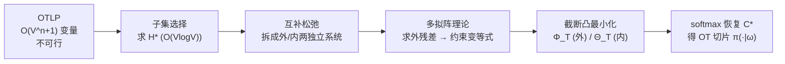

# Global Resolution: Optimal Multi-Draft Speculative Sampling via Convex Optimization

**会议**: ICLR 2026  
**OpenReview**: [https://openreview.net/forum?id=gpsczXOsHn](https://openreview.net/forum?id=gpsczXOsHn)  
**代码**: 待确认  
**领域**: LLM 推理加速 / 投机采样  
**关键词**: 投机采样, 多草稿, 最优传输, 凸优化, 多拟阵, 最大流  

## 一句话总结
本文首次给出在多草稿投机采样中**精确求解最优传输（OT）验证准则**的高效算法：把指数规模的最优传输线性规划（OTLP）一步步化简为一个至多 $V$ 个变量的凸最小化问题，在 i.i.d. 草稿设定下实现 90% 接受率且每 token 开销低于 100 ms。

## 研究背景与动机
**领域现状**：投机采样（speculative sampling）用一个便宜的草稿模型先猜 token、再用验证准则决定接受或重采，从而在不改变目标分布的前提下加速大模型自回归解码。多草稿（multi-draft）扩展每步生成 $n$ 个草稿 token，理论上能进一步提高接受率——当验证准则使「某个草稿 token 被接受」的概率最大化时，它就是**最优传输（Optimal Transport, OT）**。

**现有痛点**：OT 是一个最优传输线性规划（OTLP）的解，但这个 LP 有 $O(V^{n+1})$ 个变量（$V$ 是词表大小），对大词表连写下来都不可行。近期两条理论工作分别把它重构为**重要性采样 / 典范分解**（Khisti et al., 2025）和**子集选择**（Hu et al., 2025）。这些工作能算出最优接受率 $\alpha^*$，**但都不能真正解出 OT 验证准则本身**。唯一已知的精确方法是直接跑 LP 求解器，复杂度指数级；现有近似算法（K-SEQ、MSS、RSD、词表截断）要么只有 $(1-1/e)$ 近似保证，要么完全没有理论保证。

**核心矛盾**：能算「最优接受率是多少」≠ 能算「按什么准则去验证」。从 $H^*$（子集选择的最优集合）到完整的 OT 之间，缺一条高效通路。

**本文目标**：在「$n$ 个草稿 token 从单一草稿模型 i.i.d. 采样」这一实用设定下，给出第一个**可调到任意精度、对大词表也快**的精确 OT 算法。

**核心 idea**（**反向工程 + 多拟阵**）：把子集选择的推导反过来，将 OTLP 还原成一个**最大流问题**；再用多拟阵（polymatroid）理论把指数规模的网络压缩成至多 $V$ 个变量的凸最小化问题，softmax 形式的解可被截断求解。

## 方法详解

### 整体框架
全局解析（Global Resolution）的思路是：先用已有方法在 $O(V\log V)$ 时间求出子集选择最优集合 $H^*$；再用「互补松弛」把松弛 OTLP 拆成相互独立的**外系统**与**内系统**两个最大流问题；最后在 i.i.d. 草稿结构下，用多拟阵理论求出外系统残差，把不等式约束变为等式，从而把每个系统的解参数化为一组 softmax，其参数由极小化一个**截断凸函数**得到——截断越宽，误差界越小，可调到任意精度。

### 关键设计
**1. 从 OTLP 到最大流：把指数 LP 翻译成流网络。** 论文先证明 Khisti 的典范分解（$\beta$-优化）与 Hu 的子集选择推导本质上**等价于同一个松弛 OTLP**（定理 4.1），因此典范分解相对松弛 OTLP 没有额外计算优势——这统一了此前的 SOTA 理论。随后构造一个二部网络 $\Omega$：源点 $s$ 到左顶点 $i\in V$ 容量为 $p(i)$，左顶点到右顶点 $\mathbf{i}\in V^n$（当 $i\in\mathrm{set}(\mathbf{i})$）容量为 $\infty$，右顶点到汇点 $t$ 容量为 $p_{\text{draft}}(\mathbf{i})$。把松弛变量 $S_{i,\mathbf{i}}$ 视为 $\infty$ 边上的流，容量约束恰好对应松弛 OTLP 的不等式，最大流即最优解 $S^*$。这一步用快得多的最大流求解器替换了通用 LP 求解器。

**2. 互补松弛切分：用 $H^*$ 把网络砍小。** 直接的最大流网络仍因右顶点 $V^n$ 太大而昂贵。论文通过**互补松弛**反向撤销对偶化（定理 5.1），证明任意最优 $S^*$ 必须满足一组等式/不等式系统，且这组系统在消去零变量后天然解耦为两块：仅含 $i\notin H^*,\mathbf{i}\notin(H^*)^n$ 的**外系统**，与仅含 $i\in H^*,\mathbf{i}\in(H^*)^n$ 的**内系统**。两者各自是一个被 $H^*$ 限制了顶点集的小最大流问题。更妙的是，恢复 OT 切片 $C^*_{\cdot,\omega}$ 时，当草稿元组 $\omega\in(H^*)^n$ 只需解内系统、否则只需解外系统（式 8），当 $H^*$ 较大时外网络远小于原网络，带来显著加速。

**3. 外残差的多拟阵闭式解：把不等式逼成等式。** 要让系统可被参数化为 softmax，需先求出外残差 $p^{\text{res}}(i)=p(i)-p_i$，使涉及 $p(i)$ 的约束全变等式。残差由「外残差 LP」（定理 6.1）刻画，但它有多达 $2^V$ 条约束。当集函数 $\psi$ 子模时（i.i.d. 草稿可保证），多拟阵理论给出闭式解：$p_{v_i}=p(v_i)+\min_{T\supseteq H_{i+1}}\psi(T)-\min_{T\supseteq H_i}\psi(T)$（定理 6.2）。配合 i.i.d. 下「按 $q(x)/p(x)$ 排序取前缀」的 q-凸性引理（引理 6.3），并按 $q(\cdot)/p(\cdot)$ 递增顺序选元素 + 累积最小值，全部 $\min\psi$ 项可在总计 $O(V\log V)$ 时间算完。

**4. 截断凸求解器：softmax 解 + 可调误差界。** 残差到位后，外系统的全局解可写成 softmax：$S_{i,\mathbf{i}}=\frac{e^{\alpha_i}}{\sum_{j\in\mathrm{set}(\mathbf{i})\setminus H^*}e^{\alpha_j}}\,p_{\text{draft}}(\mathbf{i})$，其参数 $\alpha_i$ 通过极小化凸函数 $\Phi_T$（定理 6.4）得到——它只在截断集 $T$ 上非常数，梯度范数满足 $\|\nabla\Phi_T\|_1\le\epsilon+\epsilon_T$，其中 $\epsilon_T=1-(\sum_{i\in H^*\cup T}q(i))^n$。内系统同理用 $\Theta_T$（定理 6.5），但因未解内残差而带一个 slack 项。增大 $T$ 时 $\epsilon_T,\gamma_T\to 0$，故可逼近真解到任意精度；为控制运行时，可在 $|T|$ 超阈值或迭代上限时提前终止。最终近似保证（引理 6.6）把 $\Phi_T/\Theta_T$ 的可调误差直接翻译成：采样分布与目标分布的 $L_1$ 偏差至多 $15\tau$、接受率偏差至多 $10\tau$。

## 实验关键数据
设定：目标/草稿模型对 Gemma-2 27B/2B 与 Llama-3 70B/8B，$n\le 10$，top-$k$ 草稿采样 $k\in\{10,100,\dots,V\}$；i.i.d. 单步多草稿。

### 主实验：求解时间（Llama-3，ms/token）

| $(k,n)$ | General LP | Max-Flow | Opt. Max-Flow | G.R. ($\tau{=}10^{-3}$) | G.R. ($\tau{=}10^{-4}$) |
|---|---|---|---|---|---|
| (10, 2) | 4.07 | 2.45 | 2.51 | 5.27 (98%) | 7.62 (93%) |
| (10, 4) | 4000+ | 74.21 | 74.37 | **40.30** (97%) | 54.84 (86%) |
| (10, 5) | 400000+ | 10000+ | 10000+ | **70.75** (96%) | 94.79 (85%) |
| (100, 2) | 4000+ | 72.28 | 63.03 | **23.92** (38%) | 25.47 (23%) |
| (1000, 2) | OOM | 400000+ | 400000+ | **34.94** (31%) | 47.46 (15%) |

全局解析在大 $k,n$ 下比其余方法快可达 1 万倍以上，且运行时始终低于 100 ms/token（括号内为提前终止后的成功率）。

### 时间预算下的最佳接受率

| 限时 (ms/tok) | Llama-3 Gen.LP | Llama-3 M.F. | Llama-3 G.R.($10^{-3}$) | Gemma-2 G.R.($10^{-3}$) |
|---|---|---|---|---|
| 10 | 82.53% | 83.94% | **85.65%** | **81.90%** |
| 100 | 83.94% | 89.01% | **90.04%** | **86.60%** |

在 100 ms/token 预算下，G.R. 比通用 LP 高约 1.0%、比最大流高约 1.0% 的接受率，且首次在多草稿上同时达到 >90% 接受率 + <100 ms 开销；通用 OTLP 求解器在同等极限下只能到 84%。

### 关键发现
- top-$k$ 采样把词表截断到 $k$，$k$ 从 10 增到 1000 接受率显著上升（如 0.8→0.95，多约 10% token 免费生成），$k\ge 10000$ 后收益递减——说明 top-$k$ 是降 OTLP 复杂度而几乎不损接受率的有效手段。
- 增大草稿数 $n$ 在较大 $k$ 时稳定提升接受率，验证了「多草稿确实值得」这一直觉。
- i.i.d. 草稿接受率在 $k\ge 100$ 时高于 Hu et al. 的 greedy 构造，大 $k,n$ 下高出近 2%，说明放回式 i.i.d. 采样在最优验证下比 greedy 更优。
- 通用 LP 在 $(1000,2)$ 直接 OOM、$(10,4)$ 起就需数秒级；而 G.R. 始终 <100 ms，体现出复杂度从指数到近线性的本质改善。
- 两个 $\tau$ 档（$10^{-3}$ vs $10^{-4}$）体现「精度—速度」权衡：更小 $\tau$ 误差更低但截断集更大、耗时更高、成功率更低。

### 复杂度对比

| 方法 | 求解器 | 复杂度量级 | 备注 |
|---|---|---|---|
| 通用 LP | LP solver | 指数（OTLP 规模） | 大 $k$ 直接 OOM |
| 最大流 | Max-Flow | 取决于 $|V^n|$ | 比 LP 快但仍受指数网络拖累 |
| 优化最大流 | Opt. Max-Flow | 由 $H^*$ 决定 | 互补松弛切小网络 |
| 全局解析（除步骤3） | 凸最小化 | $O(V\log V)$ | softmax 截断求解，可调精度 |

## 亮点与洞察
- **理论统一**：证明典范分解、子集选择两条 SOTA 路线都等价于同一个松弛 OTLP，澄清了它们「都不能解出 OT」的共同局限。
- **反向工程的巧思**：把「子集选择求最优值」的推导**反过来**，借互补松弛从 $H^*$ 反推出可解的紧凑最大流系统——这是从「知道最优是多少」跨到「知道怎么验证」的关键一跃。
- **多拟阵 + softmax 参数化**：把指数规模 LP 压成 $\le V$ 维凸问题，且解天然是 softmax，误差可被 $\tau$ 一个旋钮控制，理论保证（$15\tau$ / $10\tau$）干净利落。
- **工程落地**：在标准开源模型对上给出首个 90% 接受率 + <100 ms 的多草稿方案，可直接插进 SpecTr 等多步树状框架替换其单步 OTLP 求解器。

## 局限与展望
- **设定受限**：高效性强依赖「i.i.d. 从单一草稿模型采样」带来的子模性与 q-凸结构；对「多个不同草稿模型独立采样」「不放回采样」等非 i.i.d. 设定，文中只在附录给出讨论（内残差因指数数量难求），仍是开放问题。
- **提前终止的代价**：在大 $k$（如 100、1000）时全局解析成功率明显下降（38%、31%），失败时需回退到最大流等较慢方法，意味着收益在高 $k$ 区间被稀释。
- **一般子模 $\psi$ 未解决**：通用子模 $\psi$ 的高效 OT 求解留作未来工作；当前仅覆盖 i.i.d. 情形。
- **未做端到端墙钟加速**：实验主要衡量 OTLP 求解时间与接受率，未给出接入真实多步解码框架后的整体吞吐/延迟收益。

## 相关工作与启发
- **投机采样基础**：Chen et al. (2023)、Leviathan et al. (2023) 的单草稿投机采样；多步设定靠更聪明的草稿（检索、级联、层跳过、多 token 采样头）或新验证协议（树蒙特卡洛、block verification）提升接受率。
- **多草稿理论**：Sun et al. (2023) 首提 OTLP 与 SpecTr 树状框架；Khisti et al. (2025) 的典范分解；Hu et al. (2025) 的子集选择——本文正是站在后两者肩上，补齐「从 $H^*$ 到 OT」的缺失环节。
- **启发**：当一个组合最优化问题「最优值易算、最优解难求」时，**反向工程求值推导 + 利用问题特殊结构（子模/拟阵）做凸化**是一条值得复用的范式；softmax 参数化 + 可调截断给出了「精度—速度」可连续权衡的实用接口。

## 评分
- **新颖性**: ⭐⭐⭐⭐⭐ 首个精确高效求解多草稿 OT 的算法，理论上统一既有路线并用多拟阵/最大流给出全新通路。
- **实验充分度**: ⭐⭐⭐⭐ 覆盖两组主流模型对、多种 $k,n$，求解时间与接受率对比扎实；但缺端到端解码墙钟收益，高 $k$ 成功率偏低。
- **写作质量**: ⭐⭐⭐⭐ 推导层层递进、定理与算法衔接清晰；但理论密度高、大量细节在附录，门槛较高。
- **价值**: ⭐⭐⭐⭐ 直接可插入现有多草稿框架，把 LLM 解码加速从「近似」推进到「可证最优」，对推理系统有实用意义。

<!-- RELATED:START -->

## 相关论文

- [\[ICLR 2026\] NI Sampling: Accelerating Discrete Diffusion Sampling by Token Order Optimization](ni_sampling_accelerating_discrete_diffusion_sampling_by_token_order_optimization.md)
- [\[ICLR 2026\] Cactus: Accelerating Auto-Regressive Decoding with Constrained Acceptance Speculative Sampling](cactus_accelerating_auto-regressive_decoding_with_constrained_acceptance_specula.md)
- [\[ICLR 2026\] Flatter Tokens are More Valuable for Speculative Draft Model Training](flatter_tokens_are_more_valuable_for_speculative_draft_model_training.md)
- [\[ICLR 2026\] RepSpec: Structural Re-parameterized Draft Model Training for Speculative Decoding](repspec_structural_re-parameterized_draft_model_training_for_speculative_decodin.md)
- [\[ACL 2025\] Tetris: Optimal Draft Token Selection for Batch Speculative Decoding](../../ACL2025/llm_efficiency/tetris_optimal_draft_token_selection_for_batch_speculative_decoding.md)

<!-- RELATED:END -->
