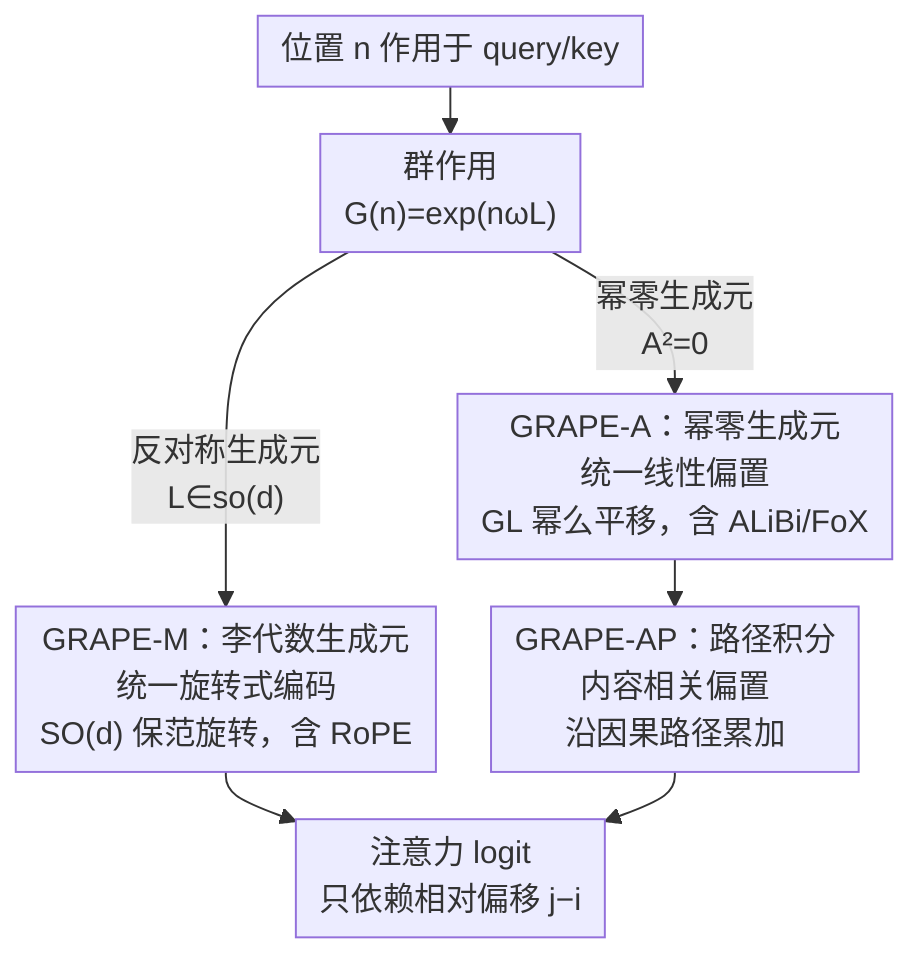

# Group Representational Position Encoding (GRAPE)

**会议**: ICLR 2026  
**arXiv**: [2512.07805](https://arxiv.org/abs/2512.07805)  
**代码**: [github.com/model-architectures/GRAPE](https://github.com/model-architectures/GRAPE)  
**领域**: 信号通信  
**关键词**: 位置编码, 群论, RoPE, ALiBi, Lie群, 旋转编码, 长上下文  

## 一句话总结

提出 GRAPE 框架，基于群作用（group actions）统一了 Transformer 中乘法型（RoPE）和加法型（ALiBi/FoX）两大位置编码家族，证明 RoPE 和 ALiBi 是其精确特例，并提出路径积分加法变体 GRAPE-AP 在下游任务上超越现有方法。

## 研究背景与动机

**位置编码碎片化**：现有方法包括绝对编码（sinusoidal/learned）、相对编码（RoPE）、线性偏置（ALiBi）和遗忘机制（FoX），各自独立设计，缺乏统一理论框架

**RoPE 的局限性**：RoPE 固定坐标平面和对数均匀频谱，无法实现跨子空间的特征耦合（cross-subspace coupling）和上下文相关的相位弯曲

**绝对编码破坏平移等变性**：基于表的相对编码引入窗口依赖的额外开销

**缺乏理论保证**：现有方法分散了稳定性、单调距离惩罚、表达力等关键性质，需要统一框架将这些性质整合

**长上下文建模需求**：长序列模型需要原理性的位置几何设计空间

## 方法详解

### 整体框架

GRAPE 想解决的是位置编码"各搞各的"——RoPE、ALiBi、FoX 这些方法各自独立设计，没有共同的理论底座。它的核心抽象是：把位置编码看成一个作用在 query/key 上的**群作用** $\mathbf{G}(n) = \exp(n\omega\mathbf{L})$，位置 $n$ 通过李群指数映射变成一个变换矩阵，而生成元 $\mathbf{L}$ 决定这个变换"长什么样"。整套设计空间于是收敛到一个旋钮上——**选什么样的生成元**，并由此自然分叉成两大家族。

当 $\mathbf{L}$ 取反对称矩阵时，$\mathbf{G}(n)$ 是 $\mathrm{SO}(d)$ 里的保范旋转，把位置编码成对 query/key 的旋转，对应**乘法型 GRAPE-M**（RoPE 是它的精确特例）；当生成元改取幂零矩阵时，指数映射退化成一阶平移，给注意力 logit 直接加一个随距离变化的偏置项，对应**加法型 GRAPE-A**（ALiBi、FoX 是它的精确特例）。加法这一支还能进一步把"每步固定的偏置"升级成"沿因果路径累加的内容相关偏置"，得到 **GRAPE-AP**。无论走哪一支，最终注意力分数都只依赖相对偏移 $j-i$，保持严格相对律。

### 关键设计

**1. 乘法型 GRAPE-M：用李代数生成元统一所有旋转式编码**

这一支要回答的是"旋转式编码为什么有效、能不能统一参数化"。RoPE 好用的根因是旋转矩阵天然满足相对律——把每个位置编码成一个旋转，注意力分数就只依赖相对偏移而非绝对位置。GRAPE-M 把这件事抽象成：用秩-2 反对称生成元 $\mathbf{L} = \mathbf{ab}^\top - \mathbf{ba}^\top \in \mathfrak{so}(d)$ 通过指数映射造出旋转 $\mathbf{G}(n) = \exp(n\omega\mathbf{L}) \in \mathrm{SO}(d)$。这样构造的变换自动满足精确相对律 $\mathbf{G}(n+m) = \mathbf{G}(n)\mathbf{G}(m)$（注意力只看偏移 $j-i$）和保范性 $\mathbf{G}(n)^\top\mathbf{G}(n) = \mathbf{I}$（不放大也不缩小特征）。算的时候不用显式矩阵化，直接用 Rodrigues 闭式

$$\exp(\mathbf{L}) = \mathbf{I} + \frac{\sin s}{s}\mathbf{L} + \frac{1-\cos s}{s^2}\mathbf{L}^2$$

复杂度只有 $O(d)$，和 RoPE 持平、流式 KV-cache 完全兼容。把 $d/2$ 个秩-2 生成元分别作用在正交的 2D 子空间上，再令子空间取标准坐标对、频率取对数均匀谱，就精确还原出 RoPE；而把子空间基设成可学习、把不同子空间做非交换混合，就比 RoPE 多出"跨子空间耦合"和"上下文相关相位弯曲"的表达力——这正是 RoPE 因固定坐标平面、对数均匀谱而做不到的事。

**2. 加法型 GRAPE-A：用幂零生成元把线性偏置纳入同一框架**

ALiBi 这类方法不旋转特征，而是直接在 logit 上按距离扣分，乍看和旋转编码毫无关系。GRAPE 的做法是通过齐次坐标把维度提升到 $\mathrm{GL}(d+k)$，换用幂零生成元 $\mathbf{A}$（满足 $\mathbf{A}^2=\mathbf{0}$），此时指数映射截断成一阶 $\mathbf{G}_\mathrm{add}(n) = \exp(n\omega\mathbf{A}) = \mathbf{I} + n\omega\mathbf{A}$，效果就是给注意力加一个随位置线性增长的平移项——于是加法偏置也被纳入"群作用 + 选生成元"的同一框架。在 $\mathrm{GL}(d+2)$ 里取秩-1 幂零生成元，logit 恰好变成 $\mathbf{q}_i^\top\mathbf{k}_j + (j-i)\beta_h$，与 ALiBi 逐字一致。把固定斜率换成内容相关的门控斜率，就得到 GRAPE-A-QK 变体

$$\text{logit} = \mathbf{q}_i^\top\mathbf{k}_j + (j-i)\,\omega\,[\text{softplus}(\mathbf{v}^\top\mathbf{q}_i/\sqrt{d}) + \text{softplus}(\mathbf{u}^\top\mathbf{k}_j/\sqrt{d})]$$

让每个 token 自己决定"忘得多快"，其中 softplus 保证有效衰减率非负、维持单调距离惩罚。当斜率退化为逐 token 的标量、令 $\omega_t = \log f_t$（$f_t$ 是遗忘门），累积偏置就还原出 Forgetting Transformer 的遗忘偏置 $D_{ij}$，说明 FoX 也只是 GRAPE-A 的一个路径依赖特例。

**3. 路径积分变体 GRAPE-AP：把单步偏置升级为沿路径累加的内容相关偏置**

前面的加法偏置每一步是固定的，惩罚力度和中间 token 的内容无关。GRAPE-AP 让每一步的**边势函数**依赖当前内容：

$$\psi_h(t,\ell) = \alpha_h \cdot g\!\left(\frac{1}{d}\langle\mathbf{p}_{t,h},\, \mathbf{R}_\ell\mathbf{p}_{\ell,h}\rangle\right) \leq 0$$

其中链接函数 $g$ 单调且 1-Lipschitz（实验取 $g(z)=\log\mathrm{Sigmoid}(z)$），保证边势恒非正；再沿因果路径把这些边势累加成总偏置 $b_h(t,j) = \sum_{\ell=j+1}^{t}\psi_h(t,\ell)$。因为势函数恒非正、且按"逐步累加"的方式计算，它既保持了单调距离惩罚（越远扣得越多），又能根据中间 token 的内容动态调节惩罚力度——这是固定斜率的 GRAPE-A 做不到的（GRAPE-A 正是边势不依赖端点时的退化特例）。它还天然满足因果约束、可增量更新，支持流式推理与 KV-cache，并且可以叠加在乘法型 GRAPE-M 之上联合使用，是论文实验里下游收益的主要来源。

## 实验

### 实验设置

- 基于 nanoGPT / Llama 架构，仅替换位置编码
- 数据集：FineWeb-Edu 100B（取 50B token 训练）
- 模型规模：Medium (350M, 24层8头) / Large (770M, 36层10头)
- 上下文长度 4096，batch size 480
- Baseline：RoPE, ALiBi, FoX

### 主实验 (Medium 350M, 0-shot, 7任务平均)

| 方法 | ARC-E | ARC-C | HellaSwag | PIQA | SciQ | **Avg.** |
|------|-------|-------|-----------|------|------|----------|
| RoPE | 56.36 | 30.38 | 44.65 | 68.77 | 74.40 | 51.73 |
| ALiBi | 58.21 | 29.78 | 45.38 | 70.08 | 78.50 | 52.87 |
| FoX | 58.38 | 30.89 | 45.80 | 69.37 | 78.40 | 52.96 |
| GRAPE-A-QK | 57.95 | **32.00** | 45.77 | 69.37 | 79.00 | 53.00 |
| **GRAPE-AP** | **59.26** | 31.31 | 45.42 | 68.17 | **79.70** | **53.25** |
| GRAPE-AP+KV-shift | 57.32 | 30.55 | **46.18** | 69.10 | 79.60 | **53.46** |

### 主实验 (Large 770M, 0-shot, 7任务平均)

| 方法 | ARC-E | ARC-C | HellaSwag | PIQA | SciQ | **Avg.** |
|------|-------|-------|-----------|------|------|----------|
| RoPE | 62.63 | 32.76 | 51.01 | 71.33 | 80.50 | 55.76 |
| ALiBi | 62.67 | 34.39 | 51.33 | 71.11 | 82.70 | 56.44 |
| FoX | 61.07 | 33.11 | 51.85 | 71.27 | 83.70 | 56.30 |
| **GRAPE-AP** | **63.89** | 34.22 | 51.52 | **71.98** | **84.40** | **56.91** |
| FoX+KV-shift | 63.55 | 33.96 | **52.72** | 71.71 | 83.20 | 57.09 |
| GRAPE-AP+KV-shift | 63.72 | 33.11 | 52.29 | 71.65 | 83.50 | 56.86 |

### 关键发现

1. **GRAPE-AP 在无 KV-shift 条件下全面最优**：350M Avg. 53.25 > FoX 52.96 > RoPE 51.73；770M Avg. 56.91 > ALiBi 56.44
2. **训练稳定性优势**：RoPE 在 770M 训练中出现不稳定（loss spike），GRAPE 保持稳定改善
3. **乘法型 GRAPE-M 与 RoPE 持平**：验证了理论等价性，GRAPE-M 本身未显著超越 RoPE
4. **加法型是核心增益来源**：GRAPE-A 和 GRAPE-AP 系列一致优于纯乘法方法
5. **KV-shift 与 GRAPE-AP 互补**：加入 KV-shift 后 350M 进一步提升至 53.46

## 亮点

- **优雅的理论统一**：用 Lie 群框架将看似不相关的 RoPE、ALiBi、FoX 统一为同一数学对象的特例，给出严格证明
- **实用性强**：Rodrigues 闭式公式使得计算复杂度与 RoPE 一致（$O(d)$），流式推理/KV-cache 完全兼容
- **设计空间可扩展**：框架自然给出可学习正交基、内容门控斜率、路径积分偏置等扩展方向
- **数学表述严谨**：群论视角为位置编码提供了清晰的几何直觉（旋转平面、幂么平移）

## 局限性

- **实验规模有限**：仅在 350M/770M 模型上验证，缺少 >1B 大模型实验；训练仅 50B token
- **GRAPE-M 未显著超越 RoPE**：乘法型的理论优势（可学子空间、非交换混合）在实验中未体现明显增益
- **长上下文评估缺失**：训练仅用 4096 上下文，未测试长上下文外推能力（这恰是 ALiBi/RoPE 的关键差异场景）
- **路径积分 GRAPE-AP 计算开销未充分分析**：边势函数需要逐步计算内积，实际推理延迟未报告
- **下游任务覆盖有限**：仅做 0-shot LM evaluation，缺少生成质量、微调后的评估

## 相关工作

- **RoPE** (Su et al., 2021): GRAPE-M 的精确特例（标准坐标对 + 对数均匀谱）
- **ALiBi** (Press et al., 2021): GRAPE-A 在 $\mathrm{GL}(d+2)$ 中的精确特例
- **Forgetting Transformer (FoX)** (Lin et al., 2025): 证明为 GRAPE-A 的路径依赖形式
- **PaTH Attention** (Yang et al., 2025): 论文分析其为收缩性的、近奇异的，可能损害长上下文建模
- **NoPE / 无位置编码**: 未在框架中讨论

## 评分

- 新颖性: ⭐⭐⭐⭐⭐ — 群论统一视角非常优雅，RoPE/ALiBi/FoX 的精确恢复证明是亮点
- 实验充分度: ⭐⭐⭐ — 模型规模偏小，缺少长上下文和大模型验证
- 写作质量: ⭐⭐⭐⭐ — 数学推导清晰严谨，但符号较多，门槛偏高
- 综合价值: ⭐⭐⭐⭐ — 理论贡献显著，为位置编码设计提供了统一原则性框架

<!-- RELATED:START -->

## 相关论文

- [\[ACL 2025\] LaMPE: Length-aware Multi-grained Positional Encoding for Adaptive Long-context Scaling Without Training](../../ACL2025/llm_efficiency/adaptive_grouped_pe_context_window.md)
- [\[ICLR 2026\] Extending the Context of Pretrained LLMs by Dropping Their Positional Embedding](extending_the_context_of_pretrained_llms_by_dropping_their_positional_embedding.md)
- [\[ICLR 2026\] Understanding and Improving Length Generalization in Hierarchical Sparse Attention Models](understanding_and_improving_length_generalization_in_hierarchical_sparse_attenti.md)
- [\[ICML 2026\] RePo: Language Models with Context Re-Positioning](../../ICML2026/llm_efficiency/repo_language_models_with_context_re-positioning.md)
- [\[ICLR 2026\] Test-Time Training Done Right](test-time_training_done_right.md)

<!-- RELATED:END -->
