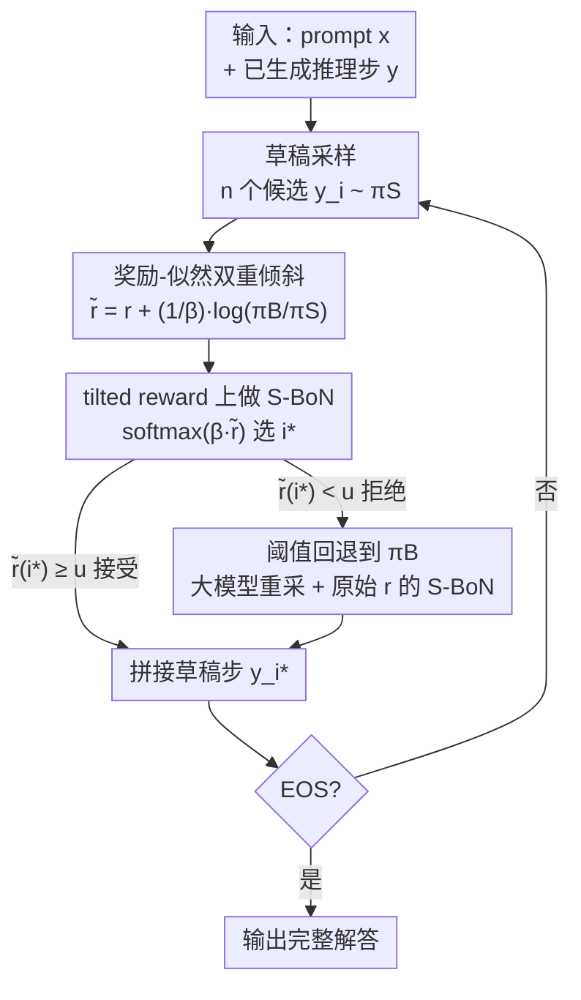

# Guided Speculative Inference for Efficient Test-Time Alignment of LLMs

**会议**: ICLR 2026  
**OpenReview**: [https://openreview.net/forum?id=miNzDqDENd](https://openreview.net/forum?id=miNzDqDENd)  
**代码**: https://github.com/j-geuter/GSI  
**领域**: LLM效率 / 测试时对齐 / 投机解码  
**关键词**: 投机解码, 奖励引导解码, soft best-of-n, 测试时扩展, 分布保证

## 一句话总结
GSI 用一个小草稿模型先采样推理步、再用「奖励 + 对数似然比」修正后的 tilted reward 做 soft best-of-n，并在分数过低时回退到大模型重采，在数学推理基准上既逼近甚至超过大模型 best-of-n 的精度，又把端到端延迟最多降低 28%，且是首个对最优 tilted 策略有分布保证的投机式测试时扩展方法。

## 研究背景与动机
**领域现状**：训练时扩展（堆参数、堆数据）边际收益递减，于是「测试时扩展」成为提升 LLM 能力的新主线。其中 best-of-n、soft best-of-n 这类并行采样方法很有效——采 $n$ 个候选、按奖励模型 $r(x,y)$ 选最好的那个，本质是在向一个「奖励倾斜（reward-tilted）」的最优策略 $\pi_{\beta,B}(y\mid x)\propto \pi_B(y\mid x)\exp(\beta r(x,y))$ 靠拢。

**现有痛点**：要让 soft best-of-n 真正逼近这个 tilted 分布，需要从大模型 $\pi_B$ 自回归生成 $n$ 个完整候选，$n$ 一大就贵到不可接受。投机解码（speculative decoding）虽然能用小草稿模型 $\pi_S$ 加速，但它保证的是从 $\pi_B$ **原始**分布采样，并不带奖励对齐；而最近的奖励引导投机解码 RSD（Liao et al., 2025）虽把对齐和投机拼在一起，却只对「期望奖励」有保证——最坏情况下相比小模型 $\pi_S$ 没有任何提升，对最终策略本身也不给任何分布保证。

**核心矛盾**：「对齐到奖励模型的最优 tilted 策略」与「用草稿模型省算力」之间缺一个桥梁——tilted 分布是定义在 $\pi_B$ 上的，而草稿样本来自 $\pi_S$，二者分布不一致，直接拿 $\pi_S$ 的样本做奖励加权并不收敛到 $\pi_{\beta,B}$。

**本文目标**：设计一个测试时算法，既能用小草稿模型 $\pi_S$ 加速，又能可证明地逼近最优 tilted 策略 $\pi_{\beta,B}$（而不只是期望奖励）。

**切入角度**：作者注意到 tilted 分布可以恒等地改写成「以 $\pi_S$ 为基、用一个修正后的奖励去倾斜」的形式——只要把奖励加上一项 $\frac{1}{\beta}\log\frac{\pi_B}{\pi_S}$，就能把对 $\pi_B$ 的依赖折叠进奖励里，从而合法地在 $\pi_S$ 的样本上做 soft best-of-n。

**核心 idea**：用「奖励 + 对数似然比」构成的 **tilted reward** 在草稿样本上做 soft best-of-n，把对齐到 $\pi_B$ 的目标转化为对 $\pi_S$ 样本的加权，再辅以阈值回退，得到既快又有分布保证的 reward-guided 投机推理。

## 方法详解

### 整体框架
GSI 把推理任务拆成一步步的「推理步」（以 `\n\n` 双换行为界），在**每一步**内部跑一轮草稿—验证—回退的循环，逐步拼出完整解答，直到生成 EOS。一步之内的流程是：先让草稿模型 $\pi_S$ 并行采 $n$ 个候选推理步；对每个候选算出 tilted reward $\tilde r$（把原始奖励 $r$ 加上 $\frac{1}{\beta}\log\frac{\pi_B}{\pi_S}$ 这个似然比修正项）；按 $\mathrm{softmax}(\beta\tilde r)$ 软选出一个候选 $y^S_{i^*}$；如果它的 tilted reward 超过阈值 $u$ 就**接受**、把这一步拼进答案；否则**拒绝**，转而从大模型 $\pi_B$ 重新采 $n$ 个候选、用原始奖励 $r$ 做 soft best-of-n 选一个拼进去。关键在于：$\log\pi_B(y^S_i\mid x)$ 只需对草稿样本跑**一次** $\pi_B$ 前向（并行打分），而非自回归生成，这正是延迟收益的来源。

### 关键设计

**1. 奖励-似然双重倾斜：把「对齐 $\pi_B$」折叠进草稿样本的奖励里**

这是全文的数学支点，针对的就是「tilted 分布定义在 $\pi_B$ 上、草稿样本却来自 $\pi_S$」这个根本矛盾。作者把最优 tilted 策略恒等改写为以 $\pi_S$ 为基的形式：

$$\pi_{\beta,B}(y\mid x)=\frac{\pi_S(y\mid x)\exp\!\big(\beta\,\tilde r(x,y)\big)}{Z_{\beta,B}(x)},\qquad \tilde r(x,y)=r(x,y)+\frac{1}{\beta}\log\frac{\pi_B(y\mid x)}{\pi_S(y\mid x)}.$$

于是只要把奖励从 $r$ 换成 tilted reward $\tilde r$，就能在 $\pi_S$ 采的 $n$ 个候选上做 soft best-of-n（按 $\exp(\beta\tilde r_i)$ 加权采样），近似从 $\pi_{\beta,B}$ 采样。直觉上，$\frac{1}{\beta}\log\frac{\pi_B}{\pi_S}$ 这一项在「补偿」草稿模型与目标模型的分布差异——草稿模型偏爱、但目标模型不看好的候选会被这一项压低分数，反之则被抬高，从而让加权后的样本看起来像是从 $\pi_B$ 倾斜出来的。和 RSD 只用原始奖励做阈值判断相比，这个似然比修正项才是 GSI 能对**策略本身**给出保证的原因。

**2. 分布保证：首个对最优 tilted 策略有 KL 上界的投机方法**

针对 RSD「只保证期望奖励、最坏情况不优于 $\pi_S$」的缺陷，作者证明了对 GSI 诱导分布 $\tilde\pi_{\mathrm{GSI}}$ 的 KL 保证（Theorem 1）。在一个温和的**覆盖假设**下——$C_\infty(x):=\sup_{y:\pi_B(y\mid x)>0}\frac{\pi_B(y\mid x)}{\pi_S(y\mid x)}<\infty$，即草稿模型要能覆盖目标模型的支撑集（正温度采样下任何响应概率非零，故有限长响应时该上确界有限）——只要候选数

$$n\ \ge\ \big(\chi^2(\pi_B\,\|\,\pi_S)+1\big)\cdot\frac{e^{2\beta\|r\|_\infty}-1}{e^\epsilon-1},$$

就有 $\mathrm{KL}\big(\pi_{\beta,B}\,\|\,\tilde\pi_{\mathrm{GSI}}\big)\le\epsilon$。这说明随 $n$ 增大，GSI 的采样分布**可证明**收敛到最优 tilted 策略，而非仅仅在期望奖励上不退化。和并行工作 SPECS（Cemri et al., 2025）相比，SPECS 的 KL 界要求推理步长趋于无穷、且 $n$ 和阈值 $u$ 是随机变量这些实践中站不住的近似，GSI 的界不需要任何此类假设。

**3. 阈值回退：用拒绝采样兜底草稿覆盖不足**

双重倾斜在理论上够用，但实践中草稿模型对某些步的覆盖很差，光靠加权选出来的草稿步质量仍可能不行。GSI 因此加了一个类拒绝采样的阈值 $u$：选出的草稿步 $\tilde r_{i^*}<u$ 时直接拒绝，转而从大模型 $\pi_B$ 重采 $n$ 个候选、用**原始**奖励 $r$ 做 soft best-of-n（此时退化为 $\pi^n_{\beta,B}$）。这一步不影响 Theorem 1 的分布保证（保证针对接受路径），但经验上明显提分——消融显示带回退的 GSI 一致优于不带回退的版本，且随 $n$ 增大二者差距缩小，印证了「$n$ 越大草稿覆盖越好、越不需要回退」的解释。整体策略 $\pi_{\mathrm{GSI}}$ 即「接受时等于 $\tilde\pi_{\mathrm{GSI}}$，拒绝时等于 $\pi^n_{\beta,B}$」的混合。

### 一个例子：MATH500 上的接受与拒绝
以论文 Figure 3 的题目「数列 0,1,1,3,6,9,27,… 中第一个大于 125 的项」为例走一遍：第 1 步草稿模型给出建表思路，tilted reward $0.719$ 高于阈值，**接受**；第 2 步草稿模型把递推算错（误把第五项当 $a_5=9$、最终得 $a_9=497$），PRM 给的 tilted reward 只有 $0.067$，低于 $u=0.5$ 被**拒绝**，于是从大模型 $\pi_B$ 重采——大模型给出正确递推（$a_{10}=129$），奖励 $0.979$；第 3 步在正确前缀上收尾得到答案 $129$。这个例子直观展示了 GSI 的工作方式：能用草稿就用草稿（省时间），草稿翻车时由大模型纠偏（保质量）。论文也诚实给了反例：有时草稿步其实正确，只因措辞和大模型差别大被误拒，造成一些不必要的回退。

## 实验关键数据

### 主实验
在 Qwen2.5-Math（草稿 1.5B / 目标 7B）和 Qwen3（草稿 1.7B / 目标 14B，关闭思考模式）两个模型族、PRM 用 Qwen2.5-Math-PRM-7B、超参 $\beta=20,\ u=0.5,\ \text{temp}=0.7$ 的设置下，在 MATH500、OlympiadBench、Minerva Math、MMLU-STEM、GSM8K 五个推理基准上评测（每集 500 样本、3 个随机种子、报 95% 置信区间）。

| 对比对象 | 精度（趋势） | 说明 |
|--------|------|------|
| GSI vs RSD | 显著更高 | RSD 几乎全盘接受草稿样本，性能接近小模型 S-BoN |
| GSI vs S-BoN(小模型) | 显著更高 | tilted reward + 回退带来质量提升 |
| GSI vs S-BoN(大模型) | 逼近、部分超过 | 某些数据集上 GSI 精度接近甚至超过 $\pi^n_{\beta,B}$，经验印证 Theorem 1 |
| GSI vs SPECS | MATH500 大幅领先 | MATH500：$n=4$ 时 +11.5%、$n=16$ 时 +2.9%；OlympiadBench 上 SPECS 略优（+1.6%/+3.2%） |

### 延迟与吞吐（Table 1）
| 模型族 | $n$ | 方法 | s/步↓ | 接受率% | 步/秒↑ |
|------|----|------|------|------|------|
| Qwen2.5-Math (H100) | 16 | GSI | 0.72 | 82.0 | 1.39 |
| | 16 | S-BoN(base) | 0.94 | – | 1.06 |
| Qwen3 (A100) | 16 | GSI | 1.21 | 91.5 | 0.83 |
| | 16 | S-BoN(base) | 1.82 | – | 0.55 |

GSI 比大模型 S-BoN 明显更快：Qwen3 在 $n=16$ 时吞吐（步/秒）提升约 51%、仅 3% 相对性能损失，端到端延迟最多降低 28%。GSI 比 RSD 慢一点，因为 GSI 接受率更低（更常回退到大模型），但这正是它质量高于 RSD 的代价。

### 关键发现
- **回退步是提分主力，但随 $n$ 衰减**：带回退的 GSI 一致优于不带回退版；$n$ 越大草稿覆盖越好，差距缩小——不带回退的 GSI 反而是唯一在 $n=256$ 仍未饱和、最受益于增大 $n$ 的方法。
- **接受率与速度/质量的 trade-off**：RSD 接受率高达 95%+ 所以快但质量近似小模型；GSI 接受率 76%–92%，慢一些但稳定超过大模型 S-BoN 的速度同时逼近其精度。
- **PRM 是延迟瓶颈**：作者指出 PRM 占了相当一部分端到端时间，换更小的 PRM 能让 GSI 的延迟优势更明显。

## 亮点与洞察
- **恒等改写把跨分布对齐变成同分布加权**：用 $\frac{1}{\beta}\log\frac{\pi_B}{\pi_S}$ 修正奖励，就把「在 $\pi_B$ 上对齐」合法地搬到 $\pi_S$ 的样本上——一个干净的数学技巧，让投机 + 对齐第一次能同时拿到分布保证。
- **$\log\pi_B$ 并行打分而非自回归生成**：草稿样本在 $\pi_B$ 上只跑一次前向就能拿到对数似然，避开了昂贵的自回归，是延迟收益的工程根基；且草稿、目标都全并行，绕开了投机解码在大 batch 下吞吐崩塌的老问题。
- **可迁移思路**：这套「tilted reward = 原奖励 + 似然比修正」可推广到任何「想用便宜分布的样本近似昂贵 tilted 目标」的场景（如蒸馏、重要性采样式的对齐）。

## 局限与展望
- **依赖覆盖假设**：草稿模型若覆盖不到目标模型支撑集的某些高奖励区域，$C_\infty$ 和所需 $n$ 会爆炸，保证失效；作者承认这在实践中靠正温度采样勉强成立。
- **草稿与目标 $n$ 相同**：算法允许草稿、目标用不同 $n$，但论文未探索，留作未来工作。
- **误拒正确步**：PRM 对措辞敏感时会把正确草稿步当成不好而拒绝，带来不必要的回退、拉低速度。
- **PRM 开销大**：当前实现里 PRM 吃掉不少端到端时间，且 PRM 验证与 $\pi_B$ 对数似然计算未并行化，延迟仍有压缩空间。

## 相关工作与启发
- **vs RSD（Liao et al., 2025）**：RSD 也用 $\pi_S$ 采样 + 奖励阈值决定是否回退，但只对期望奖励有保证、最坏情况不优于 $\pi_S$，且几乎全盘接受导致性能近似小模型；GSI 用 tilted reward 直接对**策略分布**给 KL 保证，质量显著更高。
- **vs SPECS（Cemri et al., 2025，并行工作）**：同样推导了对目标分布的 KL 界，但要求步长趋无穷、$n$ 与阈值是随机变量等不切实际的近似；GSI 的界无需这些假设，且 MATH500 上大幅领先。
- **vs 标准投机解码（Leviathan et al., 2023）**：标准 SD 保证从 $\pi_B$ 原始分布采样、不带对齐；GSI 把目标换成奖励倾斜的 $\pi_{\beta,B}$，是「对齐版」的投机推理。

## 评分
- 新颖性: ⭐⭐⭐⭐⭐ 首个对最优 tilted 策略有分布保证的投机式测试时对齐，数学改写干净
- 实验充分度: ⭐⭐⭐⭐ 两模型族五基准 + 延迟/消融齐全，但未对比 SPECS 实测、未跨 $n$ 解耦
- 写作质量: ⭐⭐⭐⭐⭐ 动机—理论—算法—实验链条清晰，反例诚实
- 价值: ⭐⭐⭐⭐ 给「又快又对齐」的测试时扩展提供了有理论支撑的实用方案

<!-- RELATED:START -->

## 相关论文

- [\[ICLR 2026\] Scaling Up, Speeding Up: A Benchmark of Speculative Decoding for Efficient LLM Test-Time Scaling](scaling_up_speeding_up_a_benchmark_of_speculative_decoding_for_efficient_llm_tes.md)
- [\[ICLR 2026\] In-Place Test-Time Training](in-place_test-time_training.md)
- [\[ICLR 2026\] Test-Time Training Done Right](test-time_training_done_right.md)
- [\[ICLR 2026\] Let's (not) just put things in Context: Test-time Training for Long-context LLMs](lets_not_just_put_things_in_context_test-time_training_for_long-context_llms.md)
- [\[ICLR 2026\] FlashDLM: Accelerating Diffusion Language Model Inference via Efficient KV Caching and Guided Diffusion](flashdlm_accelerating_diffusion_language_model_inference_via_efficient_kv_cachin.md)

<!-- RELATED:END -->
