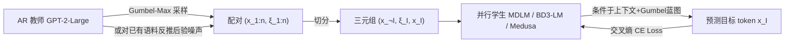

# Gumbel Distillation for Parallel Text Generation

**会议**: ICLR 2026  
**OpenReview**: [https://openreview.net/forum?id=aEuqVZVCdr](https://openreview.net/forum?id=aEuqVZVCdr)  
**代码**: 待确认  
**领域**: LLM 推理加速 / 并行解码 / 知识蒸馏  
**关键词**: 并行解码, 掩码扩散语言模型, 多 token 预测, Gumbel-Max, 知识蒸馏  

## 一句话总结
用 Gumbel-Max 把自回归教师的"采样随机性"外化成一段确定性的 Gumbel 噪声"蓝图"，让并行学生模型只需学一个有监督的"噪声→文本"映射，从而把难以建模的联合分布问题降维成简单回归，显著缩小并行解码与自回归之间的质量差距。

## 研究背景与动机
**领域现状**：自回归（AR）语言模型靠链式法则 $p^*(x_{1:n})=\prod_i p^*(x_i\mid x_{<i})$ 精确捕捉 token 间依赖，质量高但逐 token 串行推理慢。为提速，社区转向并行解码——掩码扩散语言模型（MDLM、BD3-LM）和多 token 预测（MTP，如 Medusa）一步生成多个 token。

**现有痛点**：并行解码为了同时预测一组 token $x_I$，被迫采用条件独立假设 $p_\theta(x_I\mid x_{\neg I})=\prod_{i\in I}p_\theta(x_i\mid x_{\neg I})$，丢掉了块内 token 之间的依赖。最典型的例子是预测"San Francisco"时，"Francisco"高度依赖同块出现的"San"；这种简化会导致重复、不连贯、语法错误，质量明显落后于 AR。

**核心矛盾**：直接让学生网络去建模真正的联合分布 $p_\theta(x_I\mid x_{\neg I})$ 在计算上几乎不可行——输出空间大小是 $V^{|I|}$，随并行 token 数 $|I|$ 指数爆炸。所以并行模型要么牺牲质量，要么放弃并行性。

**本文目标**：在不损失并行解码速度的前提下，提升并行解码器对联合分布的建模能力，把"学复杂分布"这个学习问题变简单。

**核心 idea**：**把教师的随机采样重写成确定性函数**。Gumbel-Max trick 告诉我们——从 softmax 分布采样等价于"给 logits 加一段 Gumbel 噪声再取 argmax"。于是对于教师生成的任何序列 $x_{1:n}$，都存在一段对应的 Gumbel 噪声 $\xi_{1:n}$ 能确定性地复现它。把这段噪声当作"蓝图"喂给学生作为条件输入，学生的任务就从"学联合分布"退化成"学一个确定性映射 $p_\theta(x_I\mid x_{\neg I}, \xi_I)$"，即一个有监督学习问题。

## 方法详解

### 整体框架
Gumbel Distillation 是一个两阶段、模型无关的即插即用蒸馏框架。**阶段一（数据生成）**：用 AR 教师产生 (token 序列, Gumbel 噪声序列) 配对 $(x_{1:n}, \xi_{1:n})$，再按学生架构切成训练三元组 $(x_{\neg I}, \xi_I, x_I)$；**阶段二（学生训练）**：并行学生在上下文 $x_{\neg I}$ 和目标位置噪声 $\xi_I$ 双重条件下预测目标 token $x_I$。整个过程不改学生主结构，只是给输入"加一路条件"。

### 关键设计

**1. Gumbel-Max 反演：把采样随机性外化成确定性蓝图。** 这是全文的地基。Gumbel-Max trick 指出，从 logits $l$ 定义的 softmax 分布采样 token，等价于先采一组 i.i.d. 标准 Gumbel 噪声 $\xi_k\sim G(0,1)$，再取 $Y=\arg\max_k(l_k+\xi_k)$，且 $Y$ 与原分布完全同分布。关键洞察在于：一旦 logits 和噪声给定，argmax 是完全确定的——随机性被完全转移到了噪声向量 $\xi$ 上。因此训练目标从难以处理的分布匹配，变成最大化条件对数似然 $\mathcal{L}=-\mathbb{E}_{(x_{\neg I},\xi_I,x_I)}\big[\log p_\theta(x_I\mid x_{\neg I},\xi_I)\big]$。学生不再"凭空"猜联合分布，而是被噪声蓝图直接"剧透"了教师当时是怎么一步步采出这串文本的。

**2. 并行 Gumbel 后验提取：单次前向反推整条序列的噪声。** 直接的串行提取（一边 ancestral sampling 一边记录噪声）需要 $n$ 次教师前向，太慢；更糟的是它会把教师自身的重复/低质偏差也学进来。本文给出一个更优的替代：假设已有高质量语料 $x_{1:n}$ 就是从教师分布采出的，只需教师做**一次前向**拿到全部 logits $l_{1:n}$，然后从后验 $P(\xi_{1:n}\mid x_{1:n}, l_{1:n})$ 中采样能复现该文本的噪声。Theorem 4.1 给出闭式后验采样：对每个位置并行计算 $p_i=\text{Softmax}(l_i)$，采辅助噪声 $\zeta_0,\zeta\sim G(0,1)$，令 $\xi_i\leftarrow-\log\big(\exp(-\zeta)+p_i\exp(-\zeta_0)\big)$，再把真值 token 那一维覆盖为 $\xi_i^{x_i}\leftarrow\zeta_0-\log p_i^{x_i}$。这样既保证 $\arg\max_k(l_k+\xi_k)=x_i$ 的约束成立，又把数据生成从 $O(n)$ 次前向压成 $1$ 次，且因为锚定在高质量真实语料上，反而比串行采样质量更高。

**3. Gumbel 信号注入：softmax 归一化 + 学习投影替换 [MASK]。** 噪声怎么喂进学生是个关键工程选择。对掩码扩散模型，作者把被遮位置的 Gumbel 噪声 $\xi_I$ 先做 softmax 归一化（把 Gumbel 的长尾压到 $(0,1)$，同时保留编码教师采样选择的相对秩序），再过一个可学习线性投影映到词表嵌入空间，用这个"富信息蓝图嵌入"**替换原本无信息的 [MASK] token 嵌入**。对 MTP（Medusa），则把噪声处理成条件向量分发给每个预测头，直接给出联合分布的指引，帮各头打破条件独立假设、提出更连贯的候选块。这一设计让框架真正做到 plug-and-play——MDLM、BD3-LM、Medusa 都只需最小改动即可接入。

**4. 为什么必须是 Gumbel 噪声。** 蓝图的有效性来自 Gumbel-Max 建立的"噪声↔token 概率"确定性链接，换别的噪声会破坏这个语义：消融显示 Gaussian 噪声（把 Gumbel 变换成高斯再喂）显著掉点、甚至差于朴素 baseline；Uniform 噪声（inverse transform 采样里 Gumbel 的前身 $\xi=-\log(-\log u)$）会引发训练不稳定与模式崩塌。只有 Gumbel 分布能构成学生可学的结构化蓝图。

## 实验关键数据

### 主实验表格
无条件文本生成，教师为 GPT-2-Large，学生在 LM1B（长度 128）和 OpenWebText（长度 1024）训练 1M 步。AR（同参数量）仅作质量参考。

| 模型 | LM1B MAUVE ↑ | LM1B GenPPL ↓ | OWT MAUVE ↑ | OWT GenPPL ↓ |
|------|------|------|------|------|
| AR (student-size) | 0.465 | 36.42 | 0.691 | 14.10 |
| MDLM | 0.179 | 78.74 | 0.217 | 38.34 |
| **MDLM + Gumbel Distillation** | **0.264** | **67.64** | **0.282** | **34.33** |
| BD3-LM (L'=4) | 0.193 | 56.98 | 0.251 | 26.40 |
| **BD3-LM (L'=4) + Gumbel Distillation** | **0.291** | **46.06** | **0.304** | **24.37** |

在 OpenWebText 上对 MDLM 把 MAUVE 提升 30.0%、GenPPL 降低 10.5%；BD3-LM 同样全面改善。

LLM 评判（Gemini-2.5-pro，1-10 分）：MDLM+Gumbel 在 Clarity +17.2%、Factuality +22.6%、Grammaticality +15.8% 等维度全面提升，事实性与清晰度增益最显著。

MTP（Medusa）每头条件接受率随头序增大增益越大：GPT-2-Small 上 Head 1→3 为 +4.5%→+22.0%；扩到 Vicuna-7B 上 Head 1→3 为 +8.9%→+37.6%，平均接受长度从 1.745 升到 1.891（+8.4%），说明它确实帮远端头学到更强的序列依赖。

### 消融实验表格
MDLM on LM1B，对比经典蒸馏与噪声选择。

| 方法 | MAUVE ↑ | GenPPL ↓ |
|------|------|------|
| MDLM | 0.179 | 78.74 |
| + Token-level KD | 0.166 | 95.88 |
| + Sequence-level KD | 0.169 | 99.48 |
| + APD（推理期） | 0.203 | 57.61 |
| + Gumbel Distillation | 0.264 | 67.64 |
| + Gumbel Distillation + APD | 0.255 | **49.28** |

| 噪声/提取方式 | MAUVE ↑ | GenPPL ↓ |
|------|------|------|
| 并行提取 + Gumbel | **0.264** | **67.64** |
| 串行提取 + Gumbel | 0.189 | 86.38 |
| 并行提取 + Gaussian | 0.242 | 81.43 |
| 并行提取 + Uniform | 0.097 | 模式崩塌 |

### 关键发现
- **经典蒸馏反而掉点**：token-level KD 只对齐每位置边际、与掩码扩散目标冲突；sequence-level KD 用教师生成文本替换训练分布，导致多样性下降、模式崩塌。Gumbel Distillation 因为蒸馏的是教师"内部采样过程"而非"输出结果"，效果远超二者。
- **并行提取优于串行**：反直觉地，并行后验提取（GenPPL 67.64）好过串行采样（86.38），因为串行会复制教师自身的重复/低质偏差，而并行提取锚定在高质量真实语料上。
- **与 APD 正交可叠加**：Gumbel-distilled MDLM 上再叠加推理期的 APD 得到最佳 GenPPL 49.28。
- **零样本推理迁移**：在 8 个常识/QA 基准上，MDLM 平均准确率 34.3%→36.1%，BD3-LM 38.6%→39.4%，说明学生不仅学到流畅度还继承了教师的知识与常识推理能力。
- **toy 迷宫任务**：Gumbel-conditioned MDLM 在 NFE=3 步下成功率从 64% 升到 94%，逼近 AR 教师 NFE=10 步的 100%。

## 亮点与洞察
- **把"分布匹配"问题重写成"有监督回归"**是真正优雅的一招：Gumbel-Max 提供的确定性映射让指数级的联合分布学习问题降维成单点监督目标，这是方法能 work 的根本原因。
- **蒸馏对象的转移**——从蒸"教师的输出"到蒸"教师的内部采样决策（噪声蓝图）"——是与所有经典 AR→NAR 蒸馏的本质区别，也解释了为何经典 KD 在这里失效。
- **模型无关 + 即插即用**：同一框架无改动地横跨掩码扩散（MDLM/BD3-LM）和多 token 预测（Medusa）两大并行解码范式，泛化性强。
- 闭式后验采样定理把数据生成从 $O(n)$ 次前向降到 1 次，让方法在工程上真正可扩展。

## 局限与展望
- **噪声维度随词表线性增长**：Gumbel 噪声向量维度正比于词表大小 $V$，投影成本 $O(VH)$，大词表场景下开销与高维挑战上升（但作者指出该开销不随模型深度增长，主干越大相对占比越小）。未来可用结构化/低秩噪声表示缓解。
- **推理时仍需噪声来源**：生成时学生依赖 Gumbel 蓝图，如何在纯推理（无教师）场景下高效提供高质量噪声条件，文中以训练阶段为主，部署细节着墨较少。
- **规模有限**：教师止步 GPT-2-Large / Vicuna-7B，是否能扩到更大基础模型、把潜在 Gumbel 空间用于可控生成，是作者明确提出的未来方向。

## 相关工作与启发
- **AR→NAR 蒸馏**：始于 Gu et al. (2017) 的 sequence-level KD（机器翻译并行学生），后续 Gu et al. (2023)、Kou et al. (2024) 推广到通用 LM；本文区别在于蒸"采样过程"而非"输出文本"。
- **掩码扩散语言模型**：MDLM（Sahoo et al. 2024）给出连接 unmasking 与生成过程的简化目标；BD3-LM（Arriola et al. 2025）在块级做扩散、支持变长生成与 KV cache。本文把它们当作即插即用的接入对象。
- **多 token 预测 / 投机解码**：Medusa（Cai et al. 2024）多头并行提议，APD（Israel et al. 2025）推理期自适应接受最长高质量前缀；本文与 APD 正交、可叠加。
- **启发**：Gumbel-Max 后验反演这一"把随机性外化为可学条件"的思路，或可迁移到其他需要打破条件独立假设的并行/扩散生成场景，乃至作为可控生成的潜在控制空间。

## 评分
- **新颖性**: ⭐⭐⭐⭐⭐ 用 Gumbel-Max 把采样随机性外化成蓝图、将联合分布学习降维成有监督回归，并蒸馏教师的"内部采样过程"而非输出，视角新颖且自洽。
- **实验充分度**: ⭐⭐⭐⭐ 横跨 MDLM/BD3-LM/Medusa 三架构、两数据集、MAUVE/GenPPL/LLM 评判/零样本基准多维度，消融完整（噪声类型、提取方式、经典 KD 对比）；但教师/学生规模偏小，缺大模型验证。
- **写作质量**: ⭐⭐⭐⭐ 动机—洞察—方法层层递进，toy 迷宫示例直观，定理与算法表述清晰。
- **价值**: ⭐⭐⭐⭐ 切中并行解码"快但质量差"的核心痛点，即插即用、与推理加速正交，对扩散 LM / 投机解码生态有较好的实用与启发价值。

<!-- RELATED:START -->

## 相关论文

- [\[ICLR 2026\] Learning to Parallel: Accelerating Diffusion Large Language Models via Learnable Parallel Decoding](learning_to_parallel_accelerating_diffusion_large_language_models_via_learnable_.md)
- [\[ICLR 2026\] FutureFill: Fast Generation from Convolutional Sequence Models](futurefill_fast_generation_from_convolutional_sequence_models.md)
- [\[ICLR 2026\] Retrospective Sparse Attention for Efficient Long-Context Generation](retrospective_sparse_attention_for_efficient_long-context_generation.md)
- [\[ICLR 2026\] ReFusion: A Diffusion Large Language Model with Parallel Autoregressive Decoding](refusion_a_diffusion_large_language_model_with_parallel_autoregressive_decoding.md)
- [\[ICLR 2026\] LoRAGen: Structure-Aware Weight Space Learning for LoRA Generation](loragen_structure-aware_weight_space_learning_for_lora_generation.md)

<!-- RELATED:END -->
