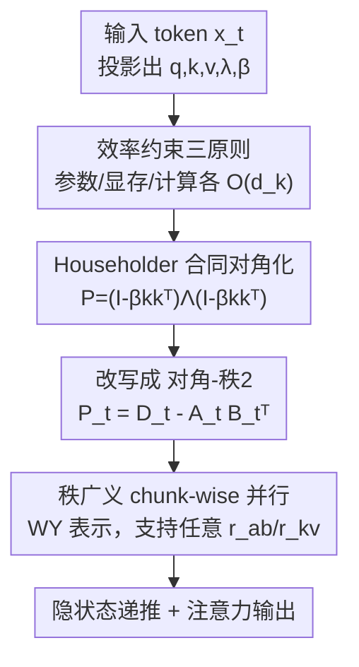

# Householder-Diagonalized Linear Attention (HDLA): Utilizing Rank-Enhanced Decay Mechanism for Efficient Sequence Modeling

**会议**: ICLR 2026  
**OpenReview**: [https://openreview.net/forum?id=HVFjzaQeig](https://openreview.net/forum?id=HVFjzaQeig)  
**代码**: https://github.com/Zhangjiefu777/HDLA-Impl  
**领域**: LLM效率  
**关键词**: 线性注意力, 衰减矩阵, Householder 变换, chunk-wise 并行, 序列建模

## 一句话总结
HDLA 用广义 Householder 矩阵对线性注意力的衰减矩阵做合同对角化，把结构从主流的「对角 + 秩 1」扩展到更具表达力的「对角 + 秩 2」，并配套一个支持任意秩的 chunk-wise 并行算法；在语言建模困惑度、MQAR/RULER 检索、MAD 合成任务上以更低的计算量全面超过同类线性注意力基线。

## 研究背景与动机

**领域现状**：线性注意力把 Softmax 注意力的 $O(n^2)$ 复杂度降到 $O(n)$，并把无限长的 KV 序列压成一个固定大小的隐状态 $S_t \in \mathbb{R}^{d_k \times d_v}$。它的核心递推是 $S_t = P_t S_{t-1} + k_t v_t^\top$，其中衰减矩阵 $P_t$ 决定历史信息 $S_{t-1}$ 与新信息 $k_t v_t^\top$ 之间的相对权重。近几年线性注意力性能的提升，几乎都来自把 $P_t$ 设计得越来越复杂：从无衰减（原始版本）→ 常数衰减（RetNet）→ 输入相关的对角衰减（GLA、Mamba、HGRN2）→ 输入相关的非对角衰减（DeltaNet、Gated DeltaNet、RWKV-7）。

**现有痛点**：当前最强的一批方法（DeltaNet、Gated DeltaNet、TTT-Linear、RWKV-7）虽然引入了非对角结构，但 $P_t$ 的结构复杂度都被卡死在「对角 + 秩 1」（Diagonal-Plus-Rank-1）这一级。对角衰减只能做"部分遗忘"、缺乏行间交互，无法实现负向擦除；而秩 1 的非对角修正虽然能擦除，但表达力有限。Gated DeltaProduct 试图用 $n_h$ 次迭代堆出「对角 + 秩 $n_h$」的更高秩衰减，但合并后的衰减矩阵**缺乏强结构性**，计算量翻 1~2 倍，性能却涨得很有限。

**核心矛盾**：想要更强的隐状态管理能力，就得用更复杂、更高秩的衰减矩阵；但任意高秩矩阵会同时撑爆参数量、显存和计算量。问题的根本在于——**如何在不牺牲效率的前提下，构造一个表达力更强、又有良好结构的衰减矩阵**。

**本文目标**：突破「对角 + 秩 1」这个天花板，把衰减矩阵扩展到更广、更结构化、更具表达力的一类，同时满足参数、显存、计算三方面的效率约束。

**切入角度**：作者从实对称矩阵的合同对角化理论（congruence diagonalization）出发——任意实对称矩阵都可写成 $P_t = H_t \Lambda_t H_t^\top$。如果选一个**参数高效**的可逆变换 $H_t$，就能用 $O(d_k)$ 的参数撬动一个 $O(d_k^2)$ 的复杂衰减矩阵。广义 Householder 矩阵 $I - \beta_t k_t k_t^\top$ 恰好满足这一点：它只比对角衰减多一个 $O(d_k)$ 规模的投影。

**核心 idea**：用广义 Householder 矩阵把一个输入相关的对角特征值矩阵"夹"起来做合同对角化，得到一个「对角 + 秩 2」的结构化衰减矩阵（$P_t = (I-\beta_t k_t k_t^\top)\Lambda_t(I-\beta_t k_t k_t^\top)$），并推导出能容纳任意秩衰减与任意秩 KV 更新的通用 chunk-wise 并行算法。

## 方法详解

### 整体框架

HDLA 要解决的核心问题是：怎样用尽量少的额外开销，把线性注意力的衰减矩阵从「对角 + 秩 1」升级到结构化的「对角 + 秩 2」。整体思路分两层：**建模层**用合同对角化 $P_t = H_t \Lambda_t H_t^\top$ 重新参数化衰减矩阵，把它拆成两个子问题——学一个对角特征值矩阵 $\Lambda_t$（管"遗忘强度"），选一个高效的可逆变换 $H_t$（管"行间交互"）；**算法层**把得到的 $P_t = (I-\beta_t k_t k_t^\top)\Lambda_t(I-\beta_t k_t k_t^\top)$ 重写成「对角减秩 2」的形式 $P_t = D_t - A_t B_t^\top$，再推导出一套支持任意秩的 chunk-wise 并行训练算法（基于秩广义化的 WY 表示）。

输入 token $x_t$ 经过线性投影得到 query $q_t$、key $k_t$、value $v_t$ 和遗忘门 $\lambda_t$、Householder 系数 $\beta_t$，进入隐状态递推；训练时按时间维切成大小为 $C$ 的 chunk，先串行算各 chunk 的隐状态检查点，再并行算各 chunk 内的注意力输出。

### 关键设计

**1. 效率约束三原则：把无限大的设计空间先框住**

复杂衰减矩阵的设计空间极广，作者先立三条硬约束把它收窄，也用来初步验证方案的实用性。① **参数效率**：$O(d_k^2)$ 的衰减矩阵必须只用 $O(d_k)$ 个参数生成，与 $\theta_Q, \theta_K, \theta_V$ 的参数量保持平衡，避免学习开销爆炸；② **显存效率**：每个 $O(d_k^2)$ 衰减矩阵或它们的累积乘积，平均只能占 $O(d_k)$ 显存，与 $q_t, k_t, v_t$ 的足迹相当；③ **计算效率**：衰减矩阵的累积乘积要保持合理的计算成本，且跨 chunk 的隐状态更新要能用一次性矩阵乘法（one-pass）完成。这三条不是事后辩护，而是直接决定了后面只能选 Householder 这种"低参数高表达"的变换——它正是同时压住这三个维度的钥匙。

**2. Householder 合同对角化衰减：用秩 2 结构突破秩 1 天花板**

这是 HDLA 的核心。作者把衰减矩阵的参数化拆成两步：对特征值矩阵 $\Lambda_t$，仿照 GLA 的输入相关对角衰减 $\Lambda_t = \mathrm{Diag}(\lambda_t)$、$\lambda_t = \sigma(W_\Lambda x_t)$，赋予模型动态遗忘历史的基础能力；对可逆变换 $H_t$，采用广义 Householder 矩阵 $I - \beta_t k_t k_t^\top$。两者组合得到

$$P_t = (I - \beta_t k_t k_t^\top)\,\Lambda_t\,(I - \beta_t k_t k_t^\top) \in \mathbb{R}^{d_k \times d_k}$$

其中 $\beta_t \in (0,2)$（取这个区间是为了增强状态追踪能力，沿用 Grazzi et al. 的结论），$\sigma$ 取 sigmoid。可以证明这个 $P_t$ 正是「对角 + 秩 2」类的一个具体实例——相比 GLA 的纯对角衰减，左右各夹一个 Householder 反射引入了行间交互与负向擦除能力；相比 DeltaNet/Gated DeltaNet 的「对角 + 秩 1」，它的结构更丰富、表达力更强。而代价仅仅是多了一个把 $x_t$ 映射到 $\beta_t$ 的 $O(d_k)$ 规模投影矩阵，完美满足参数效率约束。从 Test-Time Training 视角看，单步更新等价于一个三步优化：先惩罚 $k_t$ 与 $S_{t-1}$ 各列的高内积相似度（预先剔除冗余信息），再做对角遗忘，最后用 delta rule 做梯度下降——即"先擦除冗余、再写入新值"。

**3. 秩广义 chunk-wise 并行算法：让高秩衰减也能高效并行训练**

光有好的衰减结构不够，线性注意力的训练效率全靠 chunk-wise 并行，而已有并行算法（Lightning Attention、GLA、DeltaNet）只覆盖到对角或「对角 + 秩 1」。作者先把 $P_t$ 重写成「对角减秩 2」形式 $P_t = D_t - A_t B_t^\top$（$A_t, B_t \in \mathbb{R}^{d_k \times 2}$），再把目标推广到一个**同时容纳任意秩** $r_{ab}$ 衰减和任意秩 $r_{kv}$ KV 更新的通用递推：

$$S_t = (D_t - A_t B_t^\top)S_{t-1} + K_t V_t^\top, \quad A_t,B_t \in \mathbb{R}^{d_k \times r_{ab}},\; K_t \in \mathbb{R}^{d_k \times r_{kv}}$$

算法采用与 Lightning/GLA 相同的两阶段方案：① 串行算各 chunk 的隐状态检查点 $S_{[0]}, \dots, S_{[N-1]}$；② 并行算各时间段的注意力输出 $O_{[0]}, \dots, O_{[N-1]}$。关键技术是把累积求和（$\Sigma$）与累积乘积（$\prod$）算子从 chunk 内表示里消掉——作者用数学归纳法推出一个**秩广义的 WY 表示**，引入自定义算子 $\mathrm{triu}_{r_1 \times r_2}$（把标准上三角算子的每个 $r_1 \times r_2$ 子块当作单个元素处理），从而把 $P_{[n]}$ 和 $H_{[n]}$ 写成不含累积算子的紧凑形式。这套算法不仅把 HDLA 作为特例（$r_{ab}=2, r_{kv}=1$）包含进来，还为未来任意秩的结构化线性注意力提供了通用训练基座——这是论文的第二个主要贡献。

### 损失函数 / 训练策略
标准自回归语言建模（next-token 预测）。模型在 FineWeb-Edu 采样的 10B/50B token 上训练，覆盖 0.4B、1.45B、2.8B 三个参数规模。HDLA 设 $r_{ab}=2, r_{kv}=1$，$\beta_t \in (0,2)$ 由输入投影 + sigmoid 缩放得到，$\lambda_t$ 由 sigmoid 门控产生。

## 实验关键数据

### 主实验

语言建模困惑度（Wikitext / Lambada，0.4B / 1.45B / 2.8B 三个规模，越低越好）：

| 模型 | 0.4B Avg ppl | 1.45B Avg ppl | 2.8B Avg ppl |
|------|------|------|------|
| **HDLA** | **36.06** | **22.32** | **18.58** |
| GDP2 (Gated DeltaProduct, $n_h{=}2$) | 41.28 | 24.65 | 20.38 |
| Gated DeltaNet | 43.06 | 24.83 | 19.60 |
| DeltaNet | 44.54 | 27.44 | 22.69 |
| GLA | 43.75 | 26.42 | 21.45 |
| Mamba2 | 40.63 | 25.73 | 22.78 |
| Llama (Softmax) | 37.60 | 23.68 | 20.71 |

HDLA 在所有规模上都明显领先全部线性注意力基线，甚至在困惑度上**超过了基于 Softmax 的 Llama**。

MAD 合成基准（6 类任务平均分，越高越好）：

| 模型 | Compression | ICR | Mem. | AVG |
|------|------|------|------|------|
| Softmax Attention | 48.85 | 95.98 | 84.41 | 76.02 |
| **HDLA** | **51.01** | 99.73 | **89.34** | **72.97** |
| Gated DeltaNet | 41.41 | 99.73 | 55.64 | 68.17 |
| DeltaNet | 42.27 | 99.88 | 42.46 | 66.80 |
| GDP2 | 39.40 | 99.29 | 49.84 | 65.31 |
| Mamba | 48.20 | 86.90 | 89.48 | 68.58 |

4 个非对角衰减基线的记忆能力（Memorization）都崩到 60 分以下，而 HDLA 拿到 89.34，平均分比线性注意力基线高 4.39~7.66，显著缩小与 Softmax 的差距。

RULER 检索（S-NIAH，1.45B / 50B token，准确率）：

| 模型 | S-NIAH-3 @1024 | S-NIAH-3 @2048 | S-NIAH-2 @2048 |
|------|------|------|------|
| **HDLA** | **82.0%** | **65.2%** | **52.2%** |
| Gated DeltaNet | 50.6% | 7.0% | 45.8% |

在最难的 S-NIAH-3 上，HDLA 比 Gated DeltaNet 分别领先 31.4% 和 58.2%。MQAR（Zoology）在序列长度 2048 时 HDLA 仍保持 >81% 准确率，而 GDP2 和 Gated DeltaNet 几乎全错。

### 计算量与消融

单步递推计算量对比（衰减矩阵复杂度↔成本，越低越省）：

| 方法 | $r_{ab}$ | $r_{kv}$ | 隐状态更新计算量 |
|------|------|------|------|
| **HDLA** | 2 | 1 | $d_k(8d_v+5)$ |
| GDP2 | 2 | 2 | $d_k(12d_v+6)$ |
| GDP3 | 3 | 3 | $d_k(18d_v+9)$ |

GDP3 的计算量约为 HDLA 的 2 倍，但语言建模、MAD、检索全面落后于 HDLA。论文附录还补充了状态扩展、学习率 / $\beta_t$ 区间 / 激活函数类型等超参微调实验；ImageNet-1k 双向图像分类上 HDLA 达 74.84%，优于多数线性注意力基线。

### 关键发现
- **记忆能力是分水岭**：非对角秩 1 基线（DeltaNet/Gated DeltaNet/GDP2）在 MAD 的 Memorization 任务上集体崩盘（<60），HDLA 凭借秩 2 结构化衰减保持在 89 分，说明"对角 + 秩 1"的擦除机制会过度损害记忆。
- **更强不等于更贵**：HDLA 用比 GDP2/GDP3 更低的计算量取得更好性能，验证了"结构化"比"单纯堆秩"更划算。
- **检索仍有上限**：HDLA 在 Fuzzy In-Context Recall 上逊于 Softmax，根因是线性注意力固有的强 recency bias——对角衰减系数随时间累积衰减，使远处稀疏分布的重要 token 难以被有效聚合；与 Llama 的检索差距也源于隐状态尺寸有限这一根本约束。

## 亮点与洞察
- **把矩阵分解理论搬进注意力设计**：用实对称矩阵的合同对角化 $P=H\Lambda H^\top$ 作为参数化框架，把"设计衰减矩阵"这件事拆成"选特征值"+"选变换"两个干净的子问题，思路非常可迁移——换别的高效可逆变换就能得到新的结构化衰减族。
- **秩广义 WY 表示是真正的通用基座**：自定义 $\mathrm{triu}_{r_1\times r_2}$ 块算子，把 chunk-wise 并行从「对角 + 秩 1」一举推广到任意秩 $r_{ab}$ 衰减 + 任意秩 $r_{kv}$ KV 更新，后续任何更高秩的线性注意力都能直接复用这套训练算法。
- **TTT 视角下的"先擦后写"**：单步更新被解释为"先惩罚 $k_t$ 与隐状态的高相似度以剔除冗余，再做对角遗忘，最后 delta rule 写入"，给"秩 2 为什么有效"提供了优化视角的解释。

## 局限与展望
- **检索仍被隐状态尺寸卡住**：作者承认线性注意力的固定隐状态根本上限制了跨步检索能力，与 Llama 在 RULER 上仍有可观差距；recency bias 也让 HDLA 在含噪声的模糊召回上不如 Softmax。
- **结构仍止步秩 2**：本文把天花板从秩 1 抬到秩 2，但并未系统探索秩 3+ 的结构化衰减是否仍有正收益（算法已支持任意秩，实验却没铺开），更高秩是否会重蹈 GDP 的"涨秩不涨分"还需验证。
- **可改进方向**：把 $\beta_t$、$\lambda_t$ 的生成与状态追踪理论更紧地绑定，或引入滑窗 / 全局窗的注意力偏置目标（如 ATLAS、MesaNet 的做法）来缓解 recency bias，可能进一步缩小与 Softmax 的检索差距。

## 相关工作与启发
- **vs Gated DeltaNet / DeltaNet**：它们用「对角 + 秩 1」的 $\alpha_t(I-\beta_t k_t k_t^\top)$，HDLA 用左右双 Householder 夹对角得到结构化「对角 + 秩 2」，在记忆与检索上大幅领先，额外开销只多一个 $O(d_k)$ 投影。
- **vs Gated DeltaProduct**：GDP 靠 $n_h$ 次迭代堆出「对角 + 秩 $n_h$」但缺乏结构性，HDLA 以约一半计算量（相对 GDP3）取得更好性能，说明结构化优于盲目升秩。
- **vs GLA / Mamba**：GLA/Mamba 用输入相关的纯对角衰减、无行间交互，HDLA 的特征值矩阵 $\Lambda_t$ 正是仿照 GLA，但额外用 Householder 引入了负向擦除与行间耦合。
- **vs ParallelFlow**：ParallelFlow 给「单位阵 + 秩 n」提供了部分并行，但不容纳线性注意力中常见的任意对角项；HDLA 的秩广义 chunk-wise 算法同时支持任意对角项与任意秩。

## 评分
- 新颖性: ⭐⭐⭐⭐⭐ 首次把线性注意力衰减矩阵系统性地从秩 1 推进到结构化秩 2，并给出任意秩的通用并行算法。
- 实验充分度: ⭐⭐⭐⭐⭐ 覆盖 MAD/Zoology/语言建模/RULER/图像分类多任务、三个参数规模与计算量对照，附录还有超参微调。
- 写作质量: ⭐⭐⭐⭐ 理论推导严谨，但 WY 表示等核心算法大量推导压进附录，正文读起来偏密。
- 价值: ⭐⭐⭐⭐⭐ 既给出更强的现成模型，又提供可复用的秩广义训练基座，对后续结构化线性注意力研究有直接价值。

<!-- RELATED:START -->

## 相关论文

- [\[ICLR 2026\] MoM: Linear Sequence Modeling with Mixture-of-Memories](mom_linear_sequence_modeling_with_mixture-of-memories.md)
- [\[ACL 2026\] Native Hybrid Attention for Efficient Sequence Modeling](../../ACL2026/llm_efficiency/native_hybrid_attention_for_efficient_sequence_modeling.md)
- [\[ICLR 2026\] FlexLinearAttention: Compiling a Unified Abstraction into Scalable Kernels for Linear Attention](flexlinearattention_compiling_a_unified_abstraction_into_scalable_kernels_for_li.md)
- [\[ICLR 2026\] Log-Linear Attention](log-linear_attention.md)
- [\[ICLR 2026\] RACE Attention: A Strictly Linear-Time Attention Layer for Training on Outrageously Large Contexts](race_attention_a_strictly_linear-time_attention_layer_for_training_on_outrageous.md)

<!-- RELATED:END -->
