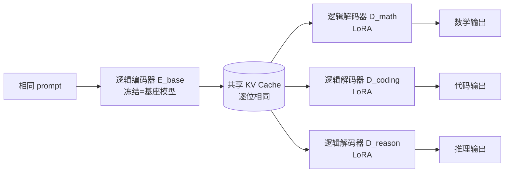

# ICaRus: Identical Cache Reuse for Efficient Multi-Model Inference

**会议**: ICLR 2026  
**OpenReview**: [https://openreview.net/forum?id=qrMo6R7lOS](https://openreview.net/forum?id=qrMo6R7lOS)  
**代码**: 待确认  
**领域**: LLM 高效推理 / KV Cache 优化 / 多模型服务  
**关键词**: KV Cache 共享, 多模型推理, Agentic AI, Prefix Caching, LoRA, 解码器 Transformer  

## 一句话总结
ICaRus 把 decoder-only Transformer 概念上拆成"逻辑编码器（造 KV cache）+ 逻辑解码器（预测 token）"，只微调逻辑解码器、冻结逻辑编码器，让一组任务专精模型共用同一份 KV cache，从而消除多模型服务里的缓存爆炸与重复 prefill，在 8 模型 agentic 工作流下把 P95 延迟降低 11.1×、吞吐提升 3.8×。

## 研究背景与动机
**领域现状** — 多模型推理（multi-model inference）正成为 agentic AI 的主流范式：用一批任务专精模型（规划、执行、总结……）协作解决复杂任务，整体准确率高于单个通用模型。ReAct、Reflexion、LATS、LLMCompiler 等工作流把不同角色模型编排进同一条流水线。

**现有痛点** — 这种范式给 KV cache 管理带来了硬伤。**每个模型即便面对完全相同的 prompt 也得各自维护一份 KV cache**：内存占用随模型数线性增长，一旦 GPU 显存被 KV cache 占满，serving 系统（vLLM、SGLang）就被迫驱逐已有缓存，等到再次需要时又触发重算（recomputation），吞吐骤降。更糟的是，prefix caching 这种成熟优化天然无法跨模型复用——因为不同模型的 KV cache 互不兼容，同一段 prompt 必须被每个模型各算一遍，prefill 开销翻倍。

**核心矛盾** — 已有的 KV cache 优化（剪枝、量化、层间共享）以及 KVFlow 这类基于工作流的调度，都只解决**单模型**内部的缓存管理，回避了多模型场景下的"缓存爆炸 + 跨模型无法共享"两大难题。DroidSpeak 尝试在基座模型与其微调变体间共享"非敏感层"的 cache，但敏感层仍须各自重算，共享并不彻底。

**本文目标** — 设计一种架构，让多个专精模型对同一 prompt 生成**逐位相同（identical）**的 KV cache，从而真正实现**全层、跨模型**的缓存共享与 prefix 复用。

**核心 idea** — **将 KV cache 的"生产者"与"消费者"解耦**：把 decoder-only Transformer 视作"逻辑编码器 $E$（从 token 生成 KV）+ 逻辑解码器 $D$（用当前 token 和累积 KV 预测下一 token）"的特例（普通 Transformer 即两者参数相同），然后**只训练逻辑解码器、冻结逻辑编码器**。既然所有专精模型共享同一个冻结编码器，它们对同一 prompt 产出的 KV cache 自然完全一致，可以直接共享。

## 方法详解

### 整体框架
ICaRus 的出发点是一个对 decoder-only Transformer 的重新诠释：next-token 生成 $x_{i+1}=F(x_1,\dots,x_i)=F(x_i, K_{1:i}, V_{1:i})$ 可拆成两步——逻辑编码器 $K_{1:i}, V_{1:i}=E(x_{1:i})$ 负责把输入序列变成 KV cache，逻辑解码器 $x_{i+1}=D(x_i, K_{1:i}, V_{1:i})$ 负责从 KV 和当前 token 解码出下一 token。普通 Transformer 只是 $E\equiv D$ 的退化情形。ICaRus 让所有任务把逻辑编码器统一固定为基座模型 $E_{\text{base}}$，只把逻辑解码器替换成任务专属的 $D_{\text{task}}$（用 LoRA 实现），从而所有模型共用一份由基座生成的 KV cache。

### 关键设计

**1. 逻辑编码器-解码器分解：把"共享"做进训练目标里** ICaRus 不是事后强行让独立训练的模型共享缓存，而是**在训练时就显式建模"KV 全共享"这一约束**。具体做法是：把逻辑编码器和逻辑解码器都用基座模型参数初始化（$F_{\text{base}}\equiv E_{\text{base}}\equiv D_{\text{base}}$），训练时把同一份输入同时喂给两者——冻结的 $E_{\text{base}}$ 生成 KV 表示 $K_{1:i},V_{1:i}=E_{\text{base}}(x_{1:i})$，可训练的 $D_{\text{task}}$ 在这组 KV 上做 attention 并用最终输出算 loss、回传梯度（公式 4-5）。由于编码器始终冻结，所有任务的专精解码器被迫复用同一套序列表示、只能通过解码器表达任务差异。这一约束反而带来一种隐式正则：实验里 ICaRus 的训练 loss 曲线与常规任务微调几乎完全重合，说明"只训练解码器"不损优化收敛，且在多任务下还降低了过拟合风险。

**2. 共享逻辑编码器 ⇒ 跨模型 KV 与 prefix 全复用** 因为所有专精模型的编码器都等于基座（$E_{\text{math}}\equiv E_{\text{coding}}\equiv E_{\text{reason}}\equiv E_{\text{base}}$），它们对同一 prompt 生成的 KV cache **逐位相同**，于是显存里只需保存**一份** KV，不再随模型数 $N$ 线性膨胀，也就不会触发因显存饱和导致的驱逐与重算。更进一步，这份共享缓存让 prefix caching 第一次能**跨模型**生效：agentic 工作流里前一个 agent（如 Planner）算出的 prompt 缓存，后续 agent（Executor、Summarizer）可直接 KV load 复用，省掉重复 prefill。复杂度上，baseline 多模型的内存是 $O(M+NL_t)$、prefill 是 $O(N(ML_t+L_t^2))$，ICaRus 把两者都压回单模型量级 $O(M+L_t)$ 和 $O(ML_t+L_t^2)$，序列越长、agent 数越多收益越大。

**3. LoRA 适配器 + 编解码并行：消化 2× 解码开销** 朴素地顺序跑编码器再跑解码器，会因为权重和 KV 都被读两次而带来最高 2× 的解码延迟。ICaRus 的应对是：逻辑解码器只插入轻量 LoRA 适配器而非全量微调，于是编码器与解码器**共享除适配器外的几乎全部参数**，基座权重只需加载一次；同时把编码器和解码器的 query 表示**沿 head 维度拼接**，让两者对同一份 KV 做并行 attention，无需重复读 KV。结果是：解码阶段虽然名义计算量翻倍（$O(2M+2L_t)$），但由于解码本身是 memory-bound、而内存访问几乎与单模型持平，实际只增加可忽略的延迟。选 LoRA 还有部署上的好处——训练快、能快速上线新 agent，且性能与全量微调相当。

## 实验关键数据

### 主实验表格
准确率（LLaMA-3.1-8B / Qwen3-8B-Base，三任务专精后评测，ICaRus 全程共享 KV）：

| Base | 方法 | KV共享 | GSM8K | GSM+ | HEval | HEval+ | GPQA |
|------|------|:---:|---|---|---|---|---|
| LLaMA3.1-8B | Multi Model | ✗ | 69.7 | 48.5 | 48.2 | 41.5 | 27.3 |
| LLaMA3.1-8B | **ICaRus** | ✓ | 67.9 | 45.8 | 48.2 | 43.9 | **28.8** |
| Qwen3-8B-Base | Multi Model | ✗ | 85.4 | 66.1 | 81.7 | 75.6 | 34.3 |
| Qwen3-8B-Base | **ICaRus** | ✓ | **87.3** | **67.5** | **86.6** | **79.9** | 33.8 |

ICaRus 在共享 KV 的前提下，准确率与各自独立微调的多模型系统持平甚至更高（Qwen3-8B 上数学/代码至少高 1.4%）。

多模型服务性能（LLaMA-3.1-8B，ReAct 模式，相对 baseline）：

| 模型数 N | 最大吞吐提升 | P95 延迟降低 |
|:---:|:---:|:---:|
| 2 | 1.4× | 3.8× |
| 4 | 2.3× | 5.1× |
| 8 | 3.8× | 11.1× |

### 消融实验表格
模型规模扩展（Qwen3-Base，MetaMathQA-40K 训练）：

| 指标 | 1.7B Base | 1.7B ICaRus | 8B Base | 8B ICaRus | 14B Base | 14B ICaRus |
|------|:---:|:---:|:---:|:---:|:---:|:---:|
| GSM8K | 73.2 | 74.0 | 85.4 | 87.3 | 85.6 | **88.8** |
| GSM+ | 53.7 | 54.1 | 66.1 | 67.5 | 66.7 | 68.8 |

随模型增大优势更明显，Qwen3-14B 上 GSM8K 反超常规微调 +3.2%。跨模型/工作流（Qwen3-14B、ReAct/Reflexion）下 ICaRus 仍达 7.4× 更低延迟、3.6× 更高吞吐。

### 关键发现
- **共享不掉点反提点**：冻结编码器带来的隐式正则降低了过拟合，多任务准确率与独立微调持平甚至更优，且模型越大优势越大。
- **收益随负载放大**：baseline 在 QPS 升高后因 KV 爆炸触发驱逐重算，吞吐先饱和后下降（2 模型 QPS 0.6、4 模型 QPS 0.3 即崩）；ICaRus 因共享缓存吞吐持续上升。
- **延迟优势随 agent 数指数级拉开**：8 模型时 P95 延迟 11.1× 收益，远大于 2 模型的 3.8×。

## 亮点与洞察
- **概念解耦带来工程红利**：把 Transformer 重新理解为"逻辑编码器+逻辑解码器"是个极简却有力的视角——它把"能否共享 KV"从一个事后兼容性问题，变成一个可以在训练时直接锚定的约束。
- **"训练时就建模共享"是关键差异点**：相比 DroidSpeak 这类对独立训练模型做部分层共享的事后方案，ICaRus 在训练阶段就让所有解码器复用同一冻结编码器，保证推理时 KV 逐位相同、无需识别敏感层、全层可共享。
- **memory-bound 视角下的"免费午餐"**：解码本属 memory-bound，ICaRus 用参数共享 + query 拼接把翻倍的计算量隐藏在几乎不变的内存流量后，把理论 2× 开销压成可忽略，这是它能在真实 serving 中兑现收益的工程核心。

## 局限与展望
- **只验证同基座家族**：所有专精解码器都从同一基座派生，论文未深入探讨异构基座 / 不同基座模型间能否共享 KV——这恰是真实多 agent 系统常见的诉求。
- **基座质量是上限**：冻结的逻辑编码器直接决定了 KV 表示质量，若基座本身偏弱，所有下游解码器都被其表示能力封顶，论文未讨论基座选择对极端专精任务的影响。
- **解码阶段仍跑两遍计算**：虽然延迟被内存流量掩盖，但在 compute-bound 的短序列 / 小 batch 场景下，2× 计算可能重新暴露为瓶颈，适用边界值得进一步刻画。
- 作者展望扩展到更大规模模型、异构 agent 系统与真实部署场景。

## 相关工作与启发
- **KV Cache 优化**：传统 prefix caching（vLLM、SGLang）只能在单模型内复用；ICaRus 把可复用范围从"单模型多请求"扩展到"多模型同 prompt"。
- **vs DroidSpeak**：DroidSpeak 共享非敏感层、敏感层仍重算，需识别敏感层且影响后续层；ICaRus 通过训练时约束做到全层逐位一致，无此负担。
- **vs KVFlow**：KVFlow 用工作流预测调度 KV 驱逐/预取以减少重算，但仍是单模型、agent 由 prompt 区分；ICaRus 直接从源头消除跨模型缓存冗余。
- **启发**："把推理时的系统约束（如缓存兼容性）前置进训练目标"是一条值得推广的思路，可迁移到量化感知共享、跨设备缓存对齐等场景。

## 评分
- **新颖性**: ⭐⭐⭐⭐⭐ "逻辑编码器/解码器分解 + 只训解码器以共享 KV"的视角新颖且简洁，是首个实现 decoder-only Transformer 全层 KV 共享的架构。
- **实验充分度**: ⭐⭐⭐⭐ 覆盖多基座（LLaMA/Qwen 多尺度）、多任务、多 agent 模式与 vLLM 真实 serving，准确率与系统性能双线验证；异构基座共享留待补充。
- **写作质量**: ⭐⭐⭐⭐⭐ 数学抽象清晰、动机-方法-复杂度分析层层递进，图 1/3 与复杂度表把直觉和收益讲得很透。
- **价值**: ⭐⭐⭐⭐⭐ 直击 agentic AI 多模型服务的真实痛点，11.1× 延迟 / 3.8× 吞吐的收益对生产级 LLM serving 极具吸引力。
