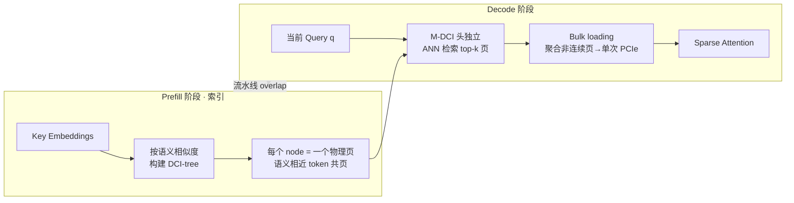

# IceCache: Memory-Efficient KV-cache Management for Long-Sequence LLMs

**会议**: ICLR 2026  
**OpenReview**: [https://openreview.net/forum?id=yHxSKM9kdr](https://openreview.net/forum?id=yHxSKM9kdr)  
**代码**: [https://yuzhenmao.github.io/IceCache/](https://yuzhenmao.github.io/IceCache/)  
**领域**: LLM 推理加速 / KV-cache 管理 / 长序列生成  
**关键词**: KV-cache offloading, PagedAttention, 语义聚类, 近似最近邻检索, 多级 DCI, 长上下文推理  

## 一句话总结
IceCache 把"按语义相似度聚类 token"和 PagedAttention 的分页机制结合起来——用一棵可增量更新的多级 DCI 树把语义相近的 token 塞进同一个物理内存页，使得 query-aware 检索时相关 token 高度共页、命中率大幅提升，从而在仅用 25% KV-cache 预算时仍保住接近满 cache 的精度和更低的延迟。

## 研究背景与动机

**领域现状**：KV-cache 是 LLM 自回归生成提速的核心，但其显存占用随序列长度线性增长，长上下文/长生成场景下极易撑爆显存。已有两条主线缓解：一是 eviction（H2O、StreamingLLM、SnapKV）直接丢弃不重要 token，速度快但用静态策略、难适应动态变化的上下文；二是 offloading（MagicPiG、OmniKV、PQCache、ArkVale）把 KV-cache 卸到 CPU、按 query 动态把重要页搬回 GPU，更准但带来 GPU–CPU 传输延迟。

**现有痛点**：offloading 类方法普遍**选 token 不精准**——它们沿用 PagedAttention 的分页方式，**页是按 token 的原始顺序切的**。这导致对某个 query 真正相关的 token 会**散落在多个页里**，检索时不得不把一整页（含大量无关 token）搬上 GPU，既浪费带宽又降低选择精度（hit rate 低）。更糟的是，多数方法**缺乏解码中动态更新 cache pool 的机制**，在 CoT 推理、长文摘要等长生成任务上性能明显退化。

**核心矛盾**：分页是按"物理位置/时间顺序"组织的，而注意力的相关性是按"语义"组织的——两者错位，使得"想精准检索少量相关 token"和"分页内存搬运的粒度"无法对齐。

**本文目标**：在受限显存预算下，既要高 hit rate 的精准检索，又要低延迟的内存搬运，并且能在长生成中持续动态维护。

**核心 idea**：<u>让内存页的组织从"按 token 顺序"改成"按语义相似度"</u>——把语义相近的 token 聚到同一页，相关 token 自然共页，于是"选 top-k 页"就近似等价于"选 top-k 相关 token"，搬运粒度和检索目标对齐。配套用一棵支持增量更新的多级 DCI 树承载这个聚类索引。

## 方法详解

### 整体框架
IceCache 工作流分三步：**(1) 索引**——在 prefill 阶段（或新窗口 token 卸载到 CPU 时）为每个注意力头构建一棵 DCI 树，按 key embedding 语义相似度把 token 聚成"节点（node）"，每个节点直接映射为一个物理内存页；**(2) 页选择**——解码时对每个头用 M-DCI 做近似最近邻搜索，独立选出与当前 query 最相关的 top-k 页；**(3) 批量加载**——把选中的（非连续）页聚合进连续缓冲区，单次高吞吐 PCIe 传输搬回 GPU。再叠加 prefill/卸载/索引的流水线把 CPU 侧开销藏进 GPU 计算。

### 关键设计

**1. 语义聚类分页：让"选页"等价于"选相关 token"。** 这是全文的根。PagedAttention 及其后继（Quest、ArkVale）都把页按 token 原始顺序切，相关 token 因此被打散到多页，检索时被迫连带搬运大量无关 token。IceCache 反其道——不依赖 token 顺序，而是为每个注意力头单独建一棵 DCI 树，按 key embedding 的语义相似度把 token 聚成节点，**每个节点直接映射到一个物理内存页**，从而在存储层面保留语义局部性。这样一来，对 query $q$ 的相关 token 高度集中在少数几页里，"取 top-k 页"就近似覆盖了真正的 top-k 相关 token，hit rate 和带宽利用率同时改善。注意力本身是稀疏的——每行注意力权重 $a_{i,j}=\frac{s_{i,j}\exp(q_i^\top k_j/\sqrt{d})}{\sum_{j'}s_{i,j'}\exp(q_i^\top k_{j'}/\sqrt{d})}$ 里只有少数 $j$ 显著非零，IceCache 的语义分页正是为了用最少的页覆盖这些显著项。

**2. 多级 DCI 树（M-DCI）：高维下高效、可增量更新的层次索引。** 底层用的是 Prioritized Dynamic Continuous Indexing（P-DCI）——不做空间划分（避免高维下退化），而是构造多个索引，每个索引把点沿一个随机向量投影、按到 query 距离的下界排序，再聚合多个下界得到更紧的界并用优先队列优先处理下界小的点，从而大幅减少距离计算。本文把它扩展成**多级层次结构**：把点随机提升到更高层，每个低层点在上一层认一个最近的"父节点"，形成共享父节点的簇；查询时从顶层用 P-DCI 找 k 个最近点，再递归下钻到对应子节点继续搜索，逐层缩小搜索空间。这种层次结构对高内在维数的数据尤其有效，且天然支持**增量插入**——长上下文滑窗里新卸载的 token 按 key embedding 插进合适节点，节点超过页大小上限就动态分裂新页，使索引在长生成中始终保持语义有效且平衡。这点正是它能缓解长生成退化的关键。

**3. 头独立的细粒度页选择 + GQA 共享。** 解码时对**每个注意力头独立**用 M-DCI 选 top-k 页，因为不同头关注的语义不同，统一选页会牺牲精度。对 group-query attention（多个 query 头共享同一组 key），IceCache 取同组内各 query 选中页的并集再共享，既尊重 GQA 结构又避免重复检索。

**4. 批量加载 + 三段流水线：把搬运和索引开销藏起来。** 选中的页在主存和显存里都不连续，逐页传输 PCIe 利用率极低。IceCache 用 CPU/GPU 两个 backload 缓冲区，把所有选中页先聚合进连续 CPU 缓冲，**单次高吞吐 PCIe 传输**进 GPU 缓冲，再 scatter 到 KV-cache 表的精确槽位，避免大量小拷贝。同时设计 prefill 计算、KV 卸载、DCI 索引三者的流水线：某层 KV 一到达 CPU 主存就并行启动该层 DCI 建树，与下一层的 GPU prefill 和卸载重叠（图 5），使索引与卸载延迟被主计算掩盖；prefill 还能进一步叠加 page reuse 技术加速。

## 实验关键数据

### 主实验（LongBench，16 子任务平均精度）
模型 Llama-3.1-8B-Instruct 与 Mistral-7B-Instruct-v0.2（GQA），对比 6 个 SOTA KV-cache 方法 + 满 cache（FULL）+ ground-truth top-k（TOP-k）。

| Budget | 方法 | Llama-3.1-8B Avg. | Mistral-7B Avg. |
|---|---|---|---|
| N/A | FULL（满 cache） | 49.5 | 42.2 |
| 256 | TOP-k（理论上界） | 49.8 | 42.6 |
| 256 | SnapKV (SKV) | 40.8 | 31.8 |
| 256 | StreamingLLM (SLM) | 33.5 | 27.8 |
| 256 | OmniKV (OKV) | 46.3 | 33.0 |
| 256 | MagicPiG (MPG) | 44.6 | 39.1 |
| 256 | PQCache (PQC) | 47.3 | 37.4 |
| 256 | ArkVale (AKV) | 42.8 | — |
| **64** | **IceCache (ICE)** | **47.8** | — |
| **128** | **IceCache (ICE)** | **48.6** | — |
| **256** | **IceCache (ICE)** | **49.0** | — |

关键对比：IceCache 仅用 **budget=64** 的预算（47.8）就**超过所有 256-budget 的基线**（最强 PQC 也只有 47.3）；budget=256 时达到 49.0，逼近满 cache 的 49.5 与理论上界 49.8。论文摘要进一步给出：256-token 预算下保住满 cache 模型 **99%** 的精度。

### 效率（A100，36k 序列长度，图 1）
IceCache 在 CUDA 显存占用 vs. TPOT（每输出 token 时间）的权衡上取得**最佳 trade-off**：相比高精度基线显存更省，相比省内存基线精度/延迟更优；在仅用 **25%** KV-cache 预算时即可获得与其他 offloading 方法相当甚至更优的延迟与精度。

### 关键发现
- **Passkey Retrieval**：context 10k–100k 词、budget ∈ {256,128,64} 全部维持 **100%** 检索准确率，验证语义聚类能可靠召回被卸载的关键页。
- **长生成不退化**：可增量更新的 DCI 树使 IceCache 在 GSM8K CoT 推理、长文摘要等长生成任务上避免了基线常见的性能崩塌。
- **小预算高保真**：最小到 64 token 预算仍保持近 oracle 性能，说明"选页≈选相关 token"的对齐确实提升了检索精度。

## 亮点与洞察
- **把"内存系统视角"和"检索视角"统一**：核心洞见是 PagedAttention 的分页边界（物理/时序）与注意力相关性（语义）天然错位，IceCache 用语义聚类重排页布局，让内存搬运的最小粒度（页）和检索目标（相关 token）对齐——一个很优雅的"对齐"思路。
- **动态数据结构是长生成的胜负手**：多数前作把页布局当静态分配问题，IceCache 用可增量更新的 DCI 树把它变成动态、语义感知的结构，这正是它在长生成不退化的根因。
- **系统级工程扎实**：bulk loading 化零散小拷贝为单次 PCIe 大传输、三段流水线把索引/卸载藏进 GPU 计算，把算法优势真正落到端到端延迟上。

## 局限与展望
- **每个头每序列都要建独立 DCI 树**，头数多、batch 大时索引构建与存储开销、CPU 线程占用（实验固定 64 线程）可能成为瓶颈，论文未充分讨论高并发服务化场景。
- **随机化 ANN 的近似误差**：M-DCI 是近似最近邻，极端 query 下可能漏选关键页；虽 passkey 任务 100% 召回，但更对抗的检索分布下的鲁棒性边界未知。
- **依赖 key embedding 的语义聚类前提**：若某些层/任务的 key 空间聚类性差（语义局部性弱），分页收益会缩水；前两层因低稀疏性已被排除在外，说明该假设并非处处成立。
- 展望：与 page reuse、量化压缩（如 PQCache 的乘积量化）正交结合，以及在 serving 框架（vLLM 等）中落地是自然的下一步。

## 相关工作与启发
- **Eviction 类**：H2O（按注意力分数留子集）、StreamingLLM（保留 sink+recent）、SnapKV（取 prompt 尾部 key）——快但静态，长生成易退化。
- **Offloading 类**：MagicPiG（LSH 采样近似注意力）、OmniKV（跨层复用重要 token，但只卸部分层、显存占用高）、PQCache（乘积量化压缩 KV）——更准但有 GPU–CPU 传输成本。
- **Paged + query-aware**：Quest、ArkVale 在 PagedAttention 上做 query-aware 页重要性估计（按页内 Key 特征算上界选 top-k 页），但页按原始顺序切——IceCache 正是针对这一点改成语义聚类分页。
- **底层算法**：P-DCI（Li & Malik）的无划分高维 k-NN 检索，以及 Mao et al. (2024) 首次把 P-DCI 引入稀疏注意力，是本文 M-DCI 的直接前身。启发在于：检索结构（ANN 索引）和内存布局（分页）本可以是同一件事，把二者合一就同时拿到精度和带宽。

## 评分
- **新颖性**: ⭐⭐⭐⭐ — "语义聚类分页 + 多级 DCI 树"把检索结构和内存布局统一，是对 PagedAttention 顺序分页范式的实质性重构，角度新颖而非增量调参。
- **实验充分度**: ⭐⭐⭐⭐ — 覆盖 4 个模型（含 GQA 与标准 MHA、7B–32B）、Passkey/LongBench/GSM8K/RULER 多基准、6 个强基线，并给出显存-延迟 trade-off；多头索引开销的可扩展性分析略可加强。
- **写作质量**: ⭐⭐⭐⭐ — 动机（顺序分页 vs 语义相关性错位）讲得清晰，图 2/3/5 把 DCI 树、节点-页映射、流水线讲透，方法到系统的链路完整。
- **价值**: ⭐⭐⭐⭐ — 长序列/长生成 LLM 在受限显存下推理是高频刚需，64-budget 超越 256-budget 基线、25% 预算保持竞争力的结果有很强的实用与落地价值。

<!-- RELATED:START -->

## 相关论文

- [\[ICLR 2026\] Cache What Lasts: Token Retention for Memory-Bounded KV Cache in LLMs](cache_what_lasts_token_retention_for_memory-bounded_kv_cache_in_llms.md)
- [\[ICLR 2026\] LouisKV: Efficient KV Cache Retrieval for Long Input-Output Sequences](louiskv_efficient_kv_cache_retrieval_for_long_input-output_sequences.md)
- [\[ICLR 2026\] ThinKV: Thought-Adaptive KV Cache Compression for Efficient Reasoning Models](thinkv_thought-adaptive_kv_cache_compression_for_efficient_reasoning_models.md)
- [\[ICLR 2026\] QuoKA: Query-Oriented KV Selection for Efficient LLM Prefill](quoka_query-oriented_kv_selection_for_efficient_llm_prefill.md)
- [\[ICML 2026\] OBCache: Optimal Brain KV Cache Pruning for Efficient Long-Context LLM Inference](../../ICML2026/llm_efficiency/obcache_optimal_brain_kv_cache_pruning_for_efficient_long-context_llm_inference.md)

<!-- RELATED:END -->
