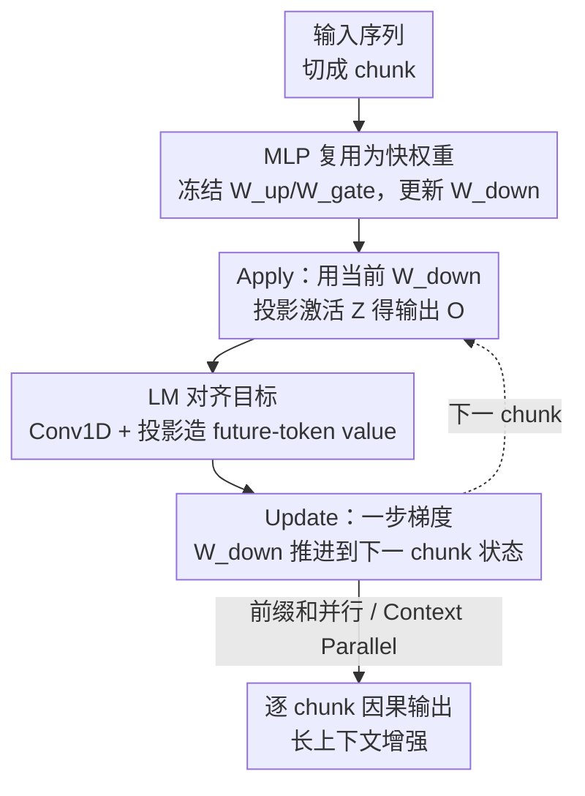

# In-Place Test-Time Training

**会议**: ICLR 2026  
**OpenReview**: [https://openreview.net/forum?id=dTWfCLSoyl](https://openreview.net/forum?id=dTWfCLSoyl)  
**代码**: 无  
**领域**: LLM效率 / 长上下文 / 测试时训练  
**关键词**: 测试时训练, 快权重, 长上下文, MLP 复用, Next-Token 对齐目标

## 一句话总结
本文把 Transformer 里 MLP 块的下投影矩阵 $W_{down}$ 当作可在推理时更新的「快权重」，配上一个对齐 Next-Token Prediction 的训练目标和分块更新机制，让现成的预训练 LLM 不改架构、不从头训就「即插即用」获得测试时训练（TTT）能力，在 128k 乃至 256k 长上下文上稳定超过原模型与 GLA / DeltaNet / LaCT 等竞品。

## 研究背景与动机
**领域现状**：当下 LLM 都是「先训练后部署」的静态范式——权重在海量语料上训好后就冻结，推理时一字不改。为了让模型处理超长、不断演进的任务，主流有两条路：一是靠 in-context learning 把历史 token 全塞进上下文窗口，但受限于注意力的二次复杂度；二是测试时训练（Test-Time Training, TTT），它引入一小撮「快权重」（fast weights），在推理时对每个新输入做一步梯度下降更新，把上下文信息在线压缩进这个动态记忆里。

**现有痛点**：TTT 概念上很美，但在 LLM 生态里落地有三道坎。其一，**架构不兼容**：现有 TTT 通常是替换注意力的专用循环层，随机初始化的新层和数十亿训练好的参数冲突，几乎必须从头重训，对大模型而言代价高到不现实。其二，**计算低效**：经典 TTT 是逐 token 串行更新，严重浪费 GPU/TPU 并行能力；即便有分块加速，TTT 作为主 token mixer 又被迫用小 chunk 来保性能，依然喂不饱现代加速器。其三，**目标错位**：TTT 普遍用通用的重建（reconstruction）目标，让快权重去关联同一个 token 的 $(k,v)$，本质是「记住当前 token」，和语言模型真正关心的「预测下一个 token」并不对齐。

**核心矛盾**：TTT 想替注意力的「野心」恰恰是它落地难的根源——一旦定位成「取代注意力的核心 token mixer」，就同时背上了从头重训、严格逐 token 因果、小 chunk 的三重包袱。

**本文目标**：在不动注意力、不从头训的前提下，给现成 LLM 装上 TTT 能力，同时解决效率与目标对齐。

**切入角度**：作者的关键观察是——快权重的选择没有任何约束，任意参数都能当快权重；而 Transformer 里的 MLP 块本身就可以看作一种 key-value 记忆，存的是预训练学到的「慢权重」通用知识。那么自然可以让同一个 MLP **兼职**快权重，在推理时动态吸收上下文。

**核心 idea**：把 MLP 的下投影矩阵原地（in-place）当快权重更新，用一个对齐 NTP 的目标 + 大 chunk 并行更新，让 TTT 从「破坏性重构」变成「即插即用」的轻量增强。

## 方法详解

### 整体框架
In-Place TTT 的整体思路是：**不新增层、不换注意力**，而是把每个 Transformer 块里那个无处不在的门控 MLP 拿来「一物两用」——它的输入投影 $W_{up}, W_{gate}$ 保持冻结、继续当存通用知识的慢权重；它的下投影 $W_{down}$ 则被释放成快权重，在推理时随上下文分块原地更新。整条数据流是一个严格因果的「apply-then-update」循环：序列先切成若干 chunk，对每个 chunk 先用**当前**快权重把中间激活投影出输出，再用这个 chunk 的激活做 key、用一个含**未来 token 信息**的 target 做 value，做一步梯度下降把快权重推进到下一个状态，交给下一个 chunk。注意力层完全不变，TTT 模块与注意力**互补**而非替代——这正是它能用大 chunk、能即插即用的根本原因。

### 关键设计

**1. 原地复用 MLP 下投影矩阵作快权重：不改架构就能 TTT**

针对「架构不兼容、必须从头重训」这道坎，作者拒绝再造一个随机初始化的专用 TTT 层，而是直接复用现成的门控 MLP。门控 MLP 的输出是 $O = \big(\phi(HW_{gate}^\top) \odot (HW_{up}^\top)\big)W_{down}^\top$，本文把 $W_{up}, W_{gate}$ 当作冻结的慢权重（保留预训练知识），唯独把最后那个下投影 $W_{down}$ 当作可在推理时原地更新的快权重。这样做之所以成立，是因为 TTT 形式上对「谁来当快权重」没有任何限制，而 MLP 本身就被论证为一种 key-value 记忆，让它额外兼任动态记忆是自然延伸。好处是彻底「drop-in」：模型结构、预训练权重的完整性都不动，只需相对便宜的继续训练就能给现成 LLM 装上 TTT，避开了从头预训练的天价成本。

**2. 大 chunk 分块更新：摆脱逐 token 串行，喂饱加速器**

针对「逐 token 串行、效率低」这道坎，本文用分块更新替代逐 token 更新。把中间激活 $Z = \phi(HW_{gate}^\top)\odot(HW_{up}^\top)$ 和对应的 value/output 切成大小为 $C$ 的不重叠 chunk，对每个 chunk 先 Apply（$O_{[i]} = Z_{[i]}(W_{down}^{(i)})^\top$）再 Update（一步梯度把 $W_{down}^{(i)}$ 更新到 $W_{down}^{(i+1)}$）。关键在于：正因为只更新 MLP、注意力层原封不动，TTT 不再背负「严格逐 token 因果」和「小 chunk 才保性能」的包袱——注意力已经负责细粒度 token mixing，TTT 只做互补的上下文压缩，于是可以放心用 512～1024 这样的大 chunk 成块处理，把并行度拉满。消融也证实它天然适配大 chunk，最优 chunk 在 512~1024。

**3. LM 对齐目标：让快权重存「对预测下一个 token 有用」的信息**

针对「重建目标与语言建模错位」这道坎，本文把 value target 从「当前 token 自身」换成「含未来 token 信息」的目标。具体地，target 取 $\hat{V} = \mathrm{Conv1D}(X_0)W_{target}$，其中 $X_0$ 是 token embedding，1D 卷积负责把邻近未来 token 的信息按可学习权重聚合进来，$W_{target}$ 是可训练投影；把卷积核设成只取下一个 token、$W_{target}$ 设成单位阵，就退化成标准的 Next-Token target，而一般情况下它学到的是一个**局部未来 token 的组合**，与先进 LLM 里的 Multi-Token Prediction 思路一致。损失用最简单的相似度 $L(\cdot,\cdot) = -\langle\cdot,\cdot\rangle_F$，于是分块下的快权重更新有干净的闭式：$W_{down}^{(i)} = W_{down}^{(i-1)} + \eta\,\hat{V}_{[i]}^\top Z_{[i]}$。作者还在 induction head 设定下给了理论保证（Theorem 1）：用 LM 对齐 target 更新一步后，正确下一个 token $v^*$ 的 logit 期望**增加**（下界 $\lambda_{lr}c_{norm}^2 c_{align}$），其它 token 几乎不变；而重建 target 对正确 token 的 logit 提升可忽略——直观说明对齐目标真的把「预测性有用」的信息压进了快权重。

**4. Context-Parallel 因果实现：并行扫描下严格等价于串行**

为了在长序列上既快又不破坏因果性，本文让更新规则适配 Context Parallelism。由于更新 $\Delta W_{down}^{(i)} = \hat{V}_{[i]}^\top Z_{[i]}$ 满足结合律，可以分三步并行：(i) 所有 chunk 并行算各自的激活和增量；(ii) 对增量序列做一次前缀和（prefix sum / parallel scan）得到每个 chunk 的累计更新 $\Delta S_i$；(iii) 用 $W_{down}^{(i-1)} = W_{down}^{(0)} + \eta\Delta S_i$ 并行算各 chunk 输出。再配合对 1D 卷积做因果 padding（保证某 chunk 的增量不含自身的未来信息）、以及在文档边界把快权重重置回预训练状态（防跨序列泄漏），这套并行扫描在数学上**严格等价于**逐步串行更新。结果是一个 CP-native、完全因果、可直接替换标准 MLP 块的模块。

### 损失函数 / 训练策略
快权重的内层目标是相似度损失 $L = -\langle\cdot,\cdot\rangle_F$，对应更新式 $W_{down}^{(i)} = W_{down}^{(i-1)} + \eta\hat{V}_{[i]}^\top Z_{[i]}$。外层训练上：drop-in 实验对 Qwen3-4B-Base 做两阶段继续训练（先 ∼20B token / 32k 上下文，再 ∼15B token / 128k 上下文），并用 YaRN 扩展 RoPE；from-scratch 实验在 32k（500M/1.5B）或 8k、120B token（4B）上从零训练。

## 实验关键数据

### 主实验
Qwen3-4B-Base 上即插即用 In-Place TTT，在 RULER 长上下文 benchmark 上随着上下文变长优势越来越大，并能外推到 256k：

| 上下文 | Baseline | In-Place TTT | 提升 |
|--------|----------|--------------|------|
| 16k | 92.1 | 92.7 | +0.6 |
| 32k | 88.7 | 89.3 | +0.6 |
| 64k | 74.3 | 78.7 | +4.4 |
| 128k | 74.8 | 77.0 | +2.2 |
| 256k（外推） | 41.7 | 43.9 | +2.2 |

跨模型族同样有效（RULER，64k 处增益最明显）：

| 模型 | 方法 | 32k | 64k |
|------|------|-----|-----|
| LLaMA-3.1-8B | Baseline | 91.1 | 81.6 |
| LLaMA-3.1-8B | In-Place TTT | 91.7 | **83.7（+2.1）** |
| Qwen3-14B | Baseline | 90.7 | 67.9 |
| Qwen3-14B | In-Place TTT | 91.2 | **70.6（+2.7）** |

从头训练对比（4B，共识推理 + 长上下文）：In-Place TTT 在 Full Attention 与 SWA 两种 backbone 下都全面提升，长上下文增益尤其大：

| 架构 | 配置 | MMLU | RULER-8k | RULER-16k |
|------|------|------|----------|-----------|
| Full Attn. | Baseline | 36.43 | 38.09 | 6.58 |
| Full Attn. | In-Place TTT | **37.42** | **43.82** | **19.99** |
| SWA | Baseline | 36.06 | 9.91 | 5.07 |
| SWA | In-Place TTT | 36.48 | **26.80** | **7.57** |

在 500M 和 1.5B 规模上，In-Place TTT 的 Sliding Window Perplexity 在 2k~32k 全程低于 SWA / GLA / DeltaNet / LaCT 所有竞品，且困惑度随上下文延长持续下降。

### 消融实验
| 配置 | 关键指标 | 说明 |
|------|----------|------|
| State size 4× vs 1× vs 0.5× | RULER ↑ | 状态越大性能越好 |
| Chunk size C=256/512/1024/2048 | 512~1024 最优 | 太小太大都掉点，呈 trade-off |
| w Conv, Proj（完整） | 最佳 | LM 对齐目标完整版 |
| w/o Conv | 掉点 | 去掉卷积（未来 token 聚合） |
| w/o Proj | 掉点 | 去掉可训练投影 $W_{target}$ |
| w/o Conv, Proj（退化成重建） | 最差 | 退回通用重建目标 |

### 关键发现
- LM 对齐目标里**卷积和投影缺一不可**：把两者都去掉退化成重建目标时长上下文得分明显下降，印证了「目标对齐」而非「目标存在」才是关键。
- **大 chunk 不仅不掉点反而更优**（512~1024），这与传统 TTT「必须小 chunk 才保性能」截然相反，根源是注意力承担了细粒度 mixing、TTT 只做互补压缩。
- 增益**随上下文长度单调放大**：短上下文几乎持平，64k/128k 才显著拉开差距，说明它真正改善的是长程上下文利用，而非短文本能力。

## 亮点与洞察
- **「快权重无约束」这一句话被用到极致**：既然任意参数都能当快权重，那就别造新层，直接征用已经训好的 MLP 下投影——一招同时绕开了架构不兼容和从头重训两个最硬的坎，是非常漂亮的「免费午餐」式洞察。
- **把效率枷锁的根源归到「定位」上**：作者点破 TTT 低效的真因不是算法本身，而是「想取代注意力」这个野心强加的逐 token + 小 chunk 约束；改成「互补注意力」后，大 chunk 并行水到渠成。这个 reframing 可迁移到其它「想替换核心组件」的工作。
- **目标对齐有理论背书**：用 induction head 给出 logit 单调上升的下界，把「重建 vs NTP 对齐」从经验直觉抬到可证明，且实践中自然过渡到 Multi-Token Prediction。

## 局限与展望
- 论文主要用语言建模/困惑度和 RULER 作为「长程演进任务」的代理，**真实的持续学习 / 流式经验学习场景**没有直接评测，离「像人一样从无界经验流中学习」的愿景仍有距离。
- 损失函数和优化器只用了最简单的相似度 + 一步梯度，作者自承核心框架与具体 loss/优化器**正交**，更强的内层优化器（如带动量、更复杂的记忆参数化）留作未来工作，当前版本未必榨干性能。
- 快权重只放在 MLP 下投影一处，是否该在更多矩阵 / 更多层上展开、状态规模与计算成本如何权衡，仍是开放问题（消融显示 state 越大越好，但成本边界没充分讨论）。
- drop-in 仍需 ∼35B token 的继续训练，并非真正「零成本」插上即用。

## 相关工作与启发
- **vs 经典 TTT（Sun et al. 2020/2024）**：经典 TTT 用专用层替换注意力、逐 token 更新、重建目标；本文复用 MLP 不动注意力、大 chunk 并行、NTP 对齐目标——三处都反着来，换来即插即用与高吞吐。
- **vs LaCT（Large Chunk TTT）**：两者都走大 chunk，但 LaCT 仍作为独立 TTT 层建在 SWA 上；本文是原地复用 MLP，且在同样 SWA backbone 下困惑度更低。
- **vs 线性注意力类（GLA / DeltaNet）**：它们是 sub-quadratic 的注意力替代品做 token mixing；本文不替代注意力，而是给标准 Transformer 的 MLP 加在线更新，在 500M/1.5B 困惑度上全面更优。
- **vs YaRN / RoPE 外推**：YaRN 改的是位置编码，本文改的是权重动态性，二者正交可叠加（实验中 64k+YaRN 仍有增益）。

## 评分
- 新颖性: ⭐⭐⭐⭐⭐ 「复用 MLP 下投影当快权重」+「NTP 对齐目标」是干净且少见的组合，把 TTT 从重构性改造变成即插即用。
- 实验充分度: ⭐⭐⭐⭐ drop-in（4B~14B 三个模型）+ from-scratch（500M~4B）+ 多消融，但缺真实持续学习场景与更大规模验证。
- 写作质量: ⭐⭐⭐⭐⭐ 三道坎→三处设计→理论保证的逻辑链非常清晰，desiderata 框架尤其好读。
- 价值: ⭐⭐⭐⭐⭐ 让现成 LLM 低成本获得长上下文/在线适应能力，对落地非常实用，且指向 LLM 持续学习这一大方向。

<!-- RELATED:START -->

## 相关论文

- [\[ICLR 2026\] Test-Time Training Done Right](test-time_training_done_right.md)
- [\[ICLR 2026\] Let's (not) just put things in Context: Test-time Training for Long-context LLMs](lets_not_just_put_things_in_context_test-time_training_for_long-context_llms.md)
- [\[ICLR 2026\] MesaNet: Sequence Modeling by Locally Optimal Test-Time Training](mesanet_sequence_modeling_by_locally_optimal_test-time_training.md)
- [\[ICLR 2026\] Guided Speculative Inference for Efficient Test-Time Alignment of LLMs](guided_speculative_inference_for_efficient_test-time_alignment_of_llms.md)
- [\[ICLR 2026\] RACE Attention: A Strictly Linear-Time Attention Layer for Training on Outrageously Large Contexts](race_attention_a_strictly_linear-time_attention_layer_for_training_on_outrageous.md)

<!-- RELATED:END -->
