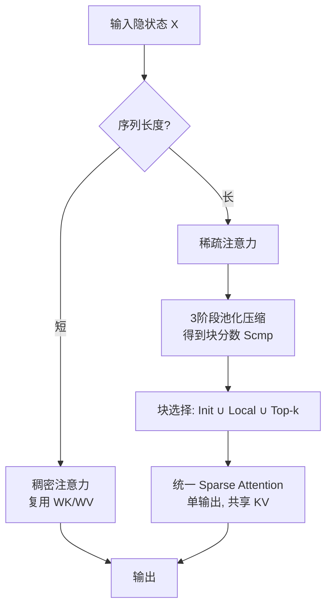

# InfLLM-V2: Dense-Sparse Switchable Attention for Seamless Short-to-Long Adaptation

**会议**: ICLR 2026  
**OpenReview**: [https://openreview.net/forum?id=ZzF9V0H6Vi](https://openreview.net/forum?id=ZzF9V0H6Vi)  
**代码**: [https://github.com/OpenBMB/infllmv2_cuda_impl](https://github.com/OpenBMB/infllmv2_cuda_impl)  
**领域**: 大模型高效推理 / 可训练稀疏注意力 / 长上下文  
**关键词**: 可训练稀疏注意力, 长上下文, 短到长适配, 块稀疏注意力, GQA, FlashAttention, MiniCPM4.1  

## 一句话总结
InfLLM-V2 用「零额外参数、复用稠密注意力权重」的可训练稀疏注意力，让模型按序列长度在稠密/稀疏模式间无缝切换，既贴合「短序列预训练→长序列微调」的主流范式，又通过硬件友好的块选择实现，比稠密注意力快 4× 而保留 98.1% / 99.7% 的长理解 / 长推理性能。

## 研究背景与动机
**领域现状**：长序列处理已是现代 LLM 的刚需（深度研究、长记忆对话、代码仓库理解、长链推理），但标准 Transformer 的自注意力在长序列上有严重的算力与显存瓶颈。稀疏注意力是公认的破局方向，其中**可训练稀疏注意力**（把稀疏性写进训练阶段）相比 training-free 方法能用更高稀疏度而不掉点，代表作是 NSA。

**现有痛点**：NSA 为了同时加速 prefill 和 decode，设计了 Compressed / Selected / Sliding 三个注意力模块，引入**三套独立的 KV 投影参数 + 一个门控 MLP**。这套复杂架构与「短序列预训练、长序列微调」的主流工作流**严重错配**：(1) 从单输出稠密注意力突然切到多输出稀疏架构，会抹掉模型已学到的能力，长序列微调时 loss 剧烈抖动、收敛慢；(2) 三套 KV + 门控在短序列上也被迫全量计算，反而拖慢短序列；(3) 额外参数无法用预训练权重初始化，难以从稠密模型平滑改造。

**核心矛盾**：稀疏注意力要长序列高效，但它带来的架构改动又破坏了短序列性能与短→长适配的平滑性——**稀疏带来的效率收益，被架构错配和块选择开销吃掉了**。

**本文目标**：设计一种稀疏注意力，在长短序列上都高效、且能从稠密模型无缝过渡，不引入任何额外参数。

**核心 idea**：**[参数复用]** 干掉 NSA 的三套 KV 与门控，用**一套共享 KV 投影**（直接复用稠密注意力的预训练权重）支撑稀疏与稠密两种模式；**[模式切换]** 把模式选择交给序列长度——短序列走稠密、长序列平滑切到稀疏，二者计算流程对齐；**[硬件实现]** 把拖后腿的块选择（compression score 计算）融进 FlashAttention 的 SRAM 计算循环里，消除 I/O 瓶颈。

## 方法详解

### 整体框架
InfLLM-V2 建立在 training-free 的块稀疏方法 InfLLM 之上，核心是把 NSA 的三模块多输出架构简化成**单输出、零额外参数、可按长度切换稠密/稀疏**的统一注意力。它复用稠密注意力的 $W_K, W_V$ 作为唯一一套 KV 投影；把 Selected Attention 与 Sliding Attention 取并集合并成统一的 Sparse Attention；丢掉 Compressed Attention 的输出、只保留其注意力分数用于块选择；再用一个无参数的多阶段池化做块表示，并用 Fused Head Group Summation 的 CUDA kernel 把块选择开销压到最小。

### 关键设计

**1. 共享 KV 投影：用一套参数把稠密和稀疏对齐。** InfLLM-V2 发现 NSA 那三套 KV 投影完全没必要——它们既复杂化短→长适配，又拖慢短序列。于是只保留一套 $W_K, W_V$，并直接用预训练稠密注意力的参数初始化，再在长序列上微调。这样稀疏注意力和稠密注意力天然共享同一套 K、V 表示，从稠密切到稀疏不再是「换架构」而只是「换 attention mask」，loss 抖动被压到最小。论文的训练曲线（图 5）显示 NSA 切换时 loss 出现明显断崖，而 InfLLM-V2 的曲线紧贴 FullAttn。

**2. 对齐计算 + 单输出：把三个模块并成一个。** 光共享参数还不够，计算流程也要对齐稠密注意力。NSA 三个模块各自出一路输出再门控聚合，导致短序列也要算全三路。InfLLM-V2 把 Selected Attention 和 Sliding Attention 取并集，并**彻底删掉 Compressed Attention 的输出**、只留它的分数 $S^{cmp}$ 用于选块。对查询 token $i$（位于块 $b_i$），它恒定关注初始块 $I_{init}$ 与局部块 $I_{local}(i)$，再从其余块按 $S^{cmp}$ 取 top-k：

$$I(i) = I_{init} \cup I_{local}(i) \cup I_{topk}(i)$$

由于 Selected 的局部块和 Sliding 的窗口本就重叠，把局部块数扩到 $N_{local} \ge \lceil w/B \rceil + 1$ 即可严格覆盖滑窗，两者合二为一。最终得到一个**单输出**的稀疏模块，形状与稠密注意力一致，因此模型可以仅凭输入长度在两种模式间动态切换。

**3. 三阶段无参数压缩：粗到细地算块分数。** 删掉 Compressed Attention 输出后，原来用于压缩的 MLP 拿不到梯度，于是换成无参数池化。直接用大块 $B$ 一次压缩会丢失细粒度信息，论文改成 3 阶段、由粗到细：先用步长 $s_{C1}$、块长 $l_{C1}$ 做 mean-pooling 得到粗表示 $K^{C1}$ 并算分数 $S^{C1}=\mathrm{Softmax}(Q(K^{C1})^\top)$；再在 GQA 的一个 head group 内对所有头求和得到共享重要度 $S^{shared}=\sum_{h=1}^{G} S^{C1}(h)$，强制组内所有头选同一批块；最后 max-pooling 取最显著特征 $S^{cmp}_i=\mathrm{Max}(S^{shared}_{i\cdot s:i\cdot s+l})$。取 $l_{C1}=B/2, s_{C1}=B/4, l=5, s=4$，在等价压缩比下保留更细的块内信息。

**4. Fused Head Group Summation + LSE 近似：拆掉块选择的 I/O 墙。** 即便用了稀疏注意力，计算 $S^{cmp}$ 本身就是新瓶颈：把第一阶段分数 $S^{C1}$（大小 $h_q n^2/s_{C1}$）写回 HBM 的 I/O 极其昂贵。受 FlashAttention 启发，论文把「head group 求和」直接融进 FlashAttention 的 SRAM 计算循环，只把降维后的 $S^{shared}$（大小 $h_q n^2/(s_{C1}G)$）写回 HBM。但 head group 求和与序列维上的 online-softmax 不可交换，于是用两遍法：第一遍在 SRAM 算出 softmax 归一化所需的 log-sum-exp，第二遍用它算最终分数并在组内求和写回。两遍法会让计算翻倍，因此再加 **LSE 近似**——用更粗的 $S^{C2}$（$s_{C2}=4s_{C1}, l_{C2}=4l_{C1}$）估计 lse，把开销从 2× 降到 1.25×。

## 实验关键数据

模型为 8B GQA backbone（$d=4096, h_q=32, h_{kv}=2$），8T tokens / 4k 长度短序列预训练，再用 5B tokens（0-4k / 4-12k / 12-24k / 24-32k 各 1:1:1:1）做长序列微调。

### 主实验：长上下文理解

RULER（32k）逐子任务平均（稀疏方法中最优加粗，下同）：

| 方法 | RULER Avg. | LongBench ↑ | LongPPL ↓ |
|------|-----------|-------------|-----------|
| FullAttn（微调） | 84.26 | 42.30 | 2.06 |
| Short + YaRN | 40.63 | 37.86 | 5.28 |
| InfLLM（training-free） | 27.94 | 32.30 | 12.01 |
| MInference（training-free） | 73.22 | 41.55 | 2.62 |
| NSA | 59.92 | 37.10 | 4.24 |
| **InfLLM-V2 (Sparse, w/ LSE)** | **82.62** | **42.54** | **2.12** |
| InfLLM-V2 (Dense) | 88.32 | 42.49 | 2.00 |

NSA 训练 loss 虽低，但 LongPPL 偏高（4.24），说明它没真正学到长程依赖；InfLLM-V2 (Sparse) 远超所有稀疏 baseline 且紧贴 FullAttn，切回 Dense 模式甚至超过 FullAttn。

### 长推理 & 通用任务

| 方法 | 长推理 Avg.（MATH-500/AIME/LCB） | 通用 Avg.（MMLU/HumanEval/BBH 等） |
|------|------|------|
| FullAttn | 42.79 | 67.41 |
| NSA | 37.28 | 60.63 |
| InfLLM-V2 (Sparse) | 42.66 | — |
| InfLLM-V2 (Dense) | 40.53 | 66.76 |

长序列微调后切回 Dense 模式，短序列通用任务几乎无损（66.76 vs FullAttn 67.41），而 NSA 掉到 60.63。

### 消融与效率
- **LSE 近似无损**：RULER 上 w/ LSE（82.62）vs w/o LSE（82.09），性能不降反略升，故默认开启。
- **速度**：在 A100、seqlen=32k 上，InfLLM-V2 相对稠密注意力达到约 4× 加速，且短序列可切回稠密、不引入额外参数开销。

### 关键发现
1. NSA 在「短训长调」范式下表现不佳，其大量额外参数才是元凶——这恰恰是 InfLLM-V2 要解决的痛点。
2. 零额外参数 + 共享 KV 让短→长适配只需极少微调即可超越 NSA。
3. 「按长度切换稠密/稀疏」不只是省算力的选项，Dense 模式有时还能反超 FullAttn。

## 亮点与洞察
- **「减法」式创新**：相比 NSA 做加法（三模块三套参数），InfLLM-V2 做减法（合并模块、共享参数、删冗余输出），反而更对齐主流训练范式，工程上也更容易落地。
- **架构与工作流对齐的价值**：论文明确指出 NSA 的失败不在算法本身，而在与「短训长调」工作流的错配，这是一个常被忽视但极实际的视角。
- **真正开源可复现**：基于该框架训练并开源了 MiniCPM4.1-8B 混合推理模型 + CUDA kernel，而非只发论文。
- **硬件协同设计**：Fused Head Group Summation + LSE 近似把块选择这个「稀疏注意力的隐形税」真正消掉，这是从「理论稀疏」到「实际加速」的关键一步。

## 局限与展望
- max-pooling 与 top-k 尚未融进 kernel，作者留作 future work，块选择仍有进一步优化空间。
- 实验主要在 32k 长度、8B 规模上验证，更长上下文（128k+）和更大规模下的表现待考。
- 三阶段压缩的超参（$l_{C1}, s_{C1}, l, s$ 及 LSE 块大小）是经验设定，对不同模型/任务的鲁棒性未充分探讨。
- 依赖 GQA 且 group size 设为 16 才适配块稀疏，对 MHA 或其他注意力变体的迁移性未讨论。

## 相关工作与启发
- **training-free 稀疏**（InfLLM、MInference、StreamingLLM）：靠注意力固有稀疏性加速推理，但稀疏度受限、加速有限——InfLLM-V2 正是 InfLLM 的可训练升级版。
- **可训练稀疏**（NSA、MoBA、SeerAttention）：把稀疏写进训练。MoBA/SeerAttention 只能加速 prefill；NSA 能同时加速 prefill 和 decode 但参数开销大。InfLLM-V2 兼顾两者且零额外参数。
- **硬件友好注意力**（FlashAttention）：InfLLM-V2 的 Fused Head Group Summation 直接借鉴其 SRAM/online-softmax 思路。
- **启发**：当一个新模块要嵌入既有训练范式时，「与已有权重/工作流的对齐程度」往往比「模块本身多强」更决定成败；做加法之前先想能不能做减法。

## 评分
- **新颖性**: ⭐⭐⭐⭐ — 零额外参数 + 稠密/稀疏按长度切换的设计简洁而有效，虽建立在 InfLLM/NSA 之上，但「对齐工作流」的视角与减法式简化很有洞见。
- **实验充分度**: ⭐⭐⭐⭐ — 覆盖长理解、长推理、通用任务三类基准，含训练曲线、消融、A100/4090 双卡效率，且训练真实 8B 模型；更长上下文与更大规模稍欠。
- **写作质量**: ⭐⭐⭐⭐ — 动机清晰、图示（图 1-4）直观，方法分层递进，从架构到 kernel 实现都讲透。
- **价值**: ⭐⭐⭐⭐⭐ — 直接产出并开源 MiniCPM4.1-8B + CUDA kernel，4× 加速近无损，对工业界部署长上下文模型有很高实用价值。

<!-- RELATED:START -->

## 相关论文

- [\[ICLR 2026\] Sparse Attention Adaptation for Long Reasoning](sparse_attention_adaptation_for_long_reasoning.md)
- [\[ICLR 2026\] FSA: An Alternative Efficient Implementation of Native Sparse Attention Kernel](fsa_an_alternative_efficient_implementation_of_native_sparse_attention_kernel.md)
- [\[ICLR 2026\] Understanding and Improving Length Generalization in Hierarchical Sparse Attention Models](understanding_and_improving_length_generalization_in_hierarchical_sparse_attenti.md)
- [\[ICLR 2026\] Short Window Attention Enables Long-Term Memorization](short_window_attention_enables_long-term_memorization.md)
- [\[ICLR 2026\] Tactic: Adaptive Sparse Attention with Clustering and Distribution Fitting for Long-Context LLMs](tactic_adaptive_sparse_attention_with_clustering_and_distribution_fitting_for_lo.md)

<!-- RELATED:END -->
