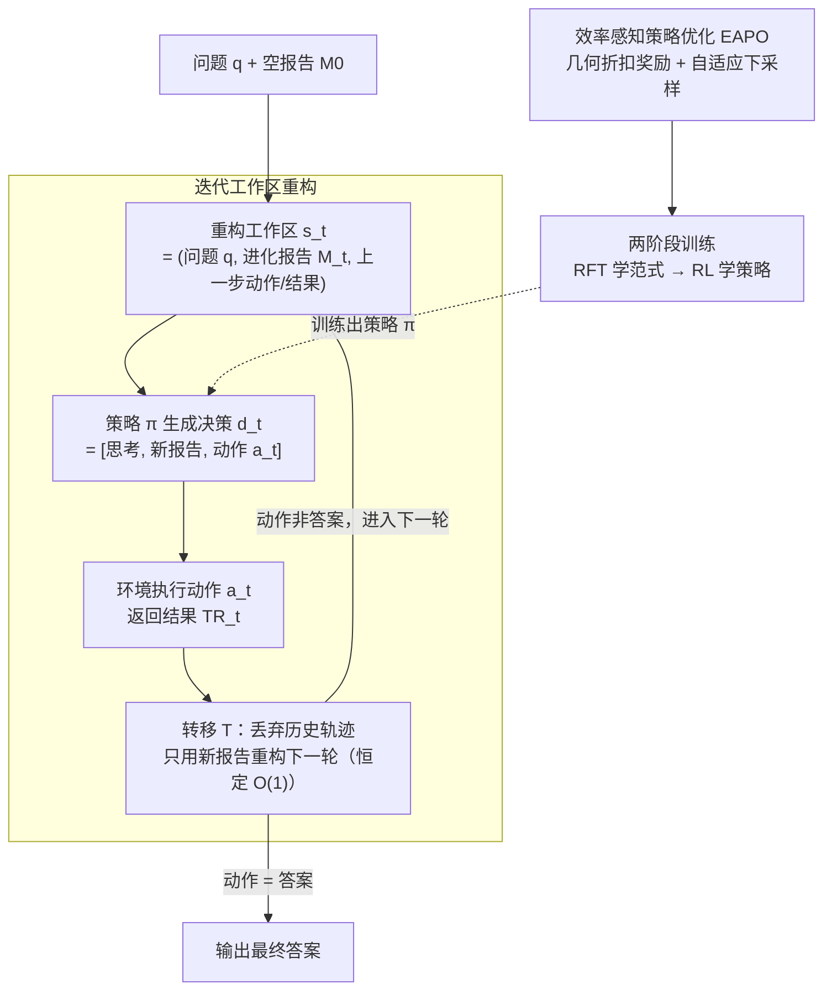

# IterResearch: Rethinking Long-Horizon Agents with Interaction Scaling

**会议**: ICLR 2026  
**arXiv**: [2511.07327](https://arxiv.org/abs/2511.07327)  
**代码**: 有  
**领域**: LLM效率  
**关键词**: 深度研究Agent, 迭代工作区, MDP框架, 交互扩展, 强化学习

## 一句话总结
提出 IterResearch，一种基于MDP的迭代深度研究范式，通过周期性工作区重构替代单上下文线性累积，使Agent在40K上下文长度下扩展到2048次交互（性能从3.5%提升至42.5%），在6个benchmark上平均超出开源Agent 14.5个百分点。

## 研究背景与动机
深度研究Agent（如 OpenAI Deep Research、Gemini Deep Research）通过自主推理和信息检索来构建知识，但现有开源方法采用"单上下文范式"（mono-contextual paradigm）——将所有检索信息和推理步骤追加到一个不断膨胀的上下文窗口中。这导致两个根本问题：

**上下文窒息 (Context Suffocation)**：随着上下文填满，可用于模型推理的空间逐渐缩小，迫使回复越来越简短，最终退化为过早或肤浅的结论

**噪声污染 (Noise Contamination)**：不相关的搜索结果和早期探索错误永久嵌入上下文，产生级联干扰

核心idea：有效的长视野研究需要**周期性综合和策略性遗忘**——定期将发现压缩为进化中的报告，然后基于报告而非完整历史继续探索。这将状态维度从 $O(t)$ 降至 $O(1)$。

## 方法详解

### 整体框架
IterResearch 想解决的是深度研究 Agent 在长程任务上"越走越差"的问题：根因在于主流的单上下文范式把每一轮的检索结果和推理步骤都追加进同一个不断膨胀的窗口，导致上下文窒息与噪声污染。它的破法是把深度研究重新建模成一个马尔可夫决策过程 $\langle\mathcal{S},\mathcal{D},\mathcal{E},\mathcal{T},R\rangle$，让 Agent 不再背着全部历史前进，而是每一轮都在一个大小恒定的"工作区"上重新出发。

整条流程是一个回环。每轮开始，Agent 拿到一个重构出来的工作区状态 $s_t = (q, \mathcal{M}_t, \{a_{t-1}, \text{TR}_{t-1}\})$，里面只有三样东西——固定不变的问题 $q$、一份滚动更新的进化报告 $\mathcal{M}_t$、以及上一步的动作及其返回结果；策略 $\pi$ 据此产出一个结构化决策 $d_t = [\text{Think}_t, \mathcal{M}_{t+1}, a_t]$，即先思考、把新发现写进更新后的报告、再发出动作；环境执行动作后返回结果 $\text{TR}_t$，转移函数随即丢弃整条历史轨迹、只用新报告重构出下一轮工作区 $s_{t+1}$。如此循环，直到动作变成"给出最终答案"才终止。这套范式要真正高效运转，还需要配套的训练：用 EAPO 给探索施加"快而准"的效率压力，再用两阶段训练让 Qwen3-30B-A3B 先学会范式、后学好策略。

### 关键设计

**1. 迭代工作区重构：让状态维度从 $O(t)$ 塌缩到 $O(1)$**

针对单上下文范式"越走越窒息、噪声永久残留"的痛点，IterResearch 不再把每轮的检索和推理堆进同一个膨胀窗口，而是每一轮都重建一个大小恒定的工作区。轮 $t$ 的状态 $s_t = (q, \mathcal{M}_t, \{a_{t-1}, \text{TR}_{t-1}\})$ 只装三样东西：固定不变的问题 $q$、进化报告 $\mathcal{M}_t$（把历史发现压缩成的一份动态文档）、以及上一步的动作及其返回结果。Agent 每步产出决策 $d_t = [\text{Think}_t, \mathcal{M}_{t+1}, a_t]$——先思考、再把新发现写进更新后的报告、最后发出动作；转移函数随即丢弃历史轨迹、重构出 $s_{t+1} = (q, \mathcal{M}_{t+1}, \{a_t, \text{TR}_t\})$。这样单上下文范式里 $|s_t| \propto O(t)$ 的线性膨胀，在这里被压成 $|s_t| \approx O(1)$。关键在于报告本身由 LLM 自然生成，直接复用它的信息压缩和相关性过滤能力——"策略性遗忘"不需要任何额外算法，过期轨迹被忘掉，有价值的发现通过报告滚动保留。

**2. 效率感知策略优化（EAPO）：训练 Agent 快而准地探索，而不是无止境地搜**

光有恒定工作区还不够，如果 Agent 学不会"尽早收敛"，它仍会把交互预算浪费在漫无目的的检索上。EAPO 用两个组件施加效率压力。其一是几何折扣奖励 $r_t = \gamma^{T-t} \cdot R_T$：终局奖励 $R_T$ 沿轨迹向前按 $\gamma$ 折扣，越靠后的步骤折扣越狠，于是越快拿到正确答案、每一步分到的奖励就越高，形成一种隐式的"快点结束"压力。其二是自适应下采样：迭代范式下每条轨迹会自然拆成多个训练样本（每轮算一个），不同问题拆出的样本数参差不齐，因此把总样本数截断到数据并行（DP）size 的最大整数倍 $|\mathcal{C}_{\text{train}}| = \lfloor|\mathcal{C}|/\text{DP}_{\text{size}}\rfloor \times \text{DP}_{\text{size}}$，保证各 DP rank 负载均衡。整套优化基于 GSPO 算法实现，训练目标沿用 PPO 风格的 clip 和 group 内优势归一化。

**3. 两阶段训练：先学会范式，再学会策略**

模型分两步成型。第一阶段 RFT（拒绝采样微调）让 Qwen3-30B-A3B 骨干先掌握迭代范式的基本动作——怎么读报告、怎么更新报告、怎么发动作；第二阶段 RL 再用 EAPO 优化搜索策略与推理深度，把"会用"打磨成"用得高效"。选 Qwen3-30B-A3B 这个 MoE 骨干，是为了在性能和推理效率之间取得平衡。

## 实验关键数据

### 主实验

| 模型 | HLE | BC | BC-zh | GAIA | Xbench-DS | SEAL-0 |
|------|-----|-----|-------|------|-----------|--------|
| WebSailor-72B | 9.8 | 12.0 | 30.1 | 55.4 | 55.0 | 19.8 |
| MiroThinker-32B | 19.1 | 17.2 | 29.4 | 64.1 | 56.0 | — |
| **IterResearch-30B-A3B** | **28.8** | **37.3** | **45.2** | **72.8** | **71.0** | **39.6** |
| 提升 | +8.8 | +20.1 | +15.8 | +8.7 | +15.0 | +18.9 |
| OpenAI DeepResearch | 26.6 | 51.5 | 42.9 | 67.4 | — | — |

### 交互扩展消融

| 最大交互次数 | BrowseComp 准确率 |
|------------|-----------------|
| 2 | 3.5% |
| 32 | ~15% |
| 128 | ~28% |
| 512 | ~35% |
| 2048 | **42.5%** |

### 关键发现
- 在6个benchmark上平均超出最佳开源Agent 14.5pp
- 在HLE和BC-zh上超越OpenAI DeepResearch
- 交互扩展到2048次实现12倍性能提升，表明长视野任务的难度可能源于探索容量不足
- 跨范式知识迁移：用 IterResearch 生成的轨迹去训练单上下文 Agent 同样能提升其性能
- 作为零训练的提示策略用于GPT-4o在BrowseComp上+19.2pp，证明范式本身的通用价值

## 亮点与洞察
- MDP建模的"策略性遗忘"思想优雅——进化报告就是压缩的状态表示，完美契合MDP的马尔可夫性
- 交互扩展的发现意义重大——说明当前Agent的"失败"更多是因为探索不够而非能力不够
- 跨范式知识迁移和零训练提示策略两个发现拓展了方法的应用边界

## 局限与展望
- 报告质量是关键瓶颈——如果重要信息在摘要中丢失，后续推理将受影响
- 每轮重构意味着需要再次理解报告，可能有冗余计算
- 仅在Qwen3-30B-A3B上训练，更大/更小模型的表现需验证
- 几何折扣奖励的 $\gamma$ 选择可能是敏感超参

## 相关工作与启发
- **vs WebThinker/WebDancer**: 这些方法使用单上下文范式，不可避免地遭遇上下文窒息
- **vs InftyThink**: 类似的迭代+摘要思想但应用于推理任务，IterResearch面向信息检索Agent

## 评分
- 新颖性: ⭐⭐⭐⭐⭐ MDP建模+迭代工作区重构是研究Agent范式的重要突破
- 实验充分度: ⭐⭐⭐⭐⭐ 6个benchmark、交互扩展、跨范式迁移、零训练提示多维度验证
- 写作质量: ⭐⭐⭐⭐⭐ 问题动机清晰，方法形式化严谨
- 价值: ⭐⭐⭐⭐⭐ 直接推进了深度研究Agent的SOTA，实用价值极高

<!-- RELATED:START -->

## 相关论文

- [\[ICLR 2026\] Demystifying and Enhancing the Efficiency of Large Language Model Based Search Agents](demystifying_and_enhancing_the_efficiency_of_large_language_model_based_search_a.md)
- [\[ICLR 2026\] Scaling Attention via Feature Sparsity](scaling_attention_via_feature_sparsity.md)
- [\[ICLR 2026\] Scaling Up, Speeding Up: A Benchmark of Speculative Decoding for Efficient LLM Test-Time Scaling](scaling_up_speeding_up_a_benchmark_of_speculative_decoding_for_efficient_llm_tes.md)
- [\[ICLR 2026\] STEM: Scaling Transformers with Embedding Modules](stem_scaling_transformers_with_embedding_modules.md)
- [\[ICML 2026\] STAR: Rethinking MoE Routing as Structure-Aware Subspace Learning](../../ICML2026/llm_efficiency/star_rethinking_moe_routing_as_structure-aware_subspace_learning.md)

<!-- RELATED:END -->
