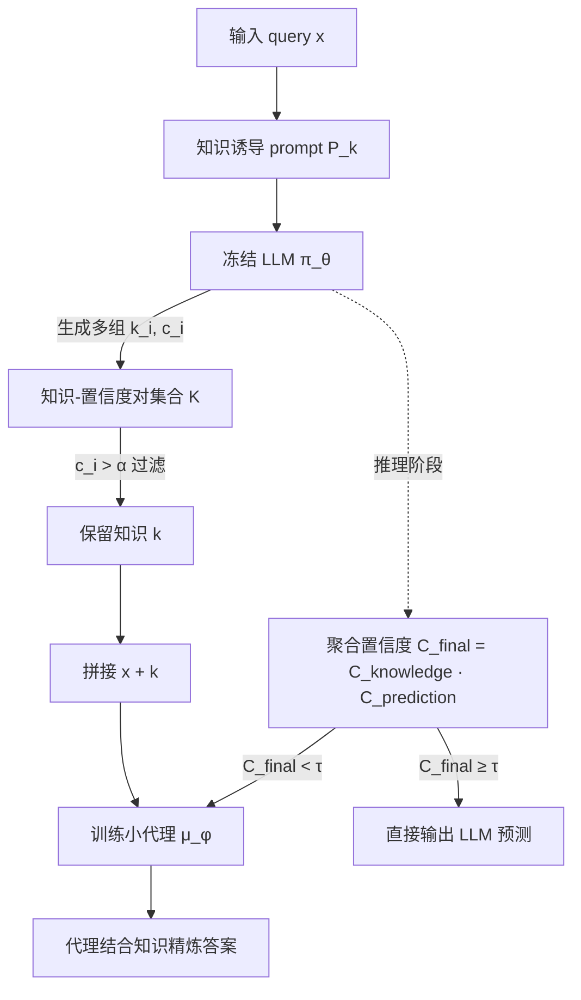

# KnowProxy: Adapting Large Language Models by Knowledge-guided Proxy

**会议**: ICLR 2026  
**OpenReview**: [https://openreview.net/forum?id=14f18NoEqO](https://openreview.net/forum?id=14f18NoEqO)  
**代码**: [https://github.com/2gukhyeon/KnowProxy](https://github.com/2gukhyeon/KnowProxy)  
**领域**: LLM 高效适配 / 代理微调 / 黑盒大模型  
**关键词**: proxy-tuning, knowledge-guided, black-box LLM, adaptive routing, uncertainty  

## 一句话总结
KnowProxy 用一个小代理模型「学会消化」冻结大模型生成的文本知识来适配下游任务，从而摆脱了传统代理微调对大模型概率分布的依赖，让黑盒 LLM 也能被高效微调，并用动态路由只在大模型不确定时才调用代理。

## 研究背景与动机
**领域现状**：直接微调动辄数十亿参数的 LLM 既昂贵又常常不可行，闭源大模型更是无法改动。一条有前景的折中路线是「代理微调」——冻住大模型，只训练一个小模型来调节它的输出，典型代表是 Proxy-tuning（用轻量模型重加权 LLM 的概率分布）和 CombLM（训练独立小模型并把它的预测分布与 LLM 融合）。

**现有痛点**：这些方法都把**概率分布**当作通信媒介，由此带来两个硬约束。其一，它们要求能访问 LLM 的完整输出分布、且大小模型共享同一词表，这在只返回文本的黑盒 API（ChatGPT、GPT-5 等）上根本无法满足。其二，近期研究表明 LLM 生成的概率分布本身就**不稳定、不可靠**，在 QASC、BoolQ 等基准上，基于分布的代理方法甚至打不过大模型自己的 zero-shot 推理。

**核心矛盾**：代理微调的吸引力在于「不碰大模型参数也能适配」，但它选择的通信通道（概率分布）恰恰是黑盒场景里拿不到、且本身质量存疑的东西——通道的脆弱性反过来限制了整个范式的适用面与稳定性。

**本文目标**：设计一种**不依赖概率分布**的代理适配框架，既能用于黑盒 LLM，又能避开分布不稳定带来的性能退化，同时控制住「每次都要跑代理」的额外推理开销。

**核心 idea（知识替代分布）**：把通信媒介从概率分布换成**文本知识**——先用 prompt 从冻结 LLM 中诱导出解题所需的文本知识与推理，再让小代理模型在「原始 query + 诱导知识」上做标准监督训练，学会把大模型的推理映射到目标任务分布；推理时再用**置信度聚合的动态路由**，只在大模型不靠谱时才唤醒代理。

## 方法详解

### 整体框架
KnowProxy 把传统代理微调目标 $\min_\phi -\mathbb{E}_{(x,y)\sim D}[\log \mu_\phi(y\mid x)\pi_\theta(y\mid x)]$（依赖 LLM 分布 $\pi_\theta(y\mid x)$）重写为知识引导目标 $\min_\phi -\mathbb{E}_{(x,y)\sim D}[\log \mu_\phi(y\mid x, k)]$，其中 $k\sim\pi_\theta(k\mid x)$ 是 LLM 以文本形式吐出的知识。整条流水线分三步：训练前用 prompt 从冻结 LLM 批量诱导每条样本的知识与置信度并过滤，训练时把知识拼进代理输入做监督微调，推理时用聚合置信度决定走 LLM 还是走代理。

### 关键设计

**1. 文本知识诱导与置信度过滤：把分布通道换成可读、可筛的知识通道。** 对每条 query $x$，KnowProxy 用知识诱导 prompt $P_k$ 让 LLM 输出知识片段及其置信度 $k, c = \pi_\theta(P_k, x)$，这里的「知识」被宽泛地定义为解题线索——底层原理、推理步骤或相关事实。关键在于它**不只取一次输出**，而是生成多组知识-置信度对，以覆盖不同推理路径、避免对单次抽取的过度依赖。由于 LLM 生成的知识可能含幻觉或无关内容，框架再做一道置信度过滤 $k = \{k_i \mid (k_i, c_i)\in K,\ c_i > \alpha\}$，只保留置信度高于阈值 $\alpha$ 的知识，最终拼成知识增强数据集 $D_K = \{(x_i, k_i, y_i)\}$。这一步把「概率分布」这个黑盒里拿不到的量，换成了文本这种任何 API 都返回、且能被显式审查筛选的载体，黑盒适用性与稳定性都来自于此。

**2. 知识引导的代理优化：让小模型内化大模型的推理而非模仿其分布。** 拿到知识增强数据集后，把 query $x$ 与过滤后的知识 $k$ 拼接成增强输入，用一个标准监督目标训练小代理 $\mu_\phi$。这一步的设计意图是让代理学会「读懂并复用」LLM 写出的推理，再把它对齐到具体任务的输出分布上，相当于让小模型在大模型的思路之上做任务特化。消融显示这是最关键的一环：去掉 adaptation（只在推理时塞知识、不训练代理消化）会带来最大的性能跌幅（平均 81.0→75.1）。值得注意的是，作者发现训练时若把 **LLM 的预测答案**也喂进去（w/ LLM answer）反而更差（81.0→77.5），原因是 LLM 的错误预测会沿训练过程传播污染代理——所以 KnowProxy 刻意只用知识、不用大模型的最终答案。

**3. 多粒度置信度聚合的动态路由：把「永远调用代理」改成「按需调用」。** 代理范式的通病是每条 query 都要额外跑一遍小模型。KnowProxy 在推理阶段引入路由：先复用知识诱导 prompt 顺带让 LLM 给出预测及其置信度 $C_\text{prediction}$，再把所有生成知识的置信度连乘聚合 $C_\text{knowledge} = \prod_{k=1}^{K} c_k$，得到最终可靠性 $C_\text{final} = C_\text{knowledge}\cdot C_\text{prediction}$。路由判据为
$$
y = \begin{cases} \pi_\theta(y\mid x), & \text{if } C_\text{final}\ge\tau \\ \mu_\phi(y\mid x, k\sim\pi_\theta(k\mid x)), & \text{if } C_\text{final}<\tau \end{cases}
$$
即聚合置信度高于阈值 $\tau$ 时直接采信 LLM、省去代理；低于阈值才唤醒代理结合知识精炼。这里的巧思在于路由信号不止看预测级置信度，而是**逐条知识**地估计不确定性——低置信知识本身就是「LLM 推理可能在打滑」的早期信号，比单一预测置信度更细粒度。聚合时连过滤掉的知识置信度也一并计入，以反映 LLM 对该 query 的整体理解程度。

## 实验关键数据

### 主实验表格
Llama-3.2-3B 作冻结 LLM、Llama-3.2-1B 作代理，9 个推理基准测试准确率（%）：

| 方法 | OBQA | ARCh | PIQA | CSQA | QASC | SIQA | WNGR | StrategyQA | BoolQ | Avg. |
|---|---|---|---|---|---|---|---|---|---|---|
| Fine-tuning LLM（上界） | 82.2 | 76.2 | 87.7 | 79.5 | 82.9 | 80.5 | 87.3 | 71.5 | 86.9 | 81.6 |
| Fine-tuning SLM | 73.2 | 60.9 | 80.3 | 72.0 | 68.0 | 74.9 | 75.4 | 66.5 | 85.4 | 73.0 |
| Chain-of-Thought | 77.6 | 80.0 | 75.6 | 73.1 | 79.0 | 68.6 | 57.8 | 69.0 | 76.7 | 73.1 |
| Proxy-tuning | 77.2 | 69.6 | 80.1 | 70.8 | 69.9 | 72.6 | 65.7 | 64.6 | 76.2 | 71.9 |
| CombLM | 78.6 | 72.6 | 81.1 | 72.5 | 76.9 | 73.7 | 69.3 | 67.2 | 76.8 | 74.3 |
| BBox-Adapter | 76.2 | 68.6 | 73.8 | 73.3 | 73.8 | 72.7 | 53.7 | 69.0 | 70.5 | 70.2 |
| **KnowProxy (ours)** | **80.2** | **75.2** | **83.4** | **75.0** | **78.1** | **76.3** | **77.8** | **72.9** | **85.1** | **78.2** |

KnowProxy 平均 78.2，全面超越所有代理基线（最优 CombLM 74.3），并在 OBQA/ARCh/StrategyQA/BoolQ 等任务上逼近甚至持平直接微调大模型（StrategyQA 上 72.9 反超微调的 71.5）。

跨 backbone（含黑盒与量化），代理固定 Llama-3.2-1B：

| LLM | Zero-shot Avg. | KnowProxy Avg. | Fine-tuning Avg. |
|---|---|---|---|
| Mistral-7B | 67.0 | 76.6 | 81.0 |
| Llama-2-13B（4-bit 量化） | 57.1 | 73.4 | 79.9 |
| ChatGPT（gpt-3.5-turbo，黑盒） | 76.9 | 80.9 | — |

黑盒 ChatGPT 上 KnowProxy（80.9）超过同为答案选择的 BBox-Adapter（79.4），证明无须分布访问即可适配 API 模型。

### 消融实验表格
ChatGPT backbone 下各组件贡献（准确率 %）：

| 变体 | OBQA | PIQA | StrategyQA | SIQA |
|---|---|---|---|---|
| **KnowProxy** | **85.0** | **87.2** | **74.7** | **77.0** |
| w/o routing | 82.0 | 87.2 | 74.7 | 76.8 |
| w/o filtering | 85.0 | 86.2 | 72.1 | 76.0 |
| w/o adaptation | 80.6 | 85.1 | 59.4 | 75.3 |
| w/ LLM answer | 76.8 | 83.7 | 72.9 | 76.4 |

### 关键发现
- **知识适配是命脉**：去掉 adaptation 平均从 81.0 跌到 75.1，是最大降幅；StrategyQA 直接从 74.7 崩到 59.4。
- **路由几乎不损精度**：去掉 routing 只从 81.0 微降到 80.2，说明它主要换来效率而非牺牲准确率——简单 query 交给 LLM、难 query 才走代理。
- **不要喂大模型的答案**：w/ LLM answer 反而降到 77.5，因为 LLM 的错误预测会向代理传播误差。
- **路由可靠性**：随置信度阈值升高，KnowProxy 路由给 LLM 处理的样本准确率单调上升，而单一预测级置信度（Tian et al.）几乎是平线——多粒度知识置信度聚合才提供了有意义的路由信号。
- **代理可换、规模可缩**：换成 LaMini-GPT-0.7B、Qwen2.5-0.5B 仍稳定提升 zero-shot，且增益与小模型能力正相关，符合 scaling law 直觉。

## 亮点与洞察
- **媒介之变**：本质洞察是把代理微调的「通信协议」从脆弱、私有的概率分布换成稳健、公开的文本知识，一举打通黑盒适配并规避分布不稳定，是对整个代理范式约束的釜底抽薪。
- **逐条知识的置信度比预测级置信度更会路由**：把不确定性下沉到知识粒度，让「LLM 推理是否在打滑」这一信号被更早、更细地捕捉，路由因此真的可靠。
- **只学思路、不抄答案**：刻意排除 LLM 的最终预测，避免错误传播，体现了对「蒸馏什么」的精细取舍。

## 局限与展望
- **依赖 LLM 的知识质量与自评置信度**：若大模型生成的知识系统性偏差或置信度校准糟糕，过滤与路由都会受连累，论文未深入探讨极端不可靠 backbone 的情形。
- **额外的知识诱导开销**：每条样本需多次 prompt 生成多组知识，训练前的数据构造与推理时的知识生成都带来调用成本，路由只缓解了代理调用、未消除知识诱导本身的开销。
- **阈值需经验调参**：过滤阈值 $\alpha$ 与路由阈值 $\tau$ 均为经验设定，跨任务迁移时的鲁棒性与自适应化是自然的下一步。
- **任务范围**：实验集中在推理类 QA 基准，生成式与长程任务上的表现仅在附录略有涉及，泛化边界仍待拓展。

## 相关工作与启发
- **代理微调谱系**：Proxy-tuning（重加权 LLM 分布）、CombLM（融合小模型分布）是直接对标对象，KnowProxy 用文本知识替代分布是对这一谱系的关键松绑；BBox-Adapter 则代表「答案选择」式的另一条黑盒适配路线。
- **LLM 不确定性诱导**：承接 Tian et al.、Xiong et al. 等用 prompt 从文本输出估计置信度的工作，但创新在于把不确定性从预测级细化到知识级，用于路由而非仅评估事实性。
- **启发**：当某个范式的瓶颈来自它选择的「接口/媒介」而非任务本身时，换一个更通用、更稳健的媒介（如此处的文本 vs 分布）往往比在原媒介上修补更有效——这对黑盒模型蒸馏、API 时代的模型适配都有方法论意义。

## 评分
- **新颖性**: ⭐⭐⭐⭐ — 用文本知识替代概率分布作为代理微调媒介、并配多粒度置信度路由，对成熟范式做了清晰而本质的松绑，思路简洁但切中要害。
- **实验充分度**: ⭐⭐⭐⭐ — 覆盖 9+ 推理基准、多种开源/黑盒/量化 backbone 与多种小模型，消融与路由可靠性分析到位；生成式与长程任务覆盖偏弱。
- **写作质量**: ⭐⭐⭐⭐ — 问题动机、目标重写与方法推导层次分明，图表清晰，公式与文字配合良好。
- **价值**: ⭐⭐⭐⭐ — 让闭源黑盒 LLM 也能被低成本适配，且无须访问分布，工程落地价值高，对 API 时代的模型定制很实用。

<!-- RELATED:START -->

## 相关论文

- [\[ICML 2026\] Proxy Compression for Language Modeling](../../ICML2026/llm_efficiency/proxy_compression_for_language_modeling.md)
- [\[ICLR 2026\] DND: Boosting Large Language Models with Dynamic Nested Depth](dnd_boosting_large_language_models_with_dynamic_nested_depth.md)
- [\[ICLR 2026\] Deep Hierarchical Learning with Nested Subspace Networks for Large Language Models](deep_hierarchical_learning_with_nested_subspace_networks_for_large_language_mode.md)
- [\[ICLR 2026\] UltraLLaDA: Scaling the Context Length to 128K for Diffusion Large Language Models](ultrallada_scaling_the_context_length_to_128k_for_diffusion_large_language_model.md)
- [\[ICLR 2026\] ParaRNN: Unlocking Parallel Training of Nonlinear RNNs for Large Language Models](pararnn_unlocking_parallel_training_of_nonlinear_rnns_for_large_language_models.md)

<!-- RELATED:END -->
