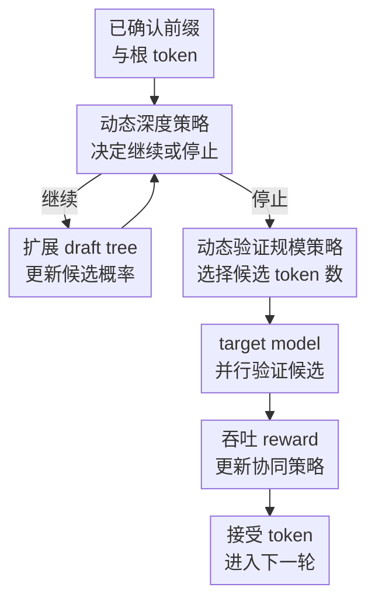

# Learning To Draft: Adaptive Speculative Decoding with Reinforcement Learning

**会议**: ICLR 2026  
**OpenReview**: [https://openreview.net/forum?id=IK9cbzzXLt](https://openreview.net/forum?id=IK9cbzzXLt)  
**代码**: https://github.com/zhzihao/Learning-to-Draft  
**领域**: LLM效率 / 推理加速 / Speculative Decoding  
**关键词**: speculative decoding, LLM推理加速, draft tree, PPO, 吞吐优化  

## 一句话总结
LTD 把树状 speculative decoding 中“draft 到多深”和“验证多少候选 token”建模成两个协同的强化学习策略，直接用每轮 draft-and-verify 的吞吐量作为 reward，在 Eagle3 上稳定提升 LLM 推理速度。

## 研究背景与动机
**领域现状**：大语言模型推理越来越依赖长链路、多步推理，输出质量提高的同时也带来了明显延迟。Speculative decoding 是当前比较实用的一类无损加速方法：用更小、更快的 draft model 先猜一批候选 token，再让 target model 并行验证这些候选，从而减少昂贵 target model 的逐 token 前向次数。

**现有痛点**：speculative decoding 的速度并不只由“猜对了多少 token”决定。树状 draft 方法如 Eagle3 可以一次生成较大的候选树，提升平均接受长度 $L_A$，但 draft 树越深、候选 token 越多，draft model 的顺序生成时间和 target model 的验证时间也会一起上涨。很多方法仍使用固定 depth 和固定 verification size，或者只根据概率、熵、隐藏状态等信号追求更长 acceptance length；这会出现一个尴尬局面：模型猜得更多了，但验证这些候选的时间把收益吃掉了。

**核心矛盾**：真正要优化的是吞吐量，而不是单独优化 draft 质量或验证规模。论文把每个 draft-and-verify cycle 的吞吐定义为 $\lambda_c=L_A/T_{total}$，其中 $T_{total}=T_{draft}+T_{verify}$。如果只扩大 draft depth，会线性增加 draft time；如果只扩大 verification size，target model 的验证时间会阶梯式增长；如果只缩小二者，又可能浪费 target model 并行验证能力。因此关键矛盾是：如何在当前上下文下动态分配 draft 和 verify 两侧的时间预算。

**本文目标**：作者希望让系统在每一轮生成时回答两个问题：draft model 是否还值得继续扩展候选树？target model 应该验证多少个候选 token？这两个问题不能孤立回答，因为更深的 draft 树会改变候选 token 的质量和数量，而更大的验证预算又会反过来决定 draft 树是否值得继续长下去。

**切入角度**：论文观察到 draft depth、verification size、上下文长度和候选 token 概率都能预测当前 cycle 的收益与成本，但这些信号和最终 wall-clock throughput 的关系很难手写规则。于是作者不再把动态调度写成启发式，而是把 draft model 与 target model 的交互看成一个强化学习环境，让轻量策略网络从真实吞吐 reward 中学习何时停、验多少。

**核心 idea**：用两个协同训练的轻量 PPO 策略替换 Eagle3 的静态 draft/verify 超参，让 speculative decoding 直接围绕每轮吞吐 $L_A/(T_{draft}+T_{verify})$ 做自适应调度。

## 方法详解
### 整体框架
LTD 建在 Eagle3 的树状 speculative decoding 框架上，不改变 target model 的输出分布，只改变每轮候选树的生成深度和验证规模。每个 cycle 从上一个已确认 token 出发，draft model 用 beam-search-like 的方式扩展 draft tree；depth policy 在每次 draft forward 后决定继续还是停止；停止后 size policy 根据整棵候选树决定送给 target model 验证的 token 数；target model 并行验证后得到 acceptance length 和耗时，系统用本轮 throughput 作为 reward 更新策略。

普通 Eagle3 的关键超参是固定的：draft depth 默认为 8，verification size 也按模型预设或网格搜索确定。LTD 的改动集中在两个可学习决策上。depth policy 的动作空间是二元的 $\{0,1\}$，表示在当前 draft 深度后继续扩展或停止；size policy 的动作空间是离散的 verification size，范围约为 $[20,240]$。两者都被实现成很小的 MLP，论文在附录中报告额外策略开销低于约 1.5%，因此策略本身不会抵消推理加速收益。

### 关键设计
**1. 吞吐 reward：把目标从“猜得长”改成“跑得快”**

这篇论文最关键的转向是不用 acceptance length 当唯一目标。每个 draft-and-verify cycle 的 reward 直接设为 $R_t=L_A/(T_{draft}+T_{verify})$，其中 $L_A$ 是本轮 target model 接受的 token 数，$T_{draft}$ 是 draft tree 生成时间，$T_{verify}$ 是 target model 验证时间。这样一来，策略不会单纯偏好更深的树或更大的候选集合；只有当额外 token 带来的接受收益超过额外时间成本时，继续扩展或扩大验证才会被奖励。

这个设计解决了以往动态方法的偏差。用 acceptance length 做 reward 时，策略容易提交过多候选 token，表面上 $\tau$ 很高，但 target model 验证时间也被拉长；用 time cost 做 reward 时，策略又会过度保守，候选 token 太少，浪费 speculative decoding 的并行验证优势。throughput reward 把这两端统一到同一个标尺里，因此能学到“少一点但更划算”的候选分配。

**2. 动态深度策略：让 draft tree 在低收益位置及时停止**

draft depth 决定 draft model 要连续前向多少轮。树越深，候选路径越多，理论上可能提高接受长度；但 draft model 的扩展是顺序发生的，时间成本大致随深度增长。LTD 的 depth policy 在每次扩展后观察当前深度 $D$、上下文长度 $L$ 以及最新一层候选 token 的概率，输出 continue 或 stop。它只看最后一层概率而不是整棵树，是为了降低频繁调用策略时的延迟。

这种策略特别适合处理上下文难度变化。若当前候选概率已经明显塌陷，继续扩展深层 draft tree 大概率只会制造低质量候选，target model 也很快会在浅层 mismatch 处截断；此时提前停止能省 draft time。若当前分布稳定、候选路径可信，策略可以继续扩展，让 target model 一次验证更长的潜在正确序列。它不是固定“深一点”或“浅一点”，而是把深度当成逐轮条件动作。

**3. 动态验证规模策略：让 target model 只验证值得验证的候选**

当 draft tree 已经生成后，所有候选 token 并不都值得送进 target model。Eagle3 会从树中按概率挑固定数量的 token；LTD 的 size policy 则观察当前深度 $D$、上下文长度 $L$ 和整棵 draft tree 的候选概率 $P_1,\ldots,P_{V_{all}}$，选择本轮 verification size $V$。候选被 flatten 成序列并配合 tree attention mask 交给 target model 一次性验证。

这个策略把验证预算变成上下文相关的资源分配。若 draft tree 里高概率候选集中且可信，较大的 $V$ 可以利用 target model 的并行验证能力换来更长 acceptance length；若候选概率长尾很差，继续塞入低质量 token 只会增加验证时间。论文在 Qwen3-32B 上的结果很有代表性：LTD 的平均接受长度反而低于 grid-search Eagle3，但由于显著减少 verification time，最终 speedup 提升很多。

**4. 交替协同训练：避免两个策略各自最优却组合低效**

depth policy 和 size policy 相互依赖：depth policy 选择的树深度会影响 size policy 可选择的候选集合，size policy 的验证预算又决定了更深 draft tree 是否值得。论文先分别训练初始策略，再做交替优化：固定 size policy 训练 depth policy，随后固定更新后的 depth policy 训练 size policy，如此迭代。实验证明 naive 组合两个独立策略不如交替训练后的 LTD。

这个协同训练让两条策略形成共同语言。附录中的分布分析显示，初始组合更像固定模式，主要聚集在浅 depth 和小 token budget 区域；最终 LTD 会根据 acceptance length 的难易程度改变策略。例如在容易接受较长序列时，它倾向于 deeper tree + larger token budget；在更难生成的位置，它也会采用 shallow but wide 的策略，用较浅 draft 降低顺序成本，同时用更多候选缓冲不确定性。

### 一个完整示例
假设当前前缀是 “It”，Eagle3 式 draft model 会从根 token 开始扩展候选树。第一层可能给出 “is”“has”等候选；继续扩展后，“is” 下可能接 “a”“the”，不同路径带有累计概率。静态 Eagle3 会按固定 depth 继续扩到预设深度，再固定挑比如 60 个 token 给 target model 验证。

在 LTD 中，depth policy 会在每次扩展后检查当前深度、上下文长度和最新候选概率。如果在深度 3 时候选仍很集中，它可能继续；如果概率已经分散、低质量分支增多，它会停止。停止后，size policy 不会机械选择固定 60 个 token，而是根据整棵树的概率形态选择本轮验证规模，例如只选 40 个最有希望的候选，或在高置信上下文下扩大到 100 个以上。target model 并行验证这些候选后，若接受了 3 个 token 且本轮 draft 与 verify 总耗时较低，则 reward 较高；如果接受了更多 token 但验证时间暴涨，reward 未必更好。

这个例子说明 LTD 学到的不是“树越大越好”，而是“当前轮多花的时间值不值”。这也是它能在高温采样和不同任务上保持收益的原因：策略最终对齐的是实际吞吐，而不是某个间接代理指标。

### 损失函数 / 训练策略
两条策略都用 PPO 训练。给定状态 $s_t$ 和动作 $a_t$，论文采用 clipped PPO objective：

$$
J(\theta)=\hat{E}_t\left[\min\left(r_t(\theta)\hat{A}_t,\mathrm{clip}(r_t(\theta),1-\epsilon,1+\epsilon)\hat{A}_t\right)\right],
$$

其中 $r_t(\theta)=\pi_\theta(a_t|s_t)/\pi_{\theta_{old}}(a_t|s_t)$，$\hat{A}_t$ 是 advantage estimate。size policy 的 actor 和 critic 是两层 MLP，隐藏维度为 $[1024,256]$，折扣因子 $\gamma=0.9$；depth policy 为了降低频繁决策开销，actor 使用单隐藏层 1024 的轻量结构，并设置更高的 $\gamma=0.999$，避免策略过早偏向 stop。

训练数据使用 HumanEval，因为代码生成样本包含较多复杂上下文，能迫使策略学到多样的 draft/verify 调度。初始训练阶段，size policy 在随机 draft depth $[1,12]$ 下训练 100k steps；depth policy 在固定 verification size 60 下训练 1M steps。随后进行交替协同训练，论文经验上两轮左右已经能带来稳定增益。PPO 使用 2048 rollout buffer、256 minibatch、20 epochs per update、entropy coefficient 0.01，学习率从 $10^{-3}$ 线性衰减。

## 实验关键数据
### 主实验
论文在 Llama-3.1-8B-Instruct、Vicuna-13B-v1.3、DeepSeek-R1-Distill-LLaMA-8B、Qwen3-14B、Qwen3-32B 上评估，并覆盖 MT-bench、GSM8K、Alpaca、Natural Questions 四类任务。由于 speculative decoding 保持 target model 输出分布，实验主要报告相对 vanilla autoregressive decoding 的 speedup 和平均接受长度 $\tau$。

| 模型 | 对比基线 | 基线平均 speedup | LTD 平均 speedup | 相对变化 | LTD 平均 $\tau$ |
|------|----------|------------------|------------------|----------|----------------|
| Llama-3.1-8B | Eagle3 | 3.68 | 3.92 | +6.5% | 6.56 |
| Vicuna-13B | Eagle3 | 4.11 | 4.32 | +5.1% | 7.00 |
| DeepSeek-R1-Distill-LLaMA-8B | Eagle3 | 3.80 | 4.16 | +9.5% | 6.08 |
| Qwen3-14B | Eagle3 + Grid Search | 2.28 | 2.37 | +4.0% | 3.19 |
| Qwen3-32B | Eagle3 + Grid Search | 1.81 | 2.47 | +36.4% | 3.13 |

这些数字的关键不是所有模型上 $\tau$ 都最长，而是 LTD 在速度上更稳定。以 Qwen3-32B 为例，LTD 的平均接受长度 $3.13$ 低于 grid-search baseline 的 $3.26$，但平均 speedup 从 $1.81$ 提升到 $2.47$。这正好支持论文主张：少验证一些低性价比候选，可能比追求更长接受长度更快。

论文还测试了 temperature=1 的高温采样。许多动态 speculative 方法在高温下会因为候选分布更不稳定而退化，而 LTD 仍保持最高或接近最高的平均 speedup。

| 模型 | 高温基线 | 基线平均 speedup | LTD 平均 speedup | LTD 平均 $\tau$ | 观察 |
|------|----------|------------------|------------------|----------------|------|
| Llama-3.1-8B | Eagle3 | 2.98 | 3.01 | 4.51 | 高温下收益较小但仍不退化 |
| Vicuna-13B | Eagle3 | 3.44 | 3.62 | 5.99 | 比默认与网格搜索都更快 |
| DeepSeek-R1-Distill-LLaMA-8B | Eagle3 | 3.07 | 3.15 | 5.09 | reasoning 模型上仍有增益 |
| Qwen3-14B | Eagle3 + Grid Search | 2.10 | 2.21 | 3.07 | 保持稳定提升 |
| Qwen3-32B | Eagle3 + Grid Search | 1.66 | 2.26 | 2.89 | 大模型收益最明显 |

### 消融实验
论文的消融主要回答三个问题：两个策略各自是否有用、协同训练是否必要、throughput reward 是否比代理 reward 更合适。

| 配置 | Vicuna-13B 平均 speedup | 平均 $\tau$ | 说明 |
|------|------------------------|------------|------|
| Eagle3 | 4.11 | 6.35 | 固定 depth 与固定 verification size |
| LTD - Depth | 4.13 | 6.84 | 只保留 size policy，收益较小 |
| LTD - Size | 4.29 | 6.57 | 只保留 depth policy，说明动态停止很重要 |
| LTD - Iterative Training | 4.20 | 7.06 | 独立策略直接组合，接受长度高但速度不最优 |
| LTD | 4.32 | 7.00 | 两策略协同训练后速度最高 |

| Reward 设计 | Vicuna-13B 平均 speedup | 平均 $\tau$ | 结论 |
|-------------|------------------------|------------|------|
| Acceptance Length | 3.59 | 6.89 | 接受长度高，但验证过多候选导致速度差 |
| Time Cost | 3.45 | 5.66 | 过度追求省时，候选太少，浪费并行验证 |
| Throughput | 4.13 | 6.84 | 在接受长度与耗时之间取得最好的实际速度 |

### 关键发现
- depth policy 的贡献非常明显。仅去掉 size policy 仍能达到 4.29 的平均 speedup，说明及时停止无效 draft 扩展是主要收益来源之一。
- size policy 单独使用时收益较小，但和 depth policy 协同时能继续提升，因为验证预算需要适配动态生成出来的 draft tree。
- 交替协同训练不是锦上添花。独立策略直接组合时平均 $\tau$ 甚至更高，但 speedup 低于最终 LTD，说明“接受更多 token”不等于“跑得更快”。
- observation space 的消融显示，候选概率 $P$、draft depth $D$、上下文长度 $L$ 的组合最合适；加入 hidden states 或 entropy 没有带来足够收益，反而会增加观测构造开销。
- 泛化实验中，LTD 在 MMLU 的 57 个子任务里优于 Eagle3 的有 54 个，平均 speedup 约再提升 5%，说明用 HumanEval 训练出的策略没有只记住代码任务。

## 亮点与洞察
- 论文把 speculative decoding 的优化目标校准得很准：系统最终关心的是 wall-clock throughput，而不是 acceptance length 这种中间指标。这个目标替换看似简单，但直接解释了为什么很多“更会猜”的动态方法实际速度不稳定。
- 两策略协同的设计很自然。draft depth 和 verification size 本来就是同一轮资源分配的两面，单独调任何一侧都容易形成局部最优；LTD 用交替 PPO 训练让两者适应彼此，避免了“draft 生成了一棵好树但验证预算不配合”的浪费。
- 方法工程感很强：策略网络很小，观测只用概率、深度和长度这类低成本特征，没有引入复杂 hidden-state 处理，因此更容易嵌入现有 Eagle3 推理栈。
- 最有启发的是 Qwen3-32B 的结果。LTD 接受长度更短但速度更快，说明大模型推理加速中“少做高成本验证”可能比“多赌几个可能正确 token”更重要。
- 这套思想可以迁移到其他推理加速场景，例如自 speculative decoding、分层 early-exit、multi-draft model routing、甚至批处理服务中的 token budget 调度。只要系统存在“候选质量 × 时间成本”的 trade-off，就可以考虑直接优化吞吐 reward。

## 局限与展望
- 论文主要在 Eagle3 框架上验证，虽然 Eagle3 是强基线，但 LTD 是否能无缝迁移到 Medusa、self-speculative decoding 或多 draft model 架构，还需要更多实验。
- 策略训练依赖实际推理时间作为 reward，不同硬件、kernel、batch size、KV cache 实现可能改变 $T_{draft}$ 和 $T_{verify}$ 的形态。一个在单机环境学到的策略，在生产 serving 系统里可能需要重新校准。
- 训练数据使用 HumanEval，虽然 MMLU 结果显示有一定泛化，但更长上下文、多轮 agent 推理、工具调用生成等场景的调度分布可能不同，值得专门测试。
- 论文没有重点讨论 batch serving 下的交互。真实线上推理常常有动态 batch、请求排队和 SLO 约束，单请求 throughput 最优未必等于系统级吞吐或尾延迟最优。
- 后续可以考虑把 reward 扩展为服务级目标，例如 $\lambda_c$、P95 latency、显存占用和 batch 兼容性的组合；也可以让策略在线自适应硬件状态，而不是只离线训练固定策略。

## 相关工作与启发
- **vs Eagle3**: Eagle3 提供强大的树状 draft model 和训练时测试机制，但推理时依赖静态 depth 与 verification size；LTD 沿用 Eagle3 的候选生成能力，把静态超参替换成上下文相关的动态策略，因此属于对 Eagle3 推理调度层的增强。
- **vs Dynamic Depth Decoding / SVIP / Gammatune**: 这些方法主要动态调整 draft length 或 draft depth，目标往往仍围绕 acceptance length 或概率/熵启发式；LTD 同时控制 draft 和 verify 两侧，并且用实际吞吐作为 reward。
- **vs C2T / Opt-Tree 类动态验证方法**: 这类方法关注候选 token 或树结构选择，能减少 target model 验证浪费；LTD 的区别在于它不只决定验证多少，还让 draft 阶段配合验证策略共同变化。
- **vs SpecDec++ / Disco**: 这些方法使用学习器预测动态 candidate length 或深度，但通常是监督学习或代理目标；LTD 用 PPO 直接从环境回报中学习，避免把“是否接受”误当成最终目标。
- **对 LLM 推理系统的启发**: 很多推理加速工作容易把可测代理指标当成目标，例如接受长度、skip 层数、cache 命中率。LTD 提醒我们：如果系统瓶颈是时间，就应尽量把真实时间成本放进优化闭环里。

## 评分
- 新颖性: ⭐⭐⭐⭐ 论文不是发明新的 speculative decoding 主干，而是把 draft/verify 调度目标改成吞吐并用协同 RL 学出来，问题定义很有价值。
- 实验充分度: ⭐⭐⭐⭐⭐ 覆盖 5 个模型、4 个任务、greedy 与 temperature=1、多类动态基线、消融和 MMLU 泛化，证据链比较完整。
- 写作质量: ⭐⭐⭐⭐ 动机和主线清晰，图 1 很好地解释了两策略交互；部分附录表格较密，但对复现细节交代充分。
- 价值: ⭐⭐⭐⭐⭐ speculative decoding 已经接近实用推理栈，LTD 提供的是低侵入、目标对齐的调度层改进，对大模型推理效率很有实际价值。

<!-- RELATED:START -->

## 相关论文

- [\[ICLR 2026\] Speculative Speculative Decoding](speculative_speculative_decoding.md)
- [\[ICLR 2026\] RepSpec: Structural Re-parameterized Draft Model Training for Speculative Decoding](repspec_structural_re-parameterized_draft_model_training_for_speculative_decodin.md)
- [\[ICLR 2026\] Flatter Tokens are More Valuable for Speculative Draft Model Training](flatter_tokens_are_more_valuable_for_speculative_draft_model_training.md)
- [\[ICLR 2026\] Learning to Parallel: Accelerating Diffusion Large Language Models via Learnable Parallel Decoding](learning_to_parallel_accelerating_diffusion_large_language_models_via_learnable_.md)
- [\[ICLR 2026\] Expert Divergence Learning for MoE-based Language Models](expert_divergence_learning_for_moe-based_language_models.md)

<!-- RELATED:END -->
