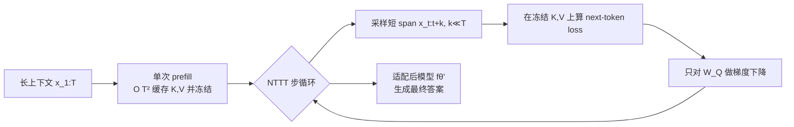

# Let's (not) just put things in Context: Test-time Training for Long-context LLMs

**会议**: ICLR 2026  
**OpenReview**: [https://openreview.net/forum?id=H0bcEdPCoc](https://openreview.net/forum?id=H0bcEdPCoc)  
**代码**: 待确认  
**领域**: LLM 高效推理 / 长上下文 / 测试时训练  
**关键词**: 长上下文, 测试时训练, 推理时计算, KV cache, score dilution, query-only TTT  

## 一句话总结
本文指出长上下文 LLM 的检索失败源于静态自注意力的 **score dilution**（干扰 token 稀释了对目标的注意力质量），并证明"思考 token"无法修复该问题；提出 **query-only 测试时训练（qTTT）**——只用一次 prefill 缓存 KV，然后在固定 KV 上只对 query 投影矩阵做几步梯度更新，在同等 FLOP 预算下显著超越思考 token，把推理时算力从"生成更多 token"重新分配到"少量针对性 query 更新"。

## 研究背景与动机

**领域现状**：预训练与架构进步已把上下文窗口推到百万 token 量级，但模型"能塞进去的"远多于"能可靠用上的"——经典的 lost-in-the-middle、needle-in-a-haystack 失败持续存在。与此同时，推理时计算（thinking token、best-of-n、self-consistency）被证明能在多步推理任务上提升表现。

**现有痛点**：作者通过两个可控沙盒任务（代码仓库 bug 定位、交易日志异常检测，固定"针"只增长"草堆"）观测到：(i) 随上下文长度 $T$ 增大，纯 in-context 准确率急剧单调下降；(ii) 用思考 token 加算力只在短上下文有效，长上下文下迅速饱和、收益逼近零——思考 token 用的还是那套已经"分不清证据"的静态注意力。

**核心矛盾**：所有 decoding 类推理时策略都在"用同一个静态注意力核生成更多 token"，但问题恰恰出在这个核身上。作者把它形式化为 **score dilution**：当存在大量 logit 与目标"接近平局"的干扰 token 时，softmax 分母被撑大，即便目标 logit 唯一最大，其注意力质量也会随 $T\to\infty$ 而趋于 0；并证明要保证目标质量不消失，目标–干扰 logit 间隔必须以 $\Omega(\log T)$ 增长（对数间隔需求）。静态权重的模型很难满足这一需求，而再多生成 token 也改变不了 $q_i^\top k_j$ 这个相似度。

**本文目标**：在不改预训练、架构、数据的前提下，找到一种把推理时算力花得更值的方式，使长上下文检索/推理真正受益。

**核心 idea**：**与其往上下文里塞更多东西（生成更多 token），不如对着已有上下文做一点点训练**——只更新 query 投影、复用 KV cache，直接把目标–干扰间隔顶上去，对症根治 score dilution。

## 方法详解

### 整体框架
qTTT 的全流程只有两步：先对长上下文 $x_{1:T}$ 做**一次** $O(T^2)$ 的 prefill，把每层的 Key/Value 张量 $K^{(\ell)}, V^{(\ell)}$ 缓存并冻结；随后在固定 KV 的前提下，反复在随机采样的短 span（长度 $k\ll T$）上做几步标准下一 token 预测的梯度下降，但梯度**只**作用于 query 投影矩阵 $\{W_Q^{(\ell)}\}$，其余参数（含整个 KV cache）保持不动；最后用适配后的模型生成答案。这样昂贵的全上下文前向只发生一次，后续更新都很便宜。

### 关键设计

**1. 为什么必须"只动 query"：朴素 TTT 在长上下文不可行。** 最自然的想法是全参数 TTT——同时更新 FFN 与 $W_Q, W_K, W_V$。但只要 key/value 被改动，整条序列的 KV cache 就失效，每一步都要对全上下文重新前向+反向，算力与激活内存都爆炸。作者的 FLOP 估算（附录 C）显示：在 $T\approx 10^5$ 时，**一步**全参数 TTT 的算力约等于解码 $1.2\times T\approx 120\text{K}$ 个 token，完全不可承受。qTTT 把可训练参数收缩到只剩 $W_Q$，从而能在一次 prefill 后复用冻结的 $\{K,V\}$、只在短 span 上算便宜的前向反向，保住了 TTT 的收益又砍掉了重复全上下文遍历的开销。损失函数即标准自回归：$L_{\text{TTT}}(\theta;x_s)=-\sum_{i=t}^{t+k-1}\log p_\theta(x_{i+1}\mid x_{1:i};\{K^{(\ell)},V^{(\ell)}\})$，梯度仅对 $\{W_Q^{(\ell)}\}$ 计算与应用。

**2. 只动 query 为何能对症根治 score dilution：query 梯度天然指向"针"。** 这是全文的理论支点。对单层、固定 $K$ 的检索损失 $\ell_i=-\log\alpha_{i,j^\star}$，论文证明 query 梯度为 $\nabla_{q_i}\ell_i=\frac{1}{\sqrt{d_k}}\big(\underbrace{\sum_\ell \alpha_{i,\ell}k_\ell}_{\mu_i}-k_{j^\star}\big)$，即注意力加权均值（干扰质心）$\mu_i$ 减去目标 key。于是一步下降 $q_i\leftarrow q_i-\eta\nabla_{q_i}\ell_i$ 会把 $q_i$ **推向目标 key $k_{j^\star}$、远离干扰质心 $\mu_i$**，直接重塑相似度 $q_i^\top k_j$ 而非重新编码上下文。更关键的是间隔改善引理：$M_i(q_i-\eta\nabla_{q_i}\ell_i)=M_i(q_i)+\eta\|\nabla_{q_i}\ell_i\|_2^2+O(\eta^2)$，只要梯度非零间隔就严格增大，且增益正比于 $\|k_{j^\star}-\mu_i\|_2^2$——也就是**注意力越分散（长上下文 dilution 越严重）时改善越大**，恰好对准了痛点。相比之下，思考 token 受 needle-signal 上界约束（命题 2.4/推论 2.5）：任何生成 token 能携带的目标信号不超过其自身在目标上的注意力质量，而在小间隔下这个质量本就极小，于是再生成 token 也救不回缺失的证据。

**3. FLOP 等价：把"思考预算"翻译成"query 更新预算"。** 为了公平比较两种花算力的方式，作者推出经验等价式 $T_{\text{think}}\approx 2\,N_{\text{qTTT}}\,k$（长 $T$、$k\ll T$）。直观例子：约 8B 稠密模型、$T=10^5$、预算解码 8K 思考 token，等价于 $k=128$ 时做 $N_{\text{qTTT}}=16$ 步、或 $k=512$ 时做 8 步 query-only 更新。差别在于：思考 token 会把 KV cache 撑长数千个位置却不改变注意力分配；而 qTTT 把 cache 长度锁死在 $T$，用等量 FLOP 去重塑 query 对已有 key/value 的访问，直接打在 §2 诊断出的间隔瓶颈上。这一等价式让所有实验都在"同等推理算力"下对比，杜绝了"qTTT 只是偷偷多花算力"的质疑。

## 实验关键数据

设置：Qwen3 模型（1.7B / 4B / 8B），覆盖 LongBench-v2 全部 6 个子集与 ZeroScrolls 8 个数据集（15+ 真实数据集）。默认 $T_{\text{think}}=8192$、$k=128$、$N_{\text{qTTT}}=32$，统一留 512 token 生成最终答案。三方对比：In-Context（无中间 token）、Thinking（FLOP 对齐的思考 token）、qTTT。

### 主实验（摘要）

| 基准 / 任务 | 设置 | 关键数字 |
|---|---|---|
| LongBench-v2 + ZeroScrolls 均值 | Qwen3-4B | qTTT 较 ICL 平均 +12.6 / +14.1 个点 |
| Long Dialogue History（证据最分散） | Qwen3-4B | 30.8 → 43.6 |
| Multi-Document QA | Qwen3-4B | 40.0 → 46.0 |
| Code Repositories（随规模放大） | Qwen3-8B | 30.0 → 44.0 → 52.0 |
| 多种任务 | 8B | 在 code 理解/多文档/多跳推理上 >20% 提升 |

在 FLOP 对齐预算下，qTTT 在各模型规模与各上下文类型上一致超越 In-Context 与 Thinking，且对更大模型增益往往更明显。

### 机制验证与分析

| 分析 | 设置 | 结论 |
|---|---|---|
| 目标注意力质量（附录 E, Table 2） | 跨上下文长度聚合目标 token 注意力 | vanilla 随 $T$ 增大质量骤降；qTTT 跨长度显著保住质量 |
| 沙盒任务随长度变化（图 1a/b） | bug 定位 / 交易日志，固定针增长草堆 | In-Context 单调下降、Thinking 快速饱和；qTTT 跨长度增益稳定 |
| FLOP 等价校准（§3.3） | $T_{\text{think}}\approx 2N_{\text{qTTT}}k$ | 8K 思考 token ≈ $k{=}128$ 时 16 步、$k{=}512$ 时 8 步 query 更新 |
| 额外推理基线（附录 G） | best-of-N、beam search | 仍在统一 FLOP 预算下与 qTTT 对比 |
| 延迟/墙钟时间（附录 H） | 与各方法对比 | qTTT 不增长 KV cache，长上下文下时间可控 |

这组分析把"准确率提升"直接绑回"目标注意力质量提升"，从经验侧坐实了 §2/§3.2 的 score dilution → 间隔提升因果链，而非仅靠端到端分数说话。

### 关键发现
- **检索驱动型任务收益最大**：Long Dialogue、Multi-Document QA、多跳 QA（MuSiQue/QASPER/NarrativeQA）大幅领先，直接验证了 score dilution 诊断与间隔提升机制。
- **总结类任务收益有限**：GovReport/QMSum/SQuALITY 上 qTTT 与 thinking 相当——当瓶颈是生成质量而非检索时，重新分配注意力收益不大。
- **注意力质量证据**（附录 E）：随输入 token 增多，vanilla 注意力在目标 token 上的质量与准确率一起骤降，而 qTTT 显著保住了跨长度的目标注意力质量。
- **思考 token 不是可靠替代**：有时有用，但在很长上下文下甚至会低于 In-Context。

## 亮点与洞察
- **诊断—理论—方法三者闭环**：从可控沙盒观测现象（思考 token 饱和）→ 形式化为 score dilution + 对数间隔需求 $\Omega(\log T)$ → 证明思考 token 受 needle-signal 上界限制 → 推出"必须改 $q^\top k$ 而非多采样"的必然结论 → query 梯度恰好指向针。逻辑非常干净。
- **"少训一点"胜过"多想一点"**这一反直觉结论，提供了推理时算力分配的新坐标轴：不止有 decoding 维度，还有 micro-TTT 维度。
- **工程上极轻**：复用 KV cache、只更新一类小矩阵、cache 长度不增长，可叠加在 sliding window、RoPE scaling、RAG 等已有长上下文技术之上。

## 局限与展望
- 只评估了 $(k, N_{\text{TTT}})$ 权衡上的单个点，未探索按 span 大小/步数变化的预算调度。
- FLOP 对齐基线主要对比思考 token，尚未纳入 self-consistency、best-of-n（正文仅附录补充）作为统一框架内的对比。
- 增益高度任务相关（总结类几乎无收益），缺少"何时该用 qTTT 而非 decoding scaling"的简单预测器。
- 理论分析主要在单层/单针检索设定下展开，多针、多跳证据组合的间隔保证仍是近似直觉。

## 相关工作与启发
- **长上下文 LLM**：RoPE scaling（Position Interpolation、LongRoPE）、稀疏/结构化注意力（Longformer、BigBird）扩窗，但 lost-in-the-middle 与 needle 失败持续存在；本文从"注意力质量如何分配"切入，而非扩窗本身。
- **推理时计算**：CoT、self-consistency、best-of-n 都属于 decoding scaling，存在递减收益；本文指出其受静态注意力上界制约。
- **测试时训练（TTT）**：以往多用于处理分布漂移（Sun 2020、Hardt & Sun 2024、Akyürek 2024）；本文首次把 TTT 重定向到"单个输入的微分布"，并设计出面向长上下文的高效 query-only 变体。
- **启发**：把"间隔需求 $\Omega(\log T)$"作为长上下文方法的理论标尺，可用于评判任何新机制是否真有希望解决长上下文检索，而非靠堆 token 续命。

## 评分
- **新颖性**: ⭐⭐⭐⭐⭐ — score dilution 形式化 + query-only TTT 是少见的"问题诊断与解法在同一数学对象（$q^\top k$ 间隔）上对齐"的工作，把 TTT 重定向到单输入微分布的视角很新。
- **实验充分度**: ⭐⭐⭐⭐ — 覆盖 15+ 数据集、3 个模型规模、FLOP 严格对齐，沙盒+真实基准互证；但只测了 Qwen3 一个模型族、$(k,N)$ 单点，best-of-n 等基线放在附录略显单薄。
- **写作质量**: ⭐⭐⭐⭐⭐ — 标题点睛，empirical→theory→method 层层递进，引理/命题与图示（query 向针移动）配合清晰。
- **价值**: ⭐⭐⭐⭐⭐ — 提出"推理时算力应从思考 token 重分配到 query 更新"的实用 takeaway，方法轻量可叠加，对长上下文落地有直接指导意义。

<!-- RELATED:START -->

## 相关论文

- [\[ICLR 2026\] Test-Time Training Done Right](test-time_training_done_right.md)
- [\[ICLR 2026\] MesaNet: Sequence Modeling by Locally Optimal Test-Time Training](mesanet_sequence_modeling_by_locally_optimal_test-time_training.md)
- [\[ICLR 2026\] Tactic: Adaptive Sparse Attention with Clustering and Distribution Fitting for Long-Context LLMs](tactic_adaptive_sparse_attention_with_clustering_and_distribution_fitting_for_lo.md)
- [\[ICML 2026\] Training-Inference Consistent Segmented Execution for Long-Context LLMs](../../ICML2026/llm_efficiency/training-inference_consistent_segmented_execution_for_long-context_llms.md)
- [\[ICLR 2026\] Cartridges: Lightweight and General-Purpose Long Context Representations via Self-Study](cartridges_lightweight_and_general-purpose_long_context_representations_via_self.md)

<!-- RELATED:END -->
