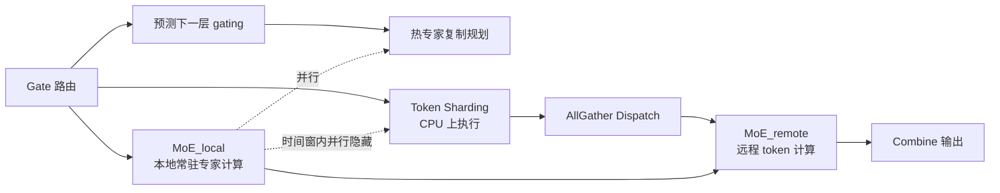

# Libra: Effective yet Efficient Load Balancing for Large-scale MoE Inference

**会议**: ICLR 2026  
**OpenReview**: [https://openreview.net/forum?id=WhxNwgGkAS](https://openreview.net/forum?id=WhxNwgGkAS)  
**代码**: [https://github.com/SNU-ARC/Libra](https://github.com/SNU-ARC/Libra)  
**领域**: LLM 高效推理 / MoE 系统 / 负载均衡  
**关键词**: Mixture-of-Experts, Expert Parallelism, 专家负载均衡, 热专家复制, Token Sharding, 推测执行  

## 一句话总结
Libra 通过"推测执行预测下一层专家激活 + 两阶段局部性感知执行流"，把 MoE 推理中负载均衡所需的专家复制与 token 分片开销完全藏到 MoE 计算背后，在 8 卡 H200 上对 Qwen3MoE 与 GLM-4.5 实现近乎完美的负载均衡，prefill 吞吐最高提升 19.2%。

## 研究背景与动机
**领域现状**：MoE 通过稀疏激活让模型在参数量冲到万亿级的同时保持推理算力可控，是 DeepSeek-V3、Qwen3MoE、GLM-4.5 等 SOTA LLM 的基石。多卡服务的标准做法是对 MoE 层用专家并行(EP)、对非 MoE 层用数据并行(DP)。

**现有痛点**：新一代 MoE 为了追求专家专精，纷纷放弃训练期的强负载均衡损失，结果推理时的**专家负载失衡显著加剧**——少数热专家收到不成比例的 token，承载它们的 GPU 变成拖后腿的 straggler。由于 MoE 层同步执行，所有卡都得等最重的那张卡算完，失衡比(最重卡负载/平均负载)从老模型的接近 1.0 恶化到 2.5+，直接拉低端到端延迟和吞吐。

**核心矛盾**：已有系统级方案在"有效"与"高效"之间难以兼得。EPLB 按历史统计周期性复制专家，效率尚可但**无法捕捉请求级的瞬时波动**，且 token 在副本间随机分配；Lina 用专家选择路径查找表预测下一层热专家、提前复制，但**预测精度极低**(Qwen3MoE 仅 43.7%、GLM-4.5 仅 11.8%)，token 也只是均匀分发；HarMoEny 拿到精确路由结果后再决策，**有效但同步运行的复杂算法卡在关键路径上**引入新瓶颈。

**本文目标**：同时在专家复制与 token 分片两件事上做到"既有效又高效"——既要接近最优的均衡，又要让均衡机制本身几乎零开销。

**核心 idea**：**[预测]** 利用 LLM 隐状态跨层缓慢演化的性质，用当前层隐状态推测执行下一层 gating，高精度预测热专家并提前复制；**[隐藏开销]** 重构执行流为"先算本地专家、再算远程专家"两阶段，把 token 分片、复制规划等开销塞进本地计算的时间窗里与之重叠。

## 方法详解

### 整体框架
Libra 的核心创新是 **Two-Stage Locality-Aware Execution(两阶段局部性感知执行)**：把一层 MoE 计算按 token 的局部性拆成 MoE_local(token 路由到本卡常驻专家)和 MoE_remote(token 需派发到其他卡)两个阶段，先执行 MoE_local 再执行 MoE_remote。关键在于 MoE_local 不依赖 token 分片结果——gating 一出就能开算，于是把昂贵的 token 分片、复制规划、元数据传输等操作全部并行到 MoE_local 的执行窗口里。配合"沿用 Lina 的提前一层预测复制"和"沿用 HarMoEny 的精细 token 分片但搬到 CPU"，Libra 同时拿下有效性与效率。

### 关键设计

**1. 两阶段局部性感知执行：用本地计算窗口吃掉均衡开销** 传统带负载均衡的执行流必须等 token 分片完成才能开始 MoE 计算，分片开销直接压在关键路径上。Libra 把计算拆成 MoE_local 与 MoE_remote 后，MoE_local 阶段对 token 分片**零依赖**,gating 函数一结束即可启动,只有 MoE_remote 阶段才依赖分片与 dispatch 结果。这就腾出了一段时间窗,让复杂的 token 分片机制与 MoE_local 并行跑。为进一步放大并行度,Libra 把 token 分片放到 **CPU** 而非 GPU 上执行,并用 **AllGather**(所有 token 广播到所有卡)替代 All2All 来做 dispatch——虽然原始通信量增大,但延迟影响可忽略,关键收益是把 dispatch 也从关键路径移除:All2All 实现下 dispatch 必须等分片完成,而 AllGather 实现下 dispatch 可与分片并行推进。

**2. 局部性感知的热专家复制：推测执行预测 + 双目标规划** 在预测上,Libra 用 **lookahead predictor**:利用 Transformer 隐状态跨层缓慢演化的性质,直接拿当前层隐状态去**推测执行下一层的 gating 函数**,用结果决定哪些专家要复制。这种运行时预测的精度($70\\text{-}90\\%$)远高于 Lina 离线查找表($11\\text{-}44\\%$),且开销可忽略。在规划上,Libra 不只追求负载均衡,还额外追求**局部性增强**——尽量延长 MoE_local 窗口来藏开销。规划分两阶段:第一阶段每卡引入 $N\\times\\alpha$ 个本卡 token 最常激活、但尚未常驻的专家,把远程 token 转成本地计算以扩大 MoE_local 窗口;第二阶段做迭代式负载均衡,每步把最重 GPU 上最热的专家复制到那些尚未拿满 $N$ 个额外专家的最轻 GPU 上。其中 $N$ 由显存容量与可用时间窗(MoE 计算时间与带宽的函数)决定,$\\alpha$ 控制第一阶段占 $N$ 的比例。实现上用 PyTorch SymmetricMemory 做 copy-engine P2P 传输,并以 even/odd 双缓冲流水线把第 $i{+}1$ 层的专家加载与第 $i$ 层的 Grouped-GEMM 计算重叠。

**3. 自适应 Token Sharding:迭代贪心再均衡** Libra 沿用 HarMoEny 风格的精细分片算法,但有两处关键差异:只对**远程 token**做分片,且整个过程**卸载到 CPU**。算法主循环先检查是否有 GPU 负载超过目标阈值,若已均衡则终止;否则选出最重的 GPU $g_s$,进入内层循环选其上最热的远程专家 $e$(占其远程 token 最多的那个),再找一个**持有 $e$ 副本且仍有容量**的最轻 GPU $g_d$ 作目的地——副本由前述热专家复制机制保证存在。找到后计算转移 token 数并更新 $g_s$、$g_d$ 负载,然后**立即返回主循环重新评估全局均衡**,确保总是先处理最严重的失衡;若找不到合适目的地,就尝试 $g_s$ 上下一个最热专家,直到选项穷尽。这种贪心策略在 CPU 上算,正好被 MoE_local 的计算窗口掩盖。

## 实验关键数据

**设置**：8×NVIDIA H200-SXM5(141GB HBM3e,NVSwitch 900GB/s),BF16,基于 SGLang v0.4.10(核心机制用 Cython 实现)。模型为 Qwen3MoE(235B)与 GLM-4.5(355B);8 个数据集(BookCorpus、Codeforces、DeepSeek-Prover、FineWeb、GSM8K、HellaSwag、HumanEvalPlus、LMSYS-Chat-1M)。指标为 prefill 吞吐(tokens/s)与失衡比。基线:vanilla SGLang、EPLB、Lina(自研复现)。注:实验刻意对基线有利(Lina 用与评测同分布建表、每卡多放 8 专家;EPLB 同分布 profiling)。

### 主实验:Prefill 吞吐与稳定性
- **吞吐**:在所有模型/数据集上 Libra 均取得最高吞吐,相比 SOTA 最高提升 **19.2%**;即便基线被给予偏袒条件,Libra 在 Qwen3MoE 与 GLM-4.5 上仍持续显著领先。
- **动态工作负载稳定性**:混合数据集模拟失衡随请求剧烈漂移。Lina/SGLang 随失衡比飙升吞吐剧烈波动,而 Libra 把失衡比稳定压到接近 **1.0**,吞吐持续高位稳定,与输入分布解耦。

### 预测精度对比(Table 1,准确率 %)

| 模型 | 数据集 | Lina | Libra |
|------|--------|------|-------|
| Qwen3MoE | BookCorpus | 47.3 | **91.7** |
| Qwen3MoE | DeepSeek-Prover | 45.4 | **86.5** |
| Qwen3MoE | HellaSwag | 37.5 | **86.6** |
| Qwen3MoE | HumanEvalPlus | 44.5 | **87.0** |
| GLM-4.5 | BookCorpus | 11.7 | **79.6** |
| GLM-4.5 | DeepSeek-Prover | 12.7 | **72.9** |
| GLM-4.5 | HellaSwag | 11.5 | **76.6** |
| GLM-4.5 | HumanEvalPlus | 11.2 | **72.7** |

### 消融/分解分析(Table 2,Qwen3MoE,seq=1024,bs=32,单位约为相对延迟)

| 方案 | Token sharding | Repl. planning | MoE | Total |
|------|----------------|----------------|-----|-------|
| SGLang | 0 | 0 | 10.99 | 13.61 |
| Lina | 0.15 | 0.08 | 8.11 | 11.33 |
| **Libra** | 0.57(隐藏) | 0.26(隐藏) | 2.77(Local)+4.55(Remote) | **9.07** |

### 关键发现
- Libra 的预测精度全面碾压 Lina,尤其 GLM-4.5 上 Lina 在 top-8 中预测对的专家不到 1 个,而 Libra 稳定在 72-92%。
- 分解分析显示:Libra 虽引入元数据传输、广播、均衡逻辑等额外成本,但这些(标注 a/b)被 MoE_local/MoE_remote **有效掩盖**,不进关键路径;最终 MoE 计算时间因高精度预测大幅下降,Total 比 Lina 再降约 20%、比 SGLang 降约 33%。

## 亮点与洞察
- **"既有效又高效"的拆解视角很干净**:把负载均衡问题正交分解为"专家复制 + token 分片"两件事,各自又有"有效性 vs 效率"两维,清晰指出 EPLB/Lina/HarMoEny 各踩在哪个象限,Libra 取各家之长。
- **执行流重构是真正的杀招**:与其优化均衡算法本身,不如改造执行流让均衡开销"无处可藏地被藏起来"——MoE_local 不依赖分片这个观察是整套设计的支点。
- **推测执行预测专家**:复用"隐状态跨层缓慢演化"这一已知性质来推测下一层 gating,把预测从"基于历史的查表"升级为"基于当前隐状态的运行时计算",一举把精度从 20-40% 拉到 70-90%。
- **用 AllGather 换 All2All**:反直觉地用更大通信量换关键路径解放,体现系统优化里"延迟比带宽更稀缺"的工程判断。

## 局限与展望
- **只评测 prefill 阶段**:论文假设 prefill-decode 分离服务,只针对 prefill 优化与测量,decode 阶段(小 batch、KV cache 主导)的失衡特性与本方法收益未涉及。
- **单节点 8 卡 NVSwitch 环境**:依赖 900GB/s 高速 P2P 与 SymmetricMemory,跨节点(NVLink 受限或走 IB)时 AllGather dispatch 与 P2P 复制的开销可能不再可忽略,扩展性待验证。
- **预测精度仍非 100%**:lookahead 预测错时会导致需要的专家未提前复制,虽有 token 分片兜底,但极端漂移工作负载下的最坏情况行为未深入分析。
- **超参 $N$、$\\alpha$ 依赖显存与带宽手工配置**:论文取 $N{=}8$、$\\alpha{=}0.5$,缺少跨模型/硬件的自适应选择策略。

## 相关工作与启发
- **vs EPLB**:EPLB 基于历史统计的周期性静态复制,无法捕捉瞬时波动;Libra 用运行时推测预测做动态复制。
- **vs Lina**:同样"提前一层预测复制",但 Libra 把离线查找表换成推测执行,精度数量级提升,并新增局部性感知规划与两阶段执行。
- **vs HarMoEny**:同样追求精细 token 分片,但 HarMoEny 同步算法卡关键路径;Libra 把分片搬到 CPU 并用 MoE_local 窗口掩盖。
- **启发**:对任何"决策开销压在关键路径上"的系统问题,与其压缩决策算法,不如寻找一段"与决策无依赖的计算"来并行掩盖——MoE 推理里 MoE_local 恰好提供了这样的窗口。该思路可迁移到 KV cache 调度、推测解码验证等同样需要"边算边决策"的场景。

## 评分
- **新颖性**: ⭐⭐⭐⭐ 两阶段局部性感知执行 + 推测执行预测专家的组合是新颖的执行流重构,虽然单点(提前预测复制 = Lina,精细分片 = HarMoEny)有借鉴,但"用本地计算窗口掩盖均衡开销"的整体范式是真创新。
- **实验充分度**: ⭐⭐⭐⭐ 两个 SOTA 大模型、8 数据集、吞吐/失衡比/预测精度/延迟分解多维度评测,且刻意给基线有利条件下仍领先,说服力强;扣分在只测 prefill、单节点环境。
- **写作质量**: ⭐⭐⭐⭐ 问题分解(有效×高效、复制×分片)清晰,三个基线的象限定位精准,图示(执行流、复制规划)直观。
- **价值**: ⭐⭐⭐⭐ 大规模 MoE 推理负载均衡是当下落地痛点,19.2% 吞吐提升 + 开源代码 + 集成进 SGLang,工程价值高,可直接被服务系统采纳。

<!-- RELATED:START -->

## 相关论文

- [\[ICLR 2026\] Scaling Large Vision-Language Model RL Training via Efficient Load Balancing](scaling_large_vision-language_model_rl_training_via_efficient_load_balancing.md)
- [\[ICLR 2026\] Semantic Parallelism: Redefining Efficient MoE Inference via Model-Data Co-Scheduling](semantic_parallelism_redefining_efficient_moe_inference_via_model-data_co-schedu.md)
- [\[ICLR 2026\] DualMap: Enabling Both Cache Affinity and Load Balancing for Distributed LLM Serving](dualmap_enabling_both_cache_affinity_and_load_balancing_for_distributed_llm_serv.md)
- [\[ICLR 2026\] Inference-Cost-Aware Dynamic Tree Construction for Efficient Inference in Large Language Models](inference-cost-aware_dynamic_tree_construction_for_efficient_inference_in_large_.md)
- [\[ICLR 2026\] Wide-In, Narrow-Out: Revokable Decoding for Efficient and Effective DLLMs](wide-in_narrow-out_revokable_decoding_for_efficient_and_effective_dllms.md)

<!-- RELATED:END -->
