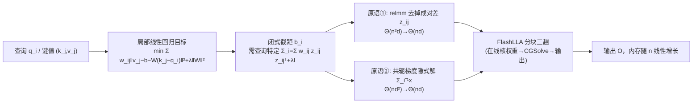

# Local Linear Attention: An Optimal Interpolation of Linear and Softmax Attention for Test-Time Regression

**会议**: ICLR 2026  
**OpenReview**: [https://openreview.net/forum?id=WGpzi489XY](https://openreview.net/forum?id=WGpzi489XY)  
**代码**: 待确认  
**领域**: 高效注意力 / 序列建模架构  
**关键词**: 局部线性注意力, 测试时回归, 非参统计, 偏差-方差权衡, FlashLLA, 关联记忆  

## 一句话总结
把注意力看成"测试时回归求解器"，作者用统计学里的**局部线性回归**升级 Softmax 注意力，得到既能像线性注意力那样随上下文增长不断逼近、又比 Softmax 更强的 Local Linear Attention（LLA），并配套设计了硬件高效的 FlashLLA 分块算法把朴素实现的二次内存压回线性。

## 研究背景与动机
**领域现状**：高效注意力（Linear Attention、SSM 如 Mamba）的研究主线一直是"在长序列上更省"，靠固定大小的隐状态把复杂度从二次降到线性；但这些设计里的 gating、forgetting factor 大多是启发式拼出来的，缺乏统一的理论解释。最近的 **test-time regression** 视角（Wang et al., 2025）把不同注意力变体统一成"逐层求解一个回归问题的测试时优化器"：键 $k_j$ 当特征、值 $v_j$ 当标签，查询 $q_i$ 当测试点。

**现有痛点**：在这套视角下，线性注意力家族其实是在解一个**全局线性回归**（参数模型），当真实映射不是全局线性时存在不可消除的近似误差；Softmax 注意力等价于 **Nadaraya-Watson 核回归**（局部常数模型），是非参数的、能渐近收敛，但局部常数估计在数据支撑边界上有严重的"边界偏差"，且在自回归预测里边界点出现得特别频繁。两边各有天花板。

**核心矛盾**：大家都在往"更省"卷，却几乎没人往"在统计意义上更对、哪怕更贵"的方向走——是否存在一个比 Softmax 更准、能随同分布数据增多持续改善的注意力？

**本文目标**：从测试时回归框架系统梳理注意力的设计空间，提出一个在偏差-方差权衡上**严格优于** Linear 和 Softmax 的注意力机制，并解决它带来的计算/内存难题。

**核心 idea**：**用局部线性回归替代 Softmax 的局部常数回归**。统计学里治"边界偏差"的标准药方就是把局部常数（NW）升级成局部多项式；LLA 正是这个升级在注意力上的自然落地，并且公式上恰好是"线性预测 + 局部核回归修正残差"，把 Linear 和 Softmax 两端**插值**了起来。

## 方法详解

### 整体框架
LLA 在每个查询 $q_i$ 处不再拟合一个常数 $\theta$，而是拟合一个**以 $q_i$ 为中心的局部线性函数** $f(x)=b+W(x-q_i)$，预测值取截距 $\hat f(q_i)=\hat b_i$。这把 Softmax 的"局部加权平均"升级成"局部加权线性拟合"。代价是它需要为每个查询维护一个**查询特定**的预条件矩阵，无法像线性注意力那样压成固定大小的递归状态，因此本质上需要 $\Theta(nd)$ 的 KV cache（和 Softmax 同级）。论文随后用两个内存原语 + 分块算法 FlashLLA 把朴素实现的 $\Theta(n^2d)$ 和 $\Theta(nd^2)$ 内存都压回 $\Theta(nd)$。

### 关键设计

**1. 局部线性回归闭式解：把"取截距"变成可计算的注意力。** 在查询 $q_i$ 处求解带岭正则的局部线性目标 $\min_{f}\frac12\sum_j w_{ij}\lVert v_j-b-W(k_j-q_i)\rVert^2+\lambda\lVert W\rVert_F^2$，其中 $w_{ij}$ 是衡量 $k_j$ 离 $q_i$ 多近的核权重。由于测试时只在 $\hat f(q_i)=\hat b_i$ 取值，只需推导截距。定义 $z_{ij}=k_j-q_i$ 和查询特定统计量 $\omega_i=\sum_j w_{ij}$、$\mu_i=\sum_j w_{ij}z_{ij}$、$\Sigma_i=\sum_j w_{ij}z_{ij}z_{ij}^\top+\lambda I$，并记 $\rho_i=\Sigma_i^{-1}\mu_i$，则截距有闭式 $\hat b_i=\sum_j s_{ij}v_j$，权重 $s_{ij}=w_{ij}\frac{1-z_{ij}^\top\rho_i}{\omega_i-\mu_i^\top\rho_i}$。和 MesaNet 维护全局预条件矩阵 $H_i$ 的关键区别在于：$\Sigma_i$ 的特征是**围绕当前查询 $q_i$ 居中**的，每个位置都不一样，这正是它表达力更强、也更贵的根源。

**2. 插值视角：LLA 是"线性预测 + 残差核回归"。** 把闭式解改写成更可解释的形式：若先给定权重 $\hat W_i$，则 $\hat b_i=\sum_j s_{ij}(v_j-\hat W_i k_j)+\hat W_i q_i$，其中 $s_{ij}=w_{ij}/\sum_{j'}w_{ij'}$ 就是标准 Softmax 权重。第一项是对**残差** $v_j-\hat W_i k_j$ 做局部常数（Softmax 式）回归，第二项是基于 $\hat W_i$ 的**线性预测**。当 $\hat W_i$ 由最优求解得到时恢复 LLA；若允许把 $\hat W_i$ 退化成像线性注意力那样的递归状态，就能在两端之间滑动。这条公式既解释了"为什么 LLA 同时含 Linear 和 Softmax 的影子"，也给出了设计新算法的模板（例如未来把 DeltaNet/Mamba 塞进 $\hat W_i$ 这一项）。

**3. 两个内存原语：把朴素实现的两处爆炸压回线性。** 朴素实现有两个瓶颈。其一是要为所有 $j\le i$ 物化成对差 $z_{ij}=k_j-q_i$，需 $\Theta(n^2d)$；作者发现 $\mu_i,\Sigma_i$ 以及内积 $z_{ij}^\top x_i$ 都能把 $k_j$ 与 $q_i$ 的贡献**代数分离**——先算与查询无关的 $\tilde\mu_i=\sum_j w_{ij}k_j$、$\tilde\Sigma_i=\sum_j w_{ij}k_jk_j^\top+\lambda I$，再平移回居中统计量 $\mu_i=\tilde\mu_i-\omega_i q_i$、$\Sigma_i=\tilde\Sigma_i-\tilde\mu_i q_i^\top-q_i\tilde\mu_i^\top+\omega_i q_i q_i^\top$，从而把内存降到 $\Theta(nd)$，并抽象成算子 relmm$(X,Q,K)=XK^\top-\text{brsum}(X\odot Q)$。其二是要对每个 $i$ 解线性系统 $\Sigma_i^{-1}x_i$，直接求逆是 $\Theta(nd^2)$；作者沿用 MesaNet 思路用**共轭梯度（CG）**，利用 $\Sigma_i$ 的秩一求和结构，只需算矩阵-向量积 $\Sigma_i p=\sum_j w_{ij}(k_j^\top p)k_j-(q_i^\top p)\tilde\mu_i-(\tilde\mu_i^\top p)q_i+(\omega_i q_i^\top p)q_i+\lambda p$，全程不物化 $\Sigma_i$，内存维持 $\Theta(nd)$。

**4. FlashLLA：分块三趟、在线核权重的硬件高效算法。** 把前向写成矩阵形式 $W=\text{tril}(\exp(QK^\top/h))$、$M=WK-\text{brsum}(W)\odot Q$、$R=\text{CGSolve}(M,Q,K,\lambda)$、$O=\big((1-\text{relmm}(R,Q,K))/\text{bcast}(\delta)\odot W\big)V$ 后，FlashLLA 仿照 FlashAttention 按查询块 $B_r$、键值块 $B_c$ 分块，每个查询块内对键值块跑**三趟**：第一趟在线累积统计量 $M_r,\omega_r$（维护 running max $m_r$ 保证核权重数值稳定，依据是 $w_{ij}$ 的齐次性）；第二趟用 CGSolve 并行解所有 $\Sigma_i^{-1}\mu_i$；第三趟用预算结果和 $V_c$ 拼出输出 $O_r$，并把中间量 $R_r,\delta_r$ 一并写回 HBM 供反向使用。作者用约 500 行 Triton 实现，在单张 H200 上把朴素法的二次内存（很快 OOM）压成随序列线性增长，CG 迭代数取常数时 I/O 复杂度与 FlashAttention 同为 $\Theta(nd+n^2)$。

## 实验关键数据
论文的实验全部围绕"隔离测试时适应能力"的合成任务展开（非大规模 LLM）。

### 主实验

| 任务 | 设置 | 关键结果 |
|------|------|----------|
| 测试时回归（分段线性、非平稳） | 单层、不训投影，$L=1024$，扫描段长 $S$ 与维度 $d$ | LLA 在每段内随同分布数据增多**持续改善**，全面优于基线；MesaNet 只在第一段（数据来自单一线性映射）最好，之后随分布漂移迅速退化；Softmax 不会从更多同分布数据中获益 |
| 维度扩展性 | MSE 比值 $\sum\ell^{\text{Model}}/\sum\ell^{\text{LLA}}$ | LLA 相对优势随维度 $d$ 增大而扩大，暗示对更大模型/数据集的潜力 |
| 上下文回归（参数化投影） | 两层无 MLP，$d_x=d_y=32$ | LLA 在所有段长配置上一致优于 Softmax / Mamba / GLA / Hyena / Gated DeltaNet，段长越小优势越明显 |
| 关联回忆 MQAR（Zoology） | 关闭 short conv 公平对比，$\lVert A_k\cup A_v\rVert=8\text{k}$ | LLA 的优势能迁移到离散 token 预测，召回准确率领先 |
| 排列状态追踪 | 交换指令序列，扫描位置数 $N$ | LLA 与 Softmax **持平**——符合理论预期：常深度 Softmax 受限于 $\text{TC}^0$，LLA 只加常数级电路层，因此天花板与 Softmax 相同 |

### 内存与效率

| 指标 | 朴素 LLA | FlashLLA |
|------|----------|----------|
| 工作集内存 vs 序列长度 | 二次增长，长序列/大 batch 很快 OOM | $\Theta(nd)$ 线性增长 |
| I/O 复杂度（CG 迭代取常数） | — | $\Theta(nd+n^2)$，与 FlashAttention 同级（常数因子略高） |
| Triton 实现 | — | 约 500 行，单张 H200 上验证 |

### 关键发现
- **理论分离结果支撑设计**：命题 2.1 证明当真实函数非全局线性时，全局线性估计误差为 $\Omega(1)$，而 NW（局部常数）为 $O(n^{-3/(d+3)})$；命题 2.2 进一步证明在边界法向梯度大时，NW 为 $\Omega(n^{-3/(d+3)})$，而局部线性 LLA 为 $O(n^{-4/(d+4)})$——从理论上把"LLA > Softmax > Linear"钉死。
- **非平稳是 LLA 的主场**：分段线性数据上 LLA 既能快速适应分布漂移，又能在段内持续逼近，是 MesaNet（擅长全局线性但不适应漂移）和 Softmax（不随数据增多改善）都做不到的。
- **状态追踪天花板由电路复杂度决定**：LLA 只给 Softmax 加了查询特定的一阶修正（常数额外电路层），所以不会超越 Softmax 的 $\text{TC}^0$ 限制，与 Softmax 打平是合理的。

## 亮点与洞察
- **把注意力设计接回非参统计的成熟工具箱**：Softmax = Nadaraya-Watson 核回归 → 已知有边界偏差 → 统计学的标准修法是局部多项式 → 直接得到 LLA。这条推导链非常干净，让"为什么这样设计"有了原理而非启发式。
- **"插值"公式 $\hat b_i=\sum_j s_{ij}(v_j-\hat W_i k_j)+\hat W_i q_i$ 是真正可复用的模板**：它把 Linear 的"线性预测"和 Softmax 的"残差核回归"统一进一个式子，未来可把任意线性注意力（DeltaNet/Mamba）塞进 $\hat W_i$ 来换效率，而保留 LLA 的估计能力。
- **逆主流而行的研究取向**：在大家都卷"更省"的时候，本文选择"哪怕更贵也要更对"，并用理论证明这份"贵"买到了可证明的偏差-方差优势。
- **工程上把理论变得可跑**：relmm + CG 两个原语 + FlashLLA 三趟分块，把一个看似 $\Theta(n^2d)/\Theta(nd^2)$ 的机制压到与 FlashAttention 同级的 I/O，是让 LLA 不停留在纸面的关键。

## 局限与展望
- **计算/IO 仍显著高于 Softmax**：核心矩阵求逆很贵，CG 虽省内存但带来额外读写，常数因子比 FlashAttention 大；作者把"找近似降算"列为重要后续。
- **尚未在真实 LLM 上验证**：实验全是合成/中等规模任务，PyTorch 直接训 LLM 因复杂度过高不可行，需要大量 kernel 工程来稳住前/反向，且矩阵求逆的数值敏感性使低精度 kernel 很难做。
- **数值稳定性是低精度部署的拦路虎**：求逆对精度敏感，直接上 bf16/fp8 可能掉点。
- **展望**：沿插值模板融合 SOTA 线性注意力以改善效率甚至电路复杂度；引入滑动窗口/稀疏进一步降 I/O；把 FlashLLA 推向真正的大模型预训练。

## 相关工作与启发
- **测试时回归统一视角**（Wang et al., 2025）是本文的理论地基：注意力 = 逐层回归求解器，键当特征、值当标签、查询当测试点。LLA 是这套视角下"把局部常数升级成局部线性"的自然推论。
- **MesaNet**（von Oswald et al., 2025）：线性注意力变体，硬编码全局线性回归的闭式解、用 CG 解预条件矩阵。LLA 借了它的 CG 思路，但把**全局**预条件 $H_i$ 换成**查询居中**的 $\Sigma_i$，从参数模型跨到非参模型。
- **线性注意力 / SSM 家族**（GLA、RetNet、RWKV、Mamba、DeltaNet、Gated DeltaNet）：都可由"$H_i\approx I$ + 不同权重 $\gamma_{ij}$"或"对 $W$ 做一步梯度下降"在测试时回归框架下推出，是 LLA 插值的一端。
- **FlashAttention / Flash Linear Attention**：FlashLLA 的分块、在线 softmax、HBM↔SRAM I/O 优化思路直接继承自这条硬件高效注意力线。
- **启发**：当一个深度学习模块能映射到经典统计估计器时，"该模块的已知缺陷 + 统计学的标准补救"往往是一条高质量的架构改进路径；本文是把这条方法论用到极致的范例。

## 评分
- **新颖性**: ⭐⭐⭐⭐⭐ —— 用局部线性回归升级 Softmax、并给出干净的 Linear↔Softmax 插值公式与可证明的偏差-方差分离，视角和结论都很新。
- **实验充分度**: ⭐⭐⭐ —— 合成任务（测试时/上下文回归、关联回忆、状态追踪）覆盖到位且与理论对齐，但缺真实 LLM 规模验证，作者自己也承认这是 ongoing question。
- **写作质量**: ⭐⭐⭐⭐ —— 从统计视角到公式到算法到实验层层递进，理论命题与工程原语都讲得清楚，可读性强。
- **价值**: ⭐⭐⭐⭐ —— 提供了一个有理论保证、且配套硬件实现的"更强但更贵"注意力，以及一套可复用的插值设计模板，对序列建模架构研究有方法论价值；落地大模型仍需工程攻坚。

<!-- RELATED:START -->

## 相关论文

- [\[ICLR 2026\] Log-Linear Attention](log-linear_attention.md)
- [\[ICLR 2026\] RACE Attention: A Strictly Linear-Time Attention Layer for Training on Outrageously Large Contexts](race_attention_a_strictly_linear-time_attention_layer_for_training_on_outrageous.md)
- [\[ICML 2026\] Dynamic Linear Attention](../../ICML2026/llm_efficiency/dynamic_linear_attention.md)
- [\[ICLR 2026\] FlexLinearAttention: Compiling a Unified Abstraction into Scalable Kernels for Linear Attention](flexlinearattention_compiling_a_unified_abstraction_into_scalable_kernels_for_li.md)
- [\[ICLR 2026\] MesaNet: Sequence Modeling by Locally Optimal Test-Time Training](mesanet_sequence_modeling_by_locally_optimal_test-time_training.md)

<!-- RELATED:END -->
