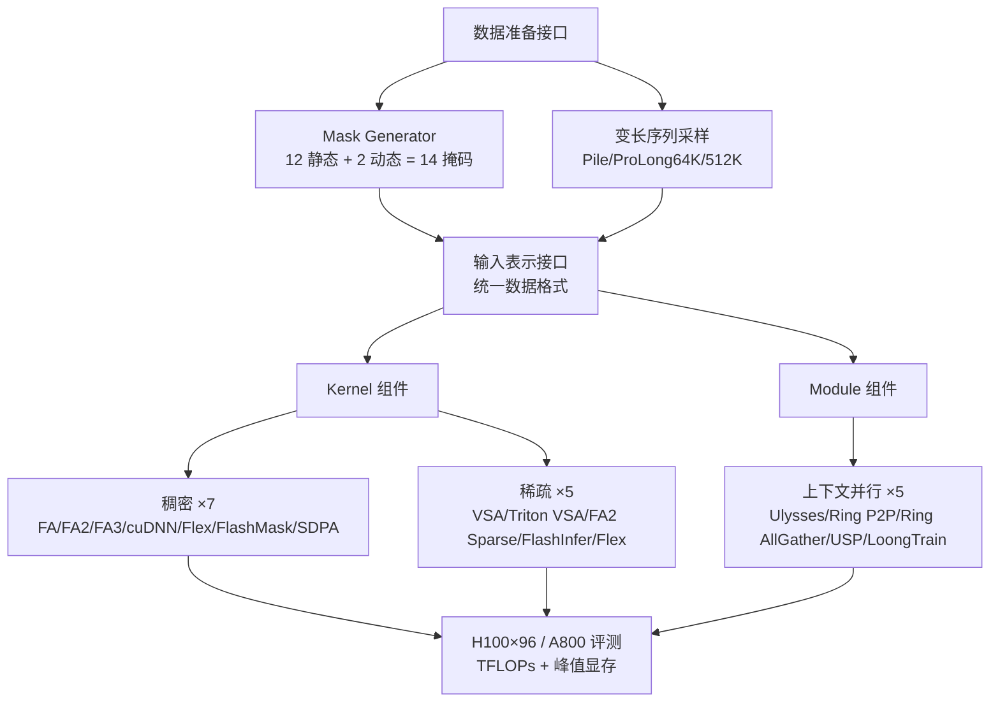

# Long-Context Attention Benchmark: From Kernel Efficiency to Distributed Context Parallelism

**会议**: ICLR 2026  
**OpenReview**: [https://openreview.net/forum?id=W7sVYFJAEp](https://openreview.net/forum?id=W7sVYFJAEp)  
**代码**: [https://github.com/NJUDeepEngine/LongCA-bench](https://github.com/NJUDeepEngine/LongCA-bench)  
**领域**: LLM 高效训练 / 长上下文 / 注意力系统  
**关键词**: 长上下文注意力, 注意力算子, 上下文并行, 稀疏注意力, 分布式训练, Benchmark  

## 一句话总结
本文提出 **LongCA-bench**——一个把 7 个稠密算子、5 个稀疏算子、5 种上下文并行机制统一到同一数据接口下的长上下文注意力基准，用最多 96 张 H100、768K 序列长度系统评测了「掩码模式 × 序列长度 × 分布式规模」三维空间下各方法的速度/显存权衡。

## 研究背景与动机
**领域现状**：Transformer 的 softmax 注意力随序列长度呈 $O(n^2)$ 计算与显存增长，是长上下文训练的核心瓶颈。社区沿两条路线缓解：一是 **算子级优化**（FlashAttention 系列、cuDNN Fused、稀疏 kernel 等单卡加速），二是 **模块级的上下文并行（context parallelism）**，把长序列切到多卡上（Ulysses、Ring Attention、USP、LoongTrain 等）。

**现有痛点**：评测严重碎片化。算子之间对掩码（mask）模式的支持差异巨大，同一算子在不同掩码下性能也天差地别，却没有统一口径的横向对比；而上下文并行方法大多与特定训练框架（DeepSpeed、InternEvo）深度耦合，难以复用、更难公平比较。

**核心矛盾**：研究者无法清楚地知道各方法之间的真实权衡，工程师在为长上下文训练选注意力机制时缺少可靠的参考基线——「该用哪个 kernel、哪种并行、在什么序列长度和掩码下」这类落地问题没有答案。

**本文目标**：搭一个公平、统一、可扩展的基准，把代表性算子和上下文并行机制收编进同一套数据准备与调用接口，沿「掩码模式」和「序列长度 × 分布式规模」两个关键维度做大规模复现实验。

**核心 idea**：**[统一接口 + 三维评测]** 用一个统一的数据准备/输入表示接口抹平各算子在数据格式上的不一致，再在 14 种掩码、1K–768K 序列、8–96 GPU 的笛卡尔积上跑通，从而第一次让稠密算子、稀疏算子、分布式并行三类方法可以放在同一坐标系里比较。

## 方法详解

### 整体框架
LongCA-bench 由三大组件构成：**数据准备接口**（统一掩码生成 + 变长采样）、**输入表示接口**（接 7 个稠密 + 5 个稀疏 kernel）、**上下文并行框架**（统一复现并优化 5 种分布式注意力）。所有方法共享同一份「统一数据格式 → 各 kernel 专用 adapter」的转换链路，保证了跨方法的可比性。

### 关键设计

**1. 统一数据准备：把掩码模式当成一等公民。** 与其直接喂下游数据集，benchmark 设计了专门的数据准备接口，把多样的掩码模式与变长序列采样组合起来，让评测数据真正反映长上下文训练的特征。作者把注意力掩码系统梳理成 **14 种模式**：12 种静态掩码（6 种规则掩码如 FULL/CAUSAL/滑窗/文档变体，6 种异构掩码如 Shared Question、Global Sliding、Causal Blockwise、Prefix LM、Block Causal Document）外加 2 种动态块稀疏掩码（均匀块 vs 变长块）。掩码能否「训练前预先确定」是静态/动态的分界。这一维度过去常被忽略，但本文实验表明它对效率、可扩展性、可用性影响巨大——例如 FA 系列和 cuDNN 根本不支持异构掩码。

**2. 算子层的统一适配与稀疏特性刻画。** 稠密侧以 naive 逐步注意力和 PyTorch SDPA 为「理论支持任意掩码但 $O(S^2)$ 复杂度」的基线，再纳入 FA/FA2/FA3、cuDNN Fused（硬件优化）、FlexAttention（按位布尔函数生成专用 kernel、兼容任意掩码、显存近 $O(S^2)$）、FlashMask（列式掩码表示优化异构计算）。稀疏侧把 5 个块稀疏 kernel 分成两类：**专用块稀疏**（VSA、Triton VSA、FA2 Sparse，针对 64×64 等固定块高度优化）和**通用块稀疏**（FlexAttention、FlashInfer，支持任意/变长块）。每个 kernel 配一个专用 adapter，从统一数据格式生成 kernel 特定的输入表示，消除数据表达上的不一致。稀疏采样上简化了重要性打分流程——直接按目标稀疏率（0.2/0.5/0.8）随机生成块掩码来纯粹考察 kernel 性能。

**3. 上下文并行的统一复现与三类架构归纳。** 作者在统一基础设施里复现并优化了 5 种分布式注意力，归纳为三类架构：**All-to-All 类**（Ulysses 切分序列与 head 维度，用 All-to-All 切换并行维度，数值精确但可扩展性受 head 数限制）；**Ring P2P 类**（Ring P2P 多轮环形点对点、Ring All-Gather 单次 KV all-gather，扩展性强、计算与通信可流水重叠，但效率偏低且有数值误差累积）；**混合类**（USP、LoongTrain 把 Ulysses 与 ring 扩成二维方案，内层 All-to-All 吃满节点内带宽、外层 ring 提升跨节点扩展性，LoongTrain 进一步用 DoubleRing 双层滑窗优化通信）。实现上借鉴 TransformerEngine，通过 **双并行切分 + 头尾重排** 达成完美负载均衡，加上双缓冲、多流重叠，并为每种方法提供 FA3 与 cuDNN 双后端、扩展变长（varlen）输入布局，把分布式策略所需元信息一次性预计算以降低同步开销。

**4. 通信量的理论分析。** 除实测外，作者对每种上下文并行的整条流水线给出 **逐设备通信量** 的理论刻画（前向/后向、通信算子、调用时机与频率、数据类型），如 Ulysses 前向为 $\frac{N-1}{N^2}t(h_{kv}+h_q)d\cdot2$、Ring P2P 为 $\frac{N-1}{N}th_{kv}d\cdot2$，混合架构把单次通信量从 Ulysses 的 $D\times(N-1)/N$ 降到 $D\times(8-1)/N$，使理论结论与实测趋势互相印证。

## 实验关键数据

实验在最多 **96 张 H100（80GB HBM3）跨 12 台服务器** 上进行，部分 kernel 实验同时在 A800 上跑；速度用 TFLOPs/s、显存用 GB。

### 主实验

| 评测维度 | 设置 | 关键结论 |
|---|---|---|
| 稠密 kernel | 12 静态掩码, 1K–48K, GQA(64:8)/MHA(64:64) | H100 上 FA3（Hopper 专用）规则掩码下最快；异构掩码只有 Flex/FlashMask/SDPA/naive 支持；naive 与 SDPA 因 $O(S^2)$ 在长序列下不可用 |
| 稀疏 kernel | 64/128 块, 32K–128K, 50% 稀疏率 | VSA 性能最高但只支持块 64、不支持 GQA；FlashInfer 块 128 显著优于块 64，但小块/长序列易 OOM；FA2 Sparse 不支持块 64 |
| 上下文并行 | 每卡 8K, 8→96 GPU, 64K→768K, GQA(64:8) | 混合架构（USP/LoongTrain）整体最优；Ulysses 负载完美但受 head 数限制；Ring P2P 在 FULL 下最优、在 DOCUMENT 下因变长 padding 波动 |

### 关键发现
- **掩码维度被严重低估**：同一算子在不同掩码下性能可差数倍，且 FA 系列/cuDNN 对异构掩码零支持，选 kernel 必须先看目标掩码。
- **稀疏 kernel 靠「专用化」取胜**：针对特定块大小/架构定制的 kernel（如 VSA）持续超过通用实现；但 **反向传播是普遍瓶颈**，且 FlashInfer 等只支持前向，限制了可训练稀疏注意力的落地。
- **分布式：先切 head 收益最大**——充分利用 MHA 先做 head 切分（Ulysses 内层）再叠 ring，能拿到最优性能；LoongTrain 的二级 P2P 给前向带来小幅提速，但因额外窗口同步导致反向无法直接续算，整体增益被抵消。
- **GQA 省显存**：GQA 与 MHA 在稀疏 kernel 上性能差异极小，但 GQA 显存效率更好。

## 亮点与洞察
- **把「掩码模式」立成一等评测维度**，14 种掩码的系统梳理本身就是对长上下文注意力生态的一次有价值的整理。
- **横跨算子层与模块层**：很少有工作能把单卡 kernel 和多卡上下文并行放进同一个公平框架，这种「从 kernel 到分布式」的全栈视角是本文最大的工程贡献。
- **理论通信量 + 实测互证**：不只是跑数，还给出逐设备通信量公式，能解释「为什么混合架构更快」，对系统设计者有直接指导意义。
- **暴露真实工程约束**：明确点出反向传播、变长 padding、OOM、head 数限制等落地痛点，比单纯报喜的论文更有参考价值。

## 局限与展望
- **掩码支持受限于底层并行设计**：上下文并行部分目前只能跑 FULL、CAUSAL、FULL/CAUSAL DOCUMENT 四种掩码，异构/动态掩码在分布式下尚未打通。
- **稀疏采样做了简化**：用随机块掩码模拟稀疏，未涉及真实重要性打分与 top-K 选择，与端到端训练的真实稀疏模式存在 gap。
- **以效率为唯一目标**：benchmark 度量速度与显存，不评估这些算子/并行对模型最终精度的影响，「快」与「好」的联动留白。
- **硬件覆盖有限**：主要在 H100/A800 上评测，结论是否迁移到其他架构（如国产卡、消费级 GPU）需进一步验证。

## 相关工作与启发
- **长上下文建模**：上下文窗口从 4K 扩到 128K/1M/10M，催生长文推理、长 ICL、信息压缩、多模态理解等能力，是本基准的需求来源。
- **注意力算子**：硬件高效（FlashAttention 矩阵分块/kernel 融合）、量化低比特、稀疏 kernel、KV cache 压缩（GQA、低秩分解）等方向，是本文稠密/稀疏侧的收编对象。
- **分布式并行**：数据/张量/流水/专家并行各切一个维度，但都无法解决超长序列带来的激活显存；上下文并行按序列切分但在重叠、均衡、扩展性、可用性上挑战重重——本文正是把这些挑战量化出来。
- **启发**：对做长上下文系统的人，这是一个能直接拿来选型的「地图」；对做新算子/新并行的人，它定义了一套公平的对标协议，未来新方法可以接进来横向 PK。

## 评分
- **新颖性**: ⭐⭐⭐⭐ 不是新算法而是新基准，但「掩码 × 长度 × 分布式」的三维统一评测与跨算子/分布式的全栈整合在该领域属首次系统化，价值显著。
- **实验充分度**: ⭐⭐⭐⭐⭐ 96 卡 H100、768K 序列、14 掩码、17 个方法、双硬件，规模与覆盖面在同类 benchmark 中罕见。
- **写作质量**: ⭐⭐⭐⭐ 结构清晰、图表系统、理论通信量与实测互证；少数结论依赖附录图表，正文略显密集。
- **价值**: ⭐⭐⭐⭐⭐ 直接回答了工程界「长上下文训练该选哪个 kernel/并行」的核心选型难题，且代码开源，复现与扩展性强，落地价值高。

<!-- RELATED:START -->

## 相关论文

- [\[ICLR 2026\] Retrospective Sparse Attention for Efficient Long-Context Generation](retrospective_sparse_attention_for_efficient_long-context_generation.md)
- [\[ICLR 2026\] AutoSP: Unlocking Long-Context LLM Training Via Compiler-Based Sequence Parallelism](autosp_unlocking_long-context_llm_training_via_compiler-based_sequence_paralleli.md)
- [\[ICLR 2026\] Tactic: Adaptive Sparse Attention with Clustering and Distribution Fitting for Long-Context LLMs](tactic_adaptive_sparse_attention_with_clustering_and_distribution_fitting_for_lo.md)
- [\[ICLR 2026\] FSA: An Alternative Efficient Implementation of Native Sparse Attention Kernel](fsa_an_alternative_efficient_implementation_of_native_sparse_attention_kernel.md)
- [\[ICLR 2026\] LycheeDecode: Accelerating Long-Context LLM Inference via Hybrid-Head Sparse Decoding](lycheedecode_accelerating_long-context_llm_inference_via_hybrid-head_sparse_deco.md)

<!-- RELATED:END -->
