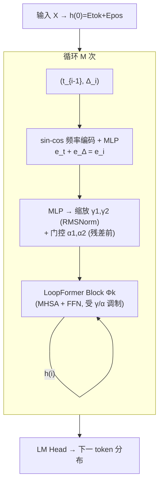

# LoopFormer: Elastic-Depth Looped Transformers for Latent Reasoning via Shortcut Modulation

**会议**: ICLR 2026  
**OpenReview**: [https://openreview.net/forum?id=RzYXb5YWBs](https://openreview.net/forum?id=RzYXb5YWBs)  
**代码**: [https://loopformer.github.io](https://loopformer.github.io)  
**领域**: LLM 高效推理 / 弹性深度 / 循环 Transformer  
**关键词**: 循环 Transformer, 潜在推理, 弹性深度, 预算可调推理, shortcut consistency, 轨迹建模  

## 一句话总结
LoopFormer 把循环 Transformer 的每次循环显式地条件化在「归一化时刻 $t$ + 步长 $\Delta t$」上，再用 shortcut-consistency 训练把不同长度的循环轨迹对齐到同一终点，从而让一个模型在推理时**任意指定计算预算 $M$、无需重训**就能优雅伸缩深度，避免了 naive 早退导致的表征塌缩。

## 研究背景与动机
**领域现状**：循环 / 权重共享 Transformer（Universal Transformer、ALBERT、Recurrent Depth 等）被证明在算法和推理任务上有强归纳偏置，能在隐状态里内化类似 chain-of-thought 的「潜在推理」，且推理能力随有效计算深度（循环数）平滑提升。

**现有痛点**：几乎所有现有循环模型在训练和推理时都**固定循环次数 $L$**。一旦训完，在更短或更长深度上评估时表征就会塌缩（因为这些深度是 off-distribution）。结果循环模型花的 FLOPs 和同算力的非循环 baseline 一样，反而丢掉了「灵活计算」这个最大卖点。

**核心矛盾**：用户希望在推理时给一个预算 $M$ 就能拿到好表征（budget-conditioned），但把早退 / 路由 / 层丢弃这些动态计算技巧硬塞进循环架构很脆弱——共享块反复套用常常收敛到相似、停滞的状态，短路由退化、长路由不再细化。

**本文目标**：训练一个**弹性深度（elastic depth）**的循环模型——单一模型在用户任选预算下都表现良好，无需重训、也不在后期步骤退化。

**核心 idea**：**把迭代式表征细化看成表征空间里的一条轨迹**——token 状态在归一化单位时间 $[0,1]$ 上从 $h_0$ 演化到目标 $h_1$。受扩散模型 shortcut/one-step 蒸馏与 Neural ODE 启发，**让每一步循环显式知道自己处在轨迹的什么时刻、跨多大步长**，使粗粒度轨迹能用更少步逼近细粒度轨迹；再用一致性损失把短轨迹的终点对齐到完整 $L$ 步轨迹的终点（循环内自蒸馏）。

## 方法详解

### 整体框架
LoopFormer 是一个 decoder-only 的循环 Transformer：一组 $k$ 个共享块 $\Phi_k(\cdot)$ 递归套用 $M$ 次（$1\le M\le L$），记作 $(k\otimes L)$。与普通循环模型唯一的不同在于**每次循环 $i$ 都条件化在 $(t_{i-1}, \Delta_i)$ 上**——其中 $0=t_0<t_1<\dots<t_M=1$ 是累积归一化时刻，$\Delta_i=t_i-t_{i-1}$ 是该步步长，整条轨迹 $\Delta_M=(\Delta_1,\dots,\Delta_M)$ 满足 $\sum_i\Delta_i=1$。训练时同时跑一条满轨迹 $\Delta_L$ 和一条随机采样的短轨迹 $\Delta_S$，用一致性损失把两者对齐；推理时用户给定 $M$ 与步长表即可弹性伸缩。

### 关键设计

**1. 时间 + 步长双调制（trajectory conditioning）：让每步知道自己在轨迹哪里、跨多大。**
现有的 TMLT 只把「循环下标」当时间来条件化（DiT 式 timestep）。LoopFormer 进一步把每步循环条件化在**两个标量**上：累积归一化时刻 $t_{i-1}\in[0,1]$ 和步长 $\Delta_i\in(0,1]$。两个标量各自经 sin-cos 频率编码后由小 MLP 投影成 $e_t,e_\Delta$，相加得 $e_i=e_t+e_\Delta$。这个信号再经一个 MLP 映射成两个 RMSNorm 的缩放 $(\gamma_1,\gamma_2)$ 与 MHSA / FFN 残差前的门控 $(\alpha_1,\alpha_2)$（类似 DiT 的 adaLN）。**步长这一维是关键**——它让同一组参数能在「粗粒度大跳」和「细粒度小步」两种模式间切换，使一条 $M$ 步的粗轨迹能近似 $L$ 步细轨迹，这是弹性深度成立的前提。

**2. Shortcut-consistency 训练：把不同长度的轨迹对齐到同一终点，做循环内自蒸馏。**
naive 早退会让后期循环停滞、深度被浪费。为此每个 batch 除满轨迹外，先采样短轨迹长度 $S\sim\mathcal{U}\{1,\dots,L-1\}$，再在 $[0,1]$ 上均匀采出满足 $\sum_{i=1}^S\Delta_i=1$ 的步长表 $\Delta_S$，保证训练同时见过长短轨迹。总损失为

$$\mathcal{L}=\mathcal{L}_L+\lambda_1\mathcal{L}_S+\lambda_2\mathcal{L}_{\text{cons}},$$

其中 $\mathcal{L}_L,\mathcal{L}_S$ 分别是满轨迹与短轨迹的下一 token 交叉熵，一致性项

$$\mathcal{L}_{\text{cons}}=\big\lVert \text{stopgrad}(h^{(L)})-h^{(S)}\big\rVert^2$$

用 stop-gradient 把短轨迹的逐 token 表征/logits 拉向满轨迹的终点（self-distillation）。论文中 $\lambda_1=\lambda_2=0.1$。这保证短路由仍信息丰富、长路由继续细化而非塌缩——两条不同长度的轨迹被训练成指向**同一个 $t=1$ 终点**。

**3. 弹性深度推理：一个预算旋钮，平滑伸缩、无需重训。**
推理时用户只需选预算 $M\le L$ 和步长表 $\Delta_M$，模型逐步 $h^{(i)}=\Phi_k(h^{(i-1)};t_{i-1},\Delta_i)$ 跑 $M$ 次后取 LM Head 输出。因为训练时已对各种轨迹做过一致性对齐，性能随算力**平滑提升**而非在短深度处崩掉。默认推理用均匀步长 $\Delta_i=1/M$；但作者发现**固定预算下轨迹形状也很重要**——穷举 $(3\otimes8)$、$M=4$ 的所有步长表，困惑度方差约 1.4、准确率方差约 1.3，最优策略普遍是**早期粗步、后期细步**（与表征动态早期相似、中后期活跃的观察一致）。

## 实验关键数据

设置：24 层 / ~1B 参数非循环 Transformer 作 iso-FLOP 锚点，NanoGPT 配置的 GPT 式 decoder，The Pile 去重子集训 25B tokens（Chinchilla scaling）。困惑度测 FineWeb-Edu / OpenWebText / Pile；潜在推理测 10 个零样本基准（COPA/HS/LB/OBQA/PIQA/RACE/SIQA/ARC/SciQ/WG）。

### 主实验（$(3\otimes8)$ 三档预算，节选）

| 预算 | 模型 | Pile PPL ↓ | 平均零样本准确率 ↑ |
|------|------|-----------|------------------|
| 24× | Base (24⊗1, 非循环) | **9.49** | **45.27** |
| 24× | Base-Loop (3⊗8) | 10.91 | 42.88 |
| 24× | TMLT (3⊗8) | 10.38 | 44.69 |
| 24× | **LoopFormer (3⊗8)** | **10.28** | 44.81 |
| 12× | Base (12⊗1) | 9.98 | 44.93 |
| 12× | TMLT-EE (3⊗4) | 12.18 | 41.5 |
| 12× | **LoopFormer (3⊗4)** | **11.12** | **43.73** |
| 6× | Base (6⊗1) | 11.13 | 42.73 |
| 6× | TMLT-EE (3⊗2) | 15.79 | 37.59 |
| 6× | **LoopFormer (3⊗2)** | **14.30** | **40.36** |

**关键对比**：在所有循环 baseline 里，LoopFormer 困惑度最低、推理最强；预算越紧（6×/12×），它对早退式 baseline（TMLT-EE、Naive-Loop-EE）的优势越大——后者在低预算处困惑度暴涨（如 6× 时 TMLT-EE 飙到 15.79，LoopFormer 仅 14.30）。

### 消融 / 分析

| 分析维度 | 发现 |
|---------|------|
| 层数 $k$ vs 循环数 $L$（$k\in\{1,2,3\}$, $L\in\{8,12,24\}$） | 困惑度与推理都随更大 $k$、更多循环平滑提升；LoopFormer 在 $M\le L$ 各预算下保持趋势不塌缩 |
| 表征动态（curvature / anisotropy / prompt entropy / CKA） | 早退 baseline 各指标全程**平坦**、CKA 高 → 停滞；LoopFormer 中段曲率/熵上升、末段收敛 → 持续演化 |
| 固定预算下的轨迹选择（穷举 $M=4$/$M=6$） | 同算力下不同步长表差异巨大（PPL 方差 1.4~3），最优策略**早粗后细** |

### 关键发现
- 循环模型在困惑度上仍落后非循环 iso-FLOP（参数承担记忆角色），但 LoopFormer 大幅缩小差距、超过所有固定深度循环变体。
- 一致性训练不仅帮 LoopFormer，也能改善 Base-Loop 和 TMLT 在弹性深度区间的伸缩性。
- 表征几何指标证实：早退导致塌缩，shortcut + consistency 维持了非退化的逐步细化。

## 亮点与洞察
- **把「预算旋钮」做进循环模型**：相比早退/路由/token halting 的实例级动态计算，LoopFormer 用扩散式「时间轨迹」视角给出一个干净的序列级预算条件化方案，训一次、推理任意深度。
- **步长维度是画龙点睛**：只加「循环下标=时间」（TMLT）不够，额外条件化「跨多大步」才让粗细轨迹可互相逼近，这是弹性深度的数学前提。
- **用表征几何当诊断器**：anisotropy / curvature / entropy / CKA 四件套清晰地把「塌缩」可视化，为「循环模型到底有没有用上深度」提供了可检验证据。
- **轨迹形状本身是可调超参**：固定预算下「早粗后细」更优的发现，为后续 schedule policy 研究开了口子。

## 局限与展望
- **预算是全局（序列级）而非实例/token 自适应**——简单输入和困难输入用同样深度，不如 Mixture-of-Recursions 那类 token 级路由精细。
- **训练开销**：多轨迹一致性需要每 batch 多跑一条短轨迹，增加训练成本。
- **表征分析是相关性而非因果**——几何指标与性能的关系尚属观察。
- 展望：实例条件化的 schedule 策略（让模型自己决定每个输入用多深）、对轨迹表征空间更深入的理论/诊断。

## 相关工作与启发
- **循环 / 权重共享 Transformer**：Universal Transformer、ALBERT、DEQ、Looped Transformers（length generalization、可编程计算）、Recurrent Depth；最相关的是 **TMLT**（用循环下标做 timestep 条件化），LoopFormer 在其上加了步长 + 多轨迹一致性。
- **动态计算**：早退（LayerSkip、CALM）、层丢弃、MoE、Mixture-of-Depths、并发的 Mixture-of-Recursions（token 级递归深度路由）——LoopFormer 走的是「预算条件化」而非「路由/halting」这条不同的路。
- **潜在推理**：在隐状态里做推理而非显式 CoT 的一系列工作；本文强调**轨迹鲁棒性**——短预算下表征仍有用、长预算下继续细化。
- **时间 / shortcut 调制**：DiT 的 adaLN timestep 条件化、consistency models、shortcut/one-step diffusion 蒸馏——LoopFormer 把这套「把长轨迹蒸成几步」的思想迁移到语言模型循环深度上。

## 评分
- **新颖性**: ⭐⭐⭐⭐ — 把扩散式「时间+步长轨迹 + shortcut consistency」迁移到循环 LM 实现弹性深度，角度新颖；不过单点技术多为已有思想（DiT adaLN、consistency 蒸馏、TMLT）的有机组合。
- **实验充分度**: ⭐⭐⭐⭐ — 三档预算 × 多 $(k,L)$ × 10 推理基准 + 四种表征几何诊断 + 轨迹穷举，对比充分；但只到 ~1B/25B tokens 规模，未验证更大模型与指令微调场景。
- **写作质量**: ⭐⭐⭐⭐ — 动机清晰、轨迹视角统一、图表（架构图/scaling 曲线/表征指标/CKA 热图）支撑到位。
- **价值**: ⭐⭐⭐⭐ — 给「可控算力的 budget-aware LLM」提供了一条实用且无需重训的弹性深度路径，对推理时算力调度有直接应用价值。

<!-- RELATED:START -->

## 相关论文

- [\[ICLR 2026\] MeSH: Memory-as-State-Highways for Recursive Transformers](mesh_memory-as-state-highways_for_recursive_transformers.md)
- [\[ICLR 2026\] DND: Boosting Large Language Models with Dynamic Nested Depth](dnd_boosting_large_language_models_with_dynamic_nested_depth.md)
- [\[NeurIPS 2025\] From Shortcut to Induction Head: How Data Diversity Shapes Algorithm Selection in Transformers](../../NeurIPS2025/llm_efficiency/from_shortcut_to_induction_head_how_data_diversity_shapes_algorithm_selection_in.md)
- [\[ICLR 2026\] STEM: Scaling Transformers with Embedding Modules](stem_scaling_transformers_with_embedding_modules.md)
- [\[ICLR 2026\] Sparse Attention Adaptation for Long Reasoning](sparse_attention_adaptation_for_long_reasoning.md)

<!-- RELATED:END -->
