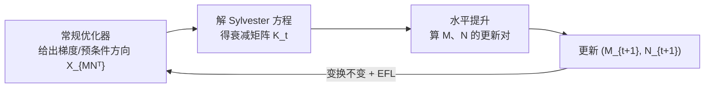

# LoRA-S: An Efficient Low Rank Adaptation scheme via Sylvester equation

**会议**: ICLR 2026  
**OpenReview**: [https://openreview.net/forum?id=Guo2XGgxZA](https://openreview.net/forum?id=Guo2XGgxZA)  
**代码**: [https://gitee.com/sanjin998/lora_s](https://gitee.com/sanjin998/lora_s)  
**领域**: llm_efficiency / 参数高效微调 (PEFT)  
**关键词**: LoRA, 高效特征学习 (EFL), 商流形优化, 水平提升, Sylvester 方程, 变换不变性  

## 一句话总结
本文用微分几何的"水平提升"理论把 LoRA 的两个低秩因子放到商流形上优化，导出一个能让**任意带预条件的优化器**自动获得"高效特征学习/变换不变性"的通用迭代框架，并用一个由 Sylvester 方程解出的衰减矩阵 $K$ 替换掉手调的 weight decay 超参，产出 AdamS 与 LRACS 两个即插即用的高效 LoRA 优化器。

## 研究背景与动机
**领域现状**：LoRA 通过冻结预训练权重 $W\in\mathbb{R}^{n\times m}$、只训练低秩增量 $X=MN^\top$ 来做参数高效微调。近年大量工作（LoRA+、LoRA-Rite 等）想加速 LoRA 的收敛，其中"高效特征学习 (Efficient Feature Learning, EFL)"是最有影响的一条线——它要求两个因子 $M$、$N$ 的更新都对损失变化有实质贡献，而不是一个在动一个被"晾着"。

**现有痛点**：常规优化器在 LoRA 上做不到 EFL，因为分解 $X=MN^\top$ 存在 $R\in GL(r)$ 的冗余自由度（$(MR, NR^{-\top})$ 表示同一个 $X$），导致更新"变换相关 (transformation-variant)"。为补救，LoRA+ 给两个因子设不同学习率（要额外调参），LoRA-Rite 重新设计了一个复杂的预条件器（实现繁琐、难以泛化）。而经典 Riemann 方法（RGD、ScaledAdam）虽然朴素地满足 EFL，但一旦叠加现代预条件就破坏了 EFL。

**核心矛盾**：想要 EFL 就得放弃强预条件，想要强预条件（缓解 LLM Hessian 的病态条件数）就丢了 EFL——两者难以兼得，且现有方法都伴随昂贵的额外超参搜索。

**本文目标**：建立一个统一框架，让"任意优化器 + 任意预条件"都能保持 EFL，同时消掉 weight decay 这个费时的超参。

**核心 idea**：把 LoRA 优化看成在商流形 $\mathbb{R}^{m\times r}_*\times\mathbb{R}^{n\times r}_*/\!\sim$ 上的几何优化，用**水平提升 (horizontal lift)** 把任意切空间方向投影到去除冗余的水平空间，从而天然获得变换不变性；并发现提升向量里自然涌现出一个由 **Sylvester 方程**决定的衰减项 $K$，它比人工 weight decay 更优。

## 方法详解

### 整体框架
LoRA 的两个因子 $(M,N)$ 与真正想优化的低秩矩阵 $X=MN^\top$ 之间差了一个 $r^2$ 维的冗余纤维。本文先建立从因子空间到秩-$r$ 矩阵流形 $\mathcal{M}(r,m\times n)$ 的 Riemann 浸没 $\pi:(M,N)\mapsto MN^\top$，把"在 $X$ 上的下降方向"通过水平提升唯一地还原成"在 $(M,N)$ 上的更新对"，更新中自带消除冗余的约束。整套流程落成一个三步循环的通用迭代框架（Algorithm 1）：给定下降向量 → 解 Sylvester 方程得 $K_t$ → 用 $K_t$ 算出两个因子的提升更新。

### 关键设计

**1. 商流形 + 水平提升：把 EFL 重述成几何条件。** 因为 $\pi^{-1}(MN^\top)=\{(MR, NR^{-\top}):R\in GL(r)\}$ 是 $r^2$ 维纤维，常规更新会落在含冗余的切空间里而变得变换相关。作者定义等价关系 $\sim$（$(M_a,N_a)\sim(M_b,N_b)\iff MN^\top$ 相同），把切空间分解为纤维核与其正交补——水平空间 $\mathcal{H}_{(M,N)}$。给定矩阵切空间里的方向 $\dot X_{MN^\top}$，存在唯一的水平提升 $\dot X_{\uparrow(M,N)}$ 满足 $D\pi(M,N)[\dot X_{\uparrow}]=\dot X_{MN^\top}$。本文进一步给出 EFL 的严格数学定义（Definition 2）：当两组因子表示同一权重 $M_1N_1^\top=M_2N_2^\top$ 时，更新在度量 $g$ 下幅度相等且满足 $\dot M_2=\dot M_1 R,\ \dot N_2=\dot N_1 R^\top$——这一条件即等价于 LoRA-Rite 所谓的"变换不变性"（Proposition 1），从而把工程性的 EFL 概念落到流形优化的语言里。

**2. Sylvester 衰减矩阵 $K$：消掉 weight decay 超参。** 选用满足 EFL 条件的 Grassmann 商流形度量 $g_{(M,N)}=\mathrm{trace}\big(M^\top M\,\dot M^\top\dot M + N^\top N\,\dot N^\top\dot N\big)$ 后，水平提升的闭式解为
$$\dot X_{M(M,N)}=\big(\dot X_{MN^\top}N - MN^\top N K\big)(N^\top N)^{-1},$$
其中 $K$ 是 Sylvester 方程 $M^\top \dot X_{MN^\top} N = M^\top M N^\top N K + K M^\top M N^\top N$ 的唯一解。作者把提升向量拆成"梯度项 (GT)"和"衰减项 (DT)"，指出传统 LoRA 里手调的 weight decay $\lambda$ 不过是对衰减项的粗糙近似。由于 $K_t$ 可由 Sylvester 方程直接解出、无需调参，且理论与实验都表明其正则效果强于 $L_2$，于是整套方法**天然免去了 weight decay 超参搜索**（消融显示"对 Sylvester 解近似得越准，性能越好"，且额外正则化 $K$ 并不带来增益，说明 $K$ 本身已是恰当的衰减）。

**3. 通用性：把任意优化器"提升"成变换不变版。** Theorem 1 保证任何遵循 Algorithm 1 的优化器都自动满足 EFL 与变换不变性。这意味着框架是即插即用的"外壳"：把常规优化器的下降方向喂进去即可。作者据此具体实例化两个优化器——**AdamS**（提升 Adam，并提供低内存变体与可选的 Riemann 内积）与 **LRACS**（提升 RACS 优化器，若注入网络最后一层则该层退化用 Adam 训练）。两者都带运行时分析，且关键优势在于：即便叠加现代强预条件（缓解 LLM Hessian 病态）仍保持 EFL——这是 RGD、ScaledAdam 等旧 Riemann 方法做不到的。

## 实验关键数据

### 主实验表格
在 Mix-of-show 图像生成模型（MSE 损失，块对角 Hessian）上以 CLIP↑/FID↓ 评测，训练 3500 步：

| 优化器 | r=4 CLIP | r=4 FID | r=8 CLIP | r=8 FID | r=16 CLIP | r=16 FID |
|---|---|---|---|---|---|---|
| Adam | 25.17 | 72.75 | 26.83 | 67.09 | 29.86 | 57.35 |
| Scaled GD (EFL 基线) | 25.74 | 70.99 | 25.98 | 70.01 | 29.07 | 59.87 |
| LoRA-Rite (SOTA EFL) | 30.96 | 59.04 | 30.99 | 59.02 | 31.90 | 55.68 |
| **LRACS (ours)** | 31.43 | 52.67 | 31.46 | 52.12 | 32.09 | 49.52 |
| **AdamS (ours)** | **32.20** | 54.39 | 32.38 | 51.87 | **32.64** | **46.32** |

GPT-2 medium 在 E2E NLG 上（r=4，5 epoch / 22.6k 步，0.39M 可训参数）：

| 方法 | BLEU | NIST | MET | ROUGE-L | CIDEr |
|---|---|---|---|---|---|
| Adam | 68.0 | 8.61 | 44.7 | 69.1 | 2.38 |
| AdamW | 68.6 | 8.69 | 46.5 | 71.3 | 2.51 |
| LoRA-Rite | 69.3 | 8.75 | 46.5 | 71.7 | 2.53 |
| **AdamS (ours)** | 69.4 | 8.75 | 46.5 | 71.7 | 2.53 |
| **LRACS (ours)** | **70.4** | **8.85** | **46.7** | **71.9** | **2.54** |

### 消融实验表格

| 消融项 | 结论 |
|---|---|
| Sylvester 解 → 替换成 weight decay 矩阵 | 近似越准性能越好，说明解 Sylvester 方程不可或缺 |
| 对 $K$ 额外正则化 | 不提升性能，$K$ 本身已是恰当衰减 |
| LoRA 秩 r=4/8/16 | r=16 为 Mix-of-show 上的最优秩，方法对秩鲁棒 |
| Riemann vs 欧氏动量累积 (GPT-2 small) | 验证 Riemann 内积选项的有效性 |
| 学习率 50%–250% / 不同 batch size 敏感性 | AdamS、LRACS 对超参变化鲁棒 |

### 关键发现
- AdamS 把 Mix-of-show 的平均 CLIP 提到 **32.64**，比 Adam (29.86) 高 9%、比 LoRA-Rite (31.90) 高 3%；FID 在 r=16 上从 57.35 降到 46.32。
- 凡是满足 EFL 的方法普遍优于其对应的非 EFL 版本，验证了"几何化 EFL"路线的有效性。
- 免 weight decay 不仅没掉点，反而因 Sylvester 衰减更精准而更优，实打实省下超参搜索时间。

## 亮点与洞察
- **把工程 trick 抬升为几何定理**：以前 EFL 靠"给两个因子设不同学习率"这类经验做法，本文用水平提升给出充要的度量条件，并证明 LoRA-Rite 的变换不变性只是其特例，理论上更干净、统一。
- **"weight decay ≈ 衰减项近似"是漂亮的洞察**：把一个长期靠手调的超参解释成提升向量里某一项的粗糙替身，并用 Sylvester 方程给出精确解，等于"用理论消掉一个超参"。
- **框架而非单点方法**：核心产出是能给任意带预条件优化器"穿"上的通用外壳，AdamS/LRACS 只是两个实例，可扩展性强。

## 局限与展望
- 实验规模偏小：仅 GPT-2 medium/small 与 Mix-of-show，未在主流大 LLM（7B+）或更大图像模型上验证，扩展性结论主要靠 r 与数据集多样性间接支撑。
- 每步要解一个 $r\times r$ 的 Sylvester 方程并做矩阵求逆，虽然 $r$ 通常很小，但运行时与显存在高秩/多层场景下的实际开销仍需关注（论文提供低内存变体作缓解）。
- 理论建立在"块对角 Hessian"等结构假设上，对不满足该结构的损失/架构是否仍最优尚不明确。
- 与 DoRA、量化型 LoRA 等其他 PEFT 改进路线的正交组合效果未探索。

## 相关工作与启发
- **EFL 谱系**：LoRA+（不同学习率）、LoRA-Rite（变换不变预条件器）是直接对标对象，本文用商流形几何把它们统一并超越。
- **Riemann/商流形优化**：ScaledGD、Quotient GD、RGD、ScaledAdam 提供了几何优化的工具箱，本文的贡献在于让"现代预条件 + EFL"可以共存。
- **启发**：把"看似要手调的超参"重新解读为更深结构（这里是提升向量的衰减项）的近似，是一条很有迁移性的研究范式——可推广到 LoRA 之外的其他低秩/分解式训练里去寻找类似的"可解析替换超参"。

## 评分
- **新颖性**: ⭐⭐⭐⭐ 用水平提升/商流形给 EFL 一个严格几何定义，并把 weight decay 解释成 Sylvester 衰减项的近似，视角新颖、统一性强。
- **实验充分度**: ⭐⭐⭐ 主实验 + 多项消融/敏感性较完整，但模型规模偏小、缺大 LLM 验证。
- **写作质量**: ⭐⭐⭐⭐ 数学推导清晰、动机—理论—算法—实验链条完整，几何符号略重但 Algorithm 1 把方法落地得很清楚。
- **价值**: ⭐⭐⭐⭐ 即插即用、免超参、对任意预条件优化器通用，对 PEFT 训练实务有直接价值。

<!-- RELATED:START -->

## 相关论文

- [\[ICLR 2026\] BA-LoRA: Bias-Alleviating Low-Rank Adaptation to Mitigate Catastrophic Inheritance in Large Language Models](ba-lora_bias-alleviating_low-rank_adaptation_to_mitigate_catastrophic_inheritanc.md)
- [\[ICLR 2026\] BoRA: Towards More Expressive Low-Rank Adaptation with Block Diversity](bora_towards_more_expressive_low-rank_adaptation_with_block_diversity.md)
- [\[ICLR 2026\] On-the-Fly Adaptation to Quantization: Configuration-Aware LoRA for Efficient Fine-Tuning of Quantized LLMs](on-the-fly_adaptation_to_quantization_configuration-aware_lora_for_efficient_fin.md)
- [\[ICLR 2026\] FLoRG: Federated Fine-tuning with Low-rank Gram Matrices and Procrustes Alignment](florg_federated_fine-tuning_with_low-rank_gram_matrices_and_procrustes_alignment.md)
- [\[ICLR 2026\] PLoP: Precise LoRA Placement for Efficient Finetuning of Large Models](plop_precise_lora_placement_for_efficient_finetuning_of_large_models.md)

<!-- RELATED:END -->
