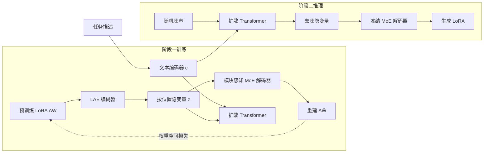

# LoRAGen: Structure-Aware Weight Space Learning for LoRA Generation

**会议**: ICLR 2026  
**OpenReview**: [https://openreview.net/forum?id=mrafO7aTYj](https://openreview.net/forum?id=mrafO7aTYj)  
**代码**: [https://github.com/tsinghua-fib-lab/LoRAGen](https://github.com/tsinghua-fib-lab/LoRAGen)  
**领域**: LLM 高效适配 / 参数生成 / LoRA  
**关键词**: LoRA 生成, 权重空间学习, 隐扩散模型, MoE, 零样本适配  

## 一句话总结
LoRAGen 从「LoRA 参数空间本身的结构特性」出发，用作用在**完整适配矩阵 $\Delta W$ 上的权重空间损失** + **模块感知 MoE 解码器**，让隐扩散模型直接从自然语言任务描述生成 LoRA 参数，在分布内逼近任务专属 LoRA、在未见任务上零样本超越基线近 5 个点。

## 研究背景与动机
- **领域现状**：LoRA 已成为大模型高效微调的事实标准，但每个新任务都要重新训练适配器、调超参，维护成本高、复用性差。于是「参数生成（parameter generation）」这条路兴起——训练一个超网络/生成模型，直接从任务描述合成 LoRA 权重，省去任务专属训练。代表工作有学隐表示再解码（D2NWG 等）、条件扩散先验、以及一次前向生成的超网络 Text-to-LoRA（T2L）。
- **现有痛点**：这些方法几乎都把 LoRA 生成当成「通用权重空间学习」的一个实例，直接重建低秩分解矩阵 $A、B$，忽视了 LoRA 参数空间自身的两条结构特性，导致泛化差、跨架构难。
- **核心矛盾**：作者在 FLAN-T5-large 的 LoRA 库上做实证分析，挖出两个被忽视的结构事实——
  1. **低秩分解的非唯一性**：$\Delta W$ 是唯一的，但其分解 $(A,B)$ 不唯一（任意可逆 $R$ 都有 $(BR)(R^{-1}A)=\Delta W$）。实测中，任务描述相似度与**完整矩阵 $\Delta W$ 相似度正相关**，却与**低秩分解矩阵相似度近乎零相关**——直接监督 $A、B$ 会被任意旋转/缩放扰动，训练易记忆而非泛化。
  2. **模块间权重分布异质**：不同模块类型的 LoRA 谱熵分布系统性不同（encoder self-attn 谱熵高、decoder self-attn 最低/更低秩、cross-attn 居中）。用单一解码器统吃所有模块会失配。
- **本文目标**：设计一个**专门贴合 LoRA 结构**的生成方法，既对分解非唯一性鲁棒，又能匹配模块异质分布，从而在分布内与零样本两种设定下都生成好用的 LoRA。
- **核心 idea（结构感知权重空间学习）**：**监督完整适配矩阵而非分解矩阵** + **按模块路由的 MoE 解码器**，把「LoRA 参数空间几何」的先验显式注入隐扩散生成框架。

## 方法详解

### 整体框架
LoRAGen 是两阶段的「隐扩散 + 自编码」框架。**阶段一**用 LoRA 权重自编码器（LAE）把预训练 LoRA 参数 $\Delta W$ 编码成按位置（模块 $m$、层 $\ell$）的隐变量，再由模块感知 MoE 解码器重建；同时训练一个扩散 Transformer，以文本编码器给出的任务描述嵌入 $c$ 为条件，对 LAE 隐空间建条件先验。**阶段二**推理时只喂任务描述 $c$ 和高斯噪声，扩散 Transformer 反向去噪得到隐变量，再过冻结的 MoE 解码器生成完整 LoRA 参数挂回 LLM（推理不用编码器）。

### 关键设计

**1. 适配矩阵级监督（Adapter-Level Supervision）：用完整 $\Delta W$ 而非 $A、B$ 当训练信号。** 这是对 Obs-1 非唯一性的正面回应。既然无数对 $(A,B)$ 都还原同一个 $\Delta W$，直接对 $A、B$ 做逐元素重建就等于强迫生成器"选一个特定分解"，训练对任意缩放/旋转敏感。LoRAGen 改成在低秩适配器 $\widehat{\Delta W}_{m,\ell}=D_\theta(z)_{m,\ell}$ 这一层加监督，并拆成两个互补项。**方向损失**先把预测与目标都归一化到单位 Frobenius 范数再比方向，消除范数歧义：$L_{\text{ang}}(m,\ell)=1-\frac{\langle \widehat{\Delta W}_{m,\ell},\,\Delta W_{m,\ell}\rangle_F}{\|\widehat{\Delta W}_{m,\ell}\|_F\,\|\Delta W_{m,\ell}\|_F}$。但方向一致并不能保证 Frobenius 能量在奇异谱上的分布一致，于是再加**谱损失**对齐前 $k$ 个主奇异值：$L_{\text{spec}}(m,\ell)=\big\|\sigma_{1:k_{m,\ell}}(\widehat{\Delta W}_{m,\ell})-\sigma_{1:k_{m,\ell}}(\Delta W_{m,\ell})\big\|_{p,\omega}$，其中 $k_{m,\ell}$ 取「累计解释目标平方 Frobenius 范数比例 $\ge\rho$」的最小截断，$\omega$ 是按奇异值归一的权重。两项加权汇总成 $L_{\text{adapter}}$，使生成的 LoRA 既在方向上贴任务、又在主谱能量分布上贴任务，同时对低秩分解的非唯一性保持鲁棒。

**2. 模块感知 MoE 解码器（Module-Aware MoE Decoder）：让不同模块的专家各管各的谱分布。** 这是对 Obs-2 异质性的回应。解码器对每个位置 $(m,\ell)$ 构造结构嵌入 $h_{m,\ell}=[\,z_{m,\ell};\,e_m;\,e_\ell\,]$，把隐变量与**可学习的模块嵌入 $e_m$、层嵌入 $e_\ell$** 拼接，再由路由器 $W_r$ 出 logits 并做 top-$K$ 软门控：$g_{(m,\ell),e}=\frac{\exp(\ell_{m,\ell,e}/\tau)}{\sum_{e'\in S_{m,\ell}}\exp(\ell_{m,\ell,e'}/\tau)}\,\mathbb{I}[e\in S_{m,\ell}]$。专家是小 MLP，门控加权和经**逐模块输出头** $H_m$ 线性映射并 reshape 成 $\widehat{\Delta W}_{m,\ell}=H_m\!\big(\sum_{e\in S_{m,\ell}} g_{(m,\ell),e}E_e(h_{m,\ell})\big)$，$H_m$ 在同一模块的所有层间共享。解码器可选"全局共享专家池"或"每模块独立专家池"两种配置，从而在「专家专精模块特定能量分布」与「受控共享」之间取得平衡，提升跨架构（T5 编码-解码 ↔ Gemma 纯解码）泛化。为防专家坍塌，加负载均衡辅助损失 $L_{\text{moe}}=\max\!\big(E\sum_e \bar p_e\bar f_e-1,\,0\big)$。

**3. 条件隐扩散先验（Conditional Latent Diffusion）：把"从任务描述采样 LoRA"做成去噪过程。** LAE 给出对角高斯后验 $q_\phi(z\mid\Delta W)$ 作为隐目标，扩散 Transformer 学条件先验 $p_\psi(z_0\mid c)$。前向加噪 $q(z_t\mid z_0)=\mathcal N(\sqrt{\bar\alpha_t}z_0,(1-\bar\alpha_t)I)$，去噪器以 $c$ 为条件用 $v$-预测目标训练：$L_{\text{diff}}(\psi)=\mathbb E\big[\|v-f_\psi(z_t,t,c)\|_2^2\big]$。LAE 总目标把适配矩阵监督、KL 正则与 MoE 负载均衡合在一起：$L_{\text{LAE}}=\alpha_{\text{adapter}}L_{\text{adapter}}+\beta\,D_{KL}\!\big(q_\phi(z\mid\Delta W)\,\|\,\mathcal N(0,I)\big)+\lambda_{\text{moe}}L_{\text{moe}}$，这样隐空间既被结构化监督塑形、又适合扩散先验采样，推理时纯噪声 + 任务描述即可生成新 LoRA。

## 实验关键数据

### 主实验
FLAN-T5-Large（FLAN 7 任务子集，分布内，Acc 平均）：

| 方法 | Avg. (acc) |
|------|-----------|
| FLAN-T5-Large（无适配） | 36.8 |
| Average LoRA | 95.8 |
| D2NWG | 58.4 |
| T2L | 88.7 |
| **LoRAGen (Ours)** | **96.0** |
| Task-specific LoRAs（上界） | 96.2 |

Gemma-2-2B-Instruct（8 个 benchmark 任务，分布内）：

| 方法 | Avg. (acc) |
|------|-----------|
| Gemma-2-2B-Instruct | 68.8 |
| D2NWG | 68.9 |
| T2L | 69.2 |
| **LoRAGen (Ours)** | **72.7** |
| Task-specific LoRAs（上界） | 74.5 |

零样本（在 136 个 FLAN 任务上训练，7 个未见任务测试）：

| 方法 | Avg. (acc) |
|------|-----------|
| D2NWG | 35.0 |
| T2L | 35.2 |
| **LoRAGen (Ours)** | **40.2** |

LoRAGen 分布内逼近任务专属 LoRA 上界（96.0 vs 96.2、72.7 vs 74.5），零样本比 D2NWG/T2L 高约 +5 点。

### 消融实验
FLAN 子集上拆解三个组件（$L_{\text{ang}}$ 方向损失 / $L_{\text{spec}}$ 谱损失 / $D_\theta$ MoE 解码器）：

| $L_{\text{ang}}$ | $L_{\text{spec}}$ | $D_\theta$ | Avg. (acc) |
|:---:|:---:|:---:|:---:|
| ✓ | ✓ | ✗ | 58.4 |
| ✗ | ✗（仅重建） | ✓ | 95.2 |
| ✗ | ✓ | ✓ | 36.9 |
| ✓ | ✓ | ✓ | **96.0** |

### 关键发现
- **MoE 解码器是性能主引擎**：去掉解码器（只留两个权重空间损失）骤降到 58.4，印证 Obs-2 的模块异质性必须靠模块感知路由+逐模块头来吃下。
- **方向损失不可缺**：只用谱损失 + 解码器（去方向损失）崩到 36.9，说明谱损失只管能量分布、必须配方向损失才能锚定任务方向。
- **适配矩阵级监督带来零样本泛化**：D2NWG/T2L 重建分解矩阵 → 倾向记忆任务专属 LoRA → 未见任务掉链子；LoRAGen 直接监督 $\Delta W$ → 学到任务相关结构而非死记，零样本明显领先。
- **跨架构可迁移**：同一套结构感知设计从 T5 编码-解码迁到 Gemma 纯解码仍有效，部分任务（ArcE/GSM8K/OQA）甚至追平或超越任务专属 LoRA。

## 亮点与洞察
- **从"权重空间几何"反推方法设计**：先做实证分析挖出非唯一性、模块异质两条结构事实，再让每个设计精确对应一条观察（损失↔Obs-1，解码器↔Obs-2），方法论干净、动机自洽。
- **抓住 LoRA 的"本质对象是 $\Delta W$ 而非 $A、B$"**：把监督从分解矩阵搬到完整适配矩阵，是对此前一众生成方法的根本性纠偏，也是零样本泛化的来源。
- **方向 + 谱双损失**互补：一个管方向、一个管主谱能量分布，恰好覆盖"任务相关 LoRA"的两类信息，且都对低秩分解的旋转/缩放等价类鲁棒。

## 局限与展望
- **基座规模有限**：主实验止于 FLAN-T5-large 与 Gemma-2-2B，更大规模 LLM（7B+）上的可扩展性与生成质量待验证。
- **零样本绝对值仍低**：未见任务 40.2 的绝对精度离实用还远，零样本生成的上限明显受限于训练任务覆盖。
- **依赖 LoRA 库与任务描述质量**：训练需现成的预训练 LoRA 库，且任务描述由 LLM 生成，描述质量/分布对生成效果的影响未充分剖析。
- **谱损失超参较多**：$k$ 的截断比例 $\rho$、加权 $\ell_p$ 范数、各损失系数等需调，鲁棒性与自动化程度有提升空间。

## 相关工作与启发
- **权重空间学习 / 参数生成**：Schürholt 等的 hyper-representation、Peebles 等的 G.pt 扩散参数生成、Kofinas 等的图编码跨架构生成构成大背景，LoRAGen 是其在 LoRA 子空间的"结构感知特化"。
- **LoRA 生成超网络**：T2L、DnD、LoRA-Gen、hyperLoRA、D2NWG 等代表"通用权重空间学习"路线；本文的核心差异是首个显式建模 LoRA 结构特性的方法。
- **启发**：(1) 生成"参数"前先研究该参数空间的等价类与几何不变性，能直接指导损失设计；(2) 当目标对象天然按模块/层异质时，MoE + 结构嵌入路由是匹配异质分布的自然选择；(3) "监督何种对象"往往比"用何种生成模型"更决定泛化——本文把监督对象从 $A、B$ 换到 $\Delta W$ 即换来零样本增益。

## 评分
- **新颖性**: ⭐⭐⭐⭐ 首个面向 LoRA 结构特性（分解非唯一性 + 模块异质）的权重空间学习方法，两条设计与两条实证观察精确对应，视角新颖。
- **实验充分度**: ⭐⭐⭐ 覆盖编码-解码与纯解码两种架构、分布内 + 零样本两种设定、消融清晰；但基座规模偏小、零样本绝对精度仍低、缺更大 LLM 验证。
- **写作质量**: ⭐⭐⭐⭐ 动机-观察-方法-实验逻辑闭环，公式与图示清楚，"先实证后设计"的叙事很有说服力。
- **价值**: ⭐⭐⭐⭐ 把 LoRA 生成从"通用权重生成"拉回"结构感知"，对参数生成与高效适配方向有明确方法论启发，并开源代码。

<!-- RELATED:START -->

## 相关论文

- [\[ICLR 2026\] Meta-UCF: Unified Task-Conditioned LoRA Generation for Continual Learning in Large Language Models](meta-ucf_unified_task-conditioned_lora_generation_for_continual_learning_in_larg.md)
- [\[ICLR 2026\] MiSS: Revisiting the Trade-off in LoRA with an Efficient Shard-Sharing Structure](miss_revisiting_the_trade-off_in_lora_with_an_efficient_shard-sharing_structure.md)
- [\[ICML 2026\] STAR: Rethinking MoE Routing as Structure-Aware Subspace Learning](../../ICML2026/llm_efficiency/star_rethinking_moe_routing_as_structure-aware_subspace_learning.md)
- [\[ICLR 2026\] Merge before Forget: A Single LoRA Continual Learning via Continual Merging](merge_before_forget_a_single_lora_continual_learning_via_continual_merging.md)
- [\[ICLR 2026\] On-the-Fly Adaptation to Quantization: Configuration-Aware LoRA for Efficient Fine-Tuning of Quantized LLMs](on-the-fly_adaptation_to_quantization_configuration-aware_lora_for_efficient_fin.md)

<!-- RELATED:END -->
