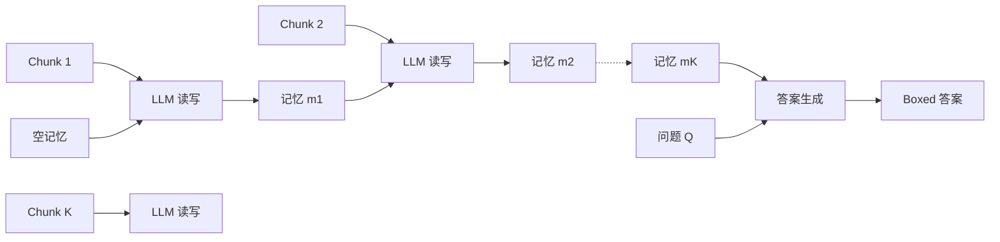

# MemAgent: Reshaping Long-Context LLM with Multi-Conv RL-based Memory Agent

**会议**: ICLR 2026  
**OpenReview**: [https://openreview.net/forum?id=k5nIOvYGCL](https://openreview.net/forum?id=k5nIOvYGCL)  
**代码**: 待确认  
**领域**: 长文本建模 / LLM 效率 / 强化学习  
**关键词**: 长上下文、固定长度记忆、线性复杂度、长度外推、Multi-Conv DAPO、RLVR  

## 一句话总结
MemAgent 把"无界长文档"切成定长 chunk 流式处理，用一段固定长度、可被覆写的 token 记忆替代不断膨胀的上下文，再用扩展版的 Multi-Conv DAPO 端到端训练记忆读写策略，使 8K 窗口模型几乎无损外推到 3.5M token 的 QA 任务，且推理复杂度严格线性。

## 研究背景与动机
**领域现状**：处理超长文档主要有三条路线——长度外推（移动位置编码 + 继续预训练）、稀疏/线性注意力、以及上下文压缩（token 级或外挂记忆模块）。它们都在试图把更长的序列塞进或塞过现有窗口。

**现有痛点**：长度外推在极长文本上仍有 $O(n^2)$ 的算力开销和明显的性能塌缩；稀疏/线性注意力往往要从头训练，且依赖人工设计的注意力模式或难以并行；上下文压缩则常常外推能力差，还要引入额外模块或上下文操作，破坏了标准自回归生成流程，损害兼容性与并行性。

**核心矛盾**：一个真正强的长上下文 LLM 需要同时满足"三位一体"——能处理无限长文本、扩展时性能不显著下降、解码具备线性复杂度。现有方法总是在这三者中顾此失彼。

**本文目标**：回到人类处理长文的直觉——人读长文时是做笔记、记关键点、丢冗余信息，而不是死记每个字。据此让模型也维护一段动态更新的定长"记忆"，在固定窗口内处理任意长度输入。

**核心 idea**：**[流式 + 覆写记忆]** 把长文档当作"证据流"，每步只看下一个 chunk 和一段定长记忆，读完即覆写记忆；**[RL 塑造记忆]** 记忆该记什么、丢什么不靠人工规则，而是用可验证结果奖励通过 RL 端到端学出来。

## 方法详解

### 整体框架
MemAgent 把任意长文档看作受控的证据流，而非一整块。推理时模型每步只面对两样东西：下一段文本 chunk 和一段定长记忆（就是上下文窗口里一串普通 token），读完当前 chunk 就用新记忆覆写旧记忆。整个流程自然分成两个模块：Context-Processing 模块按 chunk 迭代地更新记忆，文档流耗尽后切到 Answer-Generation 模块，模型只看问题加最终记忆生成答案。由于记忆长度恒定、位置编码从不重缩放，基座 LLM 的生成过程完全不变，linear 复杂度由"固定窗口"天然保证。训练侧则把这套读写记忆的多轮对话当成 RL 策略来优化。

### 关键设计

**1. 覆写式定长记忆：用恒定窗口换线性复杂度。** MemAgent 的关键是记忆永不增长——读完每个 chunk 后，模型把上一份记忆整体重写成一份新的、长度恒为 $M$ 的记忆，把至今看到的所有重要证据浓缩进去。因为 $|m_k|=M$ 是常数，每步的算力与显存都只是 $O(C+M)$（$C$ 为 chunk 长度），端到端复杂度对 chunk 数严格线性 $O(N)$。这个"覆写"动作看似简单到不可思议，但正是它让系统能扩展到百万级 token：窗口大小固定 → 解码时间和显存随输入线性增长，而不是二次爆炸。记忆只是窗口内的普通 token，因此基座模型既不需要改架构、也不需要重缩放位置编码，直接复用其潜在的长度外推能力。

**2. 自回归分解视角：把语言模型拆成"读—写"两条路径。** 标准自回归 LLM 把序列联合似然分解为 $p(x_{1:N})=\prod_{n=1}^{N} p(x_n\mid x_{1:n-1})$，隐含假设每个历史 token 都要留在活跃上下文里——这正是二次注意力成为长上下文瓶颈的根源。MemAgent 引入定长隐变量记忆序列 $m_{1:K-1}$，把似然重写为读路径与写路径的乘积：

$$p(x_{1:N})=\sum_{m_{1:K-1}}\prod_{k=1}^{K}\underbrace{p(c_k\mid m_{k-1})}_{\text{read}}\;\underbrace{p(m_k\mid c_k, m_{k-1})}_{\text{write}}$$

其中 $m_0=\varnothing$。每个 chunk 内部仍跑普通 transformer 解码器，但只条件在恒定窗口 $(c_k, m_{k-1})$ 上。读路径逐 token 分解 $p(c_k\mid m_{k-1})=\prod_i p(x_i\mid x_{1:i-1}, m_{k-1})$，写路径同样以自回归方式生成下一份记忆。这把"长文建模"和"RL 优化记忆状态"在数学上统一了起来——读写轨迹构成一个 MDP，RL 的目标就是学到一个在给定上下文下最优的记忆状态分布。

**3. Multi-Conv DAPO：跨独立上下文的多对话端到端优化。** MemAgent 对单条 query 会生成多段彼此上下文独立的对话（多轮记忆更新 + 一次答案生成），这超出了现有 RL 框架的处理范围——它们要么把工作流轨迹简单拼接、要么用滑动窗口，缺乏灵活性与可扩展性。本文把每段对话当作独立的优化目标，将 DAPO 的损失从传统的 (group, token) 二维扩展到 (group, conversation, token) 三维。具体做法是：策略模型对输入采样一组 $G$ 个响应，每个样本 $i$ 生成 $n_i$ 段对话；优势值只从"包含最终答案的那段对话"算出，再均匀地施加到同一样本派生出的所有前置对话上：

$$\hat{A}_{i,j,t}=R_i-\text{mean}(\{R_i\}_{i=1}^{G})$$

奖励用基于规则的 verifier 给出可验证的结果奖励 $R(\hat{y}, y)=\mathbb{1}_{\text{is\_equiv}(y,\hat{y})}$。沿用 Dr. GRPO，优势不除以标准差。这样一来，"哪段记忆该保留答案关键事实、哪段该丢掉干扰项"完全由最终答案对不对来反向塑造，实现了对任意 agent 工作流的端到端优化。

## 实验关键数据

### 主实验表格（RULER-HQA，准确率 %，跨上下文长度）

| 模型 | 7K | 112K | 448K | 896K | 1.75M | 3.5M |
|---|---|---|---|---|---|---|
| QwenLong-L1-32B | 72.66 | 31.25 | 13.28 | 11.72 | N/A | N/A |
| Qwen2.5-Instruct-14B-1M | 60.16 | 50.00 | 8.59 | 0.00 | N/A | N/A |
| DS-Distill-Qwen-32B | 70.31 | 23.44 | 7.81 | 7.03 | N/A | N/A |
| **RL-MEMAGENT-14B** | **80.47** | **81.25** | **79.69** | **75.78** | **78.91** | **71.09** |
| **RL-MEMAGENT-7B** | 81.25 | 79.69 | 76.56 | 74.22 | 77.34 | 71.88 |

8K 窗口训练（1024 query + 5000 chunk + 1024 memory + 1024 output）的 MemAgent 一路外推到 3.5M token，性能从 7K 到 3.5M 仅掉不到 10%；而所有对手在百万 token 量级几乎全线归零。

### 消融实验表格（LongBench-SUM 摘要，AVG recall %）

| 模型 | GOV REPORT AVG | QMSUM AVG |
|---|---|---|
| Qwen2.5-Instruct-14B-1M | 19.34 | 29.84 |
| QwenLong-L1 | 16.29 | 23.74 |
| **RL-MEMAGENT-14B** | **21.80** | **31.39** |
| RL-MEMAGENT-7B | 19.34 | 31.27 |

在 NIAH-512K 大海捞针测试上 MemAgent 取得 >95% 的准确率；LongBench-QA 上 14B 版本平均 51.0、领先 32B 量级的 QwenLong-L1（50.7）。w/o RL 的对照组在长程上明显塌缩，说明 RL 训练是记忆能力的关键来源。

### 关键发现
- **外推近乎无损**：固定窗口 + RL 塑造记忆，使性能曲线在百万 token 上几乎走平，打破了"长度外推必塌缩"的惯例。
- **小模型反超大模型**：7B/14B MemAgent 在超长场景全面碾压 32B 量级的长上下文专用基线。
- **RL 不可或缺**：去掉 RL 的 MemAgent 在长程崩溃，验证了"记什么/丢什么"必须靠结果奖励学出来而非规则设定。

## 亮点与洞察
- **用"恒定窗口"换"无限长度"**：把长上下文难题从"如何塞下更多 token"重构为"如何维护一段够用的定长记忆"，从根上规避了二次注意力瓶颈。
- **架构零改动、即插即用**：记忆只是普通 token，位置编码不动、注意力布局不变，任何中等窗口的 LLM 都能改造成线性复杂度的长上下文 reasoner。
- **RL 视角统一长文建模**：把读写记忆形式化成 MDP，并给出自回归似然的"读—写"分解，理论上把 RL 优化与长文建模缝合在一起。
- **Multi-Conv DAPO 填补空白**：训练跨多个独立上下文的 agent 工作流此前几乎无人涉足，本文给出了把优势从答案对话回传到所有前置对话的可行配方。

## 局限与展望
- **覆写是有损的**：定长记忆必然丢信息，对需要精确召回大量细节、或多跳推理依赖分散在全文的线索的任务可能不利，固定 $M$ 的容量上限是硬约束。
- **顺序流式处理**：chunk 必须按序处理、记忆串行更新，单条样本内部难以并行，长文档推理的墙钟时间仍受 chunk 数线性影响。
- **依赖可验证奖励**：RLVR 配方要求答案能被规则 verifier 判对错，对开放式生成、无标准答案的长文任务如何设计奖励仍是开放问题。
- **记忆容量自适应**：未来可探索按任务难度动态调整记忆长度、或分层记忆，以缓解定长记忆在高信息密度文本上的瓶颈。

## 相关工作与启发
本文处在三条长上下文路线（长度外推、稀疏/线性注意力、上下文压缩）的交汇与超越处：它像压缩方法一样浓缩信息，却不破坏标准自回归生成；像线性注意力一样保证线性复杂度，却无需从头训练或人工设计模式。记忆建模上承接了 NTM / Memory Networks 的"外部记忆"思想，但用 RL 让记忆读写策略可学。训练上把 DAPO/GRPO 这类 RLVR 算法从单对话推广到多对话工作流，对 agent、工具调用、长程规划等"多轮独立上下文"场景的端到端训练提供了通用思路。

## 评分
- **新颖性**: ⭐⭐⭐⭐ — "定长覆写记忆 + Multi-Conv DAPO"的组合把长上下文问题重构得相当干净，自回归分解视角和多对话 RL 扩展都有原创性。
- **实验充分度**: ⭐⭐⭐⭐ — 从 7K 到 3.5M 的极端外推曲线、NIAH/LongBench-QA/SUM 多基准、w/o RL 对照都覆盖到了，证据链完整有说服力。
- **写作质量**: ⭐⭐⭐⭐ — 动机直觉（人类记笔记）讲得清楚，方法、公式与图示对应良好，三位一体的论证结构清晰。
- **价值**: ⭐⭐⭐⭐ — 提供了一条"零架构改动把普通 LLM 变成线性复杂度长上下文 reasoner"的实用配方，对工业级长文系统和 agent 长程记忆都有直接借鉴意义。

<!-- RELATED:START -->

## 相关论文

- [\[ICLR 2026\] RMAAT: Astrocyte-Inspired Memory Compression and Replay for Efficient Long-Context Transformers](rmaat_astrocyte-inspired_memory_compression_and_replay_for_efficient_long-contex.md)
- [\[ICLR 2026\] Smooth Reading: Bridging the Gap of Recurrent LLM to Self-Attention LLM on Long-Context Understanding](smooth_reading_bridging_the_gap_of_recurrent_llm_to_self-attention_llm_on_long-c.md)
- [\[ACL 2026\] CoMeT: Collaborative Memory Transformer for Efficient Long Context Modeling](../../ACL2026/llm_efficiency/comet_collaborative_memory_transformer_for_efficient_long_context_modeling.md)
- [\[ICLR 2026\] AutoSP: Unlocking Long-Context LLM Training Via Compiler-Based Sequence Parallelism](autosp_unlocking_long-context_llm_training_via_compiler-based_sequence_paralleli.md)
- [\[ICLR 2026\] Dynamic Speculative Agent Planning](dynamic_speculative_agent_planning.md)

<!-- RELATED:END -->
