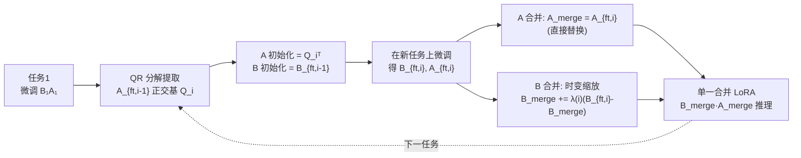

# Merge before Forget: A Single LoRA Continual Learning via Continual Merging

**会议**: ICLR 2026  
**OpenReview**: [https://openreview.net/forum?id=i1Rj7yU6eF](https://openreview.net/forum?id=i1Rj7yU6eF)  
**代码**: 待确认  
**领域**: 参数高效持续学习 / LoRA 模型合并  
**关键词**: LoRA, 持续学习, 灾难性遗忘, 模型合并, 正交初始化, 参数高效微调  

## 一句话总结
把"持续学习"重新表述成"序贯模型合并"问题，全程只维护**一对** LoRA 矩阵 `{A, B}`：用前一任务的正交基初始化新任务的 `A`，并基于 LoRA 的不对称性只对 `B` 做 time-aware 缩放合并，从而把内存复杂度从随任务线性增长降到常数，同时缓解遗忘与僵化。

## 研究背景与动机
- **领域现状**：LoRA 已成为大模型持续学习（CL）的主流参数高效手段。代表方法如 O-LoRA（冻结旧 LoRA，在其正交子空间学新任务）、InfLoRA（用任务相关输入矩阵定义正交子空间）、SAPT-LoRA（保留旧 LoRA + 生成伪样本对齐）、SD-LoRA（解耦幅度与方向）。
- **现有痛点**：这些方法要么**冻结并保留**所有历史 LoRA，参数堆成 `[B₁A₁, …, B_tA_t]`；要么维护任务数据表征。后果是 (i) 内存随任务数 `O(T(m+n)r)` **线性增长**，(ii) 存储受限难扩展，(iii) 缺乏有原则的合并机制导致**任务干扰**。
- **核心矛盾**：另一条路线"模型合并"虽能把多模型并成一个，但 KnOTS、LoRA-LEGO 等都**假设同时拿到所有任务的 LoRA**，不适配任务序贯到来的持续场景；而面向全模型的 continual merging（如 OPCM）既不为 LoRA 设计，目标（保留 vs. 泛化）也与 CL 不一致。**保留所有历史 ≠ 高效持续学习**。
- **本文目标**：回答"能否只用**单个共享 LoRA**完成持续学习，既不存任务专属 LoRA 也不存数据表征"。
- **核心 idea**：**【框架重构】** 把 CL 框成序贯合并问题 + **【关键观察】** 论文实测发现 LoRA 的 `A` 在不同任务间余弦相似度远高于 `B`（图 1），说明 `A`、`B` 学习动态本质不同，应**区别对待**——这成为整套设计的物理依据。

## 方法详解

### 整体框架
方法名 **SLAO**（Single LoRA continual learning with Orthogonal initialization via continual merging）。每来一个任务只做两步：(1) 用上一任务微调得到的 LoRA 提取正交基来**初始化**新任务的 `A`、用上一任务的 `B` 初始化新 `B`；(2) 微调后，利用 `A`/`B` 的不对称性——`A` 直接替换为新微调的 `A`，`B` 用 time-aware 系数做**增量合并**。全程只存"当前合并 LoRA"和"待合并的微调 LoRA"，内存与任务数无关。

### 关键设计

**1. 正交初始化：用 NTK 遗忘界推出"该微调 A、并继承前一任务正交基"。** 作者在 NTK regime 下把遗忘误差与僵化误差统一界为 `∥B_tA_t − B_iA_i∥_F` 一类项，再分解成 `∥B_t(A_t−A_i)∥_F + ∥(B_t−B_i)A_i∥_F + ∥B_i(A_i−A*_i)∥_F + ∥(B_i−B*_i)A*_i∥_F`。直接"冻结 A"虽让 `∥A_t−A_i∥_F=0`，却因 `A` 随机而放大 `∥A_i−A*_i∥_F`（僵化变差）。于是改为：微调 `A_i`，并对前一任务的 `A_{ft,i-1}` 做 QR 分解取正交基 `Q_i` 来初始化，使 `A_i^{(0)}(A_i^{(0)})^⊤ = I_r`。这种正交结构让跨任务的 `A` 保持几何一致、`E[A_jA_i^⊤]≈I_r`，同时压低 `∥A_t−A_i∥_F` 与 `∥A_i−A*_i∥_F` 两项——遗忘和僵化一起缓解。具体地 $Q_iR_i = \mathrm{QR}((A_{ft,i-1})^{\top}),\; Q_i = Q_i\cdot\mathrm{sign}(\mathrm{diag}(R_i))^{\top},\; A_{ft,i}^{(0)} = Q_i^{\top}$。

**2. 只合并 B：从 LoRA 不对称性论证"B 的更新更正交，更适合做任务向量加法"。** 沿 Hao et al. (2024) 的训练动态把 `B_1 = ηf_B(T)A_0^⊤`、`A_1 = A_0 + ηA_0 f_A(T)` 展开，递推得到 `∥ΔB_i^⊤ B_{i-1}∥_F < ∥A_{i-1}ΔA_i^⊤∥_F`：当学习率不大时 `B` 的更新相对其初始化**更接近正交**。结合"任务向量近正交才能最小化干扰"的结论，**合并 B 比合并 A 提供更好的任务隔离**。因此 `A` 不合并（直接用新微调的 `A`），`B` 用线性算术合并：$B_{merge} = B_{merge} + \lambda\cdot(B_{new} - B_{merge})$。这正是把 PEFT adapter 的线性可组合性用在 `B` 上。

**3. Time-aware 缩放：用 `λ(i)=1/√i` 维持合并幅度恒定。** 由于各任务的 `B` 任务向量近似两两正交（图 1 实测），随着合并步数增加，若用固定系数会让累计偏移幅度发散。借鉴 OPCM（Tang et al. 2025）的思路设 $\lambda(i) = \frac{1}{\sqrt{i}}$，使合并后 `B` 相对历史的偏移幅度在整条序列上保持一致——既不让新任务淹没旧知识，也不让旧知识压制新任务的可塑性。

**4. 动态分析：正交初始化让 B 跨子空间更新、隐式增秩助泛化。** 定理 1 在 SGD 更新下证明：若 `A_i^{(0)}(A_i^{(0)})^⊤=I_r`，则 `B` 的总更新 $\Delta B_i = -\eta\big(\sum_{s}\nabla_W L_i^s\big)(A_i^{(0)})^{\top}$ 会在不同初始化子空间上累积，**等效提升 `B` 的秩**从而增强泛化。与 Hao et al. (2024) 用 `B^{(0)}=0` 不同，SLAO 用上一任务的 `B` 初始化（`B^{(0)}≠0`），这正是其合并能继承历史知识的关键。

## 实验关键数据

### 主实验表格
Llama-2-7B-chat，三大基准（标准 CL / 大量任务 / SuperNI），多任务序为各列均值（%）：

| 方法 | 标准 CL avg | 大量任务 avg | SuperNI avg |
|------|:---:|:---:|:---:|
| SeqLoRA | 76.0 | 68.7 | 22.6 |
| IncLoRA | 77.0 | 72.5 | 23.8 |
| O-LoRA | 77.2 | 73.5 | 25.9 |
| InfLoRA | 79.6 | 69.8 | 19.3 |
| SAPT-LoRA* | 81.1 | 81.9 | 50.9 |
| CorDA | 79.2 | 73.4 | 18.5 |
| MagMax | 80.3 | 73.4 | 11.2 |
| KnOTS | 68.2 | 59.9 | 32.4 |
| LoRA-LEGO | 68.4 | 56.9 | 29.8 |
| OPCM | 60.2 | 50.5 | 12.0 |
| **SLAO (ours)** | **80.4** | **74.8** | **37.2** |
| Multi-Task (上界) | 80.9 | 78.1 | 45.2 |

\* SAPT-LoRA 依赖生成历史任务伪样本（在多数 LLM 场景不现实），故不属"data-free"公平比较；SLAO 在所有 **data-free** 基线中全面最优。

### 消融实验表格
**初始化策略**（标准 CL / 大量任务 / SuperNI avg）：

| 初始化 | 标准 | 大量 | SuperNI |
|------|:---:|:---:|:---:|
| Random (zero) | 65.7 | 59.6 | 31.1 |
| Last-Merge | 80.3 | 74.2 | 34.0 |
| **Last-FT (ours)** | **80.4** | **74.8** | **37.2** |

**合并策略不对称性**（avg）：

| 合并策略 | 标准 | 大量 | SuperNI |
|------|:---:|:---:|:---:|
| FREB-MA（冻 B 合 A） | 77.3 | 69.7 | 19.7 |
| FREA-MB（冻 A 合 B） | 78.7 | 72.9 | 26.5 |
| FTBA-MA（微调后合 A） | 78.4 | 71.7 | 25.9 |
| FTBA-MBA（合 A 和 B） | 80.1 | 73.9 | 33.3 |
| FTBA-MB（微调后只合 B） | 80.1 | 74.3 | 33.8 |
| **SLAO (ours)** | **80.4** | **74.8** | **37.2** |

### 关键发现
- **内存恒定**：相比冻结型方法 `O(T(m+n)r)` 线性增长，SLAO 全程 `O((m+n)r)`，与任务数无关（图 2）。
- **"从上次微调点初始化"最优**：让合并后的单一 LoRA 在合并时能隐式重加权历史更新；从"上次合并点"初始化会固化时间系数、失去灵活性；随机初始化把 `A` 推离 `A*`、僵化最严重。
- **只合并 B 验证不对称性**：FTBA-MB > FTBA-MBA > FTBA-MA，且冻结时 FREA-MB > FREB-MA，与"冻 A 微调 B 至少不劣于反过来"一致。
- 把全模型 continual merging（OPCM）直接搬到 LoRA、对 `A`/`B` 一视同仁，结果显著掉点（标准 60.2 / 大量 50.5），印证不对称处理的必要性。

## 亮点与洞察
- **范式重构**：把持续学习显式重写为"序贯 LoRA 合并"，跳出"保留所有历史"的惯性，自然拿到常数内存。
- **理论驱动设计**：正交初始化来自 NTK 遗忘-僵化界、只合并 B 来自训练动态的正交性分析、`1/√i` 来自任务向量近正交假设——三处设计都有推导支撑而非纯经验。
- **抓住 LoRA 不对称性这一根因**：图 1 的余弦相似度观察把"为什么该区别对待 A、B"落到实证上，整篇方法都顺着这个观察展开，逻辑闭环。

## 局限与展望
- **依赖 NTK 假设**：遗忘界与动态分析建立在 prompt-based 微调停留在 NTK regime 的经验假设上，大幅微调或非 NTK 场景的保证会减弱。
- **与生成式 SAPT 仍有差距**：SAPT-LoRA 在大量任务/SuperNI 上更高，但它靠伪样本；SLAO 在严格 data-free 下最优，能否进一步逼近上界仍开放。
- **SuperNI 上离上界（45.2）尚有距离**：任务相似度低、生成类任务多时，单一 LoRA 容量可能成为瓶颈，未来可探索秩自适应或轻量扩容。
- `λ(i)=1/√i` 为固定调度，是否能学习/自适应缩放仍可改进。

## 相关工作与启发
- **LoRA 持续学习**：O-LoRA、InfLoRA、SAPT-LoRA、SD-LoRA、LoRM、CorDA、MagMax——共性是保留历史 LoRA 或数据；SLAO 用"合并"取而代之。
- **（LoRA）模型合并**：KnOTS（SVD 投影到共享潜空间）、LoRA-LEGO（语义单元分解重组）假设并发访问；OPCM 面向全模型 continual merging。SLAO 把 continual merging 首次系统地落到 LoRA 且区分 A/B。
- **启发**：当"持续"的瓶颈是存储而非性能时，"合并优先于保留"是个值得复用的视角；而组件级不对称性（哪个该冻、哪个该合）在任何低秩/适配器结构里都可能是被忽视的免费午餐。

## 评分
- **新颖性**: ⭐⭐⭐⭐ — "CL=序贯 LoRA 合并 + 只合并 B + 正交初始化"组合新颖，且每步有理论动机；单点技术（QR 正交基、`1/√i` 缩放）多借鉴已有工作。
- **实验充分度**: ⭐⭐⭐⭐ — 5 个模型 × 3 类基准 × 多任务序，对比 13 个基线，初始化/合并策略消融到位；但部分关键结果（13B、Qwen、BWT/MOPD）放在附录。
- **写作质量**: ⭐⭐⭐⭐ — 动机-观察-理论-方法链条清晰，图 1 不对称观察支撑全文；公式较密、定理细节需配附录阅读。
- **价值**: ⭐⭐⭐⭐ — 常数内存的参数高效持续学习对实际部署很有吸引力，data-free 设定实用，方法简洁可复现。

<!-- RELATED:START -->

## 相关论文

- [\[ICLR 2026\] Meta-UCF: Unified Task-Conditioned LoRA Generation for Continual Learning in Large Language Models](meta-ucf_unified_task-conditioned_lora_generation_for_continual_learning_in_larg.md)
- [\[ICLR 2026\] One-Prompt Strikes Back: Sparse Mixture of Experts for Prompt-based Continual Learning](one-prompt_strikes_back_sparse_mixture_of_experts_for_prompt-based_continual_lea.md)
- [\[ICLR 2026\] CONCUR: A Framework for Continual Constrained and Unconstrained Routing](concur_a_framework_for_continual_constrained_and_unconstrained_routing.md)
- [\[ICML 2026\] Turning Back Without Forgetting: Selective Backward Refinement for Parameter-Efficient Continual Learning](../../ICML2026/llm_efficiency/turning_back_without_forgetting_selective_backward_refinement_for_parameter-effi.md)
- [\[ICLR 2026\] PLoP: Precise LoRA Placement for Efficient Finetuning of Large Models](plop_precise_lora_placement_for_efficient_finetuning_of_large_models.md)

<!-- RELATED:END -->
