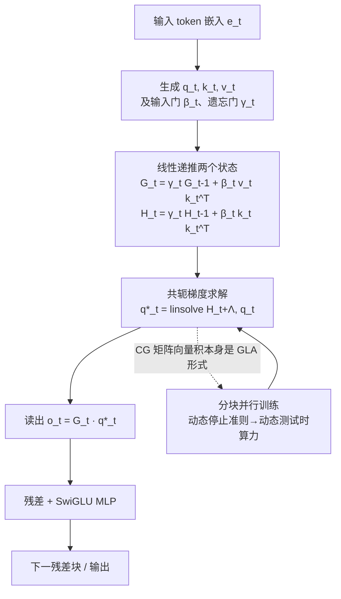

# MesaNet: Sequence Modeling by Locally Optimal Test-Time Training

**会议**: ICLR 2026  
**OpenReview**: [https://openreview.net/forum?id=xa3OnTb6c3](https://openreview.net/forum?id=xa3OnTb6c3)  
**代码**: 待确认  
**领域**: 高效序列建模 / 线性注意力 / 测试时训练  
**关键词**: Mesa layer, 线性 RNN, 测试时训练, 共轭梯度, 分块并行, 动态测试时计算  

## 一句话总结
MesaNet 把"测试时训练"做到最优：它不像 DeltaNet 那样每步只走一步梯度，而是在每个时间步把"用上下文拟合一个线性模型"的累积正则平方误差**解到最优**，并通过共轭梯度求解器 + 分块并行，让原本只能串行、数值不稳的 Mesa 层第一次能在 GPU/TPU 上规模化训练到十亿参数。

## 研究背景与动机
Transformer 靠 softmax 自注意力主导序列建模，但推理时显存和算力都随序列长度线性增长。近年一系列线性注意力 / 现代 RNN（Mamba、xLSTM、DeltaNet、Gated DeltaNet）通过把 softmax 线性化，换来常数显存与常数推理算力。

这些模型可以统一在一个视角下：它们的循环状态本质上是在用上下文**在线学习一个线性映射**（fast weight），每来一个 token 就走一步学习规则——Hebb 规则对应门控线性注意力，delta 规则对应 DeltaNet，二者都是在一个二次损失上做单步梯度下降。

问题在于"单步"。单步梯度只用一阶信息、只看当前 token 的瞬时损失，写入一条新关联往往要反复呈现多次才能压低记忆误差。von Oswald 等人 2024 年提出的 Mesa 层把目标改成"对所有历史 token 的累积正则平方误差求最优解"，理论上是平方误差意义下的**最优线性联想记忆**，能一次性（one-shot）写入关联。

但它有两个致命短板：一是必须用经典递归最小二乘串行计算，无法利用矩阵乘加速器，在 400M 规模就比别人慢一个数量级；二是带遗忘门时数值不稳，正则项必须随时间指数衰减。MesaNet 要解决的就是：**保留"解到最优"的表达力，同时让 Mesa 层可并行训练、数值稳定、并支持上下文相关的遗忘**。

## 方法详解
MesaNet 沿用主流 decoder-only 架构：N 个残差块堆叠，每块由通道混合（标准 SwiGLU MLP）和序列混合两部分组成，唯一替换的就是序列混合层——用 Mesa 层取代多头注意力。

所有对比模型（MHA、Mamba2、xLSTM、(Gated) DeltaNet）共享完全相同的骨干，只换序列混合规则，从而做到 1-1 公平对比。整体数据流如下图：

**把"最优解"写成两个线性递推状态的闭式读出。**
Mesa 层的目标是在每个时间步 $t$ 解一个带正则的累积加权最小二乘：

$$\hat{\Phi}_t = \arg\min_\Phi \tfrac{1}{2}\sum_{t'\le t}\rho_{tt'}\|v_{t'}-\Phi k_{t'}\|^2 + \tfrac12\mathrm{Tr}(\Phi\Lambda\Phi^\top),$$

其中 $\rho_{tt'}$ 是由遗忘门累乘得到的因果权重。因为损失对 $\Phi$ 是二次的，最优解有闭式 $o_t = G_t(H_t+\Lambda)^{-1}q_t$。关键观察是两个矩阵状态都满足简单的线性递推：

$$G_t=\gamma_t G_{t-1}+\beta_t v_t k_t^\top=\sum_{t'}\rho_{tt'}v_{t'}k_{t'}^\top,\qquad H_t=\gamma_t H_{t-1}+\beta_t k_t k_t^\top=\sum_{t'}\rho_{tt'}k_{t'}k_{t'}^\top.$$

因此无需显式保留历史 token，只多维护一个 $n_a\times n_a$ 的 $H_t$ 状态。这正是 Mesa 层与所有"单步"RNN 的本质区别：DeltaNet 等只优化当前输入的瞬时损失、只走一步，而 Mesa 把全部历史的损失解到最优，是二阶在线学习器，能一次性（one-shot）写入新关联，而 delta 规则往往要反复呈现才能压低记忆误差。

下表对照了几种现代线性 RNN 的递推与读出，可见 Mesa 是唯一在读出处显式解线性系统的：

| 层 | 状态递推 | 读出 |
|---|---|---|
| Mamba2 / GLA | $G_t=\gamma_t G_{t-1}+\beta_t v_t k_t^\top$ | $o_t=G_t q_t$ |
| DeltaNet | $G_t=G_{t-1}(I-\beta_t k_t k_t^\top)+\beta_t v_t k_t^\top$ | $o_t=G_t q_t$ |
| Gated DeltaNet | $G_t=\gamma_t G_{t-1}(I-\beta_t k_t k_t^\top)+\beta_t v_t k_t^\top$ | $o_t=G_t q_t$ |
| **Mesa** | $G_t,H_t$ 双状态线性递推 | $o_t=G_t\,\mathrm{linsolve}(H_t+\Lambda,q_t)$ |

**用共轭梯度求解线性系统，换来数值稳定与分块并行的双赢。**
原始 Mesa 层用递归最小二乘显式维护 $(H_t+\Lambda)^{-1}$，遗忘一开就数值爆炸，正则项还得随时间指数衰减。MesaNet 改为不显式求逆，而是对每个 query 解线性方程组 $q^*_t = \mathrm{linsolve}(H_t+\Lambda, q_t)$，并选用共轭梯度（CG）法。这一选择不是随手为之：CG 迭代里最重的计算是 $\sum_i \rho_{ti}k_ik_i^\top p$（$p$ 是当前搜索方向），它恰好又是门控线性注意力（GLA）的形式。于是整层既能写成 $O(1)$ 的递归推理模式，又能复用已有的硬件高效分块并行 GLA 实现，得到 $O(T)$ 的并行训练模式与高效反传。代价是 CG 在 $\Lambda$ 固定时序列早期收敛偏慢，且多维护的 $H_t$ 带来额外显存——但实测这块占整体显存不到 1%。

**把 CG 步数变成可调旋钮，实现动态测试时算力。**
Mesa 层本质是个测试时优化器，于是天然提供了一个分配算力的原则性方式：达到给定误差容限所需的 CG 步数 $k$ 是与头、序列、token 相关的，通过停止准则可让推理（乃至训练）成本随输入内容动态变化。这与 softmax 注意力形成有趣对照——后者算力随序列长度增长却与内容无关，而 Mesa 层按"这段数据有多难解"来花算力。两个极端很清楚：

- $k=0$ 时 $q^*_t=q_t$，整层退化回 GLA，给出算力下界；
- $k$ 越大越接近最优解，flops 大致是 GLA 的 $k$ 倍、(Gated) DeltaNet 的 $k-1$ 倍。

由于 CG 总开销随 $kn_a^2$ 增长，存在一个使 Mesa 比 MHA 更省 flops 的最大 $k$。主实验固定 30 步 CG。

## 实验关键数据
- **规模与数据**：训练 140M / 440M / 1B 三档参数，数据为 SlimPajama，主结果用 1B 模型、50B token、序列长度 2048，所有模型共享骨干 / tokenizer / 数据顺序并各自独立调学习率。
- **语言建模 PPL（1B / 50B token，越低越好）**：平均 PPL 上 Mesa 取 13.79、Hawk-Mesa 取 13.75，均优于 Gated DeltaNet（13.87）、xLSTM / DeltaNet（14.03/14.05）、Mamba2（14.58）；Hawk-Mesa 甚至略超 Transformer 基线（13.79）。在 SlimPajama / WikiText / PG19 / GovReport / Qasper 各子集上 Mesa 全面领先所有 RNN 基线。
- **下游能力（400M / 50B token）**：在全局推理（40.88）、in-context recall（39.30，Gated DeltaNet 仅 35.96）上 Mesa 领先所有 RNN；但在 recall 这类强检索任务上仍明显落后 Transformer（49.95）。
- **序列位置分析**：相对 Transformer 的 NLL 差揭示，几乎所有 RNN 在序列前 64 个 token 上反而更强、之后落后；MesaNet 和 Hawk-Mesa 把优势延伸到 512 token 以上。
- **效率**：尽管每层训练要解 $t\cdot H$ 个线性系统并反传，分块并行后训练吞吐在 H100 上与 MHA / 其他 RNN 仍有竞争力；相比原始串行 Mesa 层（400M 已慢一个数量级、因无法用遗忘门 PPL 还差约 3.2 点 / 23%），提升显著。

## 亮点与洞察
- **"解到最优"是真实增益而非噱头**：在严格 1-1 对照下，把单步在线学习升级为每步最优解，确实换来更低 PPL 和更强的全局推理 / 检索能力，验证了二阶最优联想记忆的价值。
- **算法选型服务于硬件**：选 CG 不是因为它最快收敛，而是因为它的核心 matvec 落在 GLA 形式上，从而直接嫁接成熟的分块并行内核——这是把"理论上漂亮但工程上不可扩展"的层落地的关键。
- **动态测试时计算的新形态**：把"想更准就多解几步 CG"做成网络内部的优化循环，呼应了当下"用测试时算力换性能"的大趋势，但发生在层内而非链式思维层面。
- **位置条件化评测的方法学价值**：论文指出仅看平均 PPL 会掩盖差异，RNN 早期强、后期弱的现象只有按 token 位置拆开才看得见，这对评估线性模型很有启发。
- **可作为强基线**：在统一骨干下 Mesa / Hawk-Mesa 全面领先各类现代 RNN，可作为后续高效序列层研究的稳健参照系。

## 局限性 / 可改进方向
- **检索仍是短板**：即便是最优 Mesa 层，in-context recall 也明显逊于 Transformer，常数大小状态的根本瓶颈未被根除。
- **推理算力与显存开销**：相比单状态 RNN，需额外传播 $n_a\times n_a$ 的 $H_t$，且 flops 约为 GLA 的 $k$ 倍；CG 在序列早期收敛慢。
- **骨干未为 Mesa 优化**：为公平对比沿用 Llama2 骨干（未调 key size / 头数、未融合 MLP），可能低估了 MesaNet 上限。
- **遗忘 / 正则设置较简**：实验用静态对角正则 $\Lambda$，更灵活的上下文相关正则或非线性测试时目标（如 Atlas 思路）有进一步空间。

## 相关工作与启发
MesaNet 站在"现代 RNN = 测试时回归"这条统一脉络上：GLA / Mamba2（Hebb 规则）、DeltaNet / Gated DeltaNet（delta 规则）都是单步在线学习的特例，而 Mesa 层是其"解到最优"的极限。

它直接改进了 von Oswald 等 2024 的串行 Mesa 层，并与 Longhorn（同样从二次损失推导但只看当前输入）、Atlas（Mesa 的滑窗 + 非线性变体）、Titans（mini-batch 梯度 + 动量）等并行工作形成对照。

对读者的启发在于：当一个循环层能写成二次损失的最优解时，"把它解到最优"既有理论意义（最优联想记忆、二阶学习），也能借由合适的求解器（CG ↔ GLA 等价）变得硬件友好——这为设计下一代高效序列层提供了一条"先找闭式最优、再找可并行求解器"的范式。

## 评分
- 新颖性: 4.5/5（把最优测试时训练做成可扩展、数值稳定、可动态分配算力的层）
- 实验充分度: 4.5/5（多规模、严格 1-1 对照、位置条件化评测与效率分析齐全）
- 写作质量: 4.5/5（统一视角清晰、推导与动机衔接紧密）
- 价值: 4.5/5（为高效序列建模提供了"最优 + 可并行"的新范式与扎实基线）

<!-- RELATED:START -->

## 相关论文

- [\[ICLR 2026\] Test-Time Training Done Right](test-time_training_done_right.md)
- [\[ICLR 2026\] Let's (not) just put things in Context: Test-time Training for Long-context LLMs](lets_not_just_put_things_in_context_test-time_training_for_long-context_llms.md)
- [\[ICLR 2026\] Local Linear Attention: An Optimal Interpolation of Linear and Softmax Attention for Test-Time Regression](local_linear_attention_an_optimal_interpolation_of_linear_and_softmax_attention_.md)
- [\[ICLR 2026\] MoM: Linear Sequence Modeling with Mixture-of-Memories](mom_linear_sequence_modeling_with_mixture-of-memories.md)
- [\[ICLR 2026\] Scaling Up, Speeding Up: A Benchmark of Speculative Decoding for Efficient LLM Test-Time Scaling](scaling_up_speeding_up_a_benchmark_of_speculative_decoding_for_efficient_llm_tes.md)

<!-- RELATED:END -->
