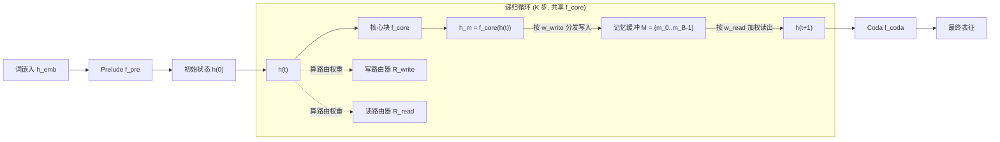

# MeSH: Memory-as-State-Highways for Recursive Transformers

**会议**: ICLR 2026  
**OpenReview**: [https://openreview.net/forum?id=IhTrFvY7p3](https://openreview.net/forum?id=IhTrFvY7p3)  
**代码**: [https://github.com/LivingFutureLab/MeSH](https://github.com/LivingFutureLab/MeSH)  
**领域**: LLM 高效化 / 递归 Transformer 架构 / 参数高效预训练  
**关键词**: 递归 Transformer、权重共享、记忆缓冲、动态路由、参数效率  

## 一句话总结
本文诊断出递归 Transformer 落后于同算力非递归模型的两大病根——"无差别计算"和"信息过载"，提出 MeSH 方案：用一组显式记忆槽 + 逐步可学习读写路由器替换被过载的单一隐状态，让 1.4B 递归模型用少 33% 参数反超同规模 Vanilla Transformer。

## 研究背景与动机

**领域现状**：递归 Transformer 通过重复调用一个权重共享的核心块（core block），把"计算深度"和"参数深度"解耦，是应对算力/数据/通信瓶颈的一种参数高效架构思路——理论上可按任务难度自适应分配计算预算，并开辟"计算深度"这一新的扩展轴。

**现有痛点**：但在**算力对齐**（等 FLOPs）的前提下，参数更少的递归模型往往跑不过非递归对手——困惑度更高、下游精度更低。以往工作只是给递归加各种固定的残差/锚点连接来打补丁，却说不清楚到底差在哪。

**核心矛盾**：作者通过探针实验把性能差距量化成三个可观测现象，并归因到两个根本病灶。一是**无差别计算（undifferentiated computation）**——核心块对自己处于第几次迭代毫无感知，被迫每一步都做几乎相同的变换，表现为「计算偏斜」（第一个 loop 干掉绝大部分活、后续 loop 更新幅度趋近 0）和「表征停滞」（相邻 loop 状态的 CKA 相似度极高，模型陷入不动点）。二是**信息过载（information overload）**——单一隐状态既要当"长期记忆"保住初始输入防遗忘，又要当"工作记忆"承载每步的瞬时计算，两个冲突角色挤在一个向量里，逼着模型退化到一个低维"公共地"表征，造成「表征坍缩」（loop 状态奇异值谱衰减远快于初始状态，有效秩骤降）。

**本文目标**：在不增加参数、保持算力对齐的前提下，从架构层面同时消除这两个病灶，让递归模型真正发挥参数效率优势。

**核心 idea**：**[状态外置 + 动态路由]** 把"状态管理"从隐式负担变成显式可学习的路由问题——用一个多槽记忆缓冲（state highway）专门承载长期信息，用每步独立参数的读写路由器动态合成下一步状态，从而让核心块每次迭代都能扮演不同角色、隐状态得以释放全部维度做瞬时计算。

## 方法详解

### 整体框架

MeSH 建立在 Prelude-Recurrent-Coda（前奏-循环-尾声）结构上：先用非共享的 prelude 块 $f_{pre}$ 处理词嵌入得到初始状态，中间是 $K$ 次权重共享的核心块 $f_{core}$ 循环，最后用 coda 块 $f_{coda}$ 产出表征。MeSH 的改造只发生在循环内部：把"前一步隐状态直接（或加固定补充项）喂给下一步"这条单通道，替换成"隐状态先写进一个多槽记忆缓冲，再从缓冲里读出下一步状态"的读写循环，读写权重由每步独立的轻量路由器实时算出。

### 关键设计

**1. 多槽记忆缓冲：给长期信息修一条专用高速路。** MeSH 维护一个含 $B$ 个槽位的状态缓冲 $M=\{m_0,\dots,m_{B-1}\}$，每个槽 $m_b\in\mathbb{R}^{L\times D}$ 与隐状态同形。循环开始前，把原始词嵌入塞进第 0 槽作为"初始锚点"，其余槽清零：$m_0^{(0)}=h_{emb},\ m_{b>0}^{(0)}=\mathbf{0}$。这个缓冲的意义在于——长期上下文从此有了专门的容身之处，不必再和瞬时计算挤在同一个隐状态里，隐状态因而能腾出全部维度去做高维、富表达的瞬时变换，直接对症"信息过载"导致的表征坍缩。

**2. 逐步独立的读写路由器：让核心块"知道自己走到第几步"。** 缓冲的读写由写路由器 $R_{write}^{(t)}$ 和读路由器 $R_{read}^{(t)}$ 管理，**关键是它们对每个迭代 $t=0,\dots,K-1$ 都有各自独立的参数**。每步根据当前隐状态算出路由权重：$w_{write}^{(t)}=\mathrm{Softmax}(\mathrm{Linear}_{write}^{(t)}(h^{(t)})),\ w_{read}^{(t)}=\mathrm{Softmax}(\mathrm{Linear}_{read}^{(t)}(h^{(t)}))$，每个 Linear 是把 $D$ 维隐状态投到 $B$ 个槽的单层投影，再沿槽维做 softmax，得到 $\mathbb{R}^{L\times B}$ 的权重矩阵。正因为路由器逐步不共享，模型不再被迫每步施加同一种通用变换，而是能在每一步学到不同的"从哪些槽取、往哪些槽存"的策略——这正是打破"无差别计算"、实现功能特化的隐式开关。

**3. 软写入 + 加权读出的状态合成：把固定补充项升级成可学习的动态组合。** 每步核心块先算输出 $h_m^{(t)}=f_{core}(h^{(t)})$；随后做"分布式软写入"，把输出按写权重缩放后**累加**进各槽：$m_b^{(t+1)}=m_b^{(t)}+h_m^{(t)}\odot w_{write,b}^{(t)}$（$\odot$ 为带广播的逐元素乘）；下一步状态再由更新后的缓冲加权读出合成：$h^{(t+1)}=\sum_{b=0}^{B-1}m_b^{(t+1)}\odot w_{read,b}^{(t)}$。相比残差/锚点那种"固定加一个 $h^{(0)}$ 或 $h^{(t)}$"的刚性方案，这套读写让模型能灵活地从所有历史状态里检索并组合上下文，论文指出它把残差、锚点等启发式连接都收编成了自己的特例。在 Prelude-Recurrent-Coda 设定下，prelude 输出先经一个过渡读写周期合成初始状态 $h^{(0)}$，主循环结束后再做一次读操作从缓冲算出 $h^{(K)}$ 交给 coda。

## 实验关键数据

预训练完全沿用 Pythia 套件方法论（GPT-NeoX 架构，去重 Pile 子集），在 160M–6.9B 规模上从头训；评测困惑度（Pile/Wiki/Lambada-OpenAI/Standard）和 9–10 个 few-shot 下游任务平均精度。递归变体相对 Vanilla 约省 33% 非嵌入参数。

### 主实验表格（部分规模，∆acc 为相对 Vanilla 的绝对精度变化）

| 规模 | 方案 | 配置 | Pile PPL↓ | LD-O PPL↓ | 0-shot ∆acc | 5-shot ∆acc |
|------|------|------|-----------|-----------|-------------|-------------|
| 160M | Vanilla | 12 层 | 11.31 | 42.86 | — | — |
| 160M | base | 2+4R2+2 | 11.79 | 53.06 | -0.98 | -1.25 |
| 160M | +anchor | 2+4R2+2 | 11.63 | 50.38 | -1.07 | -0.39 |
| 160M | **+mesh** | 2+4R2+2 | **11.37** | **46.60** | **-0.47** | **+0.06** |
| 410M | Vanilla | 24 层 | 9.07 | 19.48 | — | — |
| 410M | base | 3+6R3+3 (-50%) | 9.65 | 26.76 | -1.93 | -1.30 |
| 410M | **+mesh** | 3+6R3+3 (-50%) | **9.35** | **20.72** | **-0.34** | **+0.73** |
| 1.4B | Vanilla | 24 层 | 7.44 | 10.51 | — | — |
| 1.4B | base | 4+8R2+4 | 7.63 | 11.38 | -0.61 | -0.94 |
| 1.4B | **+mesh** | 4+8R2+4 | **7.39** | **9.72** | **+1.06** | **+0.86** |

亮点：1.4B 的 +mesh 在省 33% 参数下，0-shot/5-shot 反超 Vanilla +1.06%/+0.86%，且全数据集困惑度最优。

### 消融与诊断分析（Pythia-410M，3+6R3+3，500 样本均值）

| 诊断维度 | base | +residual | +anchor | +mesh |
|----------|------|-----------|---------|-------|
| 计算偏斜（图3） | 极端失衡，后续 loop≈0 | 部分缓解仍急降 | 部分缓解仍急降 | **三个 loop 贡献均衡** |
| 表征停滞 CKA（图4） | 相邻 loop 极高相似 | 略降 | 略降 | **显著降低，跳出不动点** |
| 表征坍缩奇异值谱（图5） | loop 衰减远快于输入 | 仅边际改善 | 仅边际改善 | **维持高维富表达** |

### 关键发现
- **参数效率 1.46×**：805M 的 +mesh（0-shot 50.6%/5-shot 52.8%）超过 1.2B 非嵌入参数的 Vanilla（49.5%/51.9%），即用近 1/3 更少参数达到同等评测损失。
- **训练全程占优**：1.4B +mesh 在 120k 步训练中损失始终更低、下游精度起点更高且爬升更陡，收益不是末段补丁而是贯穿预训练。
- **跨层分配鲁棒**：图8 控制实验中，无论 prelude/core/coda 怎么分配层数，+mesh 困惑度都低于 base 递归，且趋近 24 层 Vanilla 而省约 30% 非嵌入参数。
- **优势随规模扩大**：性能领先随模型增大而增强，说明动态状态管理是可扩展的架构原则。

## 亮点与洞察
- **先诊断后开方**：用计算偏斜、CKA 相似、奇异值谱三个可量化探针，把"递归为什么差"从直觉变成证据，再让架构设计精准对症，方法论干净。
- **把隐式难题变显式问题**：状态管理本是递归里说不清的隐藏负担，MeSH 将其转写成"读哪些槽、写哪些槽"的可学习路由问题，残差/锚点都成了它的特例，框架统一且优雅。
- **逐步独立路由是画龙点睛**：让路由器每步参数不共享，是打破"无差别计算"的关键——核心块由此隐式获得"位置感"，无需显式步数编码就能功能特化。

## 局限与展望
- 实验集中在 Pythia 系（160M–6.9B）和 Pile 上从头预训练，未验证在更大规模、不同数据分布或继续训练/微调既有模型上的迁移性。
- 引入了每步独立的路由器参数和多槽缓冲，虽然非嵌入参数仍净减，但额外的读写算子和缓冲内存开销在长序列/大 $B$ 下的实际吞吐与显存代价讨论较少。
- 槽数 $B$、写入用累加而非覆盖等设计选择的敏感性分析在正文呈现有限，最优配置如何随规模/任务变化仍待系统刻画。

## 相关工作与启发
- **递归/权重共享 Transformer**（Geiping 2025、Bae 2024/2025、Saunshi 2025）：MeSH 直接站在这条线上，给"计算深度与参数深度解耦"补上了状态管理的关键拼图。
- **启发式递归连接**（residual / anchor / anchor*）：MeSH 把这些固定加性补充项统一为动态路由的特例，揭示了它们"只缓解信息过载、不解决无差别计算"的本质局限。
- **外置记忆 / 路由机制**：将显式记忆缓冲 + 软读写路由引入递归循环内部，与记忆增强网络、MoE 路由思想相通，启发后续把"可学习状态高速路"作为递归与动态计算架构的通用组件。

## 评分
- **新颖性**: ⭐⭐⭐⭐⭐ 把递归 Transformer 的性能差距精准诊断为两大可量化病灶，并用"记忆即状态高速路 + 逐步路由"给出统一且能收编启发式方案的架构解，原创性强。
- **实验充分度**: ⭐⭐⭐⭐ 覆盖 160M–1.4B 多规模、困惑度+下游双指标、训练动态与参数效率缩放、三探针诊断对照齐全；扣分在缺更大规模迁移与开销/超参敏感性的系统刻画。
- **写作质量**: ⭐⭐⭐⭐⭐ "诊断—归因—对症—验证"逻辑链清晰，图表与公式紧扣三大病灶，可读性高。
- **价值**: ⭐⭐⭐⭐⭐ 在数据/算力扩展见顶的背景下，提供了一条用更少参数反超的可扩展递归架构路径，对参数高效预训练有实质推动。

<!-- RELATED:START -->

## 相关论文

- [\[ICLR 2026\] RMAAT: Astrocyte-Inspired Memory Compression and Replay for Efficient Long-Context Transformers](rmaat_astrocyte-inspired_memory_compression_and_replay_for_efficient_long-contex.md)
- [\[ICLR 2026\] STEM: Scaling Transformers with Embedding Modules](stem_scaling_transformers_with_embedding_modules.md)
- [\[ICLR 2026\] LoopFormer: Elastic-Depth Looped Transformers for Latent Reasoning via Shortcut Modulation](loopformer_elastic-depth_looped_transformers_for_latent_reasoning_via_shortcut_m.md)
- [\[ICLR 2026\] Efficient Resource-Constrained Training of Transformers via Subspace Optimization](efficient_resource-constrained_training_of_transformers_via_subspace_optimizatio.md)
- [\[ICLR 2026\] Reconstructing KV Caches with Cross-Layer Fusion for Enhanced Transformers](reconstructing_kv_caches_with_cross-layer_fusion_for_enhanced_transformers.md)

<!-- RELATED:END -->
