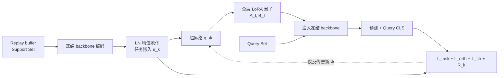

# Meta-UCF: Unified Task-Conditioned LoRA Generation for Continual Learning in Large Language Models

**会议**: ICLR 2026  
**OpenReview**: [https://openreview.net/forum?id=iNg5KL7eTC](https://openreview.net/forum?id=iNg5KL7eTC)  
**代码**: 待确认  
**领域**: LLM 高效微调 / 持续学习  
**关键词**: LoRA, 持续学习, 超网络, 参数高效微调, 元学习, 灾难性遗忘  

## 一句话总结
用一个共享超网络把每个任务的轻量嵌入即时翻译成全层 LoRA 更新，并用元对比 + 正交目标把任务嵌入推向近正交，从而在内存恒定（只占单个 adapter 的参数量）的前提下持续学习不遗忘。

## 研究背景与动机
**领域现状**：大模型部署在任务持续到来的场景里，PEFT（LoRA、adapter、prefix）已把单任务开销从全权重降到几个百分点。面向持续学习的 LoRA 变体（O-LoRA 正交化子空间、N-LoRA 重参数化避碰撞、GRID / Adaptive-SVD 在共享正交基下压缩 adapter 库）在准确率与抗遗忘上都有不错表现。

**现有痛点**：这些方法都给每个新任务**静态分配一个低秩槽位**，于是模型大小随任务数线性增长，子空间调度变得脆弱；prompt 检索类方法（L2P、ConPET）虽不长权重，却把 backbone 冻死，推理时还得显式检索 prompt，无法改动深层表示，限制了推理类任务的迁移。

**核心矛盾**：要么参数随任务线性膨胀，要么牺牲深层适配能力——二者都没真正解决灾难性遗忘。更深层的问题是：现有方法把每个新任务当成孤立补丁打上去，缺乏在任务流增长时**重组已存知识**的机制。

**本文目标**：让冻结的 LLM 面对无界任务流时实现**内存恒定、即时适配**的持续学习。

**核心 idea**：**把顺序 PEFT 重构成一个生成问题**——不再为每个任务存一个槽位，而是训练单个超网络，从紧凑的任务嵌入即时生成所有层的 rank-r LoRA 更新；再用元对比目标把任务嵌入推向近正交、用正交惩罚防止生成方向坍缩，使冻结 backbone 既保持可塑性（即时条件化更新）又保持稳定性（只有恒定大小的超网络在学）。

## 方法详解

### 整体框架
Meta-UCF 给冻结 backbone 配一个共享超网络 $g_\Phi$：从 replay buffer 采的 support set 经冻结 backbone 编码后平均，得到任务嵌入 $e_k$；$e_k$ 喂给 $g_\Phi$ 即时生成每层的 rank-r LoRA 因子；带上这些因子的 backbone 处理当前任务的 query 批次，任务损失、正交损失、对比损失、偏置损失反传**只更新 $\Phi$**，backbone 权重与 LayerNorm 统计始终冻结。训练用零内循环步的一阶 MAML 变体。

### 关键设计
**1. 任务嵌入：LayerNorm 均值池化的免参数任务画像**。一个好的任务嵌入要能概括当前任务、对采样噪声稳定、免参数可在部署时即时算、且与 backbone 同表示空间。Meta-UCF 把 support set 各样本的 CLS 隐状态做均值再过 LayerNorm：$e_k = \mathrm{LN}\big(\frac{1}{S_k}\sum_s h_s\big)$。这个简单选择带来无偏性（$\mathbb{E}[e_k]=\mathrm{LN}(\mu_k)$）、方差随样本数 $O(S_k^{-1})$ 衰减、以及尺度等变（LN 抹掉特征维任意缩放）三重好处；它还可解释为 Fisher 核展开的一阶项。持续训练时用 EMA 流式更新 $e_k^{(t)}=\mathrm{LN}\big((1-\rho)e_k^{(t-1)}+\rho\bar h^{(t)}\big)$，内存只占 $O(d)$。再配 $\ell_2$ 归一化把嵌入投到单位超球，使欧氏距离与余弦相似度一致 $\mathrm{sim}(e_i,e_j)=1-\frac{1}{2}\|e_i-e_j\|_2^2$，方便后续对比目标。

**2. 元条件参数生成器：用一个超网络替掉整个 adapter 库**。这是消除线性增长的核心。任务嵌入先经两层 MLP 压成任务码 $z_k=\mathrm{MLP_{task}}(e_k)\in\mathbb{R}^h$（$h<d$），再和每层可学位置嵌入 $p_l$ 拼接 $\tilde z_{k,l}=[z_k;p_l]$，两个低秩投影头生成该层 LoRA 因子 $(A_l,B_l)$，其中 $W_A,W_B$ 跨层共享、靠 $p_l$ 产出层特异输出。注入时按 LoRA 惯例 $W_l^{(k)}=W_l+\alpha B_l(e_k;\Phi)A_l(e_k;\Phi)$，$\alpha=1/r$。生成器参数 $|\Phi|=|\mathrm{MLP_{task}}|+2hL+2hdr$，每次前向开销 $O(|\Phi|+Ldr)$ **与任务数 $K$ 无关**——这正是内存恒定的来源。

**3. 双层正交 + 偏置门控的元目标**。每个 episodic 任务采互斥的 support/query。损失由四项构成（公式 13）：任务损失 $L_{task}$ 是标准监督目标，提供吸收新任务的可塑性；**正交惩罚** $L_{orth}=\sum_{i<j}\Omega_{ij}^2$（$\Omega_{ij}=\frac{1}{|Q_i||Q_j|}\|H_i^\top H_j\|_F$）作用在适配后 backbone 的 query 子空间上，约束**输出几何**、减少跨任务干扰；**元对比** $L_{ctr}$ 是 InfoNCE，把同任务两个独立 support minibatch 当作两个 IID "视图"做任务级数据增强，在单位超球上拉开不同任务的角度，约束生成器的**输入几何**——两个正则项在互补层级上平衡可塑性与稳定性。第四项**动态偏置校准** $R_k$ 用人口统计学奇偶差衡量敏感属性偏置，并用 $\sigma(-\beta R_k)$ 缩放梯度做门控。外循环用零内循环步的一阶 MAML + AdamW 只更新 $\Phi$。

**推理**：面对没见过的新任务，只需一个 $S\le16$ 的小 support set 算出 $e_{new}$，超网络即可无优化地生成 $\Delta(e_{new})$，实现"一模型应对所有任务"且内存开销可忽略。

## 实验关键数据

### 主实验表格
四个流（Std-CL 5、Long-CL 15、Seq-GLUE 7、TRACE-8），Average Accuracy (%, ↑)：

| 方法 | Std-CL 5 | Long-CL 15 | Seq-GLUE 7 | TRACE-8 |
|------|----------|------------|------------|---------|
| LoRA | 78.3 | 61.4 | 75.9 | 55.6 |
| O-LoRA | 80.1 | 63.4 | 76.8 | 57.3 |
| SAPT | 83.2 | 68.1 | 79.6 | 60.7 |
| N-LoRA（最强基线） | 83.5 | 68.1 | 80.2 | 61.0 |
| **META-UCF (r=8, All)** | **85.6** | **70.7** | **82.7** | **63.4** |
| META-UCF (r=8, Top-Half) | 84.9 | 70.1 | 82.1 | 62.9 |
| META-UCF (r=4, All) | 84.3 | 69.0 | 81.6 | 62.0 |

相比 N-LoRA，Std-CL 5 +1.7 pp、异构 TRACE-8 +2.2 pp。稳定性上 Meta-UCF 把遗忘率压到新低（Std-CL 5 仅 6.2% vs N-LoRA 7.1%），且 Backward Transfer 接近中性甚至微正（Std-5 为 +0.2、GLUE-7 为 +0.1），而所有竞争方法 BWT 都为负。

零样本协议（LLaMA-7B 先在 Alpaca 上 rank-8 LoRA 指令微调，再 Std-CL 5 持续训练）：Meta-UCF 下游准确率 80.5%（超最强基线 Alpaca-O-LoRA-CL +3.7 pp），同时零样本 MMLU 升到 36.2%（接近单任务 Alpaca-LoRA 的 37.5%，远高于其他持续变体），说明它保住了通用知识又抗遗忘。

### 消融实验表格
Std-CL 5 / Long-CL 15 单因子消融：

| 变体 | Std Acc.↑ | Std FR↓ | Long Acc.↑ | Long FR↓ |
|------|-----------|---------|------------|----------|
| Full Meta-UCF | 85.6 | 6.2 | 70.7 | 11.5 |
| w/o $L_{orth}$ | 83.9 | 7.8 | 68.5 | 13.2 |
| w/o $L_{ctr}$ | 84.1 | 7.2 | 68.9 | 12.7 |
| w/o 偏置校准 | 84.6 | 6.9 | 69.4 | 12.0 |
| CLS 均值→末层 CLS | 82.1 | 9.5 | 66.3 | 15.1 |
| 静态 LoRA（无生成器） | 80.3 | 11.1 | 64.9 | 17.0 |

### 关键发现
- 去掉 $L_{orth}$ 或 $L_{ctr}$ 各掉 1.1–1.9 pp 准确率、增 ≈1.5 pp 遗忘，二者共同控制漂移；偏置校准在长流上更有用。
- 把均值池化换成单个 CLS 向量掉 3.1 pp，而**用固定 LoRA 槽位（去掉生成器）损失最大**——印证任务条件化生成的必要性。
- 敏感性分析显示方法对超参极其鲁棒，大多数设置在默认值 ±1 pp 内波动，无单一因子主导。
- 理论侧给出了低秩超网络的表达力界与任务流上的 PAC-Bayes 泛化界。

## 亮点与洞察
- **范式转换**：把"为每个任务存槽位"改成"从任务嵌入生成 LoRA"，第一次让持续学习的参数量与任务数解耦，这是把 PEFT 当作生成问题的干净视角。
- **输入/输出几何双正则**：$L_{ctr}$ 管生成器输入端（任务码近正交）、$L_{orth}$ 管 backbone 输出端（query 子空间不重叠），两层互补地平衡可塑性—稳定性，比单纯事后正交启发式更系统。
- **零内循环 MAML**：免去内循环梯度，部署时一个 ≤16 的 support set 就能即时生成 adapter，真正做到 one-model-for-all-tasks。
- **BWT 转正**：多数持续学习方法 BWT 为负（学新忘旧），Meta-UCF 把它推到接近中性/微正，说明生成式更新带来了知识重组而非简单覆盖。

## 局限与展望
- **任务嵌入依赖 replay buffer**：虽只需小 support set，但仍假设能采到代表性样本；若任务分布漂移剧烈或样本极稀缺，均值嵌入的代表性会下降。
- **超网络容量是隐性瓶颈**：所有任务共享一个 $g_\Phi$，任务数极大或任务间差异极大时，固定容量超网络能否持续容纳值得进一步压力测试（论文给了表达力界但实证流最长 15 任务）。
- **偏置校准较边缘**：动态偏置项需要二值敏感属性标注，且消融显示增益有限，适用范围受限。
- **backbone 全冻结**：深层表示靠 LoRA 注入调整，对需要大幅改动底层表示的任务，可塑性上限仍受冻结 backbone 约束。

## 相关工作与启发
- **参数高效持续学习**：O-LoRA / N-LoRA / GRID / Adaptive-SVD 都走"静态槽位 + 子空间正交/压缩"路线，内存随任务线性增长；Meta-UCF 用单超网络生成替掉整个 adapter 库，是对这条线的根本性改写。
- **prompt 检索类**（L2P、ConPET、JARe）不长权重但冻死 backbone、推理需检索；Meta-UCF 的任务嵌入驱动全网低秩更新，可塑性更强。
- **经典持续学习**（EWC、GEM、LwF）在 billion 级 backbone 上扩展性差，本文作为基线对比验证了生成式路线的优势。
- **启发**：把"为每个新需求分配新模块"换成"用条件生成器即时合成模块参数"的思路，可推广到持续学习之外的多任务/个性化场景（如按用户嵌入生成个性化 adapter），是超网络 + PEFT 结合的一个有潜力方向。

## 评分
- **新颖性**: ⭐⭐⭐⭐ 把顺序 PEFT 重构为超网络生成问题、用输入/输出双层几何正则平衡可塑性与稳定性，视角干净且有理论界支撑，是对 LoRA 持续学习线的实质性创新。
- **实验充分度**: ⭐⭐⭐⭐ 四个长短/异构流、四个 7–13B backbone、三组基线、AA/FR/BWT 三指标 + Alpaca 零样本 + 消融 + 敏感性，覆盖较全；但最长流仅 15 任务，超网络在更长流上的容量极限未充分压测。
- **写作质量**: ⭐⭐⭐⭐ 动机递进清晰、方法公式完整、图 2 pipeline 直观，理论与实证结合好。
- **价值**: ⭐⭐⭐⭐ 内存恒定 + 即时适配 + BWT 转正对大模型终身学习落地很实用，one-model-for-all-tasks 的部署形态有明确工程吸引力。

<!-- RELATED:START -->

## 相关论文

- [\[ICLR 2026\] Merge before Forget: A Single LoRA Continual Learning via Continual Merging](merge_before_forget_a_single_lora_continual_learning_via_continual_merging.md)
- [\[ICLR 2026\] PLoP: Precise LoRA Placement for Efficient Finetuning of Large Models](plop_precise_lora_placement_for_efficient_finetuning_of_large_models.md)
- [\[ICLR 2026\] LoRAGen: Structure-Aware Weight Space Learning for LoRA Generation](loragen_structure-aware_weight_space_learning_for_lora_generation.md)
- [\[ICLR 2026\] BA-LoRA: Bias-Alleviating Low-Rank Adaptation to Mitigate Catastrophic Inheritance in Large Language Models](ba-lora_bias-alleviating_low-rank_adaptation_to_mitigate_catastrophic_inheritanc.md)
- [\[ICLR 2026\] Deep Hierarchical Learning with Nested Subspace Networks for Large Language Models](deep_hierarchical_learning_with_nested_subspace_networks_for_large_language_mode.md)

<!-- RELATED:END -->
