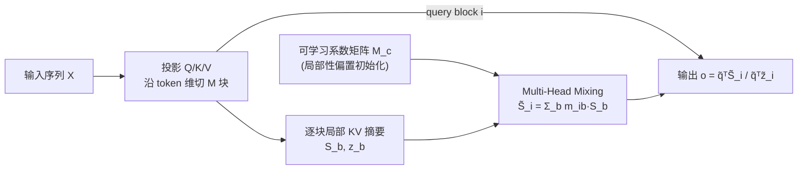

# MHLA: Restoring Expressivity of Linear Attention via Token-Level Multi-Head

**会议**: ICLR 2026  
**OpenReview**: [https://openreview.net/forum?id=340QjF3jJP](https://openreview.net/forum?id=340QjF3jJP)  
**代码**: [dagroup-pku.github.io/MHLA](https://dagroup-pku.github.io/MHLA)（Project Page）  
**领域**: 高效注意力 / 线性注意力架构  
**关键词**: Linear Attention, Token-Level Multi-Head, Global Context Collapse, Rank, Linear Complexity  

## 一句话总结
本文指出线性注意力性能退化的根因是「全局上下文坍缩」（所有 query 共用一个固定 $d\times d$ 的全局 KV 摘要，导致注意力矩阵秩被死死卡在 $d$），提出沿 token 维度分块的多头线性注意力 MHLA，用一个可学习系数矩阵让每个 query block 对各块局部摘要做 query-conditioned 混合，从而在保持 $O(N)$ 复杂度、不引入额外卷积/门控模块的前提下把秩上界提升到 $\sum_b \min(n_b,d)$，恢复了 softmax 注意力的表达力。

## 研究背景与动机
**领域现状**：Transformer 的 self-attention 是当下视觉、NLP、生成模型的核心模块，但其 $O(N^2)$ 复杂度在高分辨率图像生成、视频生成等长序列任务上代价过高。线性注意力（Katharopoulos 2020、Performer 等）用正特征映射 $\phi(\cdot)$ 把 softmax 核近似为 $\mathrm{Sim}(Q_i,K_j)\approx\phi(Q_i)\phi(K_j)^\top$，把所有 key-value 压缩成一个全局摘要 $G=\sum_j\phi(K_j)^\top V_j$，复杂度降到 $O(N)$。

**现有痛点**：线性注意力一旦直接替换 softmax，精度往往明显下降，尤其在长序列任务上。主流补救手段（Focused LA、Inline Attn、MALA/RALA 等）靠塞进 depthwise 卷积、门控等外挂模块来挽回性能，但这些模块又重新引入计算开销、随序列变长继续退化，等于背离了线性注意力「省算力」的初衷。

**核心矛盾**：线性注意力把所有 token 压成一个被所有 query 共享的固定大小 $d\times d$ 全局 KV 摘要——这恰恰丢掉了 softmax 注意力最关键的优势：**query 各自适配**（每个 query 能挑出自己关心的那一小撮 token）。**核心洞察**：本文把这一现象量化为「**全局上下文坍缩（Global Context Collapse）**」——(1) 秩坍缩：$\mathrm{rank}(A_{lin})=\mathrm{rank}(\tilde Q\tilde K^\top)\le d$，无论序列多长注意力矩阵秩都被卡在 $d$；(2) 稀疏性丢失：所有 query 复用同一聚合表示，无法按 query 相关性重新加权 key，随 $N$ 增大注意力分布趋向均匀、熵升高，失去聚焦能力。

**本文目标**：在**不牺牲线性复杂度、不引入重型外挂模块**的前提下，恢复 query 相关的多样性（不同 query 能检索不同上下文）。

**核心 idea**：**沿 token 维度切多头**。把序列切成 $M$ 个互不重叠的块（空间/时空意义上的「头」），每块算自己的局部 KV 摘要，再让每个 query block 通过一个可学习系数矩阵对所有块摘要做 query-specific 的混合，从而两阶段地恢复「块级选择 × 块内 token 重加权」的 query-conditioned 多样性。

## 方法详解

### 整体框架
MHLA 把输入序列 $X\in\mathbb{R}^{N\times d}$ 沿 token 维切成 $M$ 个非重叠块（视觉任务里块定义在 2D/3D 空间网格上而非展平的 1D），每块算一个局部 KV 摘要 $S_b=\sum_{j\in b}\tilde K_j V_j^\top$ 与归一化项 $z_b=\sum_{j\in b}\tilde K_j$。关键在于用一个可学习系数矩阵 $M_c\in\mathbb{R}^{M\times M}$ 做 **Multi-Head Mixing**：query block $i$ 不再读单一全局摘要，而是把 $M$ 个局部摘要按自己的混合权重 $m_i$ 加权成一个 query-specific 的混合摘要 $\tilde S_i=\sum_b m_{i,b}S_b$ 再做注意力。整条流程只用标准 GEMM，复杂度保持 $O(N)$。

### 关键设计

**1. Token 维度切多头 + 局部 KV 摘要：把秩上界从 $d$ 打开**。普通线性注意力把全序列压成一个 $d\times d$ 摘要，注意力矩阵 $A_{lin}=\tilde Q\tilde K^\top$ 的秩被 $\mathrm{rank}\le\min\{\mathrm{rank}(\tilde Q),\mathrm{rank}(\tilde K)\}\le d$ 死死卡住，当 $N\gg d$ 时这是对真实 $N\times N$ 注意力的严重低秩近似。MHLA 沿 token 维把序列切成 $M$ 块、每块独立算局部摘要 $S_b=\sum_{j\in b}\tilde K_j V_j^\top$ 之后，每个 query block 看到的混合 key 序列由不同块拼接而成，注意力子矩阵秩 $\mathrm{rank}(A_b)\le\min(n_b,d)$，全局秩上界随之放大到 $\mathrm{rank}(A_{MHLA})\le\min\big(N,\sum_{b=1}^M\min(n_b,d)\big)$。也就是说，秩不再被单一 $d$ 封顶，而是随头数 $M$ 近似线性增长——这正是恢复表达力的数学根源，文中 DeiT-T 实验里 MHLA 的注意力秩（233）远高于线性注意力（58）、逼近 softmax（255）。

**2. Multi-Head Mixing：用可学习系数矩阵恢复 query-conditioned 选择性**。光切块还不够，还要让每个 query 能 query-specific 地组合这些块。MHLA 引入系数矩阵 $M_c\in\mathbb{R}^{M\times M}$，其第 $i$ 行 $m_i$ 指定 query block $i$ 如何线性组合 $M$ 个局部摘要：$\tilde S_i=\sum_{b=1}^M m_{i,b}S_b$，$\tilde z_i=\sum_b m_{i,b}z_b$。给定 query $\tilde q$，输出为

$$o=\frac{\tilde q^\top\tilde S_i}{\tilde q^\top\tilde z_i}=\frac{\sum_{b=1}^M m_{i,b}\,\tilde q^\top S_b}{\sum_{b=1}^M m_{i,b}\,\tilde q^\top z_b}.$$

把局部摘要按 token 展开可得 $\tilde q^\top\tilde S_i=\sum_{t=1}^N m_{i,b(t)}\big(\tilde q^\top\tilde K_t\big)V_t^\top$，机制因此变得透明：**外层** $m_{i,b(t)}$ 让 query block 在「块级」选择该关注哪些块（剪掉不相关块），**内层** $\tilde q^\top\tilde K_t$ 在块内进一步区分 token。两级相乘 = block selection × intra-block reweighting，既恢复了 query 的稀疏聚焦（熵显著降低），又把所有运算化简成 $M$ 个 $d\times d$ 矩阵的混合（一次 GEMM），保持 $O(N)$。混合操作本身用 $M_c$ 与摘要堆栈的 GEMM 完成，硬件高效。语言建模/视频生成等长序列场景里可省掉归一化项以提升训练稳定性。

**3. 局部性偏置初始化（Locality-biased Init）+ 端到端学习**：由于块定义在空间/时空轴上，作者把 $M_c$ 初始化成偏好局部性的形式——第 $i$ 行 $m^{(0)}_{i,j}\propto 1-\mathrm{dist}(i,j)/\max_k\mathrm{dist}(i,k)$（按欧氏距离衰减），再归一化使 $\sum_j m^{(0)}_{i,j}=1$，每次更新还把系数 clip 到 $(0,1)$ 保证非负与稳定。这个先验让收敛更快更稳，同时把 $M_c$ 留作可学习参数自由适配数据分布。消融显示：纯局部性初始化（冻结）已能拿到 75.4%，单纯可学习无局部先验 75.1%，二者结合达 75.8%——先验与学习互补。

**4. 复杂度与块数权衡**：MHLA 总复杂度为 $O(MN_b d^2+M^2 d^2+MN_b d^2)=O(Nd^2+M^2d^2)$。为让 $Nd^2$ 成为主导项，块数取 $M^2\le N$（如 DiT-S/2 在 512 分辨率序列长 1024 时 $M\le 32$），此时整体仍是 $O(Nd^2)$ 的线性复杂度，内存复杂度 $O(Md^2)$，并天然兼容 chunkwise 并行训练与流式/有状态推理（每个头直接对应一个 chunk）。

## 实验关键数据

### 主实验

**图像分类（ImageNet-1K）**——MHLA 用最少额外参数拿到线性注意力中的最佳精度，甚至超过 self-attention：

| 模型 / 注意力 | Params | FLOPs | Top1-Acc |
|---|---|---|---|
| DeiT-T Self Attn | 5.7M | 1.1G | 72.2 |
| DeiT-T Linear Attn | 5.7M | 1.1G | 69.8 |
| DeiT-T MALA | 6.3M | 1.1G | 75.1 |
| **DeiT-T MHLA** | **5.7M** | 1.1G | **75.8** |
| DeiT-S Self Attn | 22M | 4.2G | 79.8 |
| **DeiT-S MHLA** | **22M** | 4.2G | **81.0** |
| MAViT-S（SOTA 复现） | 27M | 4.6G | 84.3 |
| **MHLA-VLT-S** | 27M | 4.6G | **84.6** |

**图像生成（Class-to-Image，ImageNet-1K，FID↓）**——全尺寸最佳，L/XL 上裸 MHLA 即可匹敌 self-attention：

| 模型 | Self Attn | Linear Attn | MHLA |
|---|---|---|---|
| DiT-S/2 @256 | 68.40 | 89.72 | **59.80** |
| DiT-S/2 @512 | 84.54 | 125.33 | **78.63** |
| DiT-B/2 @256 | 43.47 | 60.47 | **37.47** |
| DiT-XL/2 @256 | 19.47 | 28.63 | **19.17**(w/ CPE+Gating) |

**文生图（SANA-0.6B 微调）**：SANA-MHLA 把 FID 6.10→5.90、CLIP 28.15→28.26、GenEval 0.64→0.68，全面超过 PixArt-α/Σ 与原 SANA，且 2k 步内即追平预训练 checkpoint。

**视频生成（Wan2.1-1.3B，VBench，序列长 31,500，$M=105$）**：

| 模型 | Quality↑ | Semantic↑ | Total↑ | Latency(s)↓ |
|---|---|---|---|---|
| Wan-FA（FlashAttn 原版） | 85.23 | 75.65 | 83.31 | 166 |
| Wan-LA（全线性注意力） | 69.96 | 11.38 | 58.24 | 82 |
| **Wan-MHLA**（全替换） | 84.26 | 76.16 | 82.62 | **81**（2.1× 加速）|
| **Wan-MHLA-H**（替换 2/3 层） | 84.87 | **79.59** | **83.82** | 103（1.6× 加速）|

在 31.5k 超长序列下 vanilla LA 直接坍缩（Total 仅 58.24，loss 高位停滞训不动），MHLA 几乎恢复到 FlashAttn 水平并提速 2.1×；混合版甚至 Total 反超原版。

**NLP（0.3B，FineWeb-Edu 10B tokens）**：常识推理平均 47.1 与 Transformer++（46.8）、Mamba2（47.0）、GDN（46.9）持平；LongBench 平均 7.41 为全场最佳（Multi-Doc QA、摘要、代码任务尤为突出），体现长上下文理解优势。

### 消融实验

| (a) Multi-Head Mixing（DeiT-T） | Top1-acc |
|---|---|
| 仅局部性初始化（冻结） | 75.4 |
| 仅可学习（无局部先验） | 75.1 |
| **局部性初始化 + 可学习** | **75.8** |

| (b) 头数 M（DiT-S/2 @512，序列长 1024） | FID↓ | Throughput↑ |
|---|---|---|
| M=4 | 79.56 | 435 |
| **M=16** | **78.63** | 435 |
| M=64 | 79.50 | 408 |

头数并非越多越好：$M=16$（满足 $M^2\le N$）兼顾 FID 与吞吐；$M=64$ 时 $M^2>N$ 反而 FID 与吞吐双降，印证复杂度分析里 $M^2\le N$ 的取值约束。

### 关键发现
- **秩与熵双指标证伪「全局摘要够用」**：DeiT-T 上 LA 秩 58.4/熵 5.12，softmax 254.8/4.13，MHLA 233.4/**4.06**——MHLA 不仅秩逼近 softmax，熵甚至更低，注意力比 softmax 还聚焦。
- **外挂模块随规模失效**：DWConv(CPE) 在小 DiT 上有用，但 DiT-XL 上加 CPE 反而让 FID 从 20.32 退化到 22.79，裸 MHLA 已匹配 self-attention，说明 MHLA 的增益是内生的、可随规模扩展，而卷积外挂不能。
- **快速适配**：替换已有模型的注意力后，SANA-MHLA 2k 步追平预训练、Wan-MHLA 快速逼近原 loss 轨迹，迁移成本低。

## 亮点与洞察
- **诊断到方案一气呵成**：先用秩 + 熵两个可量化指标把「线性注意力为什么差」精确定位成「全局上下文坍缩」，再针对性地用 token 维多头打开秩上界，理论（秩界 $\sum_b\min(n_b,d)$）与实证（秩从 58→233）严丝合缝。
- **不加任何外挂模块**：相比靠 DWConv/门控续命的同行，MHLA 只用切块 + 一个 $M\times M$ 系数矩阵的 GEMM，真正守住了线性注意力「省算力」的初心，且实验证明外挂模块随规模失效、MHLA 内生增益可扩展。
- **跨四大任务通用**：分类、图像生成、视频生成、语言建模全部验证，视频 31.5k 超长序列上 2.1× 加速且几乎不掉点，是少见的同时打通判别式与生成式、视觉与语言的高效注意力。
- **「token 维多头」的视角新颖**：传统 multi-head 切的是特征维（channel），MHLA 切的是 token 维（空间/时空块），把「头」重新定义为局部上下文单元，为线性注意力提供了正交于特征映射设计的新自由度。

## 局限与展望
- **块的划分依赖空间/时空结构**：局部性偏置初始化假设块沿空间轴定义，对没有自然几何结构的纯序列任务（如某些图/集合数据），如何划块与初始化仍需探索。
- **头数 $M$ 需满足 $M^2\le N$**：这把可用头数与序列长度绑定，短序列上能切的头有限，秩提升空间受限；$M$ 选取目前靠经验+消融，缺乏自适应机制。
- **NLP 上的 ppl 仍有差距**：语言建模 WikiText ppl 38.31、LAMBADA 71.64 相比 Transformer++（34.57/60.46）仍偏高，常识推理虽持平但困惑度未追平，纯自回归长序列下的表达力恢复还不彻底。
- **混合架构的最优配比未深究**：Wan-MHLA-H 替换 2/3 层效果最好，提示全替换并非最优，但层级混合比例如何系统选择尚未给出原则。

## 相关工作与启发
- **线性注意力谱系**：从 Linear Transformer（Katharopoulos 2020）、Performer（Choromanski 2021）的核近似，到 Focused LA（Han 2023）、Inline Attn（Han 2024）、MALA/RALA（Fan 2025）靠外挂模块补表达力，MHLA 给出第三条路——不补模块，而是从「token 维分头」上改变摘要结构。
- **与门控线性注意力/状态空间模型对比**：GLA、Mamba2、GDN 等通过门控或选择性状态恢复表达力，MHLA 的可学习混合系数矩阵可视为一种结构更轻、显式块级选择的替代，且天然兼容 chunkwise 并行。
- **秩作为表达力指标**：延续 Bhojanapalli 2020 等用注意力矩阵秩衡量表达力的思路，MHLA 把「提升秩」从经验观察上升为可推导的设计目标，对后续高效注意力设计有方法论启发——任何线性注意力变体都可以用「秩上界能否随某维度扩展」来预判其表达力天花板。

## 评分
- **新颖性**: ⭐⭐⭐⭐ 「沿 token 维切多头 + 可学习混合矩阵」的视角新颖，把线性注意力退化精确归因为秩坍缩并给出可推导的提升机制，区别于一众外挂模块路线。
- **实验充分度**: ⭐⭐⭐⭐⭐ 分类/图像生成/视频生成/NLP 四大任务全覆盖，含 31.5k 超长序列视频、SANA/Wan 大模型快速适配、秩与熵的机理可视化，消融到位。
- **写作质量**: ⭐⭐⭐⭐ 「诊断→理论→方法→验证」结构清晰，秩界推导与 token 级展开把机制讲透；个别符号（如 $Y_i$ 在分析中复用）略有歧义。
- **价值**: ⭐⭐⭐⭐⭐ 在不加额外开销的前提下让线性注意力逼近甚至超过 softmax，且能即插即换进现有 DiT/SANA/Wan，对长序列生成与高效架构落地有直接实用价值。

<!-- RELATED:START -->

## 相关论文

- [\[ICLR 2026\] Explainable Token-level Noise Filtering for LLM Fine-tuning Datasets](explainable_token-level_noise_filtering_for_llm_fine-tuning_datasets.md)
- [\[ICLR 2026\] Log-Linear Attention](log-linear_attention.md)
- [\[ICML 2025\] MoH: Multi-Head Attention as Mixture-of-Head Attention](../../ICML2025/llm_efficiency/moh_multi-head_attention_as_mixture-of-head_attention.md)
- [\[ICLR 2026\] Local Linear Attention: An Optimal Interpolation of Linear and Softmax Attention for Test-Time Regression](local_linear_attention_an_optimal_interpolation_of_linear_and_softmax_attention_.md)
- [\[ICLR 2026\] RACE Attention: A Strictly Linear-Time Attention Layer for Training on Outrageously Large Contexts](race_attention_a_strictly_linear-time_attention_layer_for_training_on_outrageous.md)

<!-- RELATED:END -->
