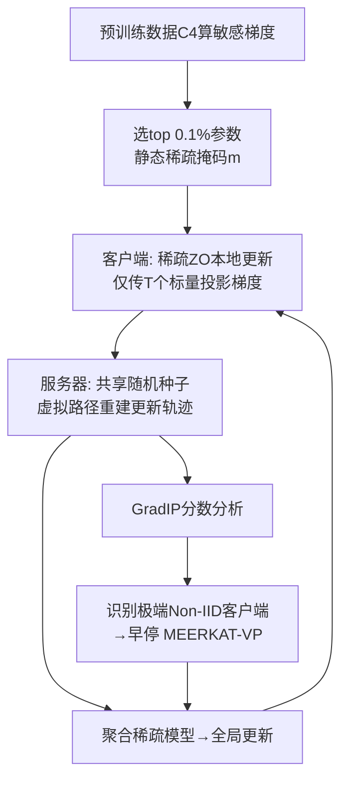

# Mitigating Non-IID Drift in Zeroth-Order Federated LLM Fine-Tuning with Transferable Sparsity

**会议**: ICLR 2026  
**OpenReview**: [https://openreview.net/forum?id=2DuMBKVbX2](https://openreview.net/forum?id=2DuMBKVbX2)  
**代码**: 待确认  
**领域**: 高效 LLM 微调 / 联邦学习 / 零阶优化  
**关键词**: Federated Learning, Zeroth-Order Optimization, Sparse Fine-Tuning, Non-IID, LLM  

## 一句话总结
提出 MEERKAT——只更新 0.1% 预训练敏感参数的稀疏零阶联邦微调方法，用「极致稀疏 + 高频同步」压制 Non-IID 漂移；并基于可追溯的虚拟路径发现 GradIP 现象，进一步用 MEERKAT-VP 识别极端 Non-IID 客户端并早停，提升全局模型质量。

## 研究背景与动机
- **领域现状**：联邦学习（FL）让 LLM 能在大量去中心化设备上协作微调而无需上传原始数据，是隐私敏感场景下的关键范式。零阶优化（ZO）通过前向扰动估计梯度，绕开反向传播和激活缓存，显著降低端侧显存，成为联邦 LLM 微调的热门方向。
- **现有痛点**：LLM 参数量巨大，导致两难——(1) 通信开销高：每轮要传整模型/大量梯度；(2) Non-IID 数据异质性引起客户端漂移（client drift），阻碍全局收敛。标准 ZO 直接作用在数十亿参数空间上既低效又不稳定。
- **核心矛盾**：要缓解 Non-IID 漂移最有效的手段是**高频同步**，但高频同步在大模型上通信成本不可承受；稀疏化能降通信，但传统稀疏 ZO 在异质数据下表现并不稳。如何同时拿到「低通信 + 高频 + 抗异质」三者？
- **本文目标**：设计一种通信开销极低、可支持高频同步、且天然能识别并处理极端 Non-IID 客户端的联邦 ZO 微调方法。
- **核心 idea**：**「可迁移的静态极稀疏掩码」**——用预训练数据梯度一次性选出对损失最敏感的 0.1% 参数作为固定更新子集，使每轮只需交换标量投影梯度，通信降 1000×，从而负担得起高频同步；**「虚拟路径 + GradIP 信号」**——服务器靠共享随机种子重建客户端更新轨迹，发现 IID/Non-IID 客户端的梯度内积呈现可区分的动力学，据此早停极端客户端。

## 方法详解

### 整体框架
MEERKAT 在客户端做稀疏零阶微调（只扰动掩码选中的 0.1% 参数，上传 T 个标量投影梯度），服务器借共享随机种子在「虚拟路径」上无数据地重建每个客户端的更新轨迹并聚合。在此之上，MEERKAT-VP 利用虚拟路径计算 GradIP 分数，识别出极端 Non-IID 客户端并对其早停（每轮只走一步），削弱其偏斜更新对全局模型的污染。

### 关键设计

**1. 预训练敏感参数驱动的极稀疏静态掩码：把更新限制在 0.1% 上以撬动高频同步。** MEERKAT 在 C4 预训练数据子集上计算每个参数的平均平方梯度，取最高的 $u$（默认 $u=0.1\%$）个标记为 1，构成二值掩码 $m\in\{0,1\}^d$，整个训练过程固定不变。本地零阶更新只扰动这部分参数：投影梯度 $g=\frac{f(w+\epsilon(z\odot m);B)-f(w-\epsilon(z\odot m);B)}{2\epsilon}$，本地梯度估计 $\hat\nabla f = g\,(z\odot m)$，其中 $z\sim\mathcal N(0,I_d)$。这一设计的关键在于：敏感度高度集中（top 0.1% 参数的平均平方梯度比 0.1%–1% 那一档大 52×），所以极稀疏几乎不损精度；且该掩码在域偏移的标定数据间**可迁移**。由于双方共享随机种子生成 $z$、掩码又固定，每步只需交换一个标量 $g$，通信比 Full-FedZO 降 1000× 以上，从而让高频同步在大模型上变得可负担。

**2. 「稀疏 + 高频同步」协同压制 Non-IID 漂移，理论上降低误差地板。** 收敛分析（PL 型非凸条件）给出界 $\frac{1}{R}\sum_r (f(w_r)-f^*)\le O\!\big(\frac{(2+u)^2}{TR}\big)+O\!\big(\frac{T}{2+u}\big)+O(1)$。两个变量耦合出清晰权衡：更稀疏（小 $u$）以平方方式 $\propto(2+u)^2$ 改善瞬态收敛项却抬高稳态误差 $\propto\frac{1}{2+u}$，故存在最优稀疏度；而本地步数 $T$ 越小、同步越频繁，稳态项 $O(\frac{T}{2+u})$ 越小，误差地板越低——这正是高频同步抗异质的理论根据。实验印证：在 $T=1$ 的极端高频下，Qwen2-1.5B 上 MEERKAT 的 Non-IID 平均精度竟与 IID 持平，几乎抹平了异质性带来的差距。

**3. 虚拟路径重建：服务器无需原始数据即可复原客户端轨迹。** 因为服务器与客户端共享每轮随机种子列表 $\{s_r^1,\dots,s_r^T\}$，收到 $T$ 个标量投影梯度后即可重新生成 $z_k^t$、配合固定掩码 $m$ 复原每一步本地梯度 $\hat\nabla f_k^t=g_k^t\cdot(z_k^t\odot m)$，进而重建整条本地更新「虚拟路径」并聚合 $w_k^T$。这一可追溯性是后续异质性诊断的基础：它把「只能看到聚合结果」的黑箱 FL，变成服务器能逐步观测客户端训练动力学、却仍不触碰原始数据的可分析过程，同时在弱网下还能减少需要直传的内容。

**4. GradIP 现象与 MEERKAT-VP 早停：用梯度内积轨迹识别并隔离极端 Non-IID 客户端。** 定义 GradIP 分数为本地 ZO 梯度与服务器预训练梯度的内积 $\langle\nabla f_p,\hat\nabla f_k^t\rangle$。实验发现一个清晰可分的现象：极端 Non-IID（单标签）客户端的 GradIP 在 100 步内单调衰减趋零，而 IID 客户端持续震荡；成因是两者梯度近乎正交（余弦≈0），差异主要由本地梯度范数轨迹决定。MEERKAT-VP 据此在标定阶段算两个指标——初期/后期均值比 $\rho_{\text{later}}=\frac{\text{Gradip}_{\text{init\_avg}}}{\text{Gradip}_{\text{later\_avg}}}$ 和静默步占比 $\rho_{\text{quie}}$，超阈值即判为极端 Non-IID 并施加早停（每轮仅一步，配数据指针保证整份数据最终被用到）。理论上 MEERKAT-VP 的异质项系数 $\frac{(2+u)L}{4K}<\frac{L}{K}$ 更小，且随异质度 $c_h$ 增大优势越明显。

## 实验关键数据

模型：Gemma-2-2B / Qwen2-1.5B / Llama-3.2-1B；数据：SST-2、AG News、Yelp、BoolQ、RTE、WSC、WiC，按 Dirichlet 分布切成 Non-IID。

### 主实验（Non-IID 下各方法平均精度，LLaMA-3.2-1B，节选）

| 方法 | Local Step | SST-2 | AgNews | Yelp | BoolQ | RTE | Acc(均) |
|------|-----------|-------|--------|------|-------|-----|---------|
| Full-FedZO | 10 | 0.909 | 0.705 | 0.940 | 0.641 | 0.542 | 0.699 |
| Weight Magnitude | 10 | 0.902 | 0.857 | 0.951 | 0.696 | 0.551 | 0.717 |
| LoRA-FedZO | 10 | 0.901 | 0.749 | 0.960 | 0.649 | 0.524 | 0.715 |
| **MEERKAT** | 10 | 0.916 | 0.872 | 0.964 | 0.695 | 0.600 | **0.759** |

Qwen2-1.5B（T=10）上 MEERKAT 平均 0.805，明显高于 Full-FedZO 0.761 / LoRA 0.768 / Weight-Mag 0.776；在 T∈{30,50,100} 各档亦普遍领先。

### 关键对比与消融

| 维度 | 结果 |
|------|------|
| 通信成本 | 固定 0.1% 掩码，比 Full-FedZO 降 **1000×** 以上 |
| 敏感度集中性 | top 0.1% 参数平均平方梯度比 0.1–1% 档大 **52×**（支撑极稀疏） |
| 掩码可迁移 | 跨域偏移标定集迁移、客户端 UnionMask 表现相当 |
| 额外基线 | 同设置下优于 DeComFL；MEERKAT-VP 优于改编 FedDYN，逼近反向传播上界 |
| 稀疏度鲁棒 | T=1 下 $10^{-3}$–$10^{-4}$ 稀疏仍保持强精度 |

### 关键发现
- **T=1 极端高频下 Non-IID 精度 ≈ IID**（Qwen2-1.5B），直接验证「稀疏+高频」抹平异质性。
- **GradIP 轨迹是可靠的异质性指示器**：Non-IID 衰减至零、IID 持续震荡，且近正交说明范数主导。
- **VPCS 早停稳定优于 MEERKAT 与随机早停**（各通信频率下，Non-IID α=0.5）。

## 亮点与洞察
- **把「通信预算」转化为「同步频率」的杠杆**：用极稀疏换来标量级通信，再把省下的带宽全部投到高频同步上去对冲 Non-IID，逻辑闭环且有理论支撑（稳态误差随 T 减小而降）。
- **虚拟路径是个巧妙的副产品**：共享随机种子本是 ZO 通信优化的手段，作者顺势让服务器「免费」重建客户端轨迹，把不可观测的 FL 变成可诊断的，催生 GradIP 信号。
- **GradIP 现象提供了无需原始数据的异质性探针**，这对隐私敏感 FL 很实用，比依赖损失/精度的客户端选择更细粒度。

## 局限与展望
- 稀疏掩码依赖预训练数据（C4）计算敏感度，假设服务器可访问与预训练分布相近的标定数据；分布严重偏离时掩码质量与 GradIP 信号是否仍成立有待考察。
- 早停判据涉及多个阈值（$\rho_{\text{later}}$、$\rho_{\text{quie}}$、$\sigma$）和标定阶段，调参与跨任务稳健性未充分展开。
- 实验集中在 1–2B 小模型与分类类任务，更大规模 LLM、生成式任务下「0.1% 稀疏 + 高频」的收益是否保持仍是开放问题。
- GradIP 衰减的理论解释建立在「单标签极端 Non-IID + 梯度近正交」假设上，对更一般的连续异质谱仅有经验观察。

## 相关工作与启发
- **零阶 LLM 微调**：承接 MeZO（Malladi 2023）用前向扰动省显存的思路，把它搬进联邦场景并叠加稀疏与可追溯通信。
- **稀疏 ZO 参数选择**：呼应 Guo 2024「梯度敏感参数优于权重幅度/随机」的结论，并把敏感参数的跨任务可迁移性用作工程支点。
- **联邦异质性**：相比 FedDYN 等校正客户端漂移的方法，本文换思路——不去校正而是「识别+早停」最坏的客户端，且诊断信号来自通信副产品而非额外计算。
- **启发**：当通信被压到标量级，FL 的设计自由度（同步频率、轨迹可观测性）会被重新释放出来；「让通信优化手段反过来提供可解释信号」是值得借鉴的范式。

## 评分
- 新颖性: ⭐⭐⭐⭐ 「可迁移静态极稀疏掩码 + 虚拟路径 GradIP 信号」组合新颖，GradIP 现象是有意思的实证发现。
- 实验充分度: ⭐⭐⭐⭐ 3 模型 7 任务多稀疏度多通信频率，含理论收敛界与丰富附录基线（DeComFL/FedDYN/上界）。
- 写作质量: ⭐⭐⭐⭐ 三条 Claim 对应三个 RQ，逻辑清晰；理论与现象解释到位，但阈值与超参细节偏附录。
- 价值: ⭐⭐⭐⭐ 通信降 1000× 且能无数据诊断异质客户端，对端侧/隐私敏感联邦 LLM 微调有实用价值。

<!-- RELATED:START -->

## 相关论文

- [\[ICLR 2026\] FLoRG: Federated Fine-tuning with Low-rank Gram Matrices and Procrustes Alignment](florg_federated_fine-tuning_with_low-rank_gram_matrices_and_procrustes_alignment.md)
- [\[ICLR 2026\] Developmental Federated Tuning: A Cognitive-Inspired Paradigm for Efficient LLM Adaptation](developmental_federated_tuning_a_cognitive-inspired_paradigm_for_efficient_llm_a.md)
- [\[ICLR 2026\] Explainable Token-level Noise Filtering for LLM Fine-tuning Datasets](explainable_token-level_noise_filtering_for_llm_fine-tuning_datasets.md)
- [\[ICLR 2026\] Difficulty–Diversity Collaborative Filtering for Data-Efficient LLM Fine-Tuning](difficultydiversity_collaborative_filtering_for_data-efficient_llm_fine-tuning.md)
- [\[ICLR 2026\] Influence-Preserving Proxies for Gradient-Based Data Selection in LLM Fine-Tuning](influence-preserving_proxies_for_gradient-based_data_selection_in_llm_finetuning.md)

<!-- RELATED:END -->
