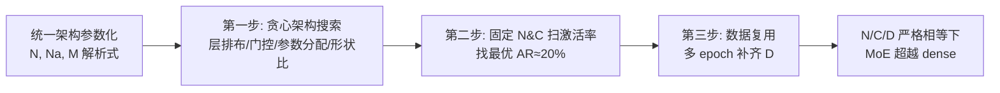

# Mixture-of-Experts Can Surpass Dense LLMs Under Strictly Equal Resource

**会议**: ICLR 2026  
**OpenReview**: [https://openreview.net/forum?id=oIdzliJAeA](https://openreview.net/forum?id=oIdzliJAeA)  
**代码**: [https://huggingface.co/kamanphoebe/moe_surpass_dense](https://huggingface.co/kamanphoebe/moe_surpass_dense)  
**领域**: LLM 高效化 / MoE 架构  
**关键词**: Mixture-of-Experts, 激活率, 等资源对比, 数据复用, 架构搜索  

## 一句话总结
在**总参数量 N、训练算力 C、数据量 D 三者严格相等**的前提下，作者通过优化 MoE 骨干并把激活率控制在约 20% 的最优区间，首次证明 MoE 能稳定超越同等资源的 dense 模型，并用数据复用策略消解 MoE 额外的数据需求。

## 研究背景与动机
- **领域现状**：MoE 凭借"参数量大、每 token 计算量小"成为扩容利器，但 LLaMA、Qwen、DeepSeek 一代等主流开源模型仍坚持 dense 架构，MoE 到底是否真的更强一直缺乏公允结论。
- **现有痛点**：现有对比要么是**数据中心视角**（固定总 token，夸 MoE 的参数效率），要么是**算力中心视角**（固定算力，让总参数膨胀近百倍），两者都回避了真实部署里 N/C/D 同时受限的事实——尤其 MoE 推理时所有专家都要驻留 HBM 并搬入共享内存，参数量本身就是运行时成本。
- **核心矛盾**：直觉上，同等总参数的 dense 模型应当因"满负荷利用容量"而占优；于是大多数研究只敢让 MoE 靠堆参数取胜，而**不敢在同参数量下正面对比**，从而绕开了真正的工程约束。
- **本文目标**：回答一个被刻意回避的问题——**在 N、C、D 三者完全相等时，MoE 能否真的赢过 dense？** 若能赢，则收益只能归因于架构本身。
- **核心 idea**：**先把 MoE 架构调到近最优，再在固定 N/C 下扫激活率找到稳定的最优区间，最后用数据复用补齐 MoE 多出来的数据需求**，从而构造一个三者严格对齐的公平擂台。

## 方法详解

### 整体框架
作者先建立一套**统一的架构参数化框架**，把 dense 与 MoE 的参数量 N、激活参数 Na、每 token 计算 M 都写成形状超参（深宽比 ζ、FFN 扩张比 α、MoE 的 µ/β 等）的解析表达，从中提炼出"激活率 ra 是主导因素"等关键观察，再据此提出**三步实验法**：①贪心搜索最优 MoE 架构 → ②固定 N、C 下扫激活率 → ③数据复用对齐 D。

### 关键设计

**1. 统一架构参数化：把激活率从一堆超参里解耦出来。** MoE 相比 dense 有海量自由度（MoE 层数 Le、专家数 E、选中数 K、专家维度 De、共享专家 Dse 等），穷举不可行。作者把非词表参数与每 token 算力写成解析式：dense 为 $N\approx(4+3\alpha)\zeta^2 L^3$、$M\approx 2N+4\zeta^2\gamma L^3$；纯 MoE（Ld=0）则有激活率 $r_a=N_a/N=(4+3\beta)/(4+3\mu)$ 与 $M\approx 2r_aN+4\zeta^2\gamma L^3$。由此推出 MoE 相对 dense 的归一化算力 $R_c=r_a\frac{4+3\alpha+2\gamma_d}{4+3\beta+2\gamma_m}$，**一旦形状超参定下，Rc 随 ra 单调增长**——这把高维设计空间收敛成"激活率"这一主变量，也直接揭示出 N/C/D 的权衡：固定 N、C 时 MoE 需要约 Rc 倍的训练 token。

**2. 贪心架构搜索：先把 MoE 骨干调到近最优，再谈对比。** 为避免"用没调好的 MoE 输给 dense"这种不公平，作者按宏观到微观顺序贪心确定结构：层排布上 **1 个 dense 层 + 其余 MoE 层 + 共享专家（1dense+SE）** 最稳（dense 层利于训练稳定），且共享专家占比影响很小，于是固定 $D_{se}=KD_e$；门控分数归一化对 loss 无明显增益且在 K=1 时会零梯度，故不归一化；Top-K 上发现**过大 K 与 K=1 都次优**，主实验尽量避开；形状比则取 ζ≈88、µ≈22（α=2.77 沿用 LLaMA）。这一步保证每个 MoE 候选都跑在自己的近最优形状上。

**3. 固定 N、C 下扫激活率：锁定 ra≈20% 的最优区间。** 在 N≈2B 与 7B 两档、激活率从 8.7% 扫到 58% 的系列模型上（每个都满足 D/N≥20 充分训练），作者发现固定 D 时性能随算力非线性增长、固定 ra 时随 D 线性增益，由此确认存在一个**与 D 无关的最优激活率点 $r_a^{**}\approx20\%$**。更关键的是，2B 和 7B 的最优点都在 20%，说明**最优 AR 不随模型规模变化**——这直接反驳了 Abnar et al. 提出的"最优稀疏度正比于模型规模"，作者归因于自己用了优化过的骨干和严格控制变量。

**4. 数据复用策略：用多 epoch 补齐 MoE 多出来的数据。** 由于固定算力下 MoE 要吃约 4.6 倍数据（ra=20% 时），为对齐 D 作者提出在固定小数据集 $\hat{D}$ 上多轮训练（每轮后 shuffle）：**严格方案**让 MoE 与 dense 在 N、D、C 上完全相等，epoch 数随 ra 降低而增加（3B/7B 实验里 1.7~8.3 轮）以维持算力预算；**宽松方案**则固定 2 epoch（$\hat{D}=0.5D$）。结果显示复用数据相比单轮唯一数据只带来轻微性能下降，MoE 仍稳定超越 dense，且最优 AR 不变——这把"MoE 赢但靠多吃数据"的漏洞彻底补上。

## 实验关键数据
规模空前：2B 量级训练近 200 个模型、7B 量级超 50 个，累计处理 50 万亿 token，全部 checkpoint 公开。

### 主实验（固定算力下 MoE vs dense，BPC 越低越好）

| 模型 | 算力 C | 数据 D | 关键结论 |
|------|--------|--------|----------|
| 2B Dense (C1=9.1e20) | C1 | 65B | 基线 |
| 2B Dense (C2≈2C1) | 1.64e21 | 114B | 2 倍算力上界 |
| 2B MoE, ra=20% | C1 | 541B | BPC 比 C1 dense 低 0.0064，仅比 2 倍算力的 C2 dense 高 0.0049 |

MoE 在 ra 约 15%~48% 区间内均能击败 C1 dense，并逼近 2 倍算力的 dense。

### 下游任务（7B SFT 模型，节选 Table 2，MoE 算力仅为 dense 一半）

| 任务 | Dense (C=5.45e21) | MoE ra=20% (C=2.86e21) |
|------|-------------------|------------------------|
| MMLU | 31.26 | **32.92** |
| DROP | 32.32 | **35.13** |
| BBH | 58.02 | **60.01** |
| GSM8K | 13.34 | **15.54** |
| GAOKAO-Math24 | 9.92 | **15.70** |

MoE 用约一半算力即在多数知识/推理/数学基准上超过 dense。

### 关键发现
- **最优激活率 ra≈20% 跨规模一致**（2B/7B/3B 均成立），与模型大小无关。
- **数据复用几乎无损**：严格复用方案相比唯一数据仅轻微掉点，宽松方案常更好。
- **激活率太低（<10%）参数不足以存知识，太高（>50%）专家专精度下降**，作者猜测最优区间对应更强的专家专精化。

## 亮点与洞察
- 把"MoE 是否更强"这个被各种视角搅浑的问题，**还原成 N/C/D 严格相等的单一公平擂台**，结论干净：赢就是架构赢。
- 统一参数化把高维 MoE 设计空间**坍缩到激活率一个主变量**，既指导实验设计又解释了 N/C/D 的内在权衡。
- "最优 AR≈20% 与规模无关"是一个**可直接落地的工程超参指引**，且用 50 万亿 token、近 250 个模型的体量背书。
- 数据复用补上了 MoE 长期被诟病的"靠多吃数据取胜"短板，让结论真正闭环。

## 局限与展望
- 数据用的是内部高质量私有语料，外部难以完全复现严格的 D 对齐实验。
- "最优 AR 对应更强专家专精"目前仍是**猜想**，缺乏机制层面的直接证据。
- 实验上限到 7B（外加 3B 验证），更大规模（数十 B 以上）是否仍保持 20% 最优 AR 尚需检验。
- 数据复用的"严格方案"在低 ra 下需要多达 8 轮 epoch，长期重复对数据多样性受限场景的影响未充分讨论。

## 相关工作与启发
- 与 Ludziejewski et al. (2025) 并行——后者发现足够大且多 token 的 MoE 能超同参 dense，本文进一步在更小规模也证明，并用复用解决数据问题。
- 与 Abnar et al. (2025) 的"最优稀疏度正比规模"结论直接相左，作者归因于对方算力不足导致欠训练、且未先优化骨干。
- 借鉴了 Li et al. (2025) 的超参缩放律来公平设定每个模型的 η、B，避免"调参不公"污染对比。
- 对从业者的启发：**做 MoE 时优先把激活率定在 ~20%，配 1dense+SE 骨干，并用数据复用对齐预算**，可在等资源下稳吃 dense。

## 评分
- **新颖性**: ⭐⭐⭐⭐ 首次在 N/C/D 严格相等下给出 MoE 超越 dense 的正面证据，视角和结论都清晰，反驳了既有稀疏度规模律。
- **实验充分度**: ⭐⭐⭐⭐⭐ 近 250 个模型、50 万亿 token、2B/3B/7B 多档 + 上下游 + 数据复用消融，体量与严谨度俱佳。
- **写作质量**: ⭐⭐⭐⭐ 参数化推导与三步法逻辑顺畅，图表信息密度高；部分结论依赖附录表格，正文略显紧凑。
- **价值**: ⭐⭐⭐⭐ 给出可直接落地的最优激活率与骨干配方，对 MoE 预训练实践有明确指导意义。

<!-- RELATED:START -->

## 相关论文

- [\[ICLR 2026\] Routing Manifold Alignment Improves Generalization of Mixture-of-Experts LLMs](routing_manifold_alignment_improves_generalization_of_mixture-of-experts_llms.md)
- [\[ICML 2026\] RepetitionCurse: Measuring and Understanding Router Imbalance in Mixture-of-Experts LLMs under DoS Stress](../../ICML2026/llm_efficiency/repetitioncurse_measuring_and_understanding_router_imbalance_in_mixture-of-exper.md)
- [\[ICLR 2026\] DirMoE: Dirichlet-Routed Mixture of Experts](dirmoe_dirichlet-routed_mixture_of_experts.md)
- [\[ICLR 2026\] Towards Greater Leverage: Scaling Laws for Efficient Mixture-of-Experts Language Models](towards_greater_leverage_scaling_laws_for_efficient_mixture-of-experts_language_.md)
- [\[ICLR 2026\] Understanding the Mixture-of-Experts with Nadaraya-Watson Kernel](understanding_the_mixture-of-experts_with_nadaraya-watson_kernel.md)

<!-- RELATED:END -->
