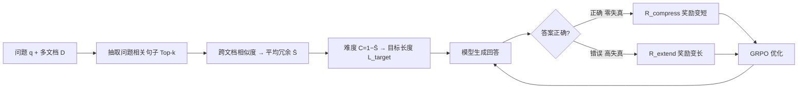

# MoL: Adaptive Mixture-of-Length Reasoning for Efficient Question Answering with Context

**会议**: ICLR 2026  
**OpenReview**: [https://openreview.net/forum?id=oWWAeLEdE3](https://openreview.net/forum?id=oWWAeLEdE3)  
**代码**: [https://github.com/cong03/MoL](https://github.com/cong03/MoL)  
**领域**: 高效推理 / LLM 推理压缩  
**关键词**: 自适应推理长度, 难度评估, 双目标奖励, GRPO, 上下文问答  

## 一句话总结
MoL 用基于跨文档信息冗余的难度评估给每个问题打"难度分"，再配一个"答错就奖励变长、答对就奖励变短"的双目标奖励做 GRPO 训练，让模型自然涌现出"智能简洁"——简单题短答、难题长答，在多个带上下文 QA 任务上同时提升准确率并大幅压缩 token。

## 研究背景与动机
- **领域现状**：带上下文的问答（多文档 / 长文档 QA）需要模型综合多处信息作答，CoT 和强化学习显著提升了推理质量，但推理链冗长导致推理成本高。
- **现有痛点**：现有高效推理方法分两类——**均匀压缩**（Token-Budget、TokenSkip、KIMI 等）对所有问题施加固定的压缩策略，结果是难题"欠推理"、简单题"过度展开"；**自适应方法**（如 ERPLP）依赖启发式难度估计和僵硬的压缩策略，一旦初始难度判断错了就无法纠错。
- **核心矛盾**：推理质量与计算效率之间的张力——压得太狠丢关键推理步骤、压得不够又浪费 token，且缺乏"初判失误后扩展推理"的容错机制。
- **本文目标**：让计算资源按问题真实复杂度自适应分配，既要**有原则的难度评估**能可靠区分简单抽取题与复杂多跳题，又要**容错的自适应机制**能在初次尝试不足时动态扩展推理。
- **核心 idea**：**[难度感知 + 容错奖励]** 用信息论视角（Set Cover 问题的近似）把 QA 难度量化为跨文档冗余度，再用"答对压缩、答错扩展"的双目标奖励，让模型在训练中按答案正确性动态切换长短模式，自我纠错地按需扩缩推理容量。

## 方法详解

### 整体框架
MoL 分两步：先用**跨文档冗余度**给问题算一个难度分 $C(q,D)$，据此为每个问题分配目标长度 $L_{target}$；再用**双目标奖励**（答对走压缩奖励、答错走扩展奖励）接入标准 GRPO 训练。关键是这两种行为不是固定的多阶段流水线，而是在训练中根据当前回答是否正确动态交错，使模型涌现"智能简洁"。

### 关键设计

**1. 信息论难度评估：用跨文档冗余度近似 Set Cover 复杂度。** 作者把"回答问题 q 需要综合一组知识片段 $U$，散落在文档集 $D$ 中"建模为 Set Cover 问题——用最少文档覆盖所有必需片段的难度，与 Set Cover 的近似硬度相关。但精确 Set Cover 是 NP-hard，于是用一个可计算的代理：高冗余（不同文档的覆盖子集重叠多）意味着低复杂度，低冗余意味着高复杂度。具体实现先对每篇文档抽出与问题最相关的 Top-k 句子 $D'_i = \{s \in D_i : s \in \text{Top-}k(\text{Sim}(s,q))\}$ 去噪，再算两两文档相似度 $S_{ij}=\cos(\text{embed}(D'_i),\text{embed}(D'_j))$，取平均冗余 $\bar S=\frac{2}{n(n-1)}\sum_{i<j}S_{ij}$，最终难度 $C(q,D)=1-\bar S$。这个启发式与人工标注难度有 81% 的一致性，且"先抽相关句再算相似"这一步很关键——直接拿原始整段算相似会被低相关句污染、把简单题误判为难题。

**2. 双目标容错奖励：答错奖励扩展、答对奖励压缩。** 这是 MoL 的核心容错机制，框架成"推理的率失真权衡"——用回答长度作"码率"代理、用任务错误作"失真"代理。对**答错（高失真）**的问题，扩展奖励鼓励变长以补全缺失的证据链：$R_{extend}=\text{clip}(\varepsilon_1-\lambda(1-\frac{L_{actual}}{L_{target}}),0,1)$，当实际长度远短于目标长度时给惩罚，逼模型多写。对**答对（零失真）**的问题，压缩奖励按最小描述长度（MDL）原则鼓励"够用即止"：$R_{compress}=\text{clip}(\varepsilon_2+\lambda(1-\frac{L_{actual}}{L_{target}}),0,1)$，回答越长奖励越低。统一奖励按答案正确性二选一：$R_{MoL}=R_{compress}$ 若 $y=y^*$，否则 $R_{extend}$。相比只能单向压缩的方法，这套机制让模型能在答错时"按需扩容"推理，而不是初判失误后无法翻盘。

**3. 难度依赖的目标长度 + 渐进式课程学习。** 根据难度分给三档目标长度作为率失真曲线上的经验锚点：$L_{target}=512$（$C\le0.3$ 简单）、$1024$（$0.3<C<0.7$ 中等）、$2048$（$C\ge0.7$ 复杂），阈值初值参考 HotpotQA 的长度分布，作者称对具体阈值选择鲁棒。为了训练稳定，长度奖励系数 $\lambda$ 随训练衰减做课程学习：$\lambda(t)=\max(\gamma,\lambda\cdot(1-\frac{t}{T}))$，前期强约束、后期放松到下限 $\gamma$。

**4. GRPO 训练目标：准确率奖励与 MoL 奖励加权。** 总奖励把标准准确率奖励和 MoL 奖励线性组合：$R(x,y)=\alpha\cdot\mathbb{1}[y=y^*]+(1-\alpha)\cdot R_{MoL}(x,y)$，再用 GRPO 优化并加 KL 正则约束到参考策略 $\pi_{ref}$：$L(\theta)=\mathbb{E}_{x,y\sim\pi_\theta}[R(x,y)-\beta\log\frac{\pi_\theta(y|x)}{\pi_{ref}(y|x)}]$。这套统一奖励还能防止"奖励黑客"——模型无法靠无脑超长或超短来骗奖励，因为奖励同时受正确性门控。

## 实验关键数据

### 主实验表格
在 HotpotQA / StrategyQA / Loong 三个带上下文 QA 数据集，跨 Qwen3-1.7B/8B/14B 与 Llama-3.1-8B-Instruct 评测（F1 为准，token 仅算输出）：

| 模型 | 方法 | HotpotQA Acc | HotpotQA Tokens | StrategyQA Acc | Loong Acc | Loong Tokens |
|------|------|------|------|------|------|------|
| Qwen3-8B | Original | 61.0 | 609 | 93.7 | 55.8 | 2165 |
| Qwen3-8B | GRPO | 63.7 | 747 | 95.4 | 60.8 | 2363 |
| Qwen3-8B | ERPLP | 63.3 | 394 | 92.0 | 56.3 | 2037 |
| Qwen3-8B | KIMI | 62.8 | 444 | 92.5 | 60.8 | 1938 |
| Qwen3-8B | **MoL** | **67.2** | **316** | **95.9** | **62.3** | **1374** |
| Qwen3-14B | Original | 65.7 | 534 | 94.4 | 62.4 | 1915 |
| Qwen3-14B | **MoL** | **69.4** | **298** | **96.8** | **72.3** | **1128** |
| Llama-3.1-8B | Original | 53.3 | 431 | 77.4 | 36.3 | 742 |
| Llama-3.1-8B | **MoL** | **69.2** | **169** | **94.1** | **59.2** | **143** |

MoL 在 Qwen3-8B 上实现 49.1% 压缩率同时 +6.2% 准确率；GRPO 虽提准确率但 token 反而膨胀；ERPLP/KIMI 的均匀压缩在复杂题上丢关键推理信息导致掉点。

### 消融实验表格
难度定义策略消融（HotpotQA）与奖励机制消融（Loong）：

| 维度 | 设置 | Accuracy | Tokens |
|------|------|------|------|
| 难度定义 | Original（原始整段相似） | 61.1 | 609 |
| 难度定义 | Original difficulty 标签 | 63.0 | 387 |
| 难度定义 | passage（参考段落相似） | 62.1 | 594 |
| 难度定义 | **MoL（先抽相关句）** | **67.2** | **316** |
| 奖励机制 | GRPO | 60.8 | 2363 |
| 奖励机制 | MoL w/o $R_{extend}$ | 58.9 | 1298 |
| 奖励机制 | MoL w/o $R_{compress}$ | 62.7 | 2862 |
| 奖励机制 | **MoL（完整）** | 62.3 | **1374** |

### 关键发现
- **去掉 $R_{extend}$** 准确率显著下降（甚至低于 GRPO），证明它专责推理质量；**去掉 $R_{compress}$** 输出大幅变长而准确率几乎不涨，证明它专责长度控制——两者作用正交。
- **分难度分层分析**：高难度段 +7.3% 准确率且 token 合理，中低难度段 token 减少约 10% 仍保持准确率优势，相比 KIMI 固定压缩展现出清晰的难度感知。
- **内部激活分析**：输出层面的自适应与内部计算模式相关——简单问题激活更少的 transformer 层，复杂问题调用更深的模型容量，暗示 MoL 诱导了某种动态计算分配。

## 亮点与洞察
- **把难度评估从启发式拉回到理论锚点**：用 Set Cover / 信息冗余给"问题有多难"一个可计算且与人工标注 81% 一致的代理，比纯启发式更有解释力。
- **"答错奖励变长"是真正的新意**：绝大多数高效推理工作只会单向压缩，MoL 的容错扩展机制让模型能从初判失误中翻盘，这也是它在难题上不掉点的根源。
- **"智能简洁"是涌现而非硬约束**：没有显式长度限制，长短行为完全由奖励诱导出来，且对目标长度阈值鲁棒。

## 局限与展望
- 难度评估依赖句向量（BGE-M3）和 Top-k 抽句，对编码器质量与 $k$ 的选择敏感，单文档或无明显跨文档冗余的任务上该代理可能失效。
- 目标长度三档阈值（512/1024/2048）源自 HotpotQA 分布，迁移到长度分布差异大的领域可能需重调。
- "内部激活与有效层数相关"是事后相关性分析（post-hoc），并非因果证据，论文自己也用了较谨慎的措辞。
- 训练成本不低（64×A100），且依赖正确性可判定（F1>0.8 算对），对开放式生成类 QA 的适用性待验证。

## 相关工作与启发
- **均匀压缩派**（Token-Budget 硬 token 限制、TokenSkip 重要性加权过滤、KIMI 对比长度奖励）：高效但对复杂题易丢关键步骤——MoL 的难度感知正是为补这个短板。
- **自适应派**（ERPLP 按预评估难度调推理深度）：缺乏纠错机制、压缩策略僵硬——MoL 的双目标容错奖励直接针对这两个痛点。
- **效率推理通用启发**：把"率失真权衡 + MDL"引入推理长度控制是一个干净的理论框架，给后续"按需推理"工作提供了可复用的奖励设计模板。

## 评分
- **新颖性**: ⭐⭐⭐⭐ 信息论难度评估 + 双向容错奖励的组合在高效推理里较新，尤其"答错奖励扩展"突破了单向压缩范式。
- **实验充分度**: ⭐⭐⭐⭐ 4 个模型 × 3 个数据集主实验 + 难度定义/奖励机制双消融 + 分难度分层分析，覆盖较全；但缺数学推理等更广任务类型。
- **写作质量**: ⭐⭐⭐⭐ 动机—理论—方法—实验逻辑清晰，公式与表格完整，对近似的局限也有诚实澄清。
- **价值**: ⭐⭐⭐⭐ 同时提准确率与压 token、对阈值鲁棒、有开源代码，对长文档 QA 的推理成本控制有实用价值。

<!-- RELATED:START -->

## 相关论文

- [\[ICLR 2026\] ThinKV: Thought-Adaptive KV Cache Compression for Efficient Reasoning Models](thinkv_thought-adaptive_kv_cache_compression_for_efficient_reasoning_models.md)
- [\[ICLR 2026\] DiffAdapt: Difficulty-Adaptive Reasoning for Token-Efficient LLM Inference](diffadapt_difficulty-adaptive_reasoning_for_token-efficient_llm_inference.md)
- [\[ICML 2026\] Skill-Based Mixture-of-Experts: Adaptive Routing for Heterogeneous Reasoning via Inferred Skills](../../ICML2026/llm_efficiency/skill-based_mixture-of-experts_adaptive_routing_for_heterogeneous_reasoning_via_.md)
- [\[ICLR 2026\] UltraLLaDA: Scaling the Context Length to 128K for Diffusion Large Language Models](ultrallada_scaling_the_context_length_to_128k_for_diffusion_large_language_model.md)
- [\[ICLR 2026\] Tactic: Adaptive Sparse Attention with Clustering and Distribution Fitting for Long-Context LLMs](tactic_adaptive_sparse_attention_with_clustering_and_distribution_fitting_for_lo.md)

<!-- RELATED:END -->
