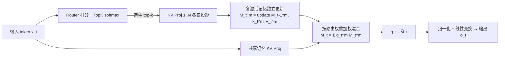

# MoM: Linear Sequence Modeling with Mixture-of-Memories

**会议**: ICLR 2026  
**OpenReview**: [https://openreview.net/forum?id=3PdOq8Rgue](https://openreview.net/forum?id=3PdOq8Rgue)  
**代码**: 待确认  
**领域**: 线性序列建模 / 高效注意力架构  
**关键词**: 线性注意力, Mixture-of-Memories, 召回密集任务, 记忆干扰, Gated DeltaNet, Test-Time Training  

## 一句话总结
MoM 用一组相互独立的记忆状态 + 路由网络替换线性模型里那个唯一的固定大小记忆，让不同 token 只更新各自被分配的记忆，从而在保持线性复杂度的同时大幅扩容记忆、消除写入干扰，把召回密集任务做到逼近 Transformer。

## 研究背景与动机
- **领域现状**：为了摆脱 Transformer 的 $O(n^2)$ 复杂度，线性注意力、状态空间模型（Mamba）、线性 RNN 等方法把整条序列压进一个固定大小的矩阵记忆 $M$，做到 $O(n)$ 训练、$O(1)$ 推理。它们普遍可写成递归形式 $M_t = M_{t-1} + k_t^\top v_t,\ o_t = q_t M_t$。
- **现有痛点**：把整条序列塞进**单个**固定记忆带来两个硬伤——**记忆容量有限**和**记忆干扰**。新信息以累加方式覆盖旧记忆，正交或新颖的输入会污染已存内容，导致在 FDA、SWDE、SQuAD 这类**召回密集任务**上和 Transformer 差一大截。
- **核心矛盾**：Transformer 之所以强，正是因为它给每个 token 保留独立 KV cache、几乎无干扰、容量近乎无限；而线性模型靠极致压缩省了算力，却也丢了这种"分而治之"的能力。单纯把单个 RNN state 调大（expand）治标不治本——一个膨胀的记忆仍难以同时承载多个互相正交的信息侧面。
- **本文目标**：在 Transformer 的"显式 token 表示"和线性模型的"极致压缩"之间找平衡点，既要扩容、去干扰，又不能丢掉线性训练 / 常数推理的效率红利。
- **核心 idea**：**[受神经科学启发的多记忆架构]** 借鉴海马体 theta-gamma 振荡的多项记忆编码（每个 gamma 子周期激活一组不同神经元，时间上分离记忆项以防干扰）和 MoE 的稀疏路由思想，提出 **Mixture-of-Memories**：维护多个独立记忆状态，路由器把每个 token 只送给 top-k 个记忆去更新，最后按重要度加权混合读出。

## 方法详解

### 整体框架
MoM 把线性层里"唯一记忆 $M$"换成"一组记忆 $\{M^1,\dots,M^M\}$ + 路由器"。每个输入 token 先经路由器算出重要度分数、选出 top-k 个记忆；被选中的记忆各自用自己的 KV 投影做 RNN 式更新，未被选中的记忆**原封不动**（这正是去干扰的关键）；读出时把激活的记忆按路由权重加权求和成"混合记忆"$\tilde M_t$，再用共享的 query 查询。另外挂一条**对全序列始终激活的共享记忆**兜底长程依赖。整套机制对记忆更新规则不挑食，能即插即用各种线性模型（Linear Attn / GLA / DeltaNet / Gated DeltaNet / Mamba2 / RWKV…）。

### 关键设计
**1. 路由器：把 token 稀疏分派给记忆，让每个记忆只接收同类信息。** 路由器是个简单线性层 $W_g\in\mathbb{R}^{d\times M}$，对每个 token 算分数后 softmax、取 top-k 并归一化：$\text{scores}_t=\text{TopK}(\text{softmax}(x_tW_g))\in\mathbb{R}^k,\ g_t=\text{scores}_t/\sum\text{scores}_t$。这一步把"一个记忆扛全部信息"变成"不同记忆各管一摊"，是容量扩张和干扰消除的源头——后文 UMAP 可视化显示路由确实把输入按特征聚成了若干簇，每个记忆专精一个子分布。

**2. 独立记忆更新 + 未激活记忆冻结：干扰消除的机制本质。** 对每个被激活的记忆 $m$，用其专属投影 $W_k^m,W_v^m$ 算出 $k_t^m,v_t^m$，再做记忆更新 $M_t^m = M_{t-1}^m + (k_t^m)^\top v_t^m$。关键在于**没被路由到的记忆这一步完全不动**，于是当前 token 的新信息绝不会写进与它无关的记忆里——这与 MoE 的"专家"思想同构，但这里的"专家"不是独立网络，而是嵌在线性递归里的一个个 RNN 状态。更新规则可任意替换：论文给出一张对照表，把 RetNet 的衰减 $\gamma M_{t-1}$、GLA / HGRN2 的数据相关门控、DeltaNet 的 $(I-k_t^\top k_t)$ 删除项、Gated DeltaNet、Mamba2、RWKV7 等统一纳入 $M_t = \text{(gate)}\,M_{t-1}+\text{(write)}$ 的框架，因此 MoM 是正交于这些工作的通用增强。

**3. 加权混合读出 + 共享记忆：把"分散的记忆"重新聚合成可查询的整体。** 更新完后用路由分数把激活记忆加权求和成混合记忆 $\tilde M_t = \sum_m g_t^{(m)} M_t^m$，再用 query 读出 $o_t = q_t\tilde M_t$。值得注意的是，"先混合再乘 query" 与 "先各自乘 query 再混合" 数学等价，这给了硬件实现极大便利。同时一条**始终激活的共享记忆**看遍全序列，专门承接长程上下文，弥补稀疏路由可能漏掉的全局信息。

**4. 硬件高效实现：把多记忆计算化简为 varlen 单核调用。** 朴素实现会因为多记忆而成本翻倍。MoM 利用上述等价性，按路由结果**重排 token**使同一记忆的 token 连续排列，拼成变长（varlen）序列后用现成的 Triton 线性算子一次性处理，算完再按权重聚合、还原回原始顺序。形式上，对 batch $b$、记忆 $m$ 收集索引集 $I_{b,m}$、拼成扁平序列 $\tilde X$ 并记录累积边界 $s$，对每段施加记忆专属核 $F_m$，最后按 $y_{b,t}=\sum_m \alpha_{b,t,m}\hat o_{b,t,m}$ 重建。这样 MoM 直接复用前人线性模型的高效算子，保持线性训练 / 常数推理。

## 实验关键数据
配置：以 **Gated DeltaNet** 作记忆更新机制，4 个记忆、每步激活 2 个、外加 1 个共享记忆；在 SlimPajama 上从零训练 380M（15B tokens）与 1.3B（100B tokens）。

### 主实验表格（召回密集任务，截断 2K，分数越高越好）

| Scale | Model | FDA | SWDE | SQuAD | NQ | TriviaQA | Drop | Avg. |
|---|---|---|---|---|---|---|---|---|
| 380M | Transformer++ | 46.14 | 25.87 | 33.22 | 18.94 | 45.97 | 20.03 | 31.70 |
| 380M | Gated DeltaNet | 20.53 | 23.24 | 28.55 | 14.98 | 44.91 | 16.48 | 24.78 |
| 380M | **MoM** | 22.98 | 29.90 | 29.69 | 16.60 | 48.82 | 20.99 | **28.16** |
| 1.3B | Transformer++† | 44.32 | 32.43 | 42.59 | 24.49 | 58.47 | 21.56 | 37.31 |
| 1.3B | Gated DeltaNet | 30.25 | 27.65 | 34.06 | 23.22 | 58.23 | 20.36 | 32.30 |
| 1.3B | **MoM** | 41.14 | 34.30 | 37.08 | 24.11 | 58.59 | 21.03 | **36.04** |

MoM 在两个规模上都显著超越所有线性基线；1.3B 时平均分 36.04 已逼近 Transformer++ 的 37.31，把线性模型与 Transformer 在召回任务上的差距几乎抹平。LongBench 上 MoM 平均 15.64，也优于 GSA(14.61)、Gated DeltaNet(13.98) 等。

### 消融实验表格（混合记忆 vs 单记忆扩容，召回密集任务 Avg.）

| Model | Params | Recall Avg. |
|---|---|---|
| GLA expanded | 425M | 22.87 |
| GLA MoM | 395M | **23.53** |
| Gated DeltaNet expanded | 550M | 26.32 |
| Gated DeltaNet MoM | 444M | **28.16** |

在常识推理任务上同样如此（Gated DeltaNet MoM 444M 取 41.97，胜过 expanded 550M 的 41.32）。关键是：**MoM 用更少的参数（444M vs 550M）打赢了"单纯把单记忆调大"的做法**，证明增益来自"分而存之"的去干扰，而非单纯堆容量。即便在严格对齐激活参数（均 400M）下，MoM 召回 Avg. 26.51 仍高于 Gated DeltaNet 的 24.78。

### 关键发现
- **去干扰才是真增益**：相同（甚至更少）参数下，分立记忆稳定优于膨胀单记忆，说明性能来自消除写入干扰而非扩容本身。
- **效率保持线性**：推理时延 / 显存随序列长度线性增长，Transformer++ 在长序列直接 OOM，MoM 仍可扩展到 512K。
- **外推更稳**：在 2K 上训练、外推到 32K 测 ppl，Transformer++ 急剧上升，MoM 在所有线性模型中 ppl 最低。
- **记忆自发专精**：UMAP 显示路由把 token 隐状态聚成清晰簇，每个记忆专攻一个子分布；作者据此给出 TTT 视角——MoM 等价于一种"测试时集成学习"，每个记忆只需拟合更简单的 $k\to v$ 子映射，配 auxiliary loss 后各记忆负载基本均衡。

## 亮点与洞察
- **范式上的差异化**：现有线性模型靠"门控/删除"被动减少干扰（丢信息），MoM 靠"分离存储"主动避免干扰（保信息），这是一个新的、与门控正交的方向。
- **通用插件**：不绑定任何特定更新规则，能给 GLA、DeltaNet、Gated DeltaNet、Mamba2、RWKV 等普遍套上，落地成本低。
- **生物 + 工程双驱动**：theta-gamma 多项记忆编码给了直觉，MoE 稀疏路由给了实现，varlen Triton 重排让"多记忆"不增算力，三者串得很顺。
- **TTT 视角自洽**：把"路由 = 动态聚类、每个记忆 = 子分布专家"解释清楚，给方法补上了理论叙事。

## 局限与展望
- **不是纯零成本**：稀疏激活只加在 KV 投影上，激活参数仍有小幅上升（作者在附录专门讨论公平性），严格等参对比下召回增益相对常识推理增益更明显，长程摘要类任务（LongBench Sum）提升有限。
- **超参敏感性**：记忆数、top-k、共享记忆的最优配置主要在 4/2/1 上验证，更大规模、更多记忆下的 scaling 行为与负载均衡还需更系统的探索。
- **依赖 auxiliary loss 保均衡**：去掉负载均衡损失后路由是否退化、是否出现记忆坍塌，文中未充分压力测试。
- **规模上限**：实验最大到 1.3B / 100B tokens，能否在 7B+ 真正逼平 Transformer 的召回能力仍是开放问题。

## 相关工作与启发
- **线性序列建模谱系**：Linear Attention、RetNet、GLA、HGRN2、DeltaNet、Gated DeltaNet、Mamba2、RWKV6/7 等，被本文统一成记忆更新规则视角，是 MoM 的"宿主"。
- **Mixture-of-Experts**：Switch Transformer 等的 top-k 路由 + auxiliary loss 直接被借用，但 MoM 的"专家"是 RNN 状态而非独立 FFN。
- **Test-Time Training / Titans**：MoM 的 UMAP 专精分析与 TTT 集成解释，把它接到"测试时拟合 $k\to v$"这条线上。
- **启发**：①"扩容不如分治"对所有压缩式记忆架构都是提醒；②路由 + varlen 重排是一种把稀疏结构低成本落到线性算子上的通用工程范式，可迁移到其他 SSM / 线性 RNN 变体。

## 评分
- **新颖性**: ⭐⭐⭐⭐ — 用多记忆 + 稀疏路由替换单一记忆，开辟了不同于门控的去干扰新范式，且把记忆更新规则统一成可插拔框架。
- **实验充分度**: ⭐⭐⭐⭐ — 召回 / 长上下文 / 常识 / 外推 / 效率 / 负载均衡 / 专精分析覆盖全面，且做了等参、单记忆扩容等关键对照；规模止于 1.3B 略欠。
- **写作质量**: ⭐⭐⭐⭐ — 动机（生物启发 + 工程）清晰，方法递进自然，硬件实现讲得明白，图表到位。
- **价值**: ⭐⭐⭐⭐ — 把线性模型在召回密集任务上做到逼近 Transformer，同时保住线性效率，对高效长序列架构是实打实的推进，且即插即用易被后续工作采纳。

<!-- RELATED:START -->

## 相关论文

- [\[ICLR 2026\] MesaNet: Sequence Modeling by Locally Optimal Test-Time Training](mesanet_sequence_modeling_by_locally_optimal_test-time_training.md)
- [\[ACL 2026\] Native Hybrid Attention for Efficient Sequence Modeling](../../ACL2026/llm_efficiency/native_hybrid_attention_for_efficient_sequence_modeling.md)
- [\[ICLR 2026\] Log-Linear Attention](log-linear_attention.md)
- [\[ICLR 2026\] FlexLinearAttention: Compiling a Unified Abstraction into Scalable Kernels for Linear Attention](flexlinearattention_compiling_a_unified_abstraction_into_scalable_kernels_for_li.md)
- [\[ICLR 2026\] FutureFill: Fast Generation from Convolutional Sequence Models](futurefill_fast_generation_from_convolutional_sequence_models.md)

<!-- RELATED:END -->
