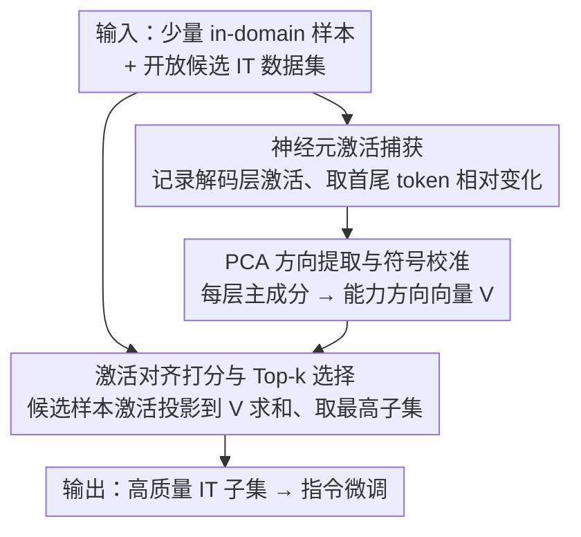

# Neuron-Aware Data Selection in Instruction Tuning for Large Language Models

**会议**: ICLR 2026  
**OpenReview**: [https://openreview.net/forum?id=uq6UWRgzMr](https://openreview.net/forum?id=uq6UWRgzMr)  
**代码**: 开源跨任务神经元特征库 + Alpaca-NAIT 数据集（论文承诺开源，链接待确认）  
**领域**: LLM 效率 / 指令微调数据选择  
**关键词**: 指令微调、数据选择、神经元激活、PCA 方向向量、能力可迁移

## 一句话总结
NAIT 提出用"神经元激活模式"来挑选指令微调数据：先用少量 in-domain 样本提取出某项能力对应的神经元激活方向向量，再按候选样本激活与该方向的对齐分数排序选 top-k，在 LLaMA-2-7b 上只用 10% 的 Alpaca-GPT4 数据就比全量微调平均提升 3.24%，而且不依赖外部大模型、成本只有 AlpaGasus 的 1/19。

## 研究背景与动机
**领域现状**：指令微调（IT）是激活大模型指令跟随与知识能力的关键步骤。已有大量工作（LIMA 用 1k 条数据就达到强效果）证明：IT 数据不是越多越好，精选一小撮高质量数据反而能显著提升性能，因此"如何从开放 IT 数据集中挑出最有效的子集"成了核心问题。

**现有痛点**：当前主流的数据选择方法各有硬伤——AlpaGasus 用 ChatGPT 打分、LLM-as-Scorer 路线既贵又黑盒、还依赖闭源 API；SelectIT、Instruction Mining 用模型输出的不确定性/困惑度，是表层特征且引入偏置；LESS 等梯度/coreset 方法计算开销巨大、在大模型上难扩展。更关键的是，这些方法都缺乏可解释性，说不清楚什么叫"高质量"，也无法定向增强某一项（或几项）目标能力。

**核心矛盾**："数据质量"本质上由模型内部对样本的反应决定，但现有方法全都在模型"外部"找代理信号（外部评分、输出不确定性、梯度近似），既看不见模型内部到底被激活了什么，又因为绕了一圈而昂贵。

**本文目标**：① 不依赖外部模型、低成本地评估 IT 数据质量；② 能定向增强指定的目标域能力；③ 选择过程本身可解释。

**切入角度**：已有可解释性研究表明，LLM 内部存在被特定任务激活的神经元子集，它们承载着模型处理知识、解决任务的机制。作者据此假设——一条样本的价值，取决于它能否激活与目标能力相关的那些神经元。

**核心 idea**：当 LLM 处理某样本时，其神经元激活模式越接近"目标能力"的激活特征，这条样本就越能提升模型在该能力上的表现；于是直接用"激活模式相似度"代替外部打分来选数据。

## 方法详解

### 整体框架
NAIT（Neuronal Activation-based efficient IT data selection）把"选数据"拆成两个模块串行：**(A) 目标能力的神经元激活特征提取** 和 **(B) 激活特征引导的数据选择**。输入是"一小批代表目标能力的 in-domain 样本 + 一个开放的候选 IT 数据集（如 Alpaca-GPT4）"，输出是一个按激活对齐度排序选出的高质量 IT 子集，拿去做指令微调。整条流水线只在被微调的那个 LLM 自己身上做前向、抽激活、做 PCA、算点积，全程不需要任何外部模型或梯度回传。

### 关键设计

**1. 神经元激活捕获：用首尾 token 的激活相对变化刻画"能力被处理"的轨迹**

要给一项能力 $C$ 建立激活特征，先用一小批 in-domain 样本 $P=\{P_i\}$ 喂给模型 $M$，记录它在各解码层 $L$ 上的激活。对某层 $l$、某 token $t_k$，激活向量是 $A(t_k)=[a_j^{(k)}]_{j=1}^{J}$（$J$ 为该层神经元数）。NAIT 不直接用绝对激活，而是取序列首尾 token 的激活差作为"动态激活漂移"：$\Delta A_i^{(l)} = A^{(l)}(t_K) - A^{(l)}(t_1)$，再对整条序列的 $K$ 个 token 取均值汇总。这样做的好处是过滤掉与具体内容无关的基线激活，留下模型在"消化这条样本、完成这项能力"过程中真正变化的那部分神经元信号——这正是把"质量"从模型外部代理信号搬回到模型内部状态的第一步。

**2. PCA 方向提取与符号校准：把一批样本的激活漂移压成一个可复用的能力方向向量**

有了一批激活差 $\Delta A^{(l)}$ 之后，NAIT 对每层做主成分分析，取第一主成分作为该层的能力方向：$v_l = \mathrm{PCA}(\Delta A^{(l)})$。但 PCA 主成分有正负号歧义，可能指向能力激活的反方向，于是再算一遍均值漂移 $\mu_{\text{diff}} = \frac{1}{|P|}\sum\big(A^{(l)}(t_K)-A^{(l)}(t_1)\big)$，若 $\mu_{\text{diff}}\cdot v_l < 0$ 就把 $v_l$ 取反，保证方向与真实激活趋势一致。逐层叠起来得到方向向量集合 $V=\{v_l\}_{l=1}^{L}$。这一步是 NAIT"可复用、可迁移"的关键——$V$ 一旦从 in-domain 样本里提出来，就是该能力的紧凑指纹，可以反复拿去给任意候选数据打分，不必每来一条新数据就重训或重查外部模型；论文也正是基于此开源了"跨任务神经元特征库"。

**3. 激活对齐打分与 Top-k 选择：用投影分数代替外部评分来排序选数据**

对候选 IT 数据集 $D_{\text{ins}}$ 里的每条样本 $y$，NAIT 把它的逐层激活投影到对应能力方向上并求和：$s_y = \sum_{l=1}^{L}\big(A^{(l)}\cdot v_l\big)$。这个分数衡量样本 $y$ 把"目标能力相关神经元"激活得有多强——分数越高，越符合"激活越对齐、样本越有效"的核心假设。最后直接取分数最高的 top-k 子集 $D_{\text{selected}}=\text{top-}k(S)$ 拿去微调。整个打分就是一次前向加一组点积，因此 NAIT 才能做到 1.32 小时、1.52 美元跑完 52k 条 Alpaca-GPT4 的筛选，比 AlpaGasus 这种调 GPT-4 打分的方法便宜近 19 倍、快 17 个小时。若想同时增强多项能力，把各能力方向各选一批再合并即可（对应主表的 System 12）。

### 损失函数 / 训练策略
NAIT 本身不引入新的训练损失，它只负责"选数据"；选出的子集照常做标准指令微调。实验主设定为 LLaMA-2-7b、选取 Alpaca-GPT4 的 10%（约 5.2k 条）做全参数微调；分析实验里把选取比例从 10% 扫到 100%，发现 top 30% 时综合表现最佳、用满 100% 反而最差。

## 实验关键数据

### 主实验
LLaMA-2-7b 上用 10% Alpaca-GPT4 数据，跨事实知识 / 数学推理 / 编码 / 多语言 / 通用推理五大类共九个基准的平均分对比（System ID 对应原文 Table 2）：

| 方法 | AVG | 相对全量微调 |
|--------|------|----------|
| Alpaca-GPT4 全量微调（基线 01） | 36.03 | — |
| AlpaGasus（ChatGPT 打分，03） | 35.18 | −2.34% |
| Q2Q（损失信号，04） | 35.68 | −0.98% |
| SelectIT（不确定性，05） | 37.16 | +3.15% |
| Random 10%（06） | 35.69 | −0.94% |
| **NAIT（GSM 特征，08）** | **37.70** | **+4.65%** |
| **NAIT（全能力特征，System 12）** | **37.20** | **+3.24%** |

只用 10% 数据，NAIT 全面超过依赖外部模型（AlpaGasus）或不确定性（SelectIT）的方法；用数学推理特征（GSM）单独引导时单项增益最大（+4.65%），甚至超过合并全部能力的 System 12。

### 跨模型与成本
不同基座上用 NAIT 选 10% 子集 vs 随机 10%（原文 Table 4）：

| 模型 | NAIT 相对全量微调 |
|------|------|
| LLaMA-2-13b | +7.02% |
| Mistral-7b | +21.92% |
| LLaMA-3-8b | +18.65% |
| Qwen-2.5-7b（强基线） | +3.83% |

成本对比（A800 80GB，52k 条 Alpaca-GPT4，原文 Table 5）：

| 方法 | 是否依赖外部 | 耗时 | 成本 |
|------|------|------|------|
| AlpaGasus | 否 | 19.07h | $178.02 |
| SelectIT | 是 | 23.20h | $26.68 |
| **NAIT** | 是 | **1.32h** | **$1.52** |

NAIT 相比 AlpaGasus 成本降 19×、相比 SelectIT 成本降 94.3% 且提速 17.58×。

### 消融实验

| 配置 | 综合 AVG | 相对 Random |
|------|---------|------|
| Random 10% | 34.04 | — |
| **High**（对齐分最高 10%） | 35.18 | **+3.35%** |
| **Low**（对齐分最低 10%） | 28.27 | **−17.54%** |

### 关键发现
- **激活对齐分数确实区分好坏数据**：取对齐分最高的 10% 比随机高 3.35%，而取最低的 10% 比随机暴跌 17.54%——说明低对齐样本不只是没用，还会主动损害模型，验证了"激活相似度即质量"的核心假设。
- **数据不是越多越好**：选取比例从 10% 增到 100%，性能先升后降，top 30% 最佳、100% 最差，印证冗余数据会损害泛化。
- **in-domain 样本即使很少也有效**：哪怕只有 16/64/256 条 in-domain 样本提取特征，多数任务仍超随机基线；GSM、TydiQA 在更大规模（4096 条）才达峰，说明 in-domain 数据质量也影响特征提取。
- **能力特征可跨域迁移**：GSM 提取的特征能同时提升 BBH、CodeX；逻辑推理类与程序类特征具有最强的通用可迁移性，而存在一个稳定的"核心子集"在不同任务特征下都被反复选中。

## 亮点与洞察
- **把"数据质量"从模型外部搬回模型内部**：用神经元激活方向向量当作能力指纹，绕开了 LLM-as-Scorer 的昂贵 API 和梯度法的高开销，一次前向 + 点积就能打分，这是它又快又便宜的根因。
- **方向向量可复用、可组合**：能力特征一旦提取就能反复用于打分，还能多能力合并（System 12），天然支持"定向增强某项能力"这个其他方法做不到的诉求。
- **PCA 符号校准是个容易忽略但必要的小细节**：主成分有正负歧义，不校准方向就会把"远离能力"误当成"靠近能力"，作者用均值漂移点积符号纠正，干净利落。
- **可迁移性发现有迁移价值**：逻辑推理/程序类数据具有最强通用迁移性这一结论，可直接指导"通用能力数据该优先选什么"。

## 局限与展望
- **依赖 in-domain 参照集**：NAIT 必须先有"能代表目标能力"的小批样本来提取方向向量，目标能力没有可用 in-domain 数据时方法无从下手；且实验显示 in-domain 数据质量会影响特征提取效果。
- **最优选取比例不固定**：Alpaca-GPT4 是 30%、Orca-GPT4 是 50%、Evol-Instruct 要到 80%，比例随数据集复杂度/信息密度变化，论文未给出自动确定比例的机制，实践中需调。
- **线性方向假设**：用单个主成分 + 线性投影刻画能力，对高度纠缠或非线性的能力表征可能不够；首尾 token 相对变化的设计在很短或结构特殊的样本上是否稳健也值得进一步验证。
- **改进思路**：可探索多主成分/非线性方向、用对齐分数自适应决定选取比例、把"核心稳定子集"显式建模为基础能力锚点。

## 相关工作与启发
- **vs AlpaGasus / InsTag（LLM-as-Scorer）**：它们调 ChatGPT/GPT-4 按复杂标准打分，贵、黑盒、依赖闭源 API 难扩展；NAIT 不依赖任何外部模型，成本降到 1/19，且打分基于模型内部激活更可解释。
- **vs SelectIT / Instruction Mining（模型特征）**：它们用输出不确定性/困惑度等表层信号，会引入偏置且仍是黑盒；NAIT 直接读内部神经元激活，更贴近"模型真正学到了什么"。
- **vs LESS（梯度 coreset）**：LESS 用梯度信号定位关键数据，在特定目标域能更强，但计算密集、且专精化会牺牲泛化、在非目标任务上掉点；NAIT 无需梯度回传，跨多语言/推理任务保持稳健迁移。
- **vs LIMA（人工精选）**：LIMA 证明 1k 条人工精选数据即可，但靠人力不可扩展且无定向性；NAIT 用激活特征自动化地实现"少而精 + 定向增强"。

## 评分
- 新颖性: ⭐⭐⭐⭐⭐ 首个基于神经元激活模式的指令数据选择框架，把数据选择与可解释性打通，是新范式。
- 实验充分度: ⭐⭐⭐⭐ 覆盖五大能力九基准、四种基座、三种 IT 数据集、成本与可迁移性分析，较全面；最优比例随数据集变化的自动化仍缺。
- 写作质量: ⭐⭐⭐⭐ 方法清晰、表格信息密度高；部分符号（如 $\Delta A$ 的下标）与图表 caption 略显跳跃。
- 价值: ⭐⭐⭐⭐⭐ 又快又便宜、不依赖外部模型、可定向增强能力，并开源特征库与 Alpaca-NAIT 数据集，实用价值高。

<!-- RELATED:START -->

## 相关论文

- [\[ICLR 2026\] CPQS-Tuning: A Model Self-Perception-Based Data Filtering Algorithm for Efficient Instruction Fine-Tuning](cpqs-tuning_a_model_self-perception-based_data_filtering_algorithm_for_efficient.md)
- [\[ICLR 2026\] Influence-Preserving Proxies for Gradient-Based Data Selection in LLM Fine-Tuning](influence-preserving_proxies_for_gradient-based_data_selection_in_llm_finetuning.md)
- [\[ICLR 2026\] Inference-Cost-Aware Dynamic Tree Construction for Efficient Inference in Large Language Models](inference-cost-aware_dynamic_tree_construction_for_efficient_inference_in_large_.md)
- [\[ICLR 2026\] Difficulty–Diversity Collaborative Filtering for Data-Efficient LLM Fine-Tuning](difficultydiversity_collaborative_filtering_for_data-efficient_llm_fine-tuning.md)
- [\[ICLR 2026\] KnowProxy: Adapting Large Language Models by Knowledge-guided Proxy](knowproxy_adapting_large_language_models_by_knowledge-guided_proxy.md)

<!-- RELATED:END -->
