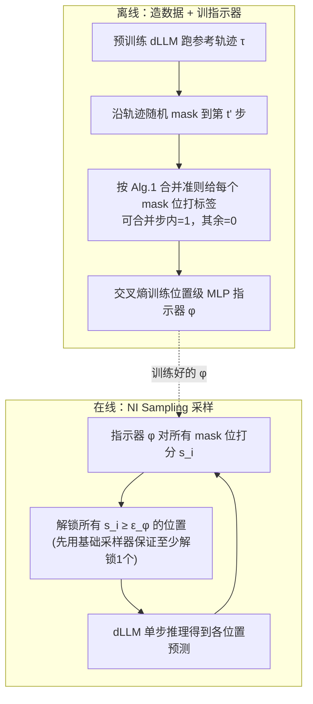

# NI Sampling: Accelerating Discrete Diffusion Sampling by Token Order Optimization

**会议**: ICLR 2026  
**OpenReview**: [https://openreview.net/forum?id=rrD1U0Izt5](https://openreview.net/forum?id=rrD1U0Izt5)  
**代码**: [https://github.com/imagination-research/NI-Sampling](https://github.com/imagination-research/NI-Sampling)  
**领域**: 大模型推理加速 / 离散扩散语言模型  
**关键词**: 离散扩散 (dLLM)、采样顺序优化、并行解码、神经指示器、轨迹保持、推理加速  

## 一句话总结
把离散扩散语言模型（dLLM）"每步只敢解锁少量 token"的保守采样改造成"每步把所有已能正确预测的 token 一次性解锁"，并用一个轻量神经网络（神经指示器）替代固定置信度阈值来做这个判断，在 LLaDA / Dream 上相比全步采样最高获得 14.3×（叠加 KV 缓存 25.0×）加速且几乎不掉点。

## 研究背景与动机

**领域现状**：离散扩散语言模型（dLLM，如 LLaDA、Dream，以及工业系统 Mercury / Gemini Diffusion）是自回归 LLM 之外的新范式。它从全 [MASK] 序列出发，通过反向去噪逐步把 mask 位置填成真实 token，天然支持任意顺序生成和单步并行解码多个 token，被寄望在效率上超越自回归模型。

**现有痛点**：理论上能并行，但实际并不快。因为同一步同时采样多个 mask 位置时，各位置的预测 $p_\theta(x_0^{i_1}|x_t)$、$p_\theta(x_0^{i_2}|x_t)$ 互相看不到对方的采样结果（彼此都还是 mask），同时落子会破坏 token 间依赖、损害质量。所以默认采样器（top-1 概率 / 概率 margin / 熵）走极端保守路线：**每步只解锁 1 个 token**，结果是序列长度 256 就要 256 步，慢得离谱。Fast-dLLM 提出的置信度阈值采样（confidence threshold sampling）算是改进——把预测概率超过阈值 $\epsilon$（通常 0.9）的位置一并解锁，能在效率和精度间权衡，但它仍然偏保守。

**核心矛盾**：作者发现真正的浪费在于——**每一步模型其实已经把一大批 token 预测对了**（它们的 top-1 token 就等于最终会生成的 token），但因为这些位置的置信度没过阈值，启发式方法没敢解锁它们，于是模型每步的预测被严重浪费，步数被白白拉长。

**本文目标**：把"采样顺序优化"作为一个独立维度正式研究，量化它的加速上限，并给出一个不依赖固定阈值、能充分利用模型每步预测的通用框架。

**核心 idea**：**[轨迹保持的合并准则]** 先证明潜力——如果每步把"按参考轨迹顺序、且当前已预测正确"的所有 token 全部解锁，可在完全不改变最终输出的前提下把步数压缩到原来的 1/24；**[神经指示器替代阈值]** 再把"该不该解锁某个位置"建模成一个轻量神经网络的二分类任务，用上述准则造监督信号离线训练一次，推理时即插即用。

## 方法详解

### 整体框架

NI Sampling 分两块：**(1) 离线分析与训练**——用预训练 dLLM 跑出参考轨迹，按"轨迹保持准则"给每个 mask 位置打 0/1 标签，训练一个位置级 MLP 指示器 $\phi$；**(2) 在线采样**——每一步 dLLM 推理后，指示器给所有剩余 mask 位置打分 $s_i$，把分数超过阈值 $\epsilon_\phi$ 的位置全部一次性解锁。指示器很小，额外开销在统计吞吐时已计入，仍换来大幅加速。

### 关键设计

**1. 轨迹保持的步合并准则：先把"加速上限"量化出来。** 采样顺序优化被形式化为对 token 位置集合 $S=\{1,\dots,N\}$ 的**有序划分** $A=(A_1,\dots,A_n)$，目标是在维持性能的前提下最小化步数 $n$。作者给出一个可证明无损的合并规则：考察轨迹第 $k$ 步，若下一步 $A_{k+1}$ 里所有位置在当前状态 $x_k$ 下就已经被预测对了——即 $\forall i\in A_{k+1},\ \arg\max_j p_\theta(x_0^i=j|x_k)=x_*^i$（$x_*^i$ 是参考轨迹在该位最终落的 token）——那么第 $k$、$k+1$ 步可以并成一步而不改变后续轨迹。这个合并可沿轨迹反复迭代直到条件不满足（Alg. 1/2）。注意这里有个微妙的"顺序约束"：某个 token 即使预测对了，但只要它在参考轨迹中的前驱 token 当前没预测对，它也不能提前解锁（见原文 Fig. 2 中 token F 的例子），这正是"轨迹保持"四个字的含义。把这套准则套到 LLaDA 的 top-1 全步轨迹上，实测能比全步快 24.3×、比置信度阈值快 3× 以上，且精度一字不差——这组数字证明了采样顺序里藏着巨大的、几乎免费的加速空间。

**2. 神经指示器：用一个轻量网络取代固定置信度阈值。** 上面的准则虽好却没法直接上线，因为推理时没有"参考轨迹"可对照。于是作者训练一个位置级指示器 $\phi$ 来近似这个判断：dLLM 推理后剩 $M$ 个 mask 位，指示器对每个位输出一个分数 $s_i$，把它当成一种"比原始概率更聪明的置信度"，解锁所有 $s_i\ge\epsilon_\phi$ 的位置（为防一个都不解锁，先用已有采样器保底解锁一个子集，再让指示器从剩余位置里挑）。关键洞察是：直接拿模型输出概率当置信度只是这个框架的特例，而指示器因为额外吃了监督信号、能编码比"裸概率向量"更丰富的信息，所以能做出更好的解锁决策。阈值 $\epsilon_\phi$ 同样提供了速度—精度的连续权衡旋钮。

**3. 沿轨迹随机 mask 的监督信号构造：让最优指示器恰好复现参考轨迹。** 训练数据这样造：用预训练 dLLM 先生成一批轨迹 $\tau_d$，训练时采一条轨迹并**沿轨迹随机回退**——随机选 $t'\in\{0,\dots,n-1\}$，把所有 $k>t'$ 步的位置重新 mask 掉，然后从这一步按 Alg. 1 的合并准则判断后续哪些步可合并：落在可合并步里的位置标 1，其余标 0，再用交叉熵训练。这种"轨迹保持式"标注的好处是**训到最优时指示器恰好能无损复现原始高质量轨迹**，只是步数大幅减少，因此训练更稳。而且造数据可用任意采样器（LLaDA 用阈值 0.8 的置信度采样高效造数据，Dream 用全步轨迹效果更好），让 NI Sampling 与所有已有采样器兼容。

**4. 指示器的输入特征与位置级 MLP 架构：把上下文塞进输入、让位置间无需交互。** 指示器每个 mask 位吃三类输入：① top-$K_1$ 概率 token 的 embedding（top-1 是将要采的结果，top-2~$K_1$ 提供语义补充信息）；② 最后一层 hidden state（携带全序列的全局上下文）；③ top-$K_2$ 个 logits（让指示器能感知 dLLM 的置信度，至少能复现已有阈值方法）。架构上刻意选**位置级 MLP**——各位置独立处理、彼此不显式交互，因为上下文信息已经通过 hidden state 注入到输入里了。不同类型特征先各过一个线性层，拼接后送入若干个"两层线性 + 激活 + 残差"的 backbone block，最后投影头出 2 维 logits 经 softmax 得到 $s_i$。参数量被刻意压小，保证额外算力可忽略。这个指示器**只训一次**就能跨任务、跨生成长度通用。

## 实验关键数据

### 主实验（LLaDA-8B-Instruct / LLaDA-1.5，vs 全步与置信度阈值采样）

| 数据集 | 方法 | LLaDA-8B Acc | Steps | Token/s | LLaDA-1.5 Acc | Steps | Token/s |
|---|---|---|---|---|---|---|---|
| GSM8K-512 | Full | 74.83 | 512 | 14.4 | 80.67 | 512 | 15.0 |
| | Threshold | 75.28 | 73.29 | 104.4 (7.2×) | 80.89 | 72.38 | 105.6 (7.0×) |
| | **NI Sampling** | **76.57** | **51.08** | **147.0 (10.2×)** | **81.20** | **53.56** | **140.6 (9.4×)** |
| HumanEval-512 | Full | 35.37 | 512 | 31.5 | 40.85 | 512 | 32.1 |
| | Threshold | 35.37 | 158.6 | 100.8 (3.2×) | 39.02 | 158.4 | 101.1 (3.1×) |
| | **NI Sampling** | **35.98** | **69.54** | **219.3 (7.0×)** | **39.63** | **105.3** | **144.2 (4.5×)** |
| MBPP-512 | Full | 36.80 | 512 | 19.1 | 37.80 | 512 | 18.7 |
| | Threshold | 37.60 | 38.75 | 250.2 (13.1×) | 38.60 | 44.38 | 215.8 (11.5×) |
| | **NI Sampling** | **38.00** | **35.25** | **263.9 (13.8×)** | **38.80** | **34.62** | **268.0 (14.3×)** |

相比全步采样最高约 15× 加速、几乎不掉点（部分数据集还略升，疑似评测方差）；相比置信度阈值采样吞吐最高再快 2.2×（219.3 vs 100.8 token/s），且性能—步数权衡曲线在所有设置下 Pareto 占优。

### 叠加缓存与跨模型泛化

| 数据集 | 方法 | Acc | Step | Token/s |
|---|---|---|---|---|
| GSM8K-512 | NI Sampling | 75.44 | 44.85 | 197.7 (13.7×) |
| | **NI Sampling+Dual Cache** | 73.84 | 50.76 | **360.6 (25.0×)** |
| GSM8K-256 (Dream-7B-Base) | Full | 75.05 | 256 | 23.0 |
| | Threshold | 72.78 | 161.95 | 36.4 (1.6×) |
| | **NI Sampling** | **74.45** | **108.26** | **52.1 (2.3×)** |

叠加 Fast-dLLM 的 Dual Cache 后最高 25.0× 加速；在从自回归 LLM 微调而来的 Dream-7B-Base 上同样稳定超过置信度阈值采样，证明框架不挑底座。

### 关键发现
- **潜力分析**：理想的"轨迹保持顺序"在 LLaDA 上能达 11.4×~24.3× 加速且精度完全不变，揭示采样顺序里有 order-of-magnitude 级别的免费加速空间。
- **训练分布匹配**：在 GSM8K+MATH 训出的指示器在数学测试集更好但代码集更差；用 ShareGPT 训出的通用指示器更均衡——可按目标域定制训练分布换取该域更优性能。
- **通用性**：一个指示器训一次即可跨任务、跨生成长度（128/256/512）使用。

## 亮点与洞察
- **把"采样顺序"独立成一个优化维度**，并先用可证明无损的合并准则量化出上限（最高 24×），再去逼近它——先证明"值得做"再"动手做"，论证链条干净。
- **指示器是已有方法的超集**：直接用概率当置信度只是它的特例，因此理论下界就是现有阈值方法，几乎稳赚不赔。
- **位置级 MLP + 离线训一次**的工程取舍漂亮：把上下文塞进输入特征，换来各位置可并行、额外开销可忽略、跨任务复用。
- 与 KV/Dual Cache **正交可叠加**，落地友好，25× 是实打实的端到端吞吐。

## 局限与展望
- 指示器需要先用 dLLM 离线生成 20 万条轨迹来训练，有一次性的数据/训练成本；换底座模型或大幅改生成分布时可能要重训。
- 轨迹保持准则为了"严格不改输出"牺牲了部分潜力——附录里更激进的策略可达 36.8×，说明在线方法离上限还有差距。
- 实验集中在数学/代码推理类基准（GSM8K/MATH/HumanEval/MBPP），开放式长文本生成、多样性采样（非贪心）下的表现还需进一步验证。
- 指示器架构（位置级 MLP）刻意简单，引入位置间交互或更强的特征（如注意力）是否能进一步逼近上限值得探索。

## 相关工作与启发
- **离散扩散语言模型**：LLaDA、Dream、Mercury、Gemini Diffusion 等，提供任意顺序 + 并行解码的底座。
- **dLLM 采样策略**：top-1 概率 / 概率 margin / 熵等保守单步策略，以及 Fast-dLLM 的置信度阈值采样与 Dual Cache——本文正是这条线的延续与超越。
- **启发**：把"什么时候解锁"从手工阈值升级成"可学习的决策器"，是一个可迁移的范式——任何"靠固定阈值做并行/早停判断"的场景（投机解码的接受准则、early-exit、token 剪枝）都可以考虑用类似的轻量指示器 + 轨迹/行为保持监督来替换。

## 评分
- **新颖性**: ⭐⭐⭐⭐ 把采样顺序正式建模为有序划分优化，并用"先证上限再学指示器"的思路落地，视角新颖、动机扎实；指示器替代阈值的想法直接而有效。
- **实验充分度**: ⭐⭐⭐⭐ 覆盖 3 个底座（含自回归微调的 Dream）、4 个基准、3 种生成长度，含权衡曲线、缓存叠加、训练分布消融，证据链完整；非贪心采样与开放式生成验证略缺。
- **写作质量**: ⭐⭐⭐⭐ 逻辑清晰，Sec.3 量化潜力 → Sec.4 给方法的结构很有说服力，图例（轨迹保持的标注规则）讲得透。
- **价值**: ⭐⭐⭐⭐ dLLM 推理加速是当前热点痛点，14.3×~25× 的端到端加速且即插即用、与缓存正交，工程落地价值高。

<!-- RELATED:START -->

## 相关论文

- [\[ICLR 2026\] Parallel Sampling from Masked Diffusion Models via Conditional Independence Testing](parallel_sampling_from_masked_diffusion_models_via_conditional_independence_test.md)
- [\[ICLR 2026\] Global Resolution: Optimal Multi-Draft Speculative Sampling via Convex Optimization](global_resolution_optimal_multi-draft_speculative_sampling_via_convex_optimizati.md)
- [\[ICLR 2026\] Cactus: Accelerating Auto-Regressive Decoding with Constrained Acceptance Speculative Sampling](cactus_accelerating_auto-regressive_decoding_with_constrained_acceptance_specula.md)
- [\[ICLR 2026\] vAttention: Verified Sparse Attention via Sampling](vattention_verified_sparse_attention_via_sampling.md)
- [\[ICLR 2026\] Learning to Parallel: Accelerating Diffusion Large Language Models via Learnable Parallel Decoding](learning_to_parallel_accelerating_diffusion_large_language_models_via_learnable_.md)

<!-- RELATED:END -->
