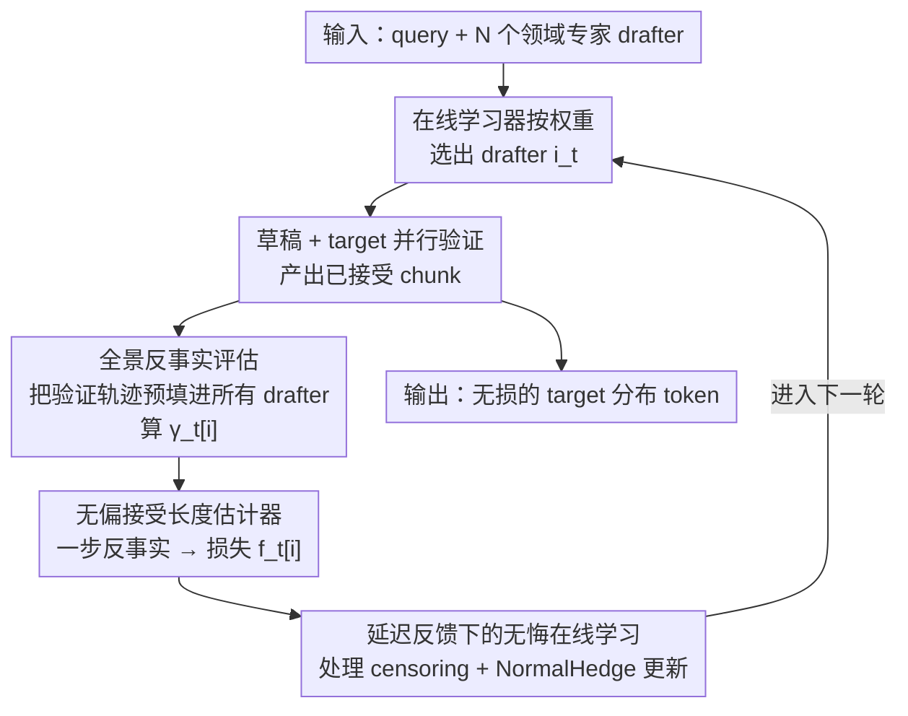

# Not-a-Bandit: Provably No-Regret Drafter Selection in Speculative Decoding for LLMs

**会议**: ICLR 2026  
**代码**: 有（论文提供链接，"Code available here"）  
**领域**: LLM效率 / 投机解码 / 在线学习  
**关键词**: 投机解码, 草稿模型选择, 全信息在线学习, 无悔算法, 接受长度

## 一句话总结
针对"多个领域专家草稿模型如何为每条 query 动态选最优"的问题，本文指出投机解码里**探索是多余的**——一条被 target 验证过的轨迹就能反事实地评估所有草稿模型，于是把原本的 multi-armed bandit 问题变成全信息在线学习问题，提出 HedgeSpec，在 N 个草稿模型上做到无悔（no-regret），相比 EAGLE3 最高提速 83.7%、相比 bandit 基线最高提升 49% MAT。

## 研究背景与动机
**领域现状**：投机解码（speculative decoding）用一个小的草稿模型（drafter）预测大 target 模型会生成的 token，再由 target 并行验证，猜对就用一次昂贵的 target 前向产出多个 token，从而降低逐 token 延迟。EAGLE-3 是目前最常用的实现。

**现有痛点**：单个草稿模型在某些任务上很强、换个任务就崩。检索式 drafter 在输出贴近输入时好用，离开就失效；领域专家 drafter（代码、科学写作、摘要）在自己领域里出色、出了领域反而比通用 EAGLE 还差。论文 Table 1 给的数据很直白：7 个领域专家 drafter 在对角线（in-domain）上 MAT 高达 7–8.5，但平均 MAT 只有 3.2–4.5，**普遍低于通用 EAGLE 的 5.69**。一旦把它们丢进真实的混合 query 流，就会出现服务质量不稳、长尾延迟。

**核心矛盾**：给定一池草稿模型，怎么为每条进来的 query 动态选出"事后看最优"的那个？MetaSD 和后来的 BanditSpec 把它建模成 multi-armed bandit，要在探索（试不同 drafter）和利用（用经验最优 drafter）之间权衡。但 bandit 每轮只能观察到**被选中那个 drafter** 的反馈，候选越多探索代价越大、收敛越慢，regret 随 drafter 数 N 线性增长。

**本文目标**：设计一个 drafter 选择算法，使其在每条 query 上的表现都逼近"事后最优 drafter"，且开销可控、对任意投机解码方法（单草稿 / 多草稿 / draft-tree）通用。

**切入角度**：作者做了一个"令人意外"的观察——**探索根本没必要**。投机解码本身是无损的（lossless），意味着 target 一定会给出一条真实验证轨迹；只要把这条轨迹喂给其它没被选中的 drafter，就能反事实地算出"它们当时会有多好"，而且**不需要额外查询昂贵的 target 模型**。

**核心 idea**：把 drafter 选择从 **bandit-feedback** 升级成 **full-information feedback**——用一条验证轨迹同时评估全部 N 个 drafter，再套用 Hedge / NormalHedge 这类全信息无悔算法，使收敛速度对 N 从线性改善到对数级。

## 方法详解

### 整体框架
HedgeSpec 在标准投机解码的"草稿 → 验证"两步之间，插入一个轻量的**评估阶段（evaluation phase）**，把单轨迹信息扩散成对所有 drafter 的全景反馈，再交给在线学习器决定下一轮用谁。整条管线是一个自循环：在线学习器按当前权重选出 drafter $i_t$ → 用它生成 $K$ 个草稿 token → target 并行验证、产出被接受的 chunk → 把这段已验证 token 预填（prefill）进其余所有 drafter，反事实地算出每个 drafter 的接受概率 $\gamma_t[i]$ → 由此构造无偏的接受长度估计、转成损失 $f_t[i]$ → 在延迟反馈下更新 NormalHedge 权重 → 进入下一轮。

关键在于：根据投机解码的无损性（Theorem 1/2），换不同 drafter 只改变生成速度、**不改变输出 token 的分布**，所以这套"反事实评估 + 自适应换 drafter"是采样无损的；而评估只需对轻量 drafter 做前向（EAGLE drafter 是单层 transformer，开销约为 target 的 1/25），且各 drafter 评估相互独立、可并行。

### 关键设计

**1. 全景反事实评估：HedgeSpec 不是 bandit**

这一步直接打掉 bandit 的根本瓶颈——只看被选中 drafter 的反馈。痛点是：要评估一个没被选中的 drafter，最朴素的做法是拿它去对着 target 真跑一遍，N 个 drafter 就是 N 倍 target 开销，完全不可行。作者的关键洞察是：**一条被 target 验证过的轨迹本身就是评估所有 drafter 的反事实证据**。当用 $q_{i_t}$ 生成的 chunk $x_{t+1:t+k}$ 被验证后，把这段 token 预填进其余每个 $q_i$，就能算出每个 drafter 在这条轨迹上的接受概率向量 $\gamma_t[i] := P_i[x_t \text{ accepted} \mid x_{\le t-1}]$。不同投机解码方法接受概率算法不同：标准单草稿下 $\gamma_{j,i} = 1 - \mathrm{TV}[p(\cdot\mid x_{\le t+j-1}), q_i(\cdot\mid x_{\le t+j-1})]$（由 Theorem 1）；EAGLE 贪心 draft-tree 下 $\gamma_{j,i}$ 是父节点在用 $q_i$ 构造/剪枝出的草稿树上所有子节点的总概率（Theorem 2）。这把问题从 bandit 设定彻底转成全信息在线学习——而全信息算法的 regret 对 N 只是 $\log N$ 级，相比 bandit 的多项式依赖是指数级改善。

**2. 无偏接受长度估计器：一条轨迹反推任意 drafter 的期望接受长度**

光有接受概率还不够，端到端效率由**接受长度**决定，而接受长度是个随机变量——即便固定前缀，$M_{q,p}$ 通常带采样。直接算 $\mathbb{E}[\text{\# accepted} \mid x_{\le t}]$ 需要枚举 target 所有（组合爆炸的）可能 rollout，不可行。Theorem 3 给出一个"一步反事实"估计器，只用一条真实轨迹就能无偏地还原任意 drafter 的期望接受长度：

$$\widehat{\mathrm{AcceptLength}}_{t,K}[M] = \sum_{k=1}^{K+1} k\,(1-\gamma_k)\prod_{j=1}^{k-1}\gamma_j,\qquad \mathbb{E}_M\!\left[\widehat{\mathrm{AcceptLength}}_{t,K}[M]\mid x_{\le t}\right] = \mathbb{E}_M[\text{\# accepted}\mid x_{\le t}].$$

这里 $\gamma_k$ 不是"接受某个具体 realized token $x_{t+k}$"的概率，而是"在 level $k$ 接受任意 $\tilde{x}_{t+k}\sim p(\cdot)$"的总概率，这正是它非平凡之处。估计器的取值被限制在 $[1, K+1]$，由 Popoviciu 不等式方差被 $K^2/4$ 控住；相比之下 BanditSpec（EXP3-Spec）的估计器方差是 $O(NK^2)$，**随 drafter 数 N 增长**——这解释了为什么 HedgeSpec 在大 drafter 池里依然稳。作者也点出它与强化学习里 Experience Replay 形似，但因为没有 off-policy 的分布漂移问题，这种"经验回放"比 RL 里有效得多。

**3. 延迟反馈下的无悔在线学习：处理 censoring 难题**

把上面的损失塞进标准在线学习游戏会立刻撞墙：接受的 token 不是在第 $t$ 步立刻可见，而是要等整个 chunk 完成才成块揭示；更麻烦的是 **censoring（删失）问题**——除非被选中的 drafter 把接受长度顶满，否则没有足够信息算出估计器，因为别的 drafter 本可能接受更多 token。若简单地用截断后的损失硬算，学习器会卡在次优解。作者把它建模成"延迟反馈（delayed feedback）"：损失函数取

$$f_t[i] = 1 - \frac{1}{K+1}\sum_{k=1}^{K+1} k\,(1-\gamma_{t+k-1}[i])\prod_{j=1}^{k-1}\gamma_{t+j-1}[i],$$

其期望衡量第 $i$ 个 drafter 距最大 chunk 长 $K+1$ 还有多少接受长度可挖（若优化接受概率则取 $f_t[i] = 1-\gamma_t[i]$）。通过对延迟反馈的黑盒规约（Joulani et al. 2013），在最大延迟为 $2K$ 的前提下，把无延迟的 Hedge/NormalHedge regret bound 平移过来，得到 Theorem 4 的无悔保证：优化接受概率时平均接受率与事后最优 drafter 的差距是 $O(\sqrt{K\log N / T})$，优化接受长度时是 $O(\sqrt{(K+1)^3\log N / T})$。两者对 N 都只有 $\log N$ 依赖，这正是"全信息"相对 bandit 的本质优势。实践中因为问题不是真对抗、而是 target LLM 诱导的马尔可夫过程，作者改用 Joulani 的"随机设定"算法（维护反馈队列、不断应用下一个可用动作）效果最佳。

**4. 系统高效实现：让评估开销小到可以忽略**

无悔保证是理论，落地还要算清评估这笔账划不划算。Table 2 的开销拆解给了答案：一次 Llama target 前向 75.7 ms，一次 EAGLE drafter 前向仅 2.5 ms（约 target 的 1/25），NormalHedge 权重更新只要 0.41 ms。也就是说，在理想假设下，只要 HedgeSpec 多换来 1 个 MAT，这点收益就足以抵消串行评估多达 25 个 drafter 的成本；而实际中各 drafter 评估相互独立、可并行，开销更小。作者还据此 curate 了 21 个 drafter（每个 target 模型配 7 个领域专家，用 SpecForge 在 Python/Math/Biology/Chemistry/MedicalQA/CNN-DM/SQL 上微调 EAGLE-3 得到），证明"一池专家 + HedgeSpec 编排"能稳定超过单个强通用 EAGLE-3。

### 一个例子：混合 query 流上的自适应换挡
设草稿深度 $K=5$，drafter 池含 Math、Coding 等 7 个专家。进来一条 Math query：在线学习器初始权重均匀，先随便选了 Coding drafter 生成 5 个草稿，target 验证后只接受了 2 个 token（chunk 短）。HedgeSpec 把这 2 个已验证 token 预填进其余 6 个 drafter，反事实算出 Math drafter 在这段轨迹上的 $\widehat{\mathrm{AcceptLength}}$ 明显更高（比如 4.21 vs Coding 的 2.63）。损失 $f_t[\text{Math}]$ 因此更低，NormalHedge 把权重迅速压向 Math drafter。由于是全信息——一次就更新了全部 7 个 drafter 的权重，而非只更新被选中的那个——它在很少几步内就收敛到接近零的平均 regret（Figure 5a），而 bandit 还在到处探索浪费在弱 drafter 上。

## 实验关键数据

### 主实验
target 用 Llama-3.1-8B-IT / Qwen-3-8B / Qwen-3-32B，drafter 均用 EAGLE-3 实现，对比 BanditSpec（Exp3Spec / UCBSpec）与原生 EAGLE，指标为 MAT（平均接受 token 数）与 Token/s。

| Target | 方法 | Avg MAT | Avg Token/s |
|--------|------|---------|-------------|
| Llama-3.1-8B-IT | EAGLE | 5.69 | 74.34 |
| Llama-3.1-8B-IT | UCBSpec | 5.09 | 68.89 |
| Llama-3.1-8B-IT | EXP3Spec | 4.86 | 65.22 |
| Llama-3.1-8B-IT | **HedgeSpec** | **7.15** | **90.41** |
| Qwen-3-8B | EAGLE | 4.23 | 47.53 |
| Qwen-3-8B | **HedgeSpec** | **6.37** | **69.44** |
| Qwen-3-32B | EAGLE | 2.88 | 20.76 |
| Qwen-3-32B | **HedgeSpec** | **6.21** | **40.41** |

- 单领域最高提速：Qwen 上 SQL 请求 MAT 从 4.2 → 7.52（+79%）、Token/s 从 44.6 → 81.94（+83.7%）。
- 混合 query 平均提升 46.1%（vs EAGLE）；相比 bandit 最高 +49% MAT、+41% Token/s。
- GSM8K / HumanEval 等训练分布外数据集趋势一致。

### 消融 / 分析实验

| 分析 | 关键结果 | 说明 |
|------|---------|------|
| 累积 regret（Fig 5a） | HedgeSpec 几步内收敛到近零 regret | bandit 因部分反馈适应慢、regret 快速累积 |
| 随 drafter 数扩展（Fig 5b） | HedgeSpec 几乎不受影响、可扩展 | bandit 随池增大急剧退化（探索代价高） |
| 评估开销（Table 2） | drafter 前向 2.5 ms vs target 75.7 ms | 多 1 个 MAT 可抵 25 个 drafter 串行评估 |
| vs 离线 Router（Table 4） | OOD 下 Router 误路由 98% MedQA / 90% Math | BERT 分类器闭世界 100% 准，但一个自然 prompt 变体就崩 |

### 关键发现
- **全信息是收益主因**：HedgeSpec 优势来自全景反馈——所有 drafter 都被评估，收敛更快、接受率更高、target 调用更少；bandit 只看被选 drafter，常收敛到次优。
- **长推理链放大优势**：Qwen-3 推理模型输出更长（Math 任务约 1.64× 长度），给在线学习器更多收敛时间，HedgeSpec 在长生成场景增益最明显——bandit 在 Llama 上甚至打不过原生 EAGLE，但在 Qwen 上能反超。
- **离线 Router 不抗分布漂移**：闭世界下 BERT 分类器能 100% 准确路由，但仅靠一句"请生成两个答案再择优"的自然 prompt 变体就让它误路由 98% 的 MedQA、90% 的 Math；HedgeSpec 靠运行时反馈自适应，对 OOD 鲁棒。

## 亮点与洞察
- **"探索是多余的"这一观察本身就是亮点**：投机解码无损 ⇒ target 一定给出真实轨迹 ⇒ 该轨迹是评估所有 drafter 的反事实证据，于是 bandit 退化成全信息问题。把这层结构看穿，是全文最"啊哈"的地方。
- **零额外 target 调用**：评估全部 drafter 不碰昂贵的 target，只需轻量 drafter 前向，且可并行——把"评估所有臂"这件 bandit 里最贵的事做成几乎免费。
- **一步反事实估计器可迁移**：Theorem 3 用单条轨迹无偏还原期望接受长度的思路，方差与 N 无关，本质是一种结构化的 off-policy 评估，可启发其它"验证即反馈"的级联推理系统（如多级 drafter、模型路由）。
- **方法与采样创新正交**：HedgeSpec 不发明新的投机采样或 drafter，而是套在任意投机解码方法之上做选择，工程上即插即用。

## 局限与展望
- 收益高度依赖**drafter 池的多样性**：必须事先 curate 出一批领域专家 drafter（本文用 SpecForge 微调 21 个），若池内 drafter 同质化，全信息选择的上限就被压低。
- 理论保证建立在延迟最大为 $2K$、问题近似 iid（实则马尔可夫）的假设上，作者承认随机设定算法只是"启发式"地用在非严格 iid 场景。
- 评估开销虽小但非零，drafter 池极大或 batch size 增大时（本文 batch=1、FP16）评估的并行成本与显存占用仍需进一步验证。
- 长尾 / 极端 OOD query 上，虽比离线 Router 鲁棒，但收敛初期仍可能选到弱 drafter，付出几轮短 chunk 的代价。

## 相关工作与启发
- **vs BanditSpec（Exp3Spec / UCBSpec）**：两者都在 drafter 选择问题上做 bandit，只观察被选 drafter 的反馈、需平衡探索与利用，regret 与方差随 N 增长；本文证明全信息可行，把估计器方差从 $O(NK^2)$ 降到 $\le K^2/4$，收敛对 N 从多项式改善到 $\log N$。
- **vs MetaSD**：最早提出在线 drafter 选择并建模为 multi-armed bandit；本文沿用问题设定但颠覆其"必须探索"的前提。
- **vs EAGLE-3**：EAGLE-3 是强通用 drafter（generalist）；本文用一池领域专家（specialists）+ HedgeSpec 编排，平均超过单个 EAGLE-3，且与 EAGLE 的采样/draft-tree 创新正交、可叠加。
- **vs 离线 Router（BERT 分类器）**：Router 在闭世界假设下能 100% 准确路由，但假设运行时 query 不漂移；HedgeSpec 用运行时反馈在线适应，OOD 下显著更鲁棒。

## 评分
- 新颖性: ⭐⭐⭐⭐⭐ "探索多余、bandit 可降为全信息"是真正反直觉且被理论坐实的洞察
- 实验充分度: ⭐⭐⭐⭐ 3 个 target、21 个 drafter、7+2 数据集、regret/扩展性/开销/OOD 多角度，但 batch>1 等部署场景留待附录
- 写作质量: ⭐⭐⭐⭐ 动机清晰、理论与系统两条线交代到位，符号略密
- 价值: ⭐⭐⭐⭐⭐ 即插即用、与采样创新正交，对多专家 drafter 服务系统有直接落地价值

<!-- RELATED:START -->

## 相关论文

- [\[ACL 2026\] Multi-Drafter Speculative Decoding with Alignment Feedback](../../ACL2026/llm_efficiency/multi-drafter_speculative_decoding_with_alignment_feedback.md)
- [\[ICLR 2026\] SpecBranch: Speculative Decoding via Hybrid Drafting and Rollback-Aware Branch Parallelism](specbranch_speculative_decoding_via_hybrid_drafting_and_rollback-aware_branch_pa.md)
- [\[ICLR 2026\] Training-Free Loosely Speculative Decoding: Accepting Semantically Correct Drafts Beyond Exact Match](training-free_loosely_speculative_decoding_accepting_semantically_correct_drafts.md)
- [\[ICLR 2026\] Self-Speculative Decoding Accelerates Lossless Inference in Any-Order and Any-Subset Autoregressive Models](self-speculative_decoding_accelerates_lossless_inference_in_any-order_and_any-su.md)
- [\[ICLR 2026\] Let's (not) just put things in Context: Test-time Training for Long-context LLMs](lets_not_just_put_things_in_context_test-time_training_for_long-context_llms.md)

<!-- RELATED:END -->
