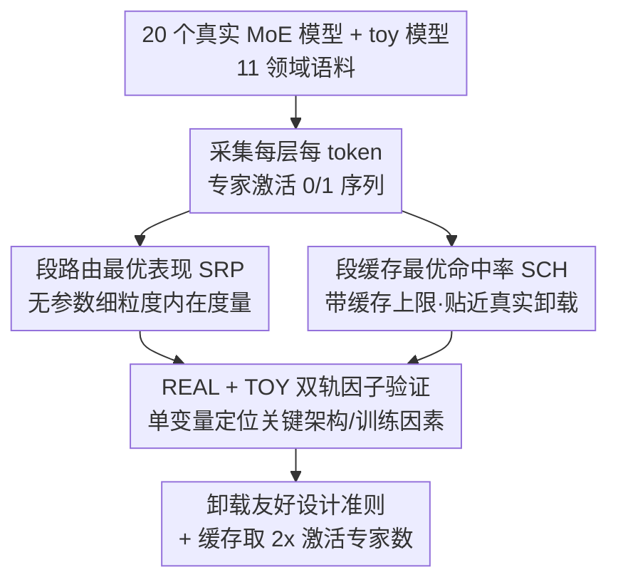

# Not All Models Suit Expert Offloading: On Local Routing Consistency of Mixture-of-Expert Models

**会议**: ICLR 2026  
**OpenReview**: [https://openreview.net/forum?id=2XMAUP74ig](https://openreview.net/forum?id=2XMAUP74ig)  
**代码**: https://github.com/ljcleo/moe-lrc  
**领域**: LLM效率  
**关键词**: 混合专家, 专家卸载, 路由一致性, 缓存命中率, 边端部署

## 一句话总结
本文提出 SRP 和 SCH 两个指标来量化 MoE 模型的「局部路由一致性」（连续 token 是否倾向激活同一批专家），在 20 个真实 MoE LLM + 一系列受控 toy 模型上系统分析，揭示了局部负载均衡 vs 路由一致性的权衡、共享专家会损害一致性、域专精专家最有利于一致性等规律，并给出「缓存大小取激活专家数 2 倍最划算」的部署结论。

## 研究背景与动机

**领域现状**：MoE 用稀疏激活把 LLM 参数规模做大而推理开销不变，但朴素实现要求所有专家常驻显存，手机等内存受限设备扛不住。于是有了「专家卸载」（expert offloading）：把一部分专家缓存在快内存（GPU），其余放慢内存（CPU/磁盘），解码时若 token 激活了未缓存的专家，要么在 CPU 上算、要么按 LRU 之类规则换入换出。

**现有痛点**：在长上下文、话题频繁切换的场景下，频繁的 CPU offload / 按需加载会严重拖慢推理。已有工作发现并利用了「专家激活的局部性」——连续 token 倾向激活相似的专家，从而减少换入换出。但这个局部性到底有多强、不同模型差多少，几乎没人系统量化过。

**核心矛盾**：并非所有 MoE 模型都均匀地具备这种连续路由特性，强弱因模型而异（论文 Figure 1 里 GRIN-MoE 的路由图很「干净」、SRP=65，Jamba-Mini 同规模同专家数却乱成一团、SRP=38）。如果不知道一个模型的路由一致性高低，就盲目上专家卸载，可能完全不划算——这正是「不是所有模型都适合专家卸载」的由来。

**本文目标**：(1) 定义一个可度量的属性来刻画这种连续路由倾向；(2) 在大量真实模型上测出它的分布；(3) 找出是什么架构/训练因素决定了它的高低，从而反过来指导「对卸载友好」的 MoE 设计。

**切入角度**：把「一段连续 token 内专家激活是否一致」形式化成一个可计算、且尽量与具体缓存算法无关的内在指标。作者用「一个只能按段（segment）做决策的简化路由器 / 缓存器去逼近原始逐 token 路由器，能逼近到多好」来反映一致性——逼近得越好，说明段内路由越一致。

**核心 idea**：用「段级最优逼近能力」量化局部路由一致性，给出无参数细粒度的 SRP 和贴近真实卸载的 SCH 两把尺子，再用真实模型 + 受控 toy 模型双轨验证决定一致性的关键因素。

## 方法详解

### 整体框架

本文不是提一个新模型，而是提一套「测量 + 归因」的分析框架。整体流程是：给定一批 MoE 模型和覆盖 11 个领域的语料，先采集每个 MoE 层、每个 token 的路由决策（哪些专家被激活）；然后用两个互补的指标把这些 0/1 激活序列压成可比较的一致性分数——SRP 做无参数的细粒度内在度量，SCH 在真实缓存大小约束下度量命中率；最后用「真实模型（REAL，异质但贴近实际）+ 受控 toy 模型（TOY，单变量改架构/训练超参）」双轨去验证哪些因素真正驱动了一致性，导出对专家卸载友好的设计与部署建议。

### 关键设计

**1. SRP：用段级路由器的最优逼近 F1 度量内在一致性**

针对「需要一个不依赖具体缓存算法、能细到单个专家的一致性度量」这个痛点。先看单个专家：它在一条序列上的激活就是一串 0/1，定义一个「段估计器」——段长为 $m$，在位置 $i$ 处对 $i$ 到 $i+m-1$ 这一段统一预测同一个结果（全激活或全不激活）。SRP 就定义为这种段估计器能达到的最优 F1。选 F1 而不是召回率/命中率，是因为漏掉主要激活比误激活次要专家更糟，而召回率没有「激活频率上限」会被刷高。关键结论是：F1 在「对所有激活次数超过某阈值的段都预测激活」时取到最优，因此 SRP 只取决于专家本身和段长 $m$，与任何具体路由方法无关，是专家的内在属性。

推广到一组专家（同层或全模型）时，token-choice 路由下专家不是独立激活的，于是改用一个「段路由器」按段决定该激活哪些专家，SRP 定义为段路由器与原始路由器决策之间 F1 的上界。为防止段路由器靠多激活专家来刷 F1，再引入段路由规模比 $\hat{\rho}$（段路由器平均激活专家数 / 原始路由器激活数）作为辅助指标：$\hat{\rho}$ 越小，说明不用多选专家就能覆盖真实需求，一致性越高。SRP 越高、$\hat{\rho}$ 越低，模型越适合段级路由/缓存。

**2. SCH：在真实缓存上限下度量 oracle 缓存的命中率**

SRP 的优点是无参数、可分析单个专家，但它有两个与真实卸载脱节的地方：真实系统有硬性缓存上限，全局最优 F1 未必可达；而且谈缓存性能时命中率（recall）比 F1 更直观。于是设计 SCH。定义缓存比 $\rho$ = 缓存大小 / 激活专家数；这个段缓存像真实卸载系统一样，对每个 token 把需要但不在缓存里的专家换入、同时换出等量未用专家，区别在于它换出的是「未来 $m$ 个 token 内被激活次数最少」的专家。SCH 即这种段缓存的命中率。

之所以 SCH 比理论最优更可落地：任何缓存命中率的上界由 clairvoyant（先知）替换算法给出，它换出「下一次激活最晚」的专家；而 SCH 依赖的 oracle 信息是「未来激活频率」，比「下一次激活的精确时刻」更容易学习和预测，因此真实缓存算法更可能逼近 SCH。SCH 与 SRP 段级行为同源，因此能在「无参数内在度量 SRP」和「真实卸载系统效率」之间架桥，论文实验也验证了 SCH 与 LRU/LFU 命中率高度相关。

**3. REAL + TOY 双轨：用受控单变量实验把「相关」做成「因果」**

针对「20 个真实模型架构高度异质，单看相关性无法判断到底是哪个因素在起作用」这个痛点。REAL 轨覆盖 3B~57B、20 个不同架构的真实 MoE LLM（SwitchTransformer、Mixtral、DeepSeek-V2、Qwen3 等），用来测出一致性的真实分布并按 SRP 粗分成 4 组。但真实模型每个都改了一堆东西，无法归因，于是再造 TOY 轨：从头预训练一系列 OLMoE-like 小模型（1.43B，缩小深度/宽度），保持总参数量不变，每个模型只单独改一个关键变量——专家粒度、共享专家数、负载均衡损失系数、激活专家数、稠密层穿插方式等。通过对比 TOY 模型的 SRP 变化，就能把「负载均衡」「共享专家」「专家组合空间」等因素从混杂中拆出来逐一验证，这是本文敢下「shared experts 损害一致性」这类因果结论的方法论基础。

### 一个完整示例

以 SCH 的具体计算为例（对应论文 Figure 3）：设一段路由序列采用「8 选 2」激活（每个 token 激活 2 个专家），缓存比 $\rho=2$（缓存可放 4 个专家），段长 $m=4$。逐个 token 处理：若当前 token 需要的专家已在缓存里则命中；若不在，则换入它、并换出「未来 4 个 token 内激活次数最少」的那个已缓存专家。把整段所有 token 的命中数除以总需求数，例子中得到 $13/18 \approx 0.722$，即该段的 SCH。对照来看，SRP 度量的是「一个段路由器最好能在多大程度上复现原始逐 token 路由」（例子里某组专家算出 SRP = F1 ≈ 0.7143），两者一个看缓存命中、一个看路由逼近，但都建立在「段内行为是否一致」这同一个直觉上。

## 实验关键数据

### 主实验

20 个真实模型按 $m=16$ 时的 SRP 粗分为 4 组，组别差异随段长增大而显著拉开（$m=4$ 时大家差不多，$m\ge16$ 后分层明显且相对次序稳定）：

| 组别 | 代表模型 | SRP ($m=16$) | $\hat{\rho}$ | 解读 |
|------|----------|--------------|--------------|------|
| Group 1 | LLaMA-MoE-v2 / OLMoE | > 0.5（LLaMA-MoE-v2 达 78.16） | ~1.25 | 长程一致性最强，最适合卸载 |
| Group 2 | Mixtral-8x7B / LLaMA-MoE-v1 | ~0.48 | ~2.5（长程偏高） | 次强，但要更多缓存 |
| Group 3 | XVERSE-MoE / DeepSeekMoE | ~0.36 | ~2.0 | 明显偏低 |
| Group 4 | NLLB-MoE / SwitchTransformers | < 0.31（SwitchTF 仅 ~19） | 短程已偏高 | 最差，几乎无段级一致性 |

SCH 实验（Figure 8）进一步印证：只有 Group 1 模型的 SCH 随缓存比 $\rho$ 快速上升、并在 $\rho\approx2$ 出现拐点，之后与 Group 2 趋同；Group 3/4 的 SCH 随 $\rho$ 近似线性缓慢增长。这正是「缓存取激活专家数 2 倍最划算」的依据。

### 消融实验

TOY 模型单变量对照（$m=16$，SRP 与负载均衡 LB 以专家激活频率标准差衡量，SD 越大越不均衡）：

| 配置 | SRP | LB(SD) | 说明 |
|------|-----|--------|------|
| Baseline | 43.56 | 4.02 | 基准 |
| NoLB（去负载均衡损失） | 56.42 | 13.21 | 一致性大涨但极不均衡 |
| OverLB（强化负载均衡） | 36.42 | 1.79 | 均衡了但一致性最低 |
| ActMore（激活更多专家，<半数） | 55.69 | 6.54 | 组合空间变大→一致性升 |
| ActFewer（激活更少专家） | 27.13 | 1.14 | 组合空间变小→一致性骤降 |
| 1ShrExp / 2ShrExp（加共享专家） | 41.38 / 38.79 | 3.43 / 3.06 | 共享专家越多 SRP 越低 |
| FewerExp（专家总数变少） | 41.62 | 3.63 | 组合空间变小→略降 |

### 关键发现

- **局部负载均衡与路由一致性强烈权衡**：高 SRP 几乎总伴随高激活频率 SD（不均衡）。NoLB ↔ OverLB 的对照最直接：为了卸载效率，在边端场景值得牺牲一些负载均衡换一致性。
- **全局均衡可与局部一致性共存**：Qwen3、GRIN-MoE 同时有高 SRP 和适中负载均衡——单条 query 只激活一部分专家，但不同话题的 query 激活不同专家集合，最终覆盖全部专家，这靠的是域专精专家。
- **共享专家损害一致性**：Group 1/2 全无共享专家；TOY 的 1ShrExp/2ShrExp 在困惑度相近时 SRP 明显低于 Baseline。原因一是「旁路效应」（更多信息走共享专家，真正 MoE 部分变次要），二是共享专家压缩了专家组合空间，路由器难在相邻 token 间做局部微调。
- **域专精 > 词表专精**：域专精专家（按领域激活频率的变异系数衡量）对一致性贡献远大于词表专精专家，尤其在「高一致性 + 全局均衡」的模型上。
- **SCH 与真实缓存算法高度相关**：SCH 与 LRU/LFU 命中率相关系数即便 $m=4$ 也达 0.77~0.81，$m\ge16$ 超 0.88；且 $\rho$ 适中时 SCH($m=16$) 很接近 clairvoyant 最优命中率（$\rho=2$ 时 SCH 相对最优达 90.55，而 LRU 仅 67.04、LFU 70.87），可当作分析用的「实用理想上界」。

## 亮点与洞察
- **把模糊的「路由局部性」做成两把可计算且互补的尺子**：SRP 无参数、可拆到单专家、与缓存算法解耦，适合做内在分析；SCH 带硬缓存上限、用命中率、贴近真实部署。一内在一实用，再证明两者高度相关，逻辑闭环很漂亮。
- **REAL + TOY 双轨是这篇最值得借鉴的方法论**：真实模型给分布与外部效度，受控 toy 给单变量因果，避免了「20 个异质模型里看相关性就下结论」的陷阱。这套「拿一群现成大模型测现象 + 自己从头训小模型做对照」的范式可迁移到任何「架构因素 → 涌现属性」的归因研究。
- **"缓存取 2x 激活专家数" 是直接可用的工程结论**：基于 SCH 拐点给出，不需要跑完整 benchmark 就能为已知内存预算的设备定缓存大小。
- **把负载均衡从「越均衡越好」的信仰里拉出来**：训练时追求均衡，但对要上专家卸载的边端部署，适度不均衡反而有利——一个反直觉但有据的洞察。

## 局限与展望
- **指标依赖 oracle 信息**：SCH 的换出策略用了「未来 $m$ 个 token 激活频率」，是理想缓存；论文虽论证它比 clairvoyant 更易逼近，但真实在线缓存算法与 SCH 的差距随场景仍可能不小。
- **结论建立在静态语料的激活统计上**：分析基于固定 512-token 样本的路由记录，真实推理中长上下文、流式解码下的话题漂移是否仍服从同样规律，需要在线验证。
- **因素并非铁律**：作者自己指出「专家组合空间」这条规律不如负载均衡/共享专家显著，Phi、GRIN 等模型并不严格遵守；穿插稠密层的影响也被共享专家/稀疏激活等混杂掩盖，归因不完全干净。
- **未给出「改一致性」的训练方法**：本文是测量+归因，得到了「该怎么设计」的准则（少用共享专家、扩大组合空间、容忍局部不均衡），但没真正训一个「为卸载优化」的模型来端到端验证收益，是自然的下一步。

## 相关工作与启发
- **vs 专家卸载系统（Eliseev & Mazur 2023 / Mixtral-offloading / EdgeMoE 等）**：他们优化「给定模型怎么缓存得更好」（设计缓存策略、预取、CPU 计算回退）；本文反过来问「什么样的模型本身就适合被缓存」，从模型属性侧而非系统侧切入，二者互补——本文的 SCH 还能直接评估这些系统的命中率上界。
- **vs 专家专精研究（Muennighoff et al. 2025）**：沿用了其域专精/词表专精的定义，但首次把这两类专精与「局部路由一致性 / 卸载效率」挂钩，发现域专精才是一致性的主要来源。
- **vs 负载均衡相关工作（Lepikhin 2021 / DeepSeek 的 router bias）**：已有工作或为均衡加 bias、或为缓存加 bias（如 Skliar et al. 偏好近期缓存的专家）；本文量化揭示了二者的内在张力，为「均衡 vs 卸载友好」的取舍提供了度量依据。

## 评分
- 新颖性: ⭐⭐⭐⭐⭐ 首次形式化并量化 MoE 局部路由一致性，两个指标设计严谨且互补
- 实验充分度: ⭐⭐⭐⭐⭐ 20 个真实模型 + 受控 toy 模型双轨，覆盖架构/训练/领域多维度
- 写作质量: ⭐⭐⭐⭐ 指标定义清晰、图示直观，但部分因子归因结论留有 caveat
- 价值: ⭐⭐⭐⭐⭐ 给出可直接落地的卸载友好设计准则与缓存大小经验法则

<!-- RELATED:START -->

## 相关论文

- [\[ICLR 2026\] Expert Divergence Learning for MoE-based Language Models](expert_divergence_learning_for_moe-based_language_models.md)
- [\[ICLR 2026\] Not All Bits Are Equal: Scale-Dependent Memory Optimization Strategies for Reasoning Models](not_all_bits_are_equal_scale-dependent_memory_optimization_strategies_for_reason.md)
- [\[ICLR 2026\] Expert Merging in Sparse Mixture of Experts with Nash Bargaining](expert_merging_in_sparse_mixture_of_experts_with_nash_bargaining.md)
- [\[ICML 2026\] TEAM: Temporal-Spatial Consistency Guided Expert Activation for MoE Diffusion Language Model Acceleration](../../ICML2026/llm_efficiency/team_temporal-spatial_consistency_guided_expert_activation_for_moe_diffusion_lan.md)
- [\[CVPR 2025\] Efficient Data Driven Mixture-of-Expert Extraction from Trained Networks](../../CVPR2025/llm_efficiency/moee_mixture_expert_extraction.md)

<!-- RELATED:END -->
