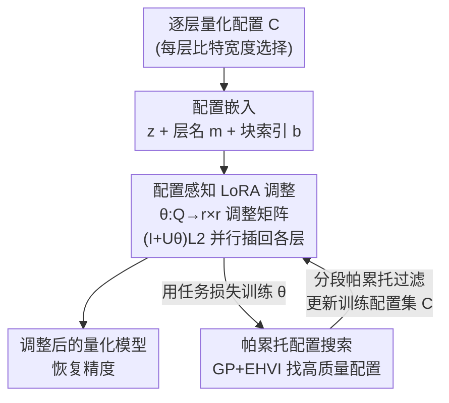

# On-the-Fly Adaptation to Quantization: Configuration-Aware LoRA for Efficient Fine-Tuning of Quantized LLMs

**会议**: ICLR 2026  
**OpenReview**: [https://openreview.net/forum?id=9OUg0nJE72](https://openreview.net/forum?id=9OUg0nJE72)  
**代码**: https://github.com/rG223/CoA-LoRA  
**领域**: LLM效率 / 模型压缩  
**关键词**: 量化, LoRA, 配置感知, 帕累托搜索, 边缘部署

## 一句话总结
CoA-LoRA 训练一个"配置感知模型"，把任意逐层量化配置直接映射成轻量的低秩调整量，让单个 LoRA 适配器无需逐配置重新微调就能适配各种比特宽度组合；再配合一个基于帕累托的高斯过程配置搜索来挑选高质量的训练配置集，最终在四个 GLUE 任务上相对 SOTA 取得 1.74%–8.89% 的准确率提升，而总微调时间几乎不随配置数增长。

## 研究背景与动机
**领域现状**：把大模型部署到边缘设备的主流做法是"先量化、再用 LoRA 微调"——量化把权重压到低比特以省显存，LoRA 再补回量化带来的精度损失（QLoRA、LQ-LoRA 等）。其中决定压缩率的核心是**量化配置（quantization configuration）**：每一层选多少比特宽度，拼起来就决定了整个模型的平均比特和压缩程度。

**现有痛点**：现有方法基本都是为**单一固定配置**设计的，换一个配置就泛化不了。可现实里边缘设备从手机到笔记本，能力千差万别，需要支持各种不同的压缩级别。于是要么用一个共享的 LoRA 硬扛所有配置（Shared-LoRA），精度大幅掉；要么给每个配置都单独微调一个 LoRA（QLoRA/LQ-LoRA），微调时间随配置数线性暴涨。论文 Fig.1 在 SST-2 上展示了这个两难：Shared-LoRA 省时间但和逐配置微调有明显精度差，逐配置微调精度好但累计时间一路爬升。

**核心矛盾**：精度与微调成本之间存在 trade-off——想覆盖更多异构配置就得做更多次微调，而想省微调就得牺牲精度，二者不可兼得。

**本文目标**：设计一个方法，能高效地把 LoRA 适配器调整到**任意**量化配置上，而不必反复微调。这又分解出两个子问题：(1) 如何避免"配置 → 完整 LoRA 参数"这个映射的输出空间过大而不可学；(2) 如何构造一个高质量的训练配置集，因为均匀分配比特宽度忽略了各层敏感度的差异，效果不好。

**切入角度**：与其为每个配置重训 LoRA，不如学一个**函数**，输入是配置、输出是对已有 LoRA 的"微调整量"。只要这个函数学好了，新配置来了直接前向一遍就能出适配器，零额外微调时间。

**核心 idea**：用一个配置感知模型 $\theta$ 把每层配置映射成一个紧凑的 $r\times r$ 调整矩阵 $U_\theta$，对 $L_2$ 做 $(I+U_\theta)L_2$ 的重参数化；再用帕累托式高斯过程搜索迭代优化训练配置集，让这个映射学得更准。

## 方法详解

### 整体框架
CoA-LoRA 要解决的是"一个 LoRA 适配任意量化配置、且不重训"。它由两个互补部件组成：**配置感知 LoRA 调整**负责把"配置 → 低秩调整量"这个映射学出来，**帕累托配置搜索**负责给这个映射喂高质量的训练配置集。整条流程是一个**循环交替**：每个 epoch 先在当前配置集 $\mathcal{C}$ 上训练配置感知模型 $\theta$，再用梯度引导搜索 + 多样性保留的帕累托过滤去扩充和精炼 $\mathcal{C}$，两者互相强化。

输入是一个逐层量化配置 $C$（每层选哪些比特参数），输出是该配置下调整好的 LoRA 适配器（进而是恢复了精度的量化模型）。中间的关键转换有三步：先把离散配置嵌入成连续向量，再让 $\theta$ 把它映射成每层的 $r\times r$ 调整矩阵并就地插回 LoRA，最后由配置搜索不断改进"拿来训练 $\theta$ 的那批配置"。

### 关键设计

**1. 配置的紧凑嵌入与逐层并行调整：把指数级配置空间压成可学的映射**

直接"配置 → 完整 LoRA 参数"行不通，因为按 Table 1 的逐层参数空间（NF 量化下每层有 5 个参数 $c_i=[b_0,b_1,b_2,B_0,B_1]$，取值组合是 $4\cdot4\cdot3\cdot3\cdot3$），$N$ 层拼起来搜索空间是 $(4\cdot4\cdot3\cdot3\cdot3)^N$，随层数指数爆炸；而要预测的 LoRA 参数总维度是 $\sum_i d_i\times r + r\times n_i$，同样高到不可学。论文的做法是把每层配置 $c_i$ 嵌入成向量 $z_i$，再拼上层名嵌入 $m$ 和块索引嵌入 $b$，得到层级嵌入 $Q_i^{(j)}=[z_i^{(j)}, m_i^{(j)}, b_i^{(j)}]$，整模型配置就是各层拼接 $Q^{(j)}=[Q_1^{(j)},\dots,Q_N^{(j)}]$。这样把离散组合搬到连续空间里学，再让模型**逐层并行**地生成调整量，把输出维度从"全部 LoRA 参数"降到"每层一个小矩阵"，大幅减轻学习负担、也缩小了 $\theta$ 本身的体量。

**2. 配置感知模型与 $L_2$ 重参数化：只动信息最集中的那一半**

论文观察到（并在量化微调下验证，附录 C.1），LoRA 的适配信号大多集中在 $L_2$ 上。于是配置感知模型只需学一个映射 $\theta:\mathbb{R}^{|Q_i|}\to\mathbb{R}^{r\times r}$，把层级配置向量 $Q_i$ 映射成一个轻量调整矩阵 $U_\theta(Q_i)\in\mathbb{R}^{r\times r}$，并把 $L_{2,i}$ 重参数化为 $(I+U_\theta(Q_i))L_{2,i}$（$I$ 是单位阵，保证 $U_\theta=0$ 时退化为原 LoRA）。调整后的模型权重写成

$$\widetilde{W}^{\text{LoRA}}_C = \text{InsertLoRA}\Big(\widetilde{W}_C,\ \big\{L^{(C)}_{1,i}(I+U_\theta(Q_i))L^{(C)}_{2,i}\big\}_{i=1}^{N}\Big),$$

其中 $L^{(C)}_{1,i},L^{(C)}_{2,i}$ 由"预训练权重与量化权重之残差"做 SVD 得到，$\text{InsertLoRA}$ 把每层调整插回对应层。训练目标是在一批配置 $\mathcal{C}$ 上最小化期望任务损失 $\theta=\arg\min_\theta \mathbb{E}_{C\in\mathcal{C}}[\mathcal{L}(\widetilde{W}^{\text{LoRA}}_C; D)]$。只在 $r\times r$ 的小矩阵上做文章，使得"一次前向出适配器"既便宜又有效——这正是"零额外微调时间"的来源。配置集初始用 50 个在 2.25–7.25 比特间均匀采样的配置。

**3. 帕累托式高斯过程配置搜索：给映射喂"既高性能又覆盖广"的训练配置**

配置感知模型的好坏严重依赖训练配置集的质量，而均匀采样忽略了各层敏感度差异、效果次优。论文把"挑配置"形式化为一个双目标优化：每个配置同时看任务性能 $f_1$ 和平均比特 $f_2$（精度高通常要更高比特，二者天然冲突），即 $\min_C f(C)=[f_1(C),f_2(C)]^\top$，求帕累托最优集。由于 $f_2$ 涉及不可微的量化运算、$f_1$ 又是昂贵的黑盒前向，无法直接梯度优化，于是用贝叶斯优化：用高斯过程 $\hat f_1(C)\sim \mathcal{G}(m(C),k(C,C'))$ 建模性能，再用**期望超体积提升（EHVI）** $\arg\max_C \mathbb{E}[\text{HVI}(f(C),\mathcal{C})]$ 来挑"对当前帕累托前沿贡献最大"的配置（超体积 HV 衡量帕累托前沿在参考点下支配的面积，越大越好）。EHVI 无解析梯度，论文用**有限差分** $\frac{\partial\alpha_{\text{EHVI}}}{\partial C_i}\approx\frac{\alpha(C+\delta e_i)-\alpha(C-\delta e_i)}{2\delta}$ 近似，再做逐坐标搜索：每步只沿梯度最大的那一层坐标 $i^*$ 更新 $C^{(j)}\leftarrow C^{(j)}-\text{sign}(\partial\alpha_{\text{EHVI}}/\partial C^{(j)}_{i^*})e_{i^*}$，跑 $T$ 步后把更新出的新配置 $\mathcal{C}'$ 并回原集 $\mathcal{C}\cup\mathcal{C}'$。

**4. 多样性保留的分段帕累托过滤：剔劣留优、同时守住比特宽度覆盖面**

搜索扩充出的 $\mathcal{C}\cup\mathcal{C}'$ 里难免混入次优配置（如同样比特宽度却准确率严格更差的"黄点"），直接拿去训练会拖累配置感知模型。论文把合并集按比特宽度切成 $U$ 个连续区段 $\mathcal{C}_1,\dots,\mathcal{C}_U$，在每段内部求"段内帕累托前沿"$\mathcal{C}^{(u)}_{\text{Pareto}}=\{C\in\mathcal{C}_u\mid f(C')\not\succ f(C)\ \forall C'\in\mathcal{C}_u\}$（$f(C')\not\succ f(C)$ 表示 $C$ 未被 $C'$ 支配），再取各段并集 $\mathcal{C}\leftarrow\bigcup_u \mathcal{C}^{(u)}_{\text{Pareto}}$。分段的意义在于：纯全局帕累托过滤会偏向某些比特区间，而分段能保证从低比特到高比特各区间都留下优质代表，既维持帕累托最优、又保住了比特宽度的广覆盖——这对"要服务异构设备的全比特范围"至关重要。实验中 $U$ 设为 40。

### 损失函数 / 训练策略
核心训练目标是公式 (3) 的期望任务损失（GLUE 用交叉熵/准确率导向，C4 用语言建模困惑度）。整体是循环交替：训 $\theta$ → 搜索扩充配置 → 分段过滤 → 再训 $\theta$。低秩 rank 用 64，学习率 $1\times10^{-4}$；C4 上最大序列长 1024、训 5 epoch，GLUE 上最大序列长 128、训 10 epoch；量化方案用 NormalFloat（NF），因其非均匀量化在同比特下能更好保留小幅值权重。

## 实验关键数据

### 主实验
在 RoBERTa-Large 上跑 GLUE 四任务（QNLI/MNLI/SST-2/QQP），用超体积 HV、相对 QLoRA 的准确率差（Acc. Gap）和训练总时间三项衡量。CoA-LoRA 只用**一次**训练（"Solution" 列为 $\infty$，意为一个模型服务全部配置），在 HV 和准确率差上多数任务最优，且总时间远低于逐配置微调：

| 方法 | 服务配置数 | QNLI HV / Gap / 时间 | MNLI HV / Gap / 时间 | SST-2 HV / Gap / 时间 | QQP HV / Gap / 时间 |
|------|-----------|----------------------|----------------------|------------------------|---------------------|
| QLoRA | 6 | 0.58 / — / 119m | 0.54 / — / 208m | 0.63 / — / 97m | 0.54 / — / 189m |
| LQ-LoRA | 6 | 0.59 / +2.81% / 108m | 0.57 / +8.13% / 183m | 0.64 / +1.54% / 91m | 0.54 / +0.47% / 172m |
| Shared-LoRA | 1 | 0.60 / +2.90% / 21m | 0.57 / +8.11% / 35m | 0.61 / **−5.06%** / 19m | 0.53 / **−1.18%** / 32m |
| **CoA-LoRA** | ∞ | **0.62 / +4.34% / 57m** | **0.59 / +8.89% / 91m** | **0.67 / +1.74% / 52m** | **0.60 / +7.87% / 88m** |

要点：逐配置微调的 QLoRA/LQ-LoRA 每个配置要 20–40 分钟，总时间随配置数线性增长；Shared-LoRA 省时但在 SST-2/QQP 上掉点严重；CoA-LoRA 大约一小时学会服务所有配置，HV 全任务领先，准确率差相对 SOTA 提升 1.74%–8.89%。

### 消融实验
配置搜索（Fig.8）与不同 rank（Table 3）的消融：

| 配置 | 关键发现 | 说明 |
|------|---------|------|
| 完整（Config search） | HV/准确率最优 | 帕累托搜索提供高质量候选 |
| Frozen config set（不搜索） | QNLI/SST-2 掉近 2% | 冻结初始配置集，映射学不准 |
| Random extension（随机扩充） | 与不搜索相当 | 每 epoch 随机加 10 个配置，无效 |

### 关键发现
- **配置搜索是涨点关键**：去掉搜索后 QNLI/SST-2 掉近 2%，MNLI/QQP 提升较小但一致；而"随机加配置"几乎等于不搜索——说明涨点靠的是引导优化挑出的**高质量**候选，而非单纯把配置集变大。
- **对未见配置有泛化**：Fig.7 显示 seen 与 unseen 配置的准确率曲线高度重合，SST-2 上偏差也 <1%（作者归因于 SST-2 任务较简单、模式较单一，泛化略弱）。
- **跨模型规模稳健**：在 Qwen2.5-1.5B/3B、LLaMA-2-7B（$N=196/252/224$ 层）上一致优于 Shared-LoRA、与其他 SOTA 相当或更好，且只需一次训练，成本不随配置数线性增长。
- **跨 rank 稳健**：Table 3 在 $r=32/64/128$ 下 CoA-LoRA 的 HV 始终最高。
- **量化方案通用**：Table 4 换成整数混合精度（int2/3/4/8）后 CoA-LoRA 仍多数最优，说明方法不绑死 NF。

## 亮点与洞察
- **把"为每个配置训一个 LoRA"换成"学一个配置→调整量的函数"**：这是从"逐实例优化"到"摊销式（amortized）生成"的视角转变，新配置来了零额外微调，本质上把训练成本一次性摊掉了。
- **只调 $L_2$ 且用 $(I+U_\theta)L_2$ 重参数化**：抓住"适配信号集中在 $L_2$"这一观察，把昂贵的高维映射压成 $r\times r$ 小矩阵，既省参数又自带"$U_\theta=0$ 即原 LoRA"的安全退化点。
- **用多目标/帕累托视角组织训练数据**：把"挑训练配置"当成性能 vs 比特的双目标优化，再用 GP+EHVI+分段过滤选样本，这套"为下游学习挑高质量训练分布"的思路可迁移到其他需要覆盖异构设置的摊销学习场景（如多分辨率、多稀疏率适配）。

## 局限与展望
- 作者承认在 SST-2 这类较简单任务上对未见配置的泛化略弱（曲线不完全对齐，差异 <1%），暗示任务复杂度会影响配置泛化。
- 自己发现：主实验集中在 GLUE 分类任务与 C4 困惑度，缺少生成/推理类下游任务的验证；配置搜索引入了 GP、EHVI、有限差分、分段过滤等多个超参（如段数 $U=40$、步长 $\delta=1$、步数 $T$），整体调参复杂度不低。
- 有限差分近似梯度在高维离散配置空间里每步只更新一坐标，收敛效率和搜索质量可能受层数 $N$ 增大影响，超大模型下的搜索开销值得进一步评估。
- 改进思路：把配置感知模型扩展到也生成/调整 $L_1$ 或注意力外的更多模块；用更高效的代理模型替代 GP 以降低搜索成本。

## 相关工作与启发
- **vs QLoRA / LQ-LoRA**：它们对每个配置单独量化 + 微调（LQ-LoRA 还用迭代 SVD 做更好的初始化），精度强但时间随配置数线性增长；CoA-LoRA 用一个配置感知模型服务全部配置，时间近乎常数，精度相当甚至更优。
- **vs Shared-LoRA**：共享一个 LoRA 适配所有量化设置，省时但精度大幅波动（SST-2 掉 5%）；CoA-LoRA 通过"按配置生成调整量"避免了这种一刀切的精度损失。
- **vs LoRA 生成类（CondP-Diff / ICM-LoRA / LoRA-Gen）**：这些用扩散/上下文学习/MoE 生成 LoRA 参数，但大多依赖专家 LoRA 或训练好的 LoRA，对量化 LLM 成本高；CoA-LoRA 走的是轻量、面向量化配置的调整路线。

## 评分
- 新颖性: ⭐⭐⭐⭐⭐ 把"配置→LoRA 调整"做成摊销生成，并用帕累托搜索挑训练配置，角度新颖
- 实验充分度: ⭐⭐⭐⭐ 覆盖多模型规模、多 rank、NF 与整数两种量化，但下游任务偏分类/困惑度
- 写作质量: ⭐⭐⭐⭐ 动机清晰、图表完整，符号略多需细读
- 价值: ⭐⭐⭐⭐⭐ 直击异构边缘部署"逐配置微调成本"痛点，实用性强

<!-- RELATED:START -->

## 相关论文

- [\[ICLR 2026\] LoRA-S: An Efficient Low Rank Adaptation scheme via Sylvester equation](lora-s_an_efficient_low_rank_adaptation_scheme_via_sylvester_equation.md)
- [\[ICLR 2026\] Developmental Federated Tuning: A Cognitive-Inspired Paradigm for Efficient LLM Adaptation](developmental_federated_tuning_a_cognitive-inspired_paradigm_for_efficient_llm_a.md)
- [\[ICLR 2026\] Difficulty–Diversity Collaborative Filtering for Data-Efficient LLM Fine-Tuning](difficultydiversity_collaborative_filtering_for_data-efficient_llm_fine-tuning.md)
- [\[ICLR 2026\] PLoP: Precise LoRA Placement for Efficient Finetuning of Large Models](plop_precise_lora_placement_for_efficient_finetuning_of_large_models.md)
- [\[ICLR 2026\] FLoRG: Federated Fine-tuning with Low-rank Gram Matrices and Procrustes Alignment](florg_federated_fine-tuning_with_low-rank_gram_matrices_and_procrustes_alignment.md)

<!-- RELATED:END -->
