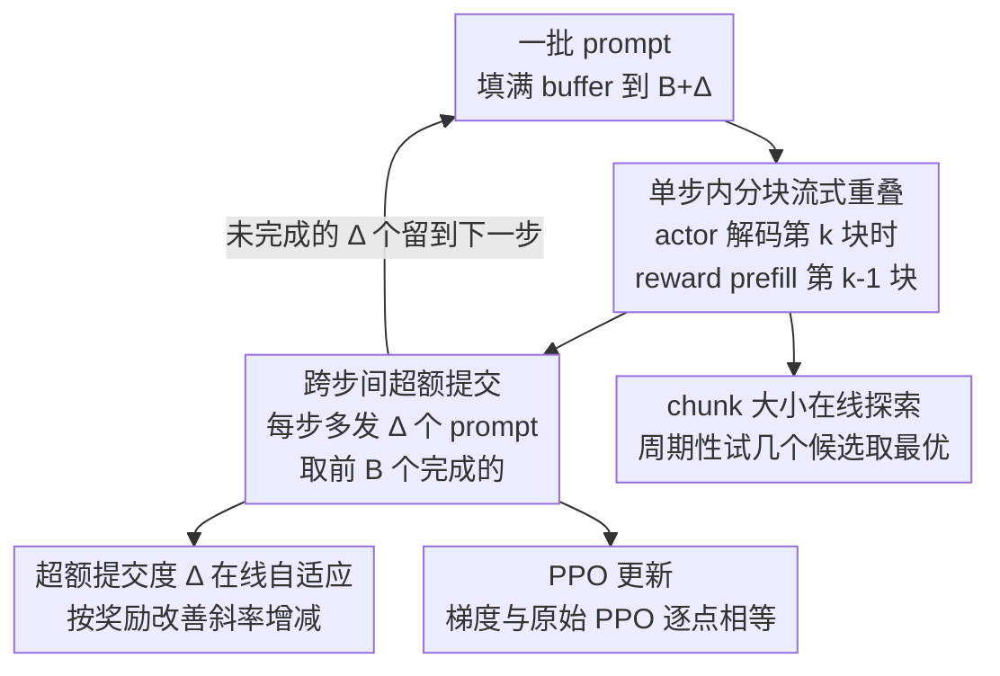

# OPPO: Accelerating PPO-based RLHF via Pipeline Overlap

**会议**: ICLR 2026  
**OpenReview**: [https://openreview.net/forum?id=31Mr6wLBeF](https://openreview.net/forum?id=31Mr6wLBeF)  
**代码**: 待确认  
**领域**: LLM效率 / RLHF系统  
**关键词**: PPO, RLHF, 流水线重叠, 长尾延迟, 训练加速

## 一句话总结
OPPO 是一个轻量、模型无关的 PPO-RLHF 训练加速框架：它在「单步内」把 actor 生成与 reward 打分用分块流式重叠起来，在「跨步间」用超额提交（overcommit）几个 prompt 把长尾响应推迟到后续 step 完成，从而在不改变 PPO 更新、不损失收敛质量的前提下把训练加速 1.8×–2.8×、GPU 利用率提升 1.4×–2.1×。

## 研究背景与动机

**领域现状**：基于 PPO 的 RLHF 是把大模型对齐到人类偏好的事实标准。一个标准的 PPO-RLHF 流水线要同时跑四个模型——actor（策略）、critic（价值函数）、reference（KL 正则用的冻结基座）、reward（人类偏好打分），每个训练 step 严格分成三个串行阶段：生成（actor 出响应）→ 打分（critic/reference/reward 评估）→ 训练（用 advantage 和梯度更新 actor 与 critic）。

**现有痛点**：这条流水线效率很低，根因是「多模型串行依赖」加「响应长度长尾」两件事叠加。一方面四个模型的算力特征差异巨大：actor 的自回归逐 token 解码是访存密集型，GPU 利用率常常低于 40%，而打分/训练阶段（尤其长上下文 prefill）是计算密集型——同一条流水线上算力需求错配，必然产生大量空闲 GPU。另一方面响应长度服从长尾分布：大多数序列很短，但少数超长响应会拖慢整个阶段的完成（阶段完成时间取决于最后一条 rollout），形成 tail straggler；更糟的是长度分布还随训练阶段漂移（warm-up vs 收敛期不同），让「动态调整 GPU 分配」这类优化很难奏效。

**核心矛盾**：想提速就得打破串行依赖，但已有的两类破法都有代价。算法侧的 DPO/GRPO 去掉了 value 或 reward 模型，却因稀疏奖励而不稳定、需要大量 rollout，还有任务相关的奖励设计难题；系统侧的异步 RLHF（如 AReaL）让 reward 评估上一步的 actor 输出来减少依赖，但引入了 staleness——论文 Figure 2c 显示 staleness=5 不仅拖慢 step-to-reward 收敛，还会降低训练后的模型质量。也就是说，**既要打破阶段间的串行空转，又不能让 PPO 更新看到陈旧数据**。

**本文目标**：在不改 PPO 算法语义、不引入有害 staleness 的前提下，最大化训练流水线的执行重叠，把那些被串行依赖和长尾拖出来的空闲时间填满。

**切入角度**：作者注意到一个被忽视的机会——既然 actor 还在做访存密集的解码、下游 reward 还在干等，那为什么不让 reward 对「已经生成出来的那部分前缀」先做 prefill？同理，既然超长序列是少数，那为什么不多发几个 prompt、先用先完成的、把没跑完的留到下一步？

**核心 idea**：用「单步内分块流式重叠（intra-step overlap）」隐藏 reward prefill 延迟，用「跨步间超额提交+延迟续跑（inter-step overlap）」消化长尾 straggler，两者正交、都带在线自适应控制，合起来只是套在已有 PPO 实现上的一个轻量 wrapper。

## 方法详解

### 整体框架

OPPO 的输入是一批 prompt 和标准 PPO-RLHF 的四模型配置，输出是经过加速、但收敛轨迹与原始 PPO 几乎一致的训练过程。它的核心是把原本「生成完→才打分→才训练」的纯串行 step，改造成两个维度上的重叠：在一个 step 内部，让 reward 的 prefill 与 actor 的 decode 交错执行；在相邻 step 之间，让没跑完的长序列跨步续跑而不是阻塞当前 step。整个调度由一个容量为 $B+\Delta$ 的 FIFO buffer 串起来：每轮先把 buffer 填满到 $B+\Delta$，生成阶段一边分块解码一边把 chunk 流给 reward 增量打分，凑齐前 $B$ 个完成的序列就做 PPO 更新，剩下未完成的 $\Delta$ 个留在 buffer 进入下一轮；同时两个在线控制器分别调 chunk 大小和超额提交度 $\Delta$。

### 关键设计

**1. 单步内分块流式重叠：让 reward 在 actor 还在解码时就开始 prefill**

这一设计直接打的痛点是：标准流水线里 reward 必须等 actor 把一条序列完整生成出来才能开始打分，下游 GPU 就这么干等着。OPPO 的做法是把 actor 的生成切成「合适大小」的 chunk，每生成一块就流给 reward 模型增量 prefill——当 actor 正在解码第 $k$ 块时，reward 并发地在处理第 $k-1$ 块的 prefill；step 结束时 reward 只需补上最后一块的 prefill 再基于整条序列算分，前面的块早就处理过了。因为 actor 解码访存密集、reward prefill 计算密集，二者算力需求错配，重叠起来几乎不互相抢资源，哪怕模型 colocate 也能受益。

关键在于这种流式**不改变 PPO 更新的任何东西**：它不动最终响应 $y_i$、不动策略 log 概率、也不动 critic/value 项。论文形式化地写出流式梯度估计：设 $y_i$ 为完整响应、$y_i^{(1)},\dots,y_i^{(T_i)}$ 为其前缀且 $y_i^{(T_i)}=y_i$，则

$$\hat{g}_{\text{str}}(\theta)=\frac{1}{B}\sum_{i=1}^{B}\sum_{t=1}^{T_i}\mathbf{1}^{(i,t)}_{\text{fin}}\,\hat{A}(y_i)\,\nabla_\theta\log\pi_\theta(y_i\mid x_i)$$

其中 $\mathbf{1}^{(i,t)}_{\text{fin}}$ 只在最终前缀处为 1。由于每个样本走的是完全相同的前缀，内层求和坍缩成单项，于是 $\hat{g}_{\text{str}}(\theta)\equiv\hat{g}_{\text{std}}(\theta)$ 逐点相等——梯度的期望和方差都不变。这就是它「加速但不伤收敛」的理论保证：流式只是改了执行时序，没改算法。

**2. chunk 大小的在线自适应控制：在重叠收益和资源争用之间找平衡**

流式带来一个 trade-off：chunk 太大（如 3K token）则重叠太少，退化回基本串行；chunk 太小（如 10 token）则因频繁的 GPU 上下文切换（在不同模型间切）造成严重资源争用，尤其在 colocate 时。OPPO 利用两个观察来在线调 chunk：一是「chunk 大小↔重叠效率」这个 trade-off 是单调、可预测的；二是 PPO 要跑成百上千步，有充足的探索机会。于是它周期性地（如每 50 步）在不同步上试几个候选 chunk 大小（如 128、256、512），选当前表现最好的配置用于后续窗口——本质是把超参搜索摊到训练过程里，免去人工调参。

**3. 跨步间超额提交：用多发几个 prompt 把长尾 straggler 推迟而非丢弃**

单步内重叠解决不了同一 batch 内因长度异质造成的长尾延迟——一条慢 prompt 仍会拖住整步。这一设计针对的就是这个 tail latency：如果原始 batch size 是 $B$，OPPO 每步实际跑 $B+\Delta$ 个 prompt（超额提交 $\Delta$ 个）。其依据是「序列生成通常不是计算受限的」，多发几个 prompt 对每 batch 执行时间影响很小，却能显著削弱长尾的影响。每步只取**最先完成的 $B$ 个**序列做 PPO 更新，未完成的 $\Delta$ 个序列连同已生成的部分（partial work 被保留、不浪费）延迟到下一步续跑。这保证了长序列不会被饿死、最终都能在后续步完成，而 batch size 始终维持在 $B$。

**4. 超额提交度 $\Delta$ 的在线自适应：用统计偏差换吞吐，收敛时自动归零**

$\Delta$ 本身是把双刃剑：太小则重叠不足、GPU 仍被长尾拖空；太大则膨胀每步延迟、引入 staleness 伤收敛。OPPO 让 $\Delta$ 跟着训练动态自适应。设 $R_t$ 为第 $t$ 步平均奖励，在宽度 $w$ 的滑动窗口上定义改善斜率 $s_t=\frac{1}{w}\sum_{i=t-w+1}^{t}(R_i-R_{i-1})$，则

$$\Delta_{t+1}=\begin{cases}\min(\Delta_{\max},\,\Delta_t+\delta_{\text{inc}}) & \text{if } s_t>0\\[2pt]\max(\Delta_{\min},\,\Delta_t-\delta_{\text{dec}}) & \text{if } s_t\le 0\end{cases}$$

其中 $\delta_{\text{inc}},\delta_{\text{dec}}$ 是固定动量（如 1），$\Delta_{\min},\Delta_{\max}$ 是边界。直觉是：奖励还在涨（$s_t>0$）说明可以更激进地超额提交换吞吐；当训练趋于收敛、$s_t\to 0$ 时 $\Delta_t$ 自然衰减回 $\Delta_{\min}$（常为 0），从而在收敛阶段关闭超额提交、避免 staleness，又在前中期有效消化长尾。控制器只做有界、渐进的小步更新，能过滤短期奖励震荡，不会突然跳变。（论文 Algorithm 1 里的伪代码版本用的是 $\Delta_{\text{change}}=\max(1,\lfloor\Delta/4\rfloor)$ 的按比例步长，并按 $\text{sign}(d)$ 反向调整，⚠️ 具体形式以原文为准。）

### 损失函数 / 训练策略
OPPO 不改 PPO 目标本身。actor 仍优化裁剪代理目标 $L_{\text{clip}}(\theta_j)=\mathbb{E}_t[\min(r_t(\theta_j)\hat{A}_t,\,\text{clip}(r_t(\theta_j),1-\epsilon,1+\epsilon)\hat{A}_t)]$，其中 $r_t(\theta_j)=\pi_{\theta_j}(a_t\mid s_t)/\pi_{\theta_{j-1}}(a_t\mid s_t)$；advantage 由 GAE 给出 $\hat{A}_t=\sum_{\ell=0}^{T-t-1}(\gamma\lambda)^\ell\delta_{t+\ell}$，$\delta_t=r_t+\gamma V(s_{t+1})-V(s_t)$。OPPO 的全部贡献都在「这些量怎么被并发地算出来」这一执行层，而非「算的是什么」这一算法层——所以它能作为 wrapper 套进现有 PPO 框架。

## 实验关键数据

实验在多种高端 GPU 上进行（8×H200 / 4×GH200 / 8×A100），actor 用 Qwen2.5-7B / 7B-Instruct / 3B-Instruct（加 value head），reward 用 Qwen2.5-7B 或规则式评估器（数学任务）。基于 TRL 库实现标准分布式 PPO，7 卡给生成+训练、1 卡给打分，默认 batch size 112，结果取 5 次独立运行平均。

### 主实验

| 任务 / 模型 | 指标 | OPPO | TRL 基线 | 加速 |
|---|---|---|---|---|
| Stack-Exchange / Qwen2.5-7B-Instruct | 达到 reward 4.17 用时 | 2,300 min | 4,300 min | 1.9× |
| Stack-Exchange / Qwen2.5-3B-Instruct | 达到 reward 5.12 用时 | 5,200 min | 13,000 min | 2.5× |
| OpenCoder-SFT (Stage2) / Qwen2.5-3B-Instruct | 训练时间 | — | — | 2.4× |
| GSM8K / Qwen2.5-7B | 训练时间 | — | — | 2.8× |
| Stack-Exchange / Qwen2.5-7B-Instruct（双节点 2×4×A100） | 平均每步延迟 | 111.08 s | 498.30 s | 4.49× |

GPU 利用率方面：Stack-Exchange 上 7B-Instruct 从 50.6%→71.0%（1.4×）、3B-Instruct 从 38.7%→73.6%（1.9×），GSM8K-7B 从 45.7%→67.3%（1.5×），OpenCoder-3B 从 35.7%→74.1%（2.1×）。与其他系统级框架比，OPPO 单步延迟 99.84s 最低，比 VeRL(DP) 快 1.26×，也胜过 AReaL 和 VeRL 各变体——因为它打的是一个和序列并行正交的延迟来源（reward 的空闲时间），故可与这些策略组合。

### 消融实验

| 配置 | Qwen2.5-7B-Instruct 达 reward 4.17 | 7B 加速 | Qwen2.5-3B-Instruct 达 reward 5.12 | 3B 加速 |
|---|---|---|---|---|
| TRL 基线 | 4,200 min | 1.0× | 13,000 min | 1.0× |
| 仅 intra-step | 3,500 min | 1.2× | 10,000 min | 1.3× |
| 仅 inter-step | 2,700 min | 1.6× | 6,300 min | 2.06× |

### 关键发现
- **两种重叠正交、可叠加**：单独 intra-step 只隐藏了约 17% 的打分延迟、且受每 batch 最长序列的 straggler 限制；单独 inter-step 收益更大（1.6×/2.06×）；二者合起来才达到 1.8×–2.8×，且所有配置最终 reward 几乎一致。
- **加速不伤收敛**：OPPO 与基线的 step-to-reward 曲线几乎重合（如 Stack-Exchange 都在 step 150 到 ~2.0、step 600 plateau 在 ~4.1；GSM8K 都经历 0.70→0.66 回落→step 200 升到 0.82 的相同学习阶段）。
- **动态 $\Delta$ 优于固定**：固定 $\Delta=4$ 因停掉的长尾少而收敛慢，固定 $\Delta=8$ 前期快但静态阈值无法适配全程；动态 $\Delta$ 全程最优。延迟分布表显示绝大多数请求即时处理、几乎所有被延迟的请求只延迟一步，既不会永久饿死难 prompt，也不会引入过量 staleness。
- **chunk 大小敏感**：7B actor + 7B reward 下，chunk=500 时步速最快（171s），过大（3000）或过小（100）都更慢，印证了在线自适应的必要性。

## 亮点与洞察
- **「不改算法、只改时序」的可证明等价性**：把 intra-step 流式写成梯度估计后证明它与标准 PPO 逐点相等，这让「加速」和「收敛」彻底解耦——这是它敢声称无损的底气，也是相比异步 RLHF（必须容忍 staleness）的根本优势。
- **超额提交是个朴素但精准的长尾解法**：不丢弃、不等待，而是「多发一点、先用先完成、慢的留到下一步续跑」，既保留 partial work 又维持 batch size，把长尾从「阻塞源」变成「跨步摊销」。
- **把超参搜索摊进训练过程**：chunk 大小和 $\Delta$ 都靠 PPO 上千步的天然探索机会在线选优，避免了人工调参，这个「利用长训练做在线 AB 测试」的思路可迁移到其他长流程训练系统。
- **正交可组合**：作为 wrapper 不与 VeRL/AReaL 的序列并行冲突，打的是 reward 空闲这个独立瓶颈，工程落地成本低。

## 局限与展望
- **依赖算力错配假设**：intra-step 重叠的收益来自 actor 解码访存密集、reward prefill 计算密集的错配；若 reward 模型很小或被高度优化、prefill 时间本就很短，可隐藏的延迟有限（仅 intra 只省 ~17%）。
- **超额提交引入的统计偏差未充分刻画**：论文用「小统计偏差换大吞吐」描述 $\Delta$，但跨步续跑使部分序列的生成分布相对当前策略略有偏移，长程或更敏感任务上是否始终无害，证据主要来自 reward 曲线重合而非更细的分布分析。
- **评测局限于 Qwen2.5 系列与三个任务**：自定义指标和奖励（如把 GSM8K 转成偏好格式）下的结论，迁移到其他模型族/更大规模/更长上下文时的稳健性仍待验证。
- **改进方向**：把 chunk/$\Delta$ 的在线控制器换成更显式的代价模型，或与序列并行、动态 GPU 伸缩等正交优化联合调度，可能进一步压缩 bubble。

## 相关工作与启发
- **vs DPO / GRPO（算法侧去模型）**：它们删掉 value 或 reward 模型来减依赖，但有稀疏奖励不稳定、需大量 rollout、奖励设计难等问题；OPPO 不动算法、保留四模型，只在执行层重叠，因此不引入这些副作用，且作者称对 DPO 等范式也有类似收益。
- **vs 异步 RLHF（如 AReaL）**：异步用 reward 评估旧 actor 输出来减依赖，代价是 staleness 伤收敛；OPPO 的 intra-step 可证明等价、inter-step 在收敛时自动关闭超额提交，把 staleness 控制在「绝大多数只延迟一步」。
- **vs 系统级框架（RLHFuse / VeRL / AReaL）**：它们靠细粒度并行、colocate 减通信、动态扩 GPU 来提吞吐，主要优化序列级执行；OPPO 打的是「reward 在 actor 生成期间的空闲时间」这个正交瓶颈，故能与它们组合而非替代。

## 评分
- 新颖性: ⭐⭐⭐⭐ intra/inter 双重叠的视角清晰，超额提交+可证明等价的组合在 RLHF 系统里少见
- 实验充分度: ⭐⭐⭐⭐ 覆盖三任务、多模型、多 GPU、单/多节点，消融拆分清楚，但模型族较单一
- 写作质量: ⭐⭐⭐⭐ 动机和方法讲得透，部分公式（Algorithm 1 的 $\Delta$ 更新）与正文略有出入
- 价值: ⭐⭐⭐⭐⭐ 轻量 wrapper、1.8×–2.8× 无损加速、可与现有框架组合，工程价值高

<!-- RELATED:START -->

## 相关论文

- [\[ICLR 2026\] PARD: Accelerating LLM Inference with Low-Cost Parallel Draft Model Adaptation](pard_accelerating_llm_inference_with_lowcost_parallel_draft_model_adaptation.md)
- [\[ICLR 2026\] SonicMoE: Accelerating MoE with IO and Tile-aware Optimizations](sonicmoe_accelerating_moe_with_io_and_tile-aware_optimizations.md)
- [\[ICLR 2026\] Cactus: Accelerating Auto-Regressive Decoding with Constrained Acceptance Speculative Sampling](cactus_accelerating_auto-regressive_decoding_with_constrained_acceptance_specula.md)
- [\[ICLR 2026\] NI Sampling: Accelerating Discrete Diffusion Sampling by Token Order Optimization](ni_sampling_accelerating_discrete_diffusion_sampling_by_token_order_optimization.md)
- [\[ICLR 2026\] LycheeDecode: Accelerating Long-Context LLM Inference via Hybrid-Head Sparse Decoding](lycheedecode_accelerating_long-context_llm_inference_via_hybrid-head_sparse_deco.md)

<!-- RELATED:END -->
