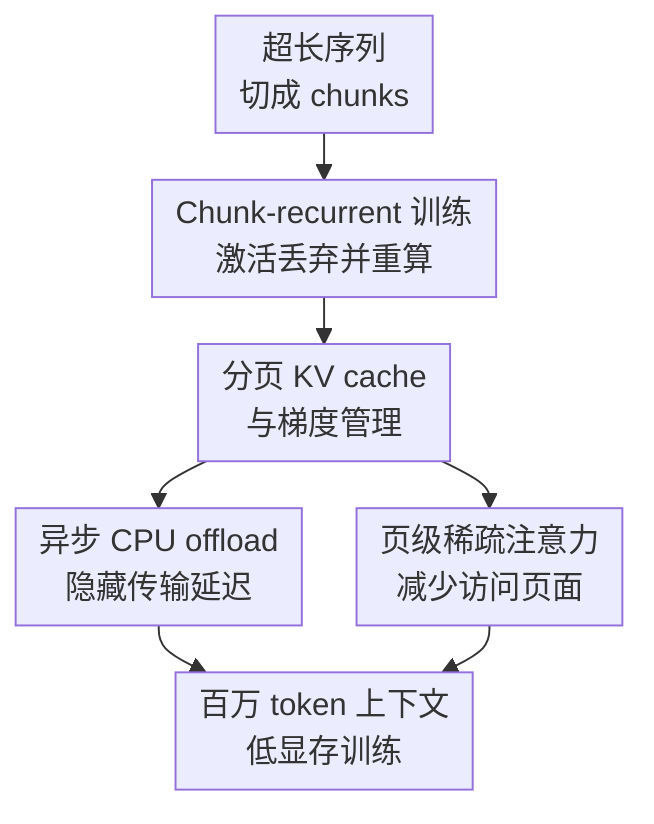

# Out of the Memory Barrier: A Highly Memory-Efficient Training System for LLMs with Million-Token Contexts

**会议**: ICLR2026  
**OpenReview**: [https://openreview.net/forum?id=dSa3ImCQr7](https://openreview.net/forum?id=dSa3ImCQr7)  
**代码**: https://github.com/wenhaoli-xmu/OOMB  
**领域**: LLM效率  
**关键词**: 长上下文训练、显存优化、KV Cache、稀疏注意力、CPU Offload

## 一句话总结
OOMB 把百万级上下文 LLM 训练改造成按 chunk 串行推进、激活即时丢弃并反向重算的系统，再用分页 KV cache、异步 CPU offload 和页级稀疏注意力管理真正随长度增长的状态，使 Qwen2.5-7B 能在单张 H200 上训练 4M token 上下文。

## 研究背景与动机

**领域现状**：长上下文 LLM 通常需要继续预训练或微调来真正学会处理超长序列。位置插值、训练-free context extension 或检索式技巧能把窗口“拉长”，但论文指出，困惑度和 needle retrieval 这类指标并不总能代表深层长程推理能力；如果目标是稳定的长上下文能力，仍然绕不开连续长序列上的训练。

**现有痛点**：真正卡住训练的不是参数、优化器状态，也不完全是训练步数，而是每个 iteration 里随序列长度线性增长的激活和 KV cache。以 4x GQA 比例的模型为例，256K 上下文单 KV cache 就可能需要约 64GB，A100 还没算其他激活就已经接近或超过上限。ZeRO3、tensor parallelism、Ring Attention 这类方案能把一部分状态摊到多卡上，但代价是更大的集群和更重的通信。

**核心矛盾**：长上下文训练的计算图希望一次看到完整序列，但 GPU 显存不能同时保留所有 token 的中间激活和跨层 KV 状态。并行训练吞吐高，却让显存按 $O(N)$ 增长；串行处理省显存，却容易牺牲训练效率，并且 Transformer 训练不像推理那样只需要前向 KV cache，还要处理梯度。

**本文目标**：作者要解决的不是“如何发明一个新的长上下文 benchmark”，而是一个系统问题：在尽量少的 GPU 资源上训练百万 token 级上下文，同时保持精确或可控近似的注意力、可反向传播的 KV cache 管理，以及可接受的端到端延迟。

**切入角度**：OOMB 的观察很直接：长上下文 fine-tuning 的数据量通常不算巨大，训练步数也可能不多，此时显存容量比极致吞吐更重要。于是系统可以接受 chunk 之间的串行化，把每个 chunk 内部仍然并行处理，再通过重算和专门内核把显存增长从激活转移到更可控的 KV cache 上。

**核心 idea**：用 chunk-recurrent 训练把激活显存压到 $O(1)$，再围绕 KV cache 这个新瓶颈共同设计分页管理、异步 offload 和页级稀疏注意力，从而跨过百万 token 训练的显存墙。

## 方法详解

### 整体框架

OOMB 的整体流程可以理解为“Transformer 训练版的分块递推”。一条超长序列先被切成多个 chunk，模型按顺序处理这些 chunk；每个 chunk 前向时能访问之前 chunk 产生的 KV cache，但自己的普通激活在前向结束后立即丢弃，等反向传播需要时再现场重算。这样一来，显存里长期保留的主要对象不再是所有层所有 token 的激活，而是随上下文增长的 KV cache 及其梯度。

围绕这个新瓶颈，OOMB 没有只加一个 offload 开关，而是把 KV cache 的存储形式、反向传播方式、CPU/GPU 迁移和注意力访问模式一起改掉：分页管理让 KV cache 可以像推理系统里的 paged attention 一样追加和索引；专门 Triton kernel 让 KV cache 梯度可以原地累积并绕开 PyTorch autograd 的额外保存；异步 CPU offload 把暂时不用的 page 搬到 CPU；页级稀疏注意力进一步减少需要搬回 GPU 和参与注意力计算的 page。

### 关键设计

**1. Chunk-recurrent 训练：把随长度增长的激活显存改成单 chunk 常数显存**

普通 Transformer 训练会在一次前向里处理完整序列，并把每层中间激活都留到反向传播使用，因此激活显存随上下文长度 $N$ 线性增长。OOMB 借鉴 RNN 的顺序训练，把长序列切成 $S$ 个 chunk：第 $i$ 个 chunk 的输出 $Y_i$ 依赖当前输入 $X_i$ 和历史 KV cache $\{M_1,\ldots,M_{i-1}\}$。前向结束后，当前 chunk 的普通激活 $A_i$ 不长期保存；反向传播走到这个 chunk 时，再用同样的输入和历史状态重算 $A_i$，然后计算参数梯度和历史 KV cache 的梯度。

这个设计的关键不是“切块”本身，而是切块之后把激活生命周期缩短到单个 chunk。显存中不再需要保存 $A_1$ 到 $A_S$ 的整条链路，激活部分变成由 chunk size 决定的 $O(1)$。代价是反向时多做一次前向式重算，但长上下文 fine-tuning 往往更受显存约束；如果没有这一步，后面的分页和 offload 只能缓解 KV cache，无法解决普通激活本身的线性爆炸。

**2. 分页 KV cache 与梯度管理：让训练中的 KV 状态像推理系统一样可追加、可索引、可回收**

Chunk-recurrent 训练把主要矛盾转移到了 KV cache：每来一个 chunk，系统都要追加新的 key/value，并在反向传播里得到这些 KV 的梯度。直接用 tensor concatenation 做追加会反复分配、拷贝和产生碎片，论文里的非分页实现甚至会让实际显存增长接近理论需求的 3 倍。OOMB 因此把 KV cache 和 KV gradient 都放进 paged memory manager，用固定 page 管理长序列状态。

训练场景比推理更难，因为推理的 paged attention 只管前向，而这里还要反向传播。作者实现了自定义 Triton kernel，同时处理 forward/backward，并让 KV cache 对 PyTorch autograd 近似“不透明”：梯度通过 `atomic_add` 原地累积到对应 page，避免为了 autograd 额外保存中间 buffer，也避免 PyTorch 把 KV cache 当普通 activation 再保存一份。这个设计让 KV cache 的存储、索引和梯度写回都由系统直接控制，是后续 offload 和稀疏访问能成立的基础。

**3. 异步 CPU offload：只让当前层需要的 KV page 留在 GPU**

即使分页以后，百万 token 的 KV cache 仍然会随长度增长，单靠 GPU 显存放不下。OOMB 的做法是把 KV cache 和梯度尽早迁到 CPU，用 pinned CPU memory、独立 CUDA stream 和 DMA 做异步传输。对 dense attention 和 local attention，某一层下一步要访问哪些 KV page 是提前知道的，所以系统可以在计算第 $i-1$ 层时预取第 $i$ 层的 KV cache，反向传播也做对称预取。

对检索式 sparse attention，前向时要先根据当前 query 算出相关 page，不能完全提前知道访问集合。OOMB 因此在 query projection 后立即启动 page retrieval 和对应数据传输，同时用后续 key/value projection 的计算时间覆盖传输延迟；反向传播时则复用前向缓存下来的 page index，再退回到更简单的预取策略。论文报告 dense/local offload 的端到端额外开销低于 5%，说明这里真正有价值的是“和计算重叠”，而不是简单把数据搬到 CPU。

**4. 页级稀疏注意力：减少注意力计算，也减少需要搬运的 KV page**

长上下文注意力的计算复杂度本身也是瓶颈。OOMB 利用分页结构天然支持 page-level sparse attention：对于 Qwen2.5 这类 dense attention 模型，系统先为每个 key page 计算平均代表向量 $K_{avg}$，再用当前 query token 与所有 page 代表向量打分，通过 softmax 和投票聚合为 query page 选择 Top-K 相关 key page。简化地说，第 $i$ 个 query page 对第 $k$ 个 key page 的分数来自该 page 内多个 token 的注意力偏好累加：

$$
Score_{page}[i,k] = \sum_j softmax(Q[i,j]^\top K_{avg}[k])
$$

这里的稀疏不是随便裁剪 token，而是在 page 粒度上选择要访问的历史块。它和分页管理天然对齐：选出的 page 可以直接作为 attention kernel 的输入，也直接决定 offload 要搬回哪些 KV page。对 GPT-OSS 这类原生稀疏模型，dense 层仍用 Top-K page retrieval，local attention 层只取最近的 KV page。这样一来，稀疏注意力同时降低计算复杂度和 CPU-GPU 通信量，是 OOMB 能把 1M、4M 甚至更长上下文训练变得实际可跑的重要组件。

### 损失函数 / 训练策略

OOMB 本身不是新的语言模型目标，而是训练系统，因此仍使用常规自回归语言建模训练目标。实验使用 Qwen2.5-7B 做 full-parameter fine-tuning，bfloat16 精度，Adam 优化器，学习率 $5\times 10^{-5}$，betas 为 $(0.9, 0.98)$；每 GPU batch size 设为 1，以便隔离上下文长度对系统性能的影响。

系统层面的关键超参包括 chunk size、KV page size 和 sparse retrieval budget。论文在 H200 上使用 page size 128，并系统比较了 4K、8K、12K chunk，以及 `4K+512`、`4K+2048`、`4K+8192`、`4K+32768` 等稀疏预算。更大的 chunk 通常带来更好的硬件利用率，但会提高单 chunk 激活占用；更大的 retrieval budget 更接近 dense attention，但也增加计算和通信。

## 实验关键数据

### 主实验

论文的主实验围绕 Qwen2.5-7B 在 H200 上的长上下文训练效率展开，比较对象包括 FlashAttention + gradient checkpointing 的并行训练 baseline，以及 Ring Flash Attention 代表的 context parallelism。最重要的结论是：baseline 在 128K 已经 OOM，而 OOMB 通过 offload 和稀疏注意力把 256K 训练维持在 34GB 左右显存；进一步的扩展实验显示单 H200 可训练 4M token 上下文。

| 方法 | 硬件/配置 | 注意力 | 最大展示上下文 | 峰值显存趋势 | 关键结论 |
|------|-----------|--------|----------------|--------------|----------|
| FlashAttention baseline | 1x H200, checkpointing | dense exact | 64K 后接近极限，128K OOM | 32K: 64,985MB；64K: 表中约 100GB 量级；128K OOM | 并行训练激活和 KV cache 同时线性增长 |
| OOMB + Dense Attn | 1x H200, chunk 4K, ckpt+offload | dense exact | 256K | 8K: 33,686MB；256K: 37,129MB | 精确注意力下显存几乎不随上下文急剧增长 |
| OOMB + Sparse Attn | 1x H200, chunk 4K, `4K+8192`, ckpt+offload | page sparse | 256K | 8K: 33,669MB；256K: 34,083MB | 稀疏注意力进一步降低延迟，显存近似常数 |
| OOMB 扩展实验 | 1x/4x H200 | dense/sparse | 4M 到 8M | 每增加 10K token 约只增 10MB（Qwen2.5-7B） | 百万级上下文训练从集群任务变成少卡/单卡任务 |

在吞吐方面，OOMB 也不是单纯“省显存但慢到不可用”。Table 3 显示，在 256K context 下，RFA 在 4x H200 上每设备约 218.41 tokens/sec；OOMB dense attention 单 H200 达到 266.13 tokens/sec，OOMB sparse attention 单 H200 达到 1301.60 tokens/sec。这个对比说明，串行 chunk 带来的额外访问开销可以被更少的通信和稀疏访问抵消。

### 消融实验

消融主要验证四件事：activation recomputation 是否有效、CPU offload 是否带来可接受延迟、sparse attention 是否显著加速、chunk/retrieval budget 如何影响精度与效率。下面选取论文表格中最能说明问题的 256K 设置。

| 配置 | 256K 延迟/迭代 | 256K 峰值显存 | 说明 |
|------|---------------|---------------|------|
| OOMB Dense, chunk 4K, ckpt, no offload | 1015.9s | 76,650MB | 仅靠 chunk/recompute 已比 baseline 可扩展，但 KV cache 仍占显存 |
| OOMB Dense, chunk 4K, offload, no ckpt | 899.6s | 60,788MB | offload 降低 KV cache 显存，且延迟没有明显恶化 |
| OOMB Dense, chunk 4K, ckpt+offload | 985.8s | 37,129MB | 精确注意力下显存最低，代价是重算带来的时间 |
| OOMB Sparse, chunk 4K, `4K+8192`, ckpt+offload | 201.4s | 34,083MB | 稀疏注意力把 256K 延迟从约 986s 降到约 201s |
| OOMB Sparse, chunk 12K, `12K+512`, ckpt+offload | 146.4s | 42,774MB | 更大 chunk 改善硬件利用率，显存略高但仍可控 |

稀疏注意力的准确性验证也比较关键。论文在 16K、64K、256K、1M context 和 4 个 retrieval budget 上分析梯度近似误差，并报告训练 loss。以 64K 为例，dense loss 为 1.22387，`4K+8192` 和 `4K+32768` 都达到 1.21875；以 256K 为例，dense loss 为 2.21875，`4K+8192` 和 `4K+32768` 同样为 2.21875。1M context 下 loss 更高，且 32K budget 后期有轻微不稳定，作者认为与学习率和位置编码外推限制有关。

### 关键发现

- OOMB 最核心的贡献来自激活重算带来的 $O(1)$ activation memory；没有这一步，KV cache 优化无法单独解决长上下文训练的显存墙。
- 分页 KV cache 不是工程小优化。非分页追加会带来重分配、拷贝和碎片，论文图 4 显示实际显存增长可能接近理论需求的 3 倍。
- CPU offload 的可用性取决于是否能把传输藏进计算。OOMB 对 dense/local attention 用跨层预取，对 sparse attention 用 query projection 后立即检索和搬运，从而把额外延迟控制在较低水平。
- 稀疏注意力在长上下文时收益巨大：在 256K 上，chunk 4K、`4K+8192`、ckpt+offload 的延迟约为 dense 版本的五分之一，同时显存还略低。
- 训练质量方面，页级稀疏注意力在 64K/256K 的 loss 与 dense attention 接近，但 1M 场景仍暴露出位置编码外推和超长训练稳定性问题。

## 亮点与洞察

- **把问题拆得非常准**：论文没有泛泛说“长上下文训练显存大”，而是先用 chunk-recurrent 把 activation 这个大头压成常数，再承认 KV cache 成为新瓶颈。这个拆法让后续系统优化有明确靶子。
- **分页管理同时覆盖 KV cache 和梯度**：很多 inference 系统只需要管理前向 KV cache，OOMB 进一步处理训练中的梯度写回。自定义 kernel 绕开 autograd 对 KV cache 的额外保存，是训练场景下很关键的差异。
- **offload 和 sparse attention 是互相增强的**：稀疏注意力不只是省 FLOPs，还减少了要从 CPU 搬回 GPU 的 page 数；分页结构也让稀疏检索直接落到可搬运的内存单位上。这比单独堆一个 offload 策略更完整。
- **资源效率的现实意义很强**：论文展示的“Qwen2.5-7B 单 H200 训练 4M context”把原本需要大规模 context parallelism 集群的问题下放到少卡甚至单卡机器，对实验室和中小团队尤其有价值。
- **方法可迁移到其他系统论文**：核心思想不是绑定某个模型，而是“把不可控的线性激活增长转成可分页、可调度、可稀疏访问的状态管理问题”。这套思路可以迁移到长视频、多模态长序列、agent trace 训练等需要超长上下文的场景。

## 局限与展望

- **吞吐仍然不是免费午餐**：chunk 之间串行处理会引入延迟，尤其 dense exact attention 在 256K 仍然需要很长的单步时间。对于大规模预训练、追求极致 tokens/sec 的场景，context parallelism 仍可能更合适。
- **稀疏注意力是近似而非严格等价**：Qwen2.5 的 dense attention 被 Top-K page retrieval 近似，虽然 loss 和梯度误差实验初步可接受，但对需要细粒度全局依赖的任务是否会损伤能力，还需要更完整的下游评测。
- **依赖 CPU-GPU 互联带宽**：异步 offload 的效果取决于 PCIe/NVLink、CPU memory 带宽和 DMA overlap。如果硬件互联较弱，传输延迟可能无法充分隐藏。
- **百万级上下文的模型质量验证还不够完整**：论文主要验证系统效率、loss 和部分梯度误差，没有系统展示长上下文下游任务、推理能力或真实应用收益。未来需要把训练系统和能力评测闭环起来。
- **工程复杂度较高**：自定义 Triton kernel、paged gradient、异步 stream、sparse retrieval 都增加维护成本。要进入通用训练框架，还需要更强的接口抽象、错误检查和跨模型适配。

## 相关工作与启发

- **vs LongLoRA / 位置扩展方法**: LongLoRA 等方法侧重用局部注意力或位置编码技巧降低长上下文微调成本，但仍难以根除训练时 activation memory 随长度增长的问题。OOMB 更偏系统层，目标是让完整训练流程能处理百万 token 级序列。
- **vs SeCO**: SeCO 已经探索 chunk-wise long-context training，但缺少 OOMB 这里的 operator、paged memory、offload 和 sparse attention 联合优化，因此能支持的上下文长度有限。OOMB 的启发是：算法范式成立以后，系统实现细节往往决定能否从 16K/128K 跨到 1M/4M。
- **vs Ring Attention / Ring Flash Attention**: Context parallelism 把序列切到多 GPU 上，用通信换显存和并行度；OOMB 把序列在单设备或少设备上串行推进，用 KV page 访问和 CPU offload 换显存。前者适合集群，后者适合资源受限但愿意接受一定串行开销的长上下文训练。
- **vs vLLM / PagedAttention**: OOMB 借鉴了推理系统里的 paged KV cache 思路，但训练需要处理反向传播和 KV gradient，这使它不能直接套用 inference engine。最有启发的是，训练系统也可以像推理系统一样围绕 page 做内存调度。
- **对后续工作的启发**: 长上下文训练可能不必只靠更多 GPU。一个更有前途的方向是把 attention pattern、KV 生命周期、内存层级和训练目标一起设计，让模型训练从“全量保存计算图”转向“按需重算、按需访问、按需搬运”。

## 评分
- 新颖性: ⭐⭐⭐⭐⭐ 论文把 chunk-recurrent training、训练版 paged KV cache、KV gradient 管理、异步 offload 和页级稀疏注意力系统性合在一起，解决的是很硬的百万上下文训练瓶颈。
- 实验充分度: ⭐⭐⭐⭐☆ 系统效率实验、消融和稀疏误差验证比较扎实，但百万上下文能力层面的下游任务评测仍偏少。
- 写作质量: ⭐⭐⭐⭐☆ 问题拆解和系统组件解释清楚，表格信息密集；不过部分超长扩展结果更多依赖图示和系统指标，读者需要自己拼接质量结论。
- 价值: ⭐⭐⭐⭐⭐ 如果代码可复现，OOMB 对长上下文 LLM 训练的资源门槛有直接降低作用，尤其适合没有大规模 GPU 集群的研究团队。

<!-- RELATED:START -->

## 相关论文

- [\[ICLR 2026\] Cache What Lasts: Token Retention for Memory-Bounded KV Cache in LLMs](cache_what_lasts_token_retention_for_memory-bounded_kv_cache_in_llms.md)
- [\[ICLR 2026\] IceCache: Memory-Efficient KV-cache Management for Long-Sequence LLMs](icecache_memory-efficient_kv-cache_management_for_long-sequence_llms.md)
- [\[ICLR 2026\] Cascadia: An Efficient Cascade Serving System for Large Language Models](cascadia_an_efficient_cascade_serving_system_for_large_language_models.md)
- [\[ACL 2025\] EpMAN: Episodic Memory AttentioN for Generalizing to Longer Contexts](../../ACL2025/llm_efficiency/epman_episodic_memory_attention_for_generalizing_to_longer_contexts.md)
- [\[ICLR 2026\] UltraMemV2: Memory Networks Scaling to 120B Parameters with Superior Long-Context Learning](ultramemv2_memory_networks_scaling_to_120b_parameters_with_superior_long-context.md)

<!-- RELATED:END -->
