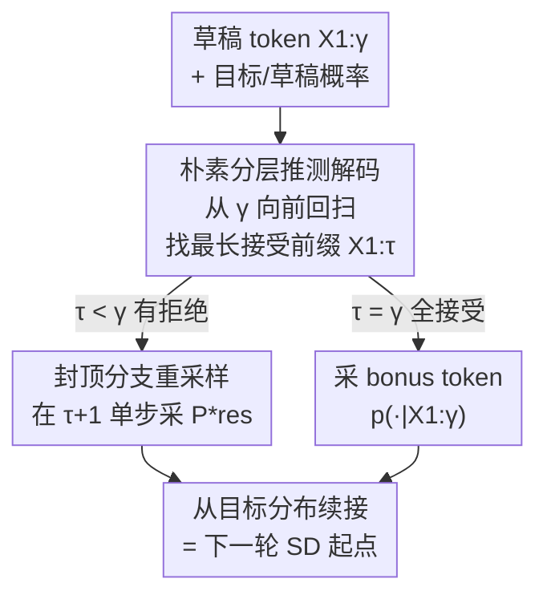

# Overcoming Joint Intractability with Lossless Hierarchical Speculative Decoding

**会议**: ICLR 2026  
**OpenReview**: [https://openreview.net/forum?id=LaVrNaBNwM](https://openreview.net/forum?id=LaVrNaBNwM)  
**代码**: https://github.com/ZhouYuxuanYX/Hierarchical-Speculative-Decoding  
**领域**: LLM效率 / 推测解码  
**关键词**: 推测解码, 无损验证, 联合不可解, 分层重采样, 推理加速

## 一句话总结
本文提出 Hierarchical Speculative Decoding（HSD），用"分层分支重采样 + 封顶"的新验证策略，在不改变目标模型分布（provably lossless）的前提下显著提高每步接受的草稿 token 数，平均解码速度提升 6.7%，接进 EAGLE-3 后再涨 12% 以上。

## 研究背景与动机
**领域现状**：推测解码（Speculative Decoding）是当前给自回归 LLM 加速的主流无损方案——用一个小草稿模型一次性提议 $\gamma$ 个 token，再用大目标模型并行验证、择优接受，既加速又精确保留目标分布。近期的研究重心已经从"怎么把草稿生成得更好"（drafting）转向"怎么把验证做得更好"（verification），因为草稿侧的收益正在递减，验证才是真正的瓶颈。

**现有痛点**：人们发现"逐 token 验证"（tokenwise）有个结构性短板——它严格从左到右逐位判定，只要第一个位置以概率 $h_1=\min\{1,p/q\}$ 被拒，整段草稿就被丢弃。于是有工作转向"序列级/联合验证"，期望接受更多 token；但联合验证撞上了**联合不可解（joint intractability）**：要无损恢复目标分布，朴素的重采样需要对所有可能解码路径求完整联合概率，而自回归模型根本算不出这些联合概率。

**核心矛盾**：现有应对要么牺牲保真度（MTAD 用固定阈值的有损接受），要么虽无损但留有缺陷——Blockwise Verification 能可证明地恢复目标分布，却仍达不到理想接受数，且其内在机制、与多草稿等框架的兼容性都说不清楚。也就是说，"无损"和"高接受数 + 可解释 + 可组合"之间还没被同时满足。

**本文目标**：设计一个既可证明无损、又能逼近理想接受数、还能即插即用嵌入现有推测解码框架（尤其是多草稿）的验证方法。

**切入角度**：作者观察到一个关键事实——虽然全空间的联合概率不可得，但给定前缀 $X_{1:t-1}$ 时，词表 $V$ 上所有下一 token 的概率是**可访问的**（accessible branch）。每个分支内部的"亏空"无法在分支内补齐，但**某些分支多出来的概率质量，可以从统计上拿去补另一些分支的亏空**。这给了一条绕开联合不可解的路。

**核心 idea**：把多个重采样分布按前缀层级组织成"分层结构"，每层只在自己可访问的分支内恢复局部的目标分布，再用"封顶"把多步重采样压成一步，从而在统计期望上恢复完整目标分布，同时最大化期望接受 token 数。

## 方法详解

### 整体框架
HSD 是一个"验证侧"的替换组件：草稿模型照常提议 $\gamma$ 个 token，目标模型并行给出各位置概率，HSD 接管"如何接受/拒绝/重采样"这一步。运行时它做三件事——先从草稿末尾 $\gamma$ **向前回扫**找到最长被接受前缀 $X_{1:\tau}$；再在位置 $\tau+1$ 用分层结构里对应的分布做**一次封顶重采样**；之后直接从目标分布继续，而这一步可以无缝接到下一轮推测解码，不产生额外的目标模型调用。

支撑这套流程的是一层理论地基（广义/分支散度与可恢复性，见关键设计 1），它决定了上面每个位置的接受概率 $h_t$ 和重采样分布到底怎么算才能保证无损。下图是运行时 pipeline：

### 关键设计

**1. 广义散度与分支可恢复性：把"联合不可解"拆成"分支内可算"的问题**

推测解码无损的本质是：被接受的草稿直接做输出，被拒绝的部分要用重采样"补回"目标分布缺的那块质量。逐 token 情形下这很简单，因为每个 token 概率直接可得；但序列级联合概率算不出来。作者的破局点是把 Leviathan 的散度推广到任意子集 $\Omega'$：定义广义散度 $D_{\Omega'}(p,q)=\sum_{\tilde\omega\in\Omega'}\max\{p(\tilde\omega)-q(\tilde\omega),0\}$，它度量草稿相对目标在 $\Omega'$ 上**亏空（deficient）的质量**，反向 $D_{\Omega'}(q,p)$ 则是**多余（excess）的质量**。在全空间上两者相等（对称），退化回标准逐 token 验证。

由此得到一连串可操作的结论：**定理 1（部分分布恢复）**——子集 $\Omega'$ 上的目标分布可由重采样完全恢复，当且仅当 $D_{\Omega'}(p,q)\le D_{\Omega'}(q,p)$，即草稿里的"触发质量"足够补上目标的亏空。把 $\Omega'$ 取成可访问分支 $\mathrm{Branch}(X_{1:t-1})=\{(X_{1:t-1},\tilde x_t)\mid \tilde x_t\in V\}$，定义分支不对称度 $\Delta_{\mathrm{Branch}}(X_{1:t-1})=D_{\mathrm{Branch}}(p,q)-D_{\mathrm{Branch}}(q,p)$，**定理 2** 给出一个惊人简洁的恒等式：

$$\Delta_{\mathrm{Branch}}(X_{1:t-1}) = p(X_{1:t-1}) - q(X_{1:t-1}).$$

也就是说，单个分支能否在内部自洽恢复，只取决于该前缀的联合概率比 $r(X_{1:t-1})=p/q$ 是否 $\le 1$（推论 3）。当某些分支补不齐时，**定理 4（散度的层级性）**保证：所有子分支正不对称度之和恰好等于父分支散度——于是过剩分支多出的质量可以"向上汇聚"再分配去补亏空分支。这条层级守恒就是 HSD 名字里"hierarchical"的来源，也是它绕开联合不可解、却仍可证明无损的根。

**2. 朴素分层推测解码：向前回扫接受 + 按层级递归重采样**

有了上面的理论，先得到一个直观但仍有开销的版本（Algorithm 1）。它对候选序列 $X_{1:\gamma}$ 从尾部 $\gamma$ 向 $1$ **回扫**：每个位置采 $\eta_t\sim U(0,1)$，若 $h_t\ge\eta_t$ 就把 $\tau$ 设为当前 $t$ 并 break（找到最长接受前缀），否则 $\tau=t-1$ 继续往前退。位置 $t<\gamma$ 的接受概率不再是简单的 $\min\{1,p/q\}$，而是用分支散度写成

$$h_t = \frac{D_{\mathrm{Branch}}(p,q\mid X_{1:t})}{\max\{D_{\mathrm{Branch}}(p,q\mid X_{1:t}),\,D_{\mathrm{Branch}}(q,p\mid X_{1:t})\}},$$

末位 $h_\gamma=\min\{r(X_{1:\gamma}),1\}$。一旦确定 $\tau$，就对 $\tau+1\dots\gamma$ 用分支重采样概率 $P_{\mathrm{res}}(x_t\mid X_{1:t-1})=\max\{p(X_{1:t})-q(X_{1:t}),0\}/D_{\mathrm{Branch}}(p,q\mid X_{1:t-1})$ 逐位补回。作者把"草稿生成 × 回扫接受 × 前缀接受 × 逐位重采样"四项概率展开，证明最终产出的序列分布恰好等于目标 $p(X_{1:\gamma})$，因此无损。问题是：被重采样的那些分支是"不可访问"的，逐位恢复需要对目标模型额外发起 $\gamma-\tau+1$ 次调用，开销过大——这正是下一步要消掉的。

**3. 封顶分支重采样：把多步恢复压成单步，零额外目标调用**

封顶（Capped Branch Resampling）是 HSD 落地为高效算法（Algorithm 2）的关键。先定义**最大前缀比索引** $m(X_{1:t})=\arg\max_{1\le i<t} r(X_{1:i})$（若没有前缀比超过 1 则为 0），再定义**封顶前缀比** $r^*(X_{1:t})=\min\{r(X_{1:m}),1\}\,r(X_{m+1:t})$。直观说，它把"前缀里那段已经过剩（$r>1$）"的部分钳到 1，只让后半段 $X_{m+1:t}$ 的比值生效——于是恢复目标被拆成"局部片段 $X_{m+1:t}$ 在本层恢复，被钳掉的亏空 $p(X_{1:m})-q(X_{1:m})$ 留给更高层级从别的轨迹统计补回"。相应地接受概率与重采样分布改用封顶版散度：

$$h_t = \frac{D^*_{\mathrm{Branch}}(p,q\mid X_{1:t})}{D^*_{\mathrm{Branch}}(q,p\mid X_{1:t})},\qquad P^*_{\mathrm{res}}(x_t\mid X_{1:t-1})=\frac{\max\{q(X_{1:t})(r^*(X_{1:t})-1),0\}}{D^*_{\mathrm{Branch}}(p,q\mid X_{1:t-1})}.$$

它的妙处在于：对负不对称（有过剩可用）的分支，**只需在 $\tau+1$ 处做一次重采样**就能恢复整条路径在统计期望上的目标分布，剩下的位置直接从目标模型采样——而这恰好就是下一轮推测解码本来要做的目标前向，于是验证阶段几乎零额外开销（实测 <1% 总解码时间）。这就是 HSD 既"无损"又"实际更快"的来源。

### 一个例子：GSM8K 上的封顶接受
以论文给的 GSM8K 片段为例（$\gamma=10$，草稿 token 为 she/work/ed/45/-/40/=/5/hours/of）。联合概率比 $\{r(X_{1:t})\}$ 在前几位 $\{0.82, 1.03, 1.59, 6.12, 0,\dots\}$——$t=2,3,4$ 越过 1 后越来越过剩，$t\ge5$ 因目标概率归零而塌成 0。封顶后 $\{r^*\}=\{0.82,1,1,1,0,\dots\}$，分层接受概率 $\{h_t\}=\{0.123,1,1,1,0,\dots\}$ 在 $t=2,3,4$ 饱和，于是前 4 个 token 一次性通过，$n_{\text{match}}=4$。对比逐 token 基线：它在第 1 位就要以 $h_1=0.82$ 赌一把，一旦被拒整段草稿全废——HSD 用回扫 + 封顶避开了"开局即全丢"的脆弱性。

## 实验关键数据

### 主实验
默认配置：8-bit GPTQ 量化的 Qwen2.5 系列，0.5B 作草稿、14B/32B/72B 作目标，温度 1，单张 H20。指标为 Block Efficiency（每次串行目标调用产出的 token 数，反映硬件无关的内在效率）与 Decoding Speed（token/秒）。

| 数据集 | 指标(目标规模) | Tokenwise | Blockwise | HSD(本文) |
|--------|------|------|----------|------|
| GSM8K | BE@14B | 5.99 | 6.13 (+2.3%) | 6.30 (+5.2%) |
| GSM8K | DS@14B | 82.28 | 86.06 (+4.6%) | 91.05 (+10.7%) |
| HumanEval | BE@32B | 4.89 | 5.15 (+5.3%) | 5.49 (+12.3%) |
| HumanEval | DS@32B | 45.68 | 48.15 (+5.4%) | 50.88 (+11.4%) |
| CNN/DM | BE@14B | 2.39 | 2.50 (+4.6%) | 2.59 (+8.4%) |

平均下来 HSD 比 Tokenwise/Blockwise 提升约 6.2% BE、6.7% DS，单数据集峰值增益达 12.3%，且全程稳定为正。

### 消融实验

| 配置 | 关键指标 | 说明 |
|------|---------|------|
| 多草稿(11 候选) | DS CNN/DM +8.9% | 接 RRS 多草稿后仍叠加增益（平均 BE +5.9%, DS +4.7%） |
| 温度 0.6/0.8/1.0 | BE 全优 | 对温度变化鲁棒，各设定下都超基线 |
| 草稿长 $\gamma=15$ | BE 7.88 / DS 52.95 | 草稿越长增益越大 |
| EAGLE-3 → EAGLE-3H | DS 71.59→80.49 (+12.4%) | 替换 EAGLE-3 的逐 token 验证，刷新 SOTA 解码效率 |

### 关键发现
- 增益在 HumanEval（代码生成）上最显著（最高 +12.3% BE），因为代码序列里"前几位高度确定、整段可一次接受"的结构最吃 HSD 的回扫接受；CNN/DM 文摘任务接受数本身低（BE~2.4），增益偏温和。
- 目标模型越大，相对增益略降（72B 上 BE 仅 +3.3%），但仍为正；草稿越长、温度适中时增益越大。
- HSD 与多草稿（RRS）、EAGLE-3 这类"草稿侧"框架基本正交，能叠加而非互斥——这是它"可组合"卖点的直接证据。Blockwise 因难以扩到多草稿而在这些设定下 N/A。

## 亮点与洞察
- **把不可解的联合概率绕成"分支可算 + 层级守恒"**：定理 2 那个 $\Delta_{\mathrm{Branch}}=p(X_{1:t-1})-q(X_{1:t-1})$ 的恒等式极其干净，直接把"分支能否自恢复"化简成"前缀概率比是否 $\le 1$"，是整套方法的支点。
- **封顶 = 用一次重采样换掉 $\gamma-\tau+1$ 次目标调用**：而且续接的目标采样恰好是下一轮 SD 的起点，等于"白嫖"，这是无损方法里少见的几乎零开销验证。
- **可解释 + 可组合**：相比 Blockwise"无损但黑箱、难扩多草稿"，HSD 把每个接受/重采样概率都用散度显式写出来，并即插即用接到 EAGLE-3 等框架——验证侧的改进能直接复用到几乎所有推测解码栈。

## 局限与展望
- 收益与任务结构强相关：在接受数本就低的长文摘类任务上增益有限，目标模型越大相对增益也越小。
- 主实验集中在 Qwen2.5 + 量化设置，少量 LLaMA-3 与 EAGLE-3 扩展验证；更多模型族、更长上下文、推理密集型 test-time scaling 场景下的稳定性仍待观察。
- 封顶引入的统计恢复是"期望意义"下无损，单条轨迹的方差/尾部行为论文未深入展开，可作为后续分析方向。
- 多草稿仅用 RRS 这一种简单基线对比，未与树注意力（SpecInfer/Medusa 树形）联合验证全面对照。

## 相关工作与启发
- **vs Tokenwise（Leviathan 2023）**：逐 token 严格左到右、首位被拒即丢整段；HSD 回扫找最长接受前缀，把"局部高确定段"整体接受，期望接受数更高，且两者在全空间散度对称这点上一脉相承。
- **vs Blockwise Verification（Sun 2024）**：同为可证明无损，但 Blockwise 接受数仍不理想、机制不透明、难扩到多草稿；HSD 用显式散度公式给出可解释的接受/重采样，并能叠加到多草稿与 EAGLE-3。
- **vs 有损方法（MTAD/DistillSpec/Medusa-2/SpecCascade）**：它们靠固定阈值或任务微调换速度但牺牲分布保真；HSD 在不动目标分布的前提下拿到同量级甚至更高的加速。

## 评分
- 新颖性: ⭐⭐⭐⭐⭐ 用广义散度 + 层级守恒正面破解联合不可解，给出可证明无损的全新验证范式
- 实验充分度: ⭐⭐⭐⭐ 覆盖多规模/多任务/多草稿/EAGLE-3，但模型族与场景仍偏集中
- 写作质量: ⭐⭐⭐⭐ 理论推导严谨、定理串联清晰，符号偏密集需要细读
- 价值: ⭐⭐⭐⭐⭐ 即插即用、几乎零额外开销、接 EAGLE-3 刷 SOTA，对 LLM 推理加速实用价值高

<!-- RELATED:START -->

## 相关论文

- [\[ICLR 2026\] Self-Speculative Decoding Accelerates Lossless Inference in Any-Order and Any-Subset Autoregressive Models](self-speculative_decoding_accelerates_lossless_inference_in_any-order_and_any-su.md)
- [\[ACL 2026\] Speculative Verification: Exploiting Information Gain to Refine Speculative Decoding](../../ACL2026/llm_efficiency/speculative_verification_exploiting_information_gain_to_refine_speculative_decod.md)
- [\[CVPR 2026\] ParallelVLM: Lossless Video-LLM Acceleration with Visual Alignment Aware Parallel Speculative Decoding](../../CVPR2026/llm_efficiency/parallelvlm_lossless_video-llm_acceleration_with_visual_alignment_aware_parallel.md)
- [\[ICLR 2026\] SpecBranch: Speculative Decoding via Hybrid Drafting and Rollback-Aware Branch Parallelism](specbranch_speculative_decoding_via_hybrid_drafting_and_rollback-aware_branch_pa.md)
- [\[ICLR 2026\] RepSpec: Structural Re-parameterized Draft Model Training for Speculative Decoding](repspec_structural_re-parameterized_draft_model_training_for_speculative_decodin.md)

<!-- RELATED:END -->
